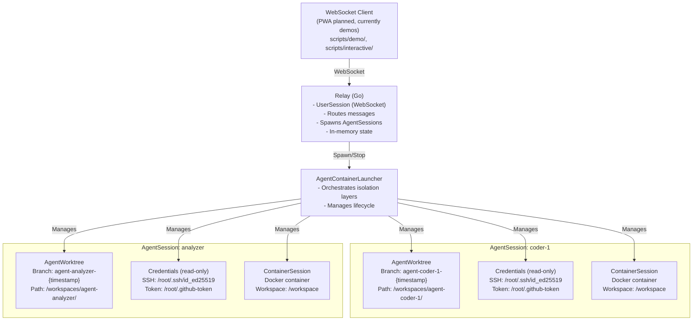
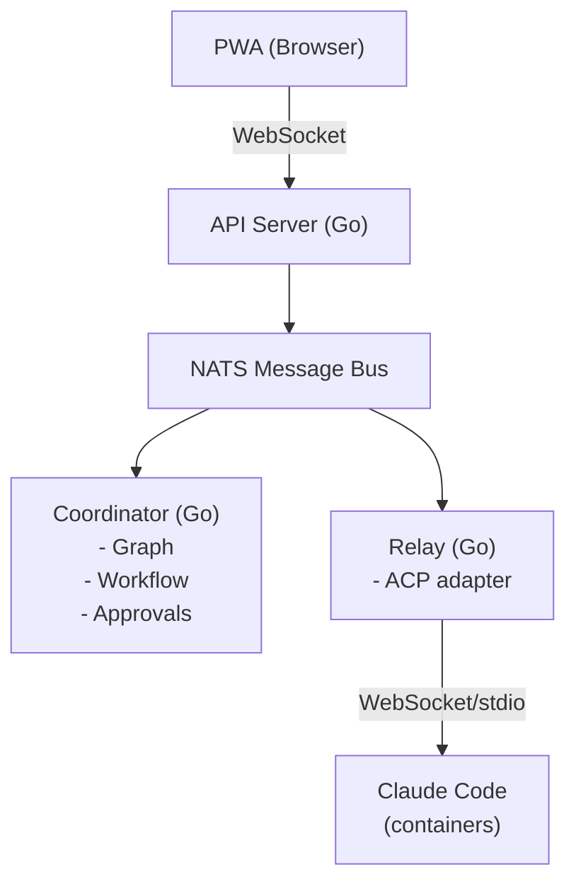

# Ourocodus Architecture: Phase 1 vs Long-term

## Phase 1: Proof of Concept (Current)

**Goal:** Validate multi-agent communication and concurrent work with proper isolation



**Example:** User spawns agents with identifiers: "coder-1", "analyzer", "task-bot"
_(Users can spawn 1-N agents with any identifiers they choose)_

**Note:**
- Agent identifiers are user-chosen and dynamic (not limited to predefined types)
- Users can spawn any number of agents (1, 3, 50, etc.) as needed
- Agent failure doesn't terminate session
- Agents can be spawned/terminated independently

**Isolation Architecture:**

Each AgentSession has three isolation layers orchestrated by `AgentContainerLauncher`:

1. **Git Isolation (AgentWorktree)**
   - Unique git worktree per agent
   - Separate branch: `agent-{agentID}-{timestamp}`
   - Path: `/workspaces/agent-{agentID}/`
   - Prevents git conflicts between concurrent agents
   - Managed by `pkg/worktree.AgentWorktreeManager`

2. **Filesystem & Process Isolation (ContainerSession)**
   - Docker container per agent
   - Isolated process namespace
   - Workspace mounted at `/workspace`
   - Resource limits (CPU, memory)
   - Managed by `pkg/containersession.Manager`

3. **Credential Isolation (AgentCredentialMounter)**
   - Read-only credential mounts
   - SSH key at `/root/.ssh/id_ed25519`
   - GitHub token at `/root/.github-token`
   - Separate credentials per agent
   - Automatic cleanup on stop
   - Managed by `pkg/agent/container.AgentCredentialMounter`

**Package Organization:**
- `pkg/worktree` - Git worktree management
- `pkg/containersession` - Docker container lifecycle
- `pkg/agent/container` - Agent-specific orchestration layer

**Operational Requirements:**

- **Workspace Paths**: Each agent gets its own worktree
  - Created via `git worktree add -b agent-{id}-{timestamp}`
  - Base directory configurable (default: `./workspaces`)
  - Paths validated for security (no directory traversal)
  - Example: `/workspaces/agent-coder-1/`, `/workspaces/agent-analyzer/`

- **Credentials**: Each agent gets isolated credentials
  - Created in `/credentials/agent-{id}/`
  - Mounted read-only into container
  - Automatic cleanup on agent stop

- **API Key**: `ANTHROPIC_API_KEY` environment variable must be set
  - Required for spawning Claude Code ACP processes
  - Shared across all agents in the relay process
  - Can be overridden via `OUROCODUS_ACP_BINARY` for testing (see `pkg/relay/session/client_factory.go`)

- **Docker**: Docker daemon must be running
  - Required for container isolation
  - Agents run in containers (not bare processes)
  - Supports Colima or Docker Desktop on macOS

**Key Characteristics:**

- No NATS (direct WebSocket + stdio)
- No Coordinator (user drives manually)
- **Containers for agent isolation** (Docker-based)
- **Git worktrees for workspace isolation** (concurrent work without conflicts)
- **Read-only credential mounts** (secure credential access)
- In-memory session state
- Variable agent count (0-N agents per session)
- Dynamic agent identifiers (user-chosen, no predefined types)
- Independent agent lifecycles (agents can fail without affecting session)
- Automatic resource cleanup (containers, worktrees, credentials)

**Limitations:**

- Not fault-tolerant (relay crash = lost state, but containers can be reattached)
- Not scalable (in-memory session tracking, single relay process)
- No workflow automation (user manually orchestrates agents)
- Manual git merge operations (branches are isolated but not auto-merged)
- No approval gates (all agent actions are immediate)
- Container attach not yet implemented (Phase 3 feature)

---

## Agent Runtime Layer

The agent runtime layer manages the lifecycle and execution environment for AI coding agents. This layer provides isolation, resource management, and workspace coordination.

**Key Components:**

- **Session Manager:** Tracks UserSessions (WebSocket connections) and spawns AgentSessions
- **ContainerSession Manager:** Creates and manages Docker containers for agent execution
- **Agent Launcher:** Coordinates agent spawning and ACP protocol initialization

**Session Types:**

- **UserSession:** WebSocket connection from PWA (browser) to Relay
- **AgentSession:** Individual AI agent process with workspace and state
- **ContainerSession:** Docker container runtime (one per AgentSession)

**Architecture Overview:**

```
PWA (Browser)
    ↓ WebSocket
Relay Server (Session Management)
    ↓ Docker API
ContainerSession Manager
    ↓ Container Lifecycle
Docker Engine
    ↓ Runs
Claude Code Agent (ACP)
    ↓ Reads/Writes
Git Worktree (Workspace)
```

**For Complete Details:** See [Agent Runtime Architecture](./AGENT_RUNTIME.md) for:
- Detailed session type definitions and lifecycle policies
- Component and sequence diagrams (Mermaid)
- Configuration and credential management
- Troubleshooting common container issues
- Future Kubernetes migration path

#### Session Lifecycle

1. User connects via PWA → UserSession created
2. User spawns agent → AgentSession + ContainerSession created
3. Agent executes tasks in isolated container
4. User terminates agent → ContainerSession and AgentSession cleaned up
5. Workspace persists on host after termination

#### Implementation

- Session tracking: `pkg/relay/session/`
- Container management: `pkg/containersession/`
- ACP client: `pkg/acp/`

---

## Long-term: Production Architecture

**Goal:** Autonomous multi-agent workflow system



**Key Characteristics:**

- NATS for all backend communication
- Coordinator drives workflow
- Relay is protocol adapter only
- Containers for isolation
- SQLite event store
- Sequential or parallel (graph-driven)
- Dynamic workflow generation

**Additions:**

- Fault tolerance (event sourcing)
- Horizontal scaling (NATS clustering)
- Workflow automation (coordinator)
- Approval gates
- Git merge automation
- PRD generation

---

## Migration Path

### Phase 1 → Phase 2: Add NATS

- Keep relay + ACP integration
- Add NATS between PWA and relay
- Relay subscribes to NATS topics
- Still no coordinator

### Phase 2 → Phase 3: Add Coordinator

- Coordinator reads graph
- Coordinator publishes work to NATS
- Relay stays as ACP adapter
- Add approval gate service

### Phase 3 → Phase 4: Production-ize

- SQLite event store
- Container isolation
- Error recovery
- Monitoring/observability

---

## Why This Phased Approach?

**Phase 1 validates the hard part:**

- Can we route messages to multiple ACP instances?
- Can agents work concurrently on same codebase?
- Does the UX model (PWA with multiple chats) work?

**Later phases add infrastructure:**

- Once routing works, add NATS for scalability
- Once manual works, add coordinator for automation
- Once POC works, add production features

**Don't build infrastructure before proving the concept.**
