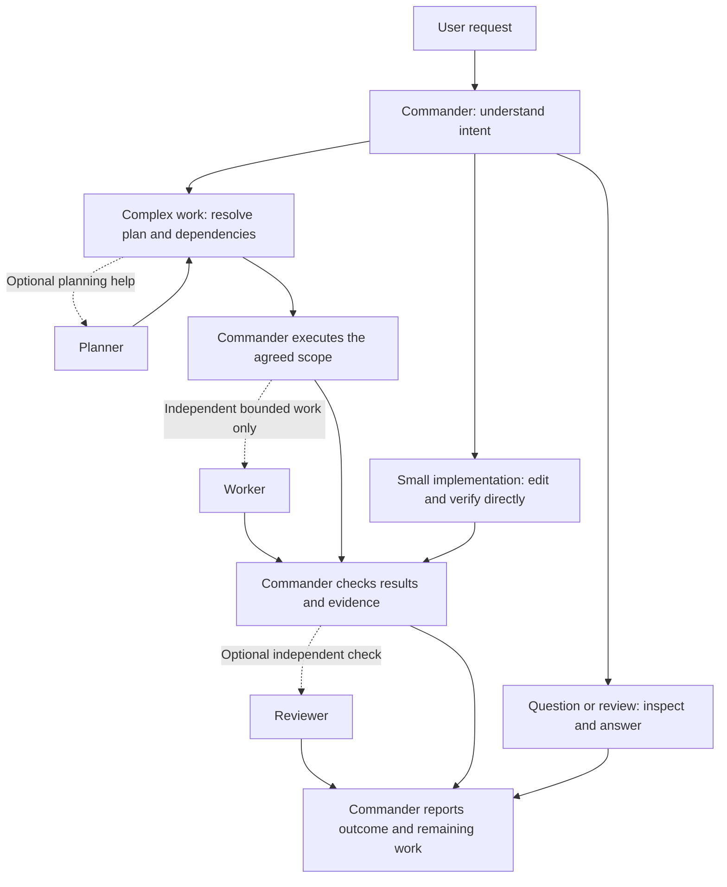

<div align="center">
  
  <h1>OpenCode Orchestrator</h1>
  <p>Lightweight mission continuity for OpenCode.</p>

  [](LICENSE)
  [](https://www.npmjs.com/package/opencode-orchestrator)
  [](https://github.com/sponsors/agnusdei1207)

  <!-- VERSION:START -->
  **Version:** `1.7.18`
  <!-- VERSION:END -->
  <!-- LAST-UPDATED: 2026-09-14 18:19 KST -->
</div>

---

## Overview

OpenCode Orchestrator keeps an objective and unfinished work connected across turns. Commander coordinates mission progress, delegation, and completion evidence inside OpenCode.

The project is moving toward a smaller mission core. The accepted scope and remaining migrations are recorded in [ADR-0021](docs/adr/0021-minimal-mission-plugin.md).

This README describes the current development tree. Tool removals below are pending a compatibility release; the version badge does not mean those removals are already published.

- **Intent first**: Answer, review, plan, or implement according to the request; use only the roles that help.
- **Small agent presets**: Commander owns the goal; planning, implementation, and independent review can be delegated when useful.
- **Local-First Memory**: Generated Markdown mission notes and a canvas for local inspection. Automatic RAG retrieval has been retired.
- **Rust Tooling**: AST, LSP, search, and terminal utilities remain during the staged reduction.

---

## 1. Installation

```bash
npm install -g opencode-orchestrator
```

> **Note**: The install hook automatically registers the plugin in `opencode.json` / `opencode.jsonc`.

### Troubleshooting: plugin installed but `/task` is missing

OpenCode reads its global config from one location only (run `opencode debug paths`
to see it under `config`): `$XDG_CONFIG_HOME/opencode`, otherwise
`~/.config/opencode` — on **every** OS, including Windows. Versions ≤ 1.7.15 of
this package mistakenly registered in `%APPDATA%\opencode` on Windows, which
OpenCode never reads. Reinstalling with the current version migrates that stale
entry automatically (with a `.backup.*` copy next to the original).

To diagnose:

```bash
opencode debug config | grep -A5 '"plugin"'
opencode debug paths
```

- If `plugin` is empty, the registration landed in the wrong file: reinstall
  this package and restart OpenCode.
- If `plugin` lists this package but commands are still missing, OpenCode may be
  loading a stale cached copy: reinstalling clears
  `<cache>/opencode/packages/opencode-orchestrator@*` automatically.
- `OPENCODE_CONFIG_DIR`, when set, takes precedence over every default location.

To remove the plugin:

```bash
npm explore -g opencode-orchestrator -- npm run cleanup:plugin
npm uninstall -g opencode-orchestrator
```

---

## 2. Configuration

Add or customize in `opencode.jsonc`:

```jsonc
{
  "$schema": "https://opencode.ai/config.json",
  "plugin": [
    [
      "opencode-orchestrator",
      {
        "agentConcurrency": {
          "commander": 1,
          "planner": 10,
          "worker": 10,
          "reviewer": 10
        },
        "missionLoop": {
          "ledger": true,
          "markdownMemory": true
        }
      }
    ]
  ]
}
```

- **Model Inheritance**: Subagents inherit the primary agent model unless explicitly configured under `agent.<name>.model`.
- **Context Window Limits**: Context usage alerts are measured against the window OpenCode reports for the model in use (a 1M-token model is no longer measured against a 200k default). Set `contextMaxTokens` (an integer token count) in the plugin options to force one limit for every model.
- **Options Schema**: Full configuration schema is available in `opencode-orchestrator.schema.json`.

Concurrency values are upper limits, not a requested team size. Simple work does not launch agents to fill those limits. A value of `0` means unlimited. The unused `workStealingWorkers` option has been retired; remove it from older configurations.

---

## 3. Usage

Select Commander in OpenCode, then start a mission:

```bash
/task "Implement feature and verify test suite"
```

The plugin preserves your default agent, native build/plan modes, agent overrides, and same-name user commands. It no longer creates an empty TODO file on startup or automatically launches Reviewer after every Worker completion. Existing mission files remain intact.

| Command | Action |
| --- | --- |
| `/task <objective>` | Starts a persisted mission loop under `.opencode/` |
| `/stop` or `/cancel` | Halts the active mission loop |
| `Esc` (Interrupt) | Pauses loop continuation until next turn |

One project directory supports one active mission. Another root session cannot replace it until its owner stops it. Ordinary sessions do not automatically resume a leftover TODO. Interrupt protection is process-local; delegated task state is not restored after restarting the plugin.

---

## 4. How work is chosen

Commander first distinguishes the request's intent. Roles are optional tools for a bounded task, not a fixed pipeline or a fanout that runs for every request.



Solid arrows show the work flow; dotted arrows show optional delegation. Planner and dependent Workers are not parallel stages. OpenCode provides the sessions, tools, permissions, and compaction beneath these presets.

| Request | Expected approach |
| --- | --- |
| Question or explanation | Inspect relevant evidence and answer; do not start an implementation mission. |
| Code review | Inspect code and report findings; changes require an implementation request. |
| Small implementation | Commander edits and verifies directly. |
| Design or research | Resolve material constraints; use Planner only when useful. |
| Larger implementation | Plan the dependencies first; delegate independent, nonconflicting scopes to Workers if useful. |
| Independent verification | Request Reviewer when the risk or task warrants another check. |

When implementation depends on a plan, the plan is resolved first. Planner and dependent Workers do not launch together. Commander reviews delegated results and owns the final explanation. The four preset names remain available for compatibility; there is no automatic Worker-to-Reviewer launch.

OpenCode owns models, permissions, native tools, sessions, extension discovery, and compaction. The plugin adds mission continuity and currently retains a bounded task runtime and Rust utilities while those parts undergo staged reduction. Current runtime details: [System Architecture](docs/SYSTEM_ARCHITECTURE.md).

### Migrating older extensions and web tools

The nested Orchestrator extension loader is removed. Convert old object-shaped extensions (`init`, `tools`, `hooks.preTool`) to the [public OpenCode plugin contract](https://opencode.ai/docs/plugins/) and let OpenCode load them. Existing extension files are preserved.

The plugin no longer registers `webfetch`, `websearch`, `cache_docs`, or `codesearch`. Native `webfetch` stays under OpenCode ownership; native web search depends on the host/provider configuration. Use normal file tools for research notes or install a separate extension if needed. Existing cached documents are preserved. See [OpenCode tools](https://opencode.ai/docs/tools/).

---
## 5. Shell Listener (Optional)

For authorized testing environments, a multi-session TCP shell listener TUI is available via the bundled Rust CLI:

```bash
orchestrator shell-listener --bind 127.0.0.1 --port 4444
```

---

## 6. Development

```bash
# TypeScript
npm run build
npx tsc --noEmit
npm test

# Rust tests in the repository container workflow
npm run docker:test
```

For agent work on Windows, use `scripts/dbuild.ps1` for Rust tests, formatting, and linting. It runs the repository in a bounded Docker container. TypeScript verification uses Node 24 LTS.

```powershell
./scripts/dbuild.ps1 test --workspace
./scripts/dbuild.ps1 fmt --all '--' --check
./scripts/dbuild.ps1 clippy --workspace --all-targets '--' -D warnings
```

---

## 7. License

[MIT License](LICENSE) © agnusdei1207
