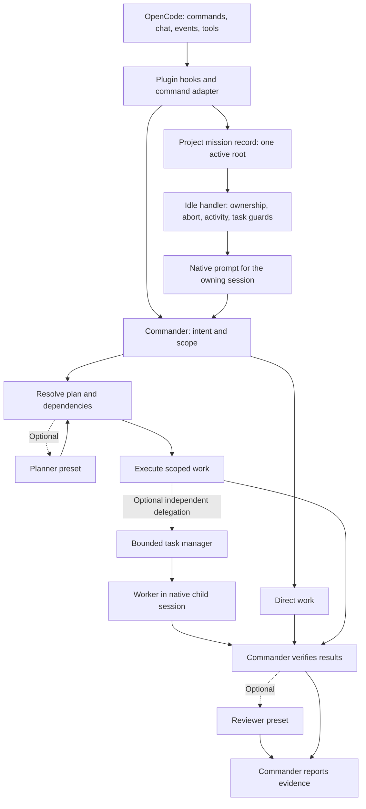

# System Architecture

Date: 2026-09-14 (minimal prompts, host ownership, and ordered hook plumbing reviewed)

This document describes the current architecture that is directly verifiable from the repository source. It intentionally avoids speculative performance claims.

## 1. Entry Points

| Surface | File | Responsibility |
| --- | --- | --- |
| Plugin bootstrap | `src/index.ts` | Parses plugin options, initializes subsystems, registers hooks, tools, and cleanup. |
| Rust CLI | `crates/orchestrator-cli/src/main.rs` | Dispatches local commands including `serve`, metadata commands, install/uninstall, and explicit terminal utilities. |
| Shell listener CLI | `crates/orchestrator-cli/src/shell_listener.rs` | Runs the authorized-lab TCP session listener and line-mode TUI outside OpenCode RPC. |
| Config hook | `src/plugin-handlers/config-handler.ts` | Registers commands and the four generated agents, merges user agent overrides, and copies global permissions. |
| Event hook | `src/plugin-handlers/event-handler.ts` | Bridges OpenCode session/message events into mission continuation, recovery, and cleanup paths. |
| Chat hook | `src/plugin-handlers/chat-message-handler.ts` | Tracks user activity and routes slash-command text through the local hook registry. |
| Command hook | `src/plugin-handlers/command-execute-handler.ts` | Starts an owned `/task` mission after OpenCode expands its command template; preserves user command overrides. |

## 2. Runtime Shape

OpenCode Orchestrator is an OpenCode plugin with four generated agents:

These are selectable presets, not required stages. Commander distinguishes questions, reviews, planning, and implementation before choosing work. Small changes stay in the primary session. A plan precedes implementation that depends on it; independent workers may run in parallel after their scope is known. Review is optional and explicit.

| Agent | Mode | Role |
| --- | --- | --- |
| Commander | `primary` | Owns the mission loop and top-level coordination. |
| Planner | `subagent` | Breaks work into ordered steps and research tasks. |
| Worker | `subagent` | Implements scoped changes. |
| Reviewer | `subagent` | Verifies completion evidence and integration risk. |



The dotted edges are optional. The mission continuation path applies only to its owning session; ordinary questions do not activate it. Native child sessions are owned by OpenCode, while the retained manager supplies bounded admission and result tracking during migration.

The plugin does not force a model. Model routing follows OpenCode inheritance:

1. Commander uses the global `model` unless `agent.commander.model` is set.
2. Planner, Worker, and Reviewer inherit the invoking primary agent model unless their own `agent.<name>.model` is set.
3. Same-name user agent config is merged back into the generated agent definition.

Native `build`/`plan` modes and the configured `default_agent` remain unchanged. If no default is configured, OpenCode chooses it. Commander is available for explicit selection. Worker completion no longer automatically launches Reviewer; review is requested deliberately when needed.

Agent instructions come from host configuration. The system-transform hook adds current mission context without injecting another complete Commander prompt.

Prompt definitions are now four short role presets using `src/agents/prompts/common.ts` and the shared philosophy. The old fragment registry, compact/verbose profile machinery, compulsory phases, and hyper-parallel instructions are removed.

The slash-command templates and runtime continuation/checkpoint prompts follow the same discipline. Planning does not require file creation or delegation. Continuation preserves document structure and existing files. A context checkpoint does not claim that OpenCode compaction has completed.

OpenCode loads extensions. Orchestrator does not inspect or execute files in `.opencode/plugins`. Its internal `HookRegistry` is a small ordered adapter for owned callbacks: there is no dynamic metadata, topological sorting, dependency declaration, or retry configuration. Registration order in `src/hooks/index.ts` defines execution order; stop/continue errors, block/intercept outcomes, and prompt injection preserve the native handler boundaries.

The custom web fetch/search/cache/code-search family and its document cache are removed. Native web tools remain owned by OpenCode and follow its permissions and availability. Existing cached documents and host dependency files are preserved. Remaining custom tools are the mission command adapter, ten search/Git/utility wrappers, four background-command tools, three AST/LSP tools, and seven task/TODO tools (25 total).

`CleanupScheduler` now has one five-minute timer that expires plugin-owned `.opencode/archive/tasks/*.jsonl` files older than seven days. It no longer deletes host dependencies, lockfiles, or arbitrary workspace files, and no longer rotates a TODO history whose producer was empty. This is the cleanup scheduler's timer count, not a census of the entire plugin.

The retained task manager is the sole completion authority. Foreground delegation waits on its state instead of polling the SDK independently. Only a completed, error-free assistant result from the current run can finish a task; result-read failures remain errors. Launch and resume share admission ownership. Pending cancellation cannot release another task's slot, and running cancellation requires a confirmed host abort. A foreground wait timeout does not cancel its task.

Notifications acknowledge only the accepted batch; failed sends remain pending. Deferred delivery rechecks ownership after asynchronous status reads. Cleanup timers and archive collection preserve resumed or replaced runs. Task archives use the plugin's project directory; they are diagnostic records, not a restart restoration mechanism.

Transport failures are not automatically replayed. Rust RPC drains output under backpressure and rejects outstanding requests on shutdown. Background commands resolve working directories from the native tool context and report termination only after confirmation. Rust command deadlines include pipe draining and stdin completion; AST/LSP failures remain distinguishable from valid empty diagnostics or search results.

## 3. Configuration Contract

The plugin accepts scoped options through the OpenCode plugin tuple:

```jsonc
{
  "plugin": [
    [
      "opencode-orchestrator",
      {
        "agentConcurrency": {
          "commander": 1,
          "planner": 10,
          "worker": 10,
          "reviewer": 10
        },
        "missionLoop": {
          "ledger": true,
          "markdownMemory": true,
          "maxEvidenceEvents": 20
        }
      }
    ]
  ]
}
```

Current option readers:

| Option | File | Effect |
| --- | --- | --- |
| `agentConcurrency` | `src/core/agents/concurrency-config.ts` | Per-agent concurrency overrides. |
| `providerConcurrency` | `src/core/agents/concurrency-config.ts` | Provider-level concurrency overrides. |
| `modelConcurrency` | `src/core/agents/concurrency-config.ts` | Model-level concurrency overrides. |
| `defaultConcurrency` | `src/core/agents/concurrency-config.ts` | Default fallback concurrency. |
| `missionLoop.*` | `src/core/config/plugin-options.ts` | Runtime mission memory and evidence controls. |

Concurrency maps and the default accept `0` for unlimited; the generated schema matches that runtime contract. Producerless work-stealing worker loops and `workStealingWorkers` have been removed. The retained admission queue controls actual task launches and resumes.

## 4. Permission Model

`src/plugin-handlers/config-handler.ts` copies the global OpenCode `permission` block into each generated agent and then merges same-name agent overrides on top. That keeps permission-gated tools such as `question` available when the user explicitly allows them, while still letting `agent.commander.permission` or similar narrow policy for a single agent.

Project instruction files are not copied into generated agent prompts by the plugin. OpenCode owns the rules layer through `AGENTS.md`, `opencode.json` `instructions`, and its documented Claude Code fallback behavior, so the config hook stays limited to command and agent registration.

## 5. Mission Loop Control Plane

Mission loop state is file-backed under `.opencode/`:

| Artifact | Producer | Purpose |
| --- | --- | --- |
| `.opencode/loop-state.json` | `src/core/loop/mission-loop.ts` | Active mission state and iteration counters. |
| `.opencode/mission-ledger.jsonl` | `src/core/loop/mission-ledger.ts` | Bounded event trail when ledger output is enabled. |
| `.opencode/docs/brain/scratchpad.md` | `src/core/knowledge/mission-memory.ts` | Generated markdown memory surface. |
| `.opencode/docs/brain/knowledge-map.canvas` | `src/core/knowledge/mission-memory.ts` | Obsidian-compatible mission graph. |
| `.opencode/docs/brain/memories/*.md` | `src/core/knowledge/mission-memory.ts`, `mission-episode.ts` | Generated memory projections and completed-mission episode notes for local inspection. |

`startMissionLoop()` persists the mission state. `handleMissionIdle()` re-verifies completion before scheduling a continuation. `generateMissionContinuationPrompt()` injects a compact prompt containing objective, progress, verification summary, stagnation signal, and completion rule.

The current record is project-wide: one active root owns it, and a foreign root start is rejected without replacing the record. This is not per-root multi-mission storage. Abort/pause protection is process-local, and delegated task state is in memory. Durable pause and task restoration remain separate migration work.

Plugin startup no longer creates a placeholder `todo.md` or watches it through an empty synchronization service. Existing user TODO files are preserved; actual mission TODO reads and writes remain in their existing owners.

The chat mission hook handles activation and cancellation only. The idle handler owns mission verification and continuation; the duplicate assistant-done mission path is removed. Unreadable TODO state, unknown host status, and pending/running delegated tasks cannot establish completion.

## 6. Continuation Guards

The plugin avoids immediate self-resume after interruption or unstable state. Current guard paths:

1. `src/plugin-handlers/event-handler.ts` requires an assistant completion for the current user turn before idle continuation is allowed.
2. `src/core/loop/mission-loop-handler.ts` cancels its countdown on user interaction or abort. The separate non-mission TODO continuation path is removed.
3. `src/core/loop/mission-loop-handler.ts` skips prompt injection while the session is aborting, recovering, compacting, or holding running background tasks.
4. Mission continuation is blocked when the local circuit breaker is open.

The pre-compaction hook contributes context only. The `session.compacted` event records the new compaction epoch and cancels stale countdowns after the host finishes compacting.

Countdowns recheck mission identity, abort state, host activity, and delegated work after asynchronous reads. A real user message releases the abort latch; a synthetic prompt or late assistant completion does not. Dynamic mission context is scoped to the active persisted mission's session.

This is the main protection against `/task` immediately restarting after `Esc` or other interrupt paths.

## 7. Authorized Shell Listener Control Plane

`orchestrator shell-listener` is a Rust CLI-only control plane for owned lab machines or explicitly authorized test environments. It is deliberately not registered in `src/tools/registry.ts`, so OpenCode model tool calls cannot start or drive an interactive shell session through the plugin JSON-RPC path.

Runtime flow:

1. `main.rs` dispatches the explicit `shell-listener` command.
2. `shell_listener.rs` binds a TCP listener with `127.0.0.1:4444` as the default address.
3. Non-loopback binds are rejected unless the operator passes `--allow-remote`.
4. Each accepted TCP stream receives a stable session id, peer metadata, a writer handle, an in-memory preview buffer, and a raw log path.
5. Reader threads append raw bytes to `.opencode-orchestrator/shell-listener/` and send sanitized preview events to the line-mode TUI.
6. Operator commands select sessions, send prompt responses, run sentinel-marked one-shot commands, or close sessions.

The design separates three concerns:

| Concern | Owner | Boundary |
| --- | --- | --- |
| Connection acceptance | Listener thread | TCP socket accept and session registration. |
| Session I/O | Per-session reader plus writer handle | Raw bytes are logged; preview bytes are sanitized for display. |
| Human operation | Line-mode TUI | The operator decides what to send and when to send it. |

Completion detection remains heuristic because shells do not emit a universal "command finished" event. The `run <cmd>` path appends a unique sentinel marker. Long-running or interactive programs should stay in `send <text>` mode so the operator can answer prompts directly.

## 8. Builder-Inspired Memory Surface

The generated markdown scratchpad and `.canvas` graph are the main Builder-derived ideas retained here:

1. Keep runtime memory local-first under the workspace.
2. Generate a readable markdown scratchpad instead of introducing a separate database.
3. Treat the graph as a visualization and navigation artifact, not as a second source of truth.

The current implementation writes these artifacts through `src/core/knowledge/mission-memory.ts` and `mission-episode.ts`. Both use `mission-note.ts` for frontmatter parsing, metadata reads, escaping, and temporary-file replacement. The episode writer does not depend on the mission projection orchestrator. Existing parser and type exports through `mission-memory.ts` and the knowledge barrel remain available.

`src/plugin-handlers/system-transform-handler.ts` injects the compact scratchpad directly. Automatic knowledge-note indexing and RAG prompt injection were retired by [ADR-0019](adr/0019-retire-knowledge-rag-subsystem.md); lifecycle fields retained in note files do not imply an active decay or retrieval engine. The parser deliberately retains its existing limited frontmatter syntax rather than providing general YAML decoding.

## 9. Release and Platform Baseline

Current verified release baseline:

1. Node.js `24+`
2. `@opencode-ai/plugin` `1.17.18`
3. `@opencode-ai/sdk` `1.17.18`
4. GitHub Actions build matrix for Linux x64/arm64, macOS x64/arm64, and Windows x64 in `.github/workflows/release.yml`

Compatibility research uses the [public plugin](https://opencode.ai/docs/plugins/) and [SDK documentation](https://opencode.ai/docs/sdk/), deployed package types, and `scripts/qa-native-host.mjs`. Sibling source and preview documentation are not release contracts. The current QA candidate is released OpenCode `1.18.29` with SDK `1.17.18`; background task parity remains unverified and the existing bounded execution path remains. See [ADR-0021](adr/0021-minimal-mission-plugin.md) for the accepted target and pending deletion gates.

Package metadata separates the project homepage from issue reporting:

- `homepage`: `https://agnusdei1207.github.io/opencode-orchestrator/`
- `bugs.url`: `https://github.com/agnusdei1207/opencode-orchestrator/issues`

## 10. Verification Pointers

When verifying architecture-sensitive changes, open these files first:

1. `src/index.ts`
2. `src/plugin-handlers/config-handler.ts`
3. `src/plugin-handlers/event-handler.ts`
4. `src/plugin-handlers/chat-message-handler.ts`
5. `src/core/config/plugin-options.ts`
6. `src/core/agents/concurrency-config.ts`
7. `src/core/loop/mission-loop.ts`
8. `src/core/loop/mission-loop-handler.ts`
9. `src/plugin-handlers/command-execute-handler.ts`
10. `crates/orchestrator-cli/src/shell_listener.rs`
