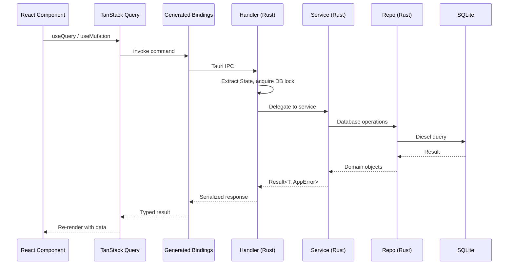
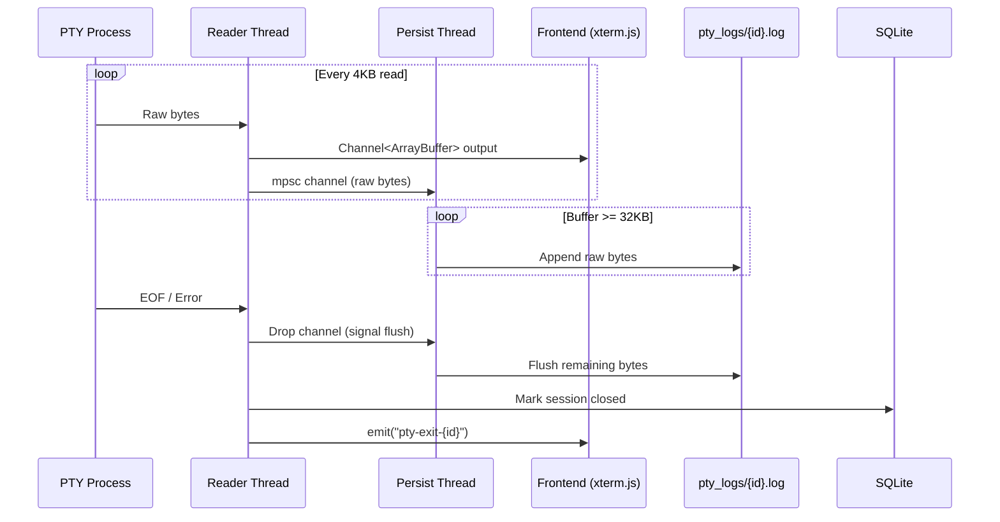
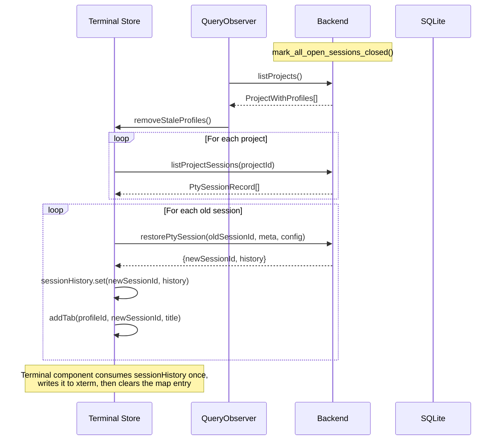
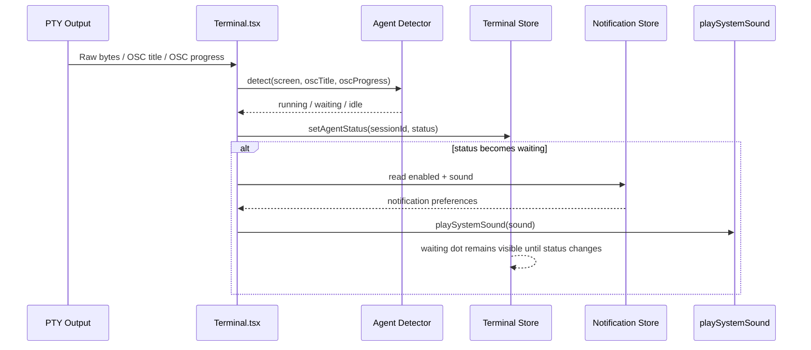
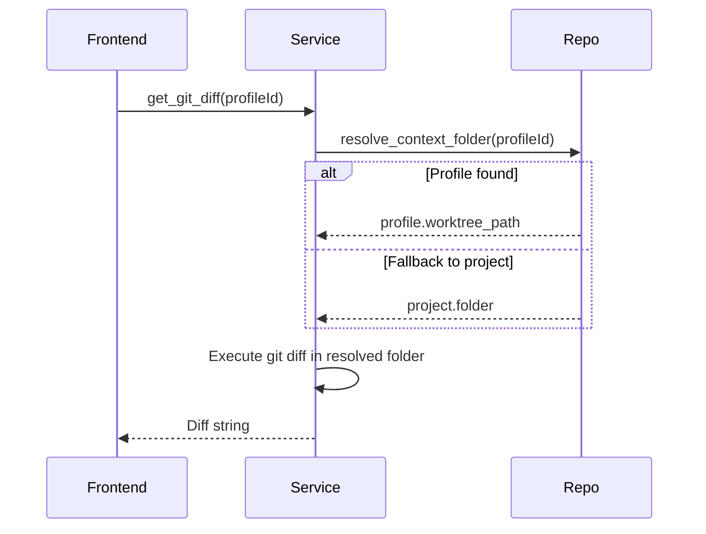

# Data Flow

## IPC Request Lifecycle

All frontend-to-backend communication uses Tauri IPC via auto-generated bindings in `src/generated/`.

## PTY Session Lifecycle

### Creation

1. Frontend calls `createPtySession({ meta, config })` via TanStack Query mutation
2. Handler delegates to `service::pty::create_session()`
3. Service loads project config (`2code.json`) for init scripts
4. Service prepares ZDOTDIR temp directory with shell init script
5. `infra::pty::create_session()` spawns PTY with env vars:
   - `TERM=xterm-256color`
   - `_2CODE_SESSION_ID={session_id}`
   - `ZDOTDIR={init_dir}` (for shell init injection)
6. Session metadata inserted into the `pty_sessions` table
7. Background reader thread spawned for live output and persistence

### Output Streaming

Key details:

- Reader thread reads 4KB chunks from PTY
- Live output is sent as raw `&[u8]` over a per-session `Channel<ArrayBuffer>`; xterm.js decodes UTF-8 across writes
- Persistence runs on a separate thread via mpsc channel, so file writes do not block live output delivery
- Persistence flushes raw bytes to `pty_logs/{session_id}.log` after 32KB batches, on the 250ms interval, on explicit flush, and at EOF
- PTY output bytes never touch SQLite; the database stores session metadata and closed-state only
- There is no byte cap. Logs live for one session, are removed on restore/close/delete, and orphan logs are reaped on startup by `service::pty::gc_orphan_logs`
- Restored scrollback is bounded by the vt100 `sanitize_history` path at 10k lines

### Session Restoration (App Startup)

This runs once at startup via a module-level `QueryObserver` subscription in `features/terminal/state.ts`.

## Notification Pipeline

Clearing notifications:

- `setAgentStatus(sessionId, "idle")` after a running state creates a completion marker
- `dismissAgentCompletion(sessionId)` clears the marker
- `closeTab(profileId, tabId)` removes status and completion state for the closed tab

## Git Operations & Context ID Resolution

Git operations accept a `profileId` that resolves polymorphically:

## File System Watching

The `watch_projects` command starts a background watcher thread using the `notify` crate. It watches all project folders and emits `watch-event` Tauri events on file changes. The frontend `fileWatcher.ts` module subscribes and invalidates relevant TanStack Query cache entries.

## Profile System (Git Worktrees)

### Creation Flow

1. Frontend calls `createProfile(projectId, branchName)`
2. Service sanitizes branch name (CJK → pinyin via `slug.rs`)
3. Service runs `git worktree add ~/.2code/workspace/{profile_id} -b {branch}`
4. Profile record inserted into `profiles` table
5. If `2code.json` has `setup_script`, execute in worktree directory

### Deletion Flow

1. If `2code.json` has `teardown_script`, execute in worktree directory
2. Run `git worktree remove` and `git branch -D`
3. Delete profile record from DB (cascades to sessions)
