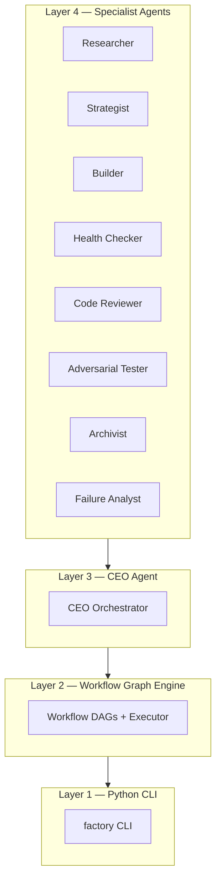

<p align="center">
  
</p>

<p align="center">
  <a href="https://www.python.org/downloads/"></a>
  <a href="https://github.com/akashgit/remote-factory/blob/main/LICENSE"></a>
  <a href="https://akashgit.github.io/remote-factory/"></a>
</p>

<p align="center">
  <b><a href="https://akashgit.github.io/remote-factory/">Documentation</a></b> · <b><a href="docs/getting-started.md">Getting Started</a></b> · <b><a href="docs/configuration.md">Configuration</a></b>
</p>

<!-- --8<-- [start:body] -->
**Describe what you want — re:factory designs and builds it.** Brainstorm an idea from scratch, refine a plan for an existing project, or create entirely new factory modes.

```bash
# Design — brainstorm an idea, refine it, then build
factory ceo "distributed eval runner" --mode design

# Iterate on an existing repo
factory ceo ~/my-project --mode design --focus "add WebSocket support"

# Create — build new factory modes and pipelines
factory ceo /path/to/factory --mode create --focus "PR validation pipeline"

# Outer Loop — evolve workflow topologies via MAP-Elites
factory outer-loop calibrate ~/my-factory \
  --benchmark featurebench \
  --population-size 3 \
  --project-dir /path/to/benchmark-instance \
  --test-command "pytest tests/ -v"
```

All state is local — per-project in `.factory/` (add to `.gitignore`), global in `~/.factory/`. See [Architecture](docs/architecture.md) for the full deep-dive.

---

## Quick Start

**Prerequisites:** Python 3.11+, [uv](https://docs.astral.sh/uv/#installation), and [Claude Code](https://docs.anthropic.com/en/docs/claude-code) (installed and authenticated).

```bash
uv tool install git+https://github.com/akashgit/remote-factory.git
```

```bash
# Design — brainstorm an idea, refine it, then build
factory ceo "my idea" --mode design

# Improve an existing project — use design mode with a focus area
factory ceo /path/to/project --mode design --focus "issue # or area to improve"
```

See the [full setup guide](docs/setup.md) for authentication, environment variables, and justification for why we install globally.

---

## Design Mode

### Design — brainstorm before building

Design mode is the primary way to use re:factory. It researches the space, drafts a structured plan via the Strategist, and lets you iterate on it before any code is written.

**From a raw idea** — describe what you want and refine it into a buildable spec:

```bash
factory ceo "distributed eval runner" --mode design
factory ceo "Build a REST API for bookmark management" --mode design
```

**From a spec file** — for longer, more detailed descriptions, write your idea to a `.md` file and pass the path:

> **Tip:** For detailed ideas with multiple paragraphs, requirements, or research notes, use a spec file instead of a quoted string. There's no length limit on file content.

```bash
factory ceo ~/ideas/weather-dashboard.md --mode design
factory ceo ~/ideas/my-app-spec.md --mode design
```

**On an existing project** — study the backlog, eval scores, open issues, and experiment history, then discuss what to work on before executing:

```bash
factory ceo ~/factory-projects/my-app --mode design
```

**Seed the conversation with a topic** — use `--focus` to start the discussion around a specific area:

```bash
factory ceo ~/factory-projects/my-app --mode design --focus "auth layer"
factory ceo ~/my-app --mode design --focus 42                       # GitHub issue
factory ceo ~/my-app --mode design --focus "owner/repo#42"          # Issue shorthand
```

Design mode subsumes Build and Improve — it researches, plans, gets your approval, then builds and iterates.

### Design-v2 — inference-time scaling

Design-v2 applies the same principle at every stage: **parallel generation → synthesis → gate**. Instead of hardcoded researchers and a single strategist, three Director agents dynamically design N/M/K approaches with project-specific prompts.

```bash
factory ceo "markdown link checker with Obsidian wikilinks" --mode design-v2
factory ceo ~/my-project --mode design-v2 --focus "auth layer"
factory ceo ~/my-project --mode design-v2 --auto-approve   # CEO acts as user at gates
```

| Stage | design | design-v2 |
|-------|--------|-----------|
| Research | 3 hardcoded researchers | Research Director designs N (3-7) tailored directions |
| Strategy | 1 strategist | Strategy Director designs M (2-5) perspectives + synthesis |
| User gate | Compressed plan | Design Doc — human-readable prose with architecture diagrams |
| QA | 1 adversarial tester | QA Director designs K (2-5) testers + code review, all parallel |
| User input | Ephemeral | User Intent Ledger — append-only file, QA checks against it |

---

## Create Your Own Factory Mode

Create mode lets you build new factory modes — new workflows, new pipelines, new factories.

### Create a New Mode

Pass a description via `--focus` to tell the CEO what mode to create. It's fully interactive — the CEO researches existing patterns, synthesizes a workflow spec, gets your approval, then implements everything: workflow definition, SKILL.md, CLI wiring, and tests.

```bash
factory ceo /path/to/factory --mode create --focus "a mode that validates PRs with multi-stage checks"
```

### Update an Existing Mode

Prefix `--focus` with the mode name and a colon. The name before the colon is matched against registered workflows — if it matches, the CEO enters update mode instead of creating a new one:

```bash
factory ceo /path/to/factory --mode create --focus "improve: add plateau detection after 3 consecutive reverts"
factory ceo /path/to/factory --mode create --focus "build: add a code review gate after the builder"
```

Without a colon, `--focus` always creates a new mode.

### How Modes Work

Every mode has three representations:

1. **Workflow definition** — a Pydantic graph in `factory/workflow/definitions.py` with typed nodes (`AgentNode`, `FnNode`, `GateNode`, `ForkNode`, `JoinNode`) and edges
2. **SKILL.md** — a prose playbook auto-generated from the graph via `factory workflow export-skills`, read by the CEO at runtime
3. **CLI entry point** — registered in `factory/cli/_main.py` and dispatched via mode routing

### Manual Workflow Editing

1. Modify the graph definition in `factory/workflow/definitions.py`
2. Re-export skills: `factory workflow export-skills`
3. Test: `pytest tests/test_workflow.py -v`

The pipeline: **3 parallel researchers** (existing patterns, intent analysis, best practices) → **Strategist** synthesizes a workflow spec → **you approve** (like design mode) → **Builder** implements → **QA** verifies end-to-end → **PR**.

Point it at the factory repo itself to extend re:factory with custom pipelines.

---

## Focus

Focus mode builds exactly one thing and exits. Target a backlog item, a GitHub issue, or multiple issues at once.

```bash
factory ceo ~/my-project --focus "add WebSocket support"            # Backlog item
factory ceo ~/my-project --focus 42                                 # GitHub issue #42
factory ceo ~/my-project --focus "owner/repo#42"                    # Issue shorthand
factory ceo ~/my-project --focus '42 and 43'                        # Multiple issues
factory ceo ~/my-project --focus 'issue 42, issue 43'               # With 'issue' keyword
factory ceo ~/my-project --mode design --focus "auth layer"         # Design mode with focus
```

---

## Available Workflows

Beyond the core Design and Create modes, re:factory ships with a growing set of workflows — both built-in and community-contributed. Each is a complete graph definition with its own agent topology, gates, and iteration strategy.

### Built-in Workflows

| Workflow | What it does |
|----------|-------------|
| **frontend-design** | Feature-to-UI pipeline — forks 5 design researchers in parallel, joins findings, then runs design audit → spec → build → render → deep QA |
| **parallel-improve** | Forks N hypotheses into isolated git worktrees, runs experiments concurrently, and selects the best result |
| **deep-research** | Decomposes a topic into research directions, executes each with internal iteration, and checks coverage |
| **design-v2** | Inference-time scaling for the design pipeline — dynamic Research/Strategy/QA Directors, user intent ledger, design doc synthesis |
| **deep-qa** | Multi-stage quality assurance — health check, code review, and adversarial testing in parallel |
| **study** | Graph-powered codebase analysis — builds a dependency graph, explores it, and produces a combined study report |

### Community-Contributed Benchmarks

These benchmark workflows live in `factory/workflow/contributed/` and follow a standard 4-node pipeline pattern (study → solver → gate → merge). See [Contributing Benchmarks](docs/contributing-benchmarks.md) for how to add your own.

| Workflow | What it solves |
|----------|---------------|
| **swebench** | GitHub issues from the SWE-bench dataset in containerized evaluation |
| **featurebench** | New feature implementations in Python codebases with explicit interface specs |
| **legacybench** | Bugs in legacy code — COBOL, Fortran, C, Java 7, Assembly |
| **devopsgym** | Build/configuration tasks — Maven, Gradle, Go modules, Make, Docker, CI/CD |
| **terminalbench** | Real-world terminal engineering tasks — compiling legacy software, scientific computing, system configuration |
| **programbench** | Adversarial discovery verification with builder → reviewer loops |
| **tomswe** | Preference-aware coding tasks with embedded user profiles (Theory of Mind) |
| **salitrap** | Commonsense reasoning — identifying salience traps in scenarios with numerical distractors |

Run any workflow with `factory ceo /path --mode <name>` or use Create mode to build your own.

---

## Outer Loop — Evolve Workflow Topologies

```bash
factory outer-loop calibrate ~/my-factory \
  --benchmark featurebench \
  --population-size 3 \
  --project-dir /path/to/benchmark-instance \
  --test-command "pytest tests/ -v"

factory ceo ~/my-factory --mode outer-loop --headless
```

The outer loop evolves the factory's own workflow DAGs against benchmarks. Starting from a simple seed (e.g. builder-only), it mutates workflow structure (adding nodes, changing edges, tweaking prompts), evaluates each candidate on a real benchmark instance, and selects for higher test pass rates. See the [Outer Loop guide](docs/outer-loop.md) for full architecture and CLI reference.

---

## Eval System

Every change is measured by a composite score across three tiers:

| Tier | What it measures | Examples |
|------|-----------------|---------|
| **Hygiene** (6 dimensions) | Code quality basics | Tests, lint, type checking, coverage, guards, config |
| **Growth** (5 dimensions) | Capability evolution | API surface area, experiment diversity, observability, research effectiveness |
| **Project** (user-defined) | Domain-specific metrics | Benchmark accuracy, latency, win rate |

On first run, `factory discover` auto-detects your project's language and framework to generate the eval profile. The weighted composite of all dimensions determines whether each experiment is kept or reverted. See [Eval System](docs/eval.md) for scoring details, weights, and guards.

---

## Architecture

re:factory is a **four-layer system**:



**Layer 1 — Python CLI** (`factory/cli/`): Pure tools that don't make decisions. Entry point is `factory.cli:main`, each subcommand a `cmd_*` function dispatched via a handler dict.

**Layer 2 — Workflow Graph Engine** (`factory/workflow/`): All factory modes are defined as directed graphs of typed nodes in `factory/workflow/definitions.py`. Each graph is a `Workflow` Pydantic model with `AgentNode`, `FnNode`, `GateNode`, `ForkNode`, `JoinNode`, and `Study` primitives. The same graph produces two execution formats: **headless** (`WorkflowExecutor` walks the DAG deterministically) and **interactive** (exported as SKILL.md prose playbooks the CEO follows at runtime).

**Layer 3 — CEO Agent** (`factory/agents/prompts/ceo.md` + `skills/workflow-*/SKILL.md`): The executive orchestrator. Detects project state, reads the appropriate SKILL.md playbook, and directs specialists through the experiment lifecycle — hypothesis, build, evaluate, keep/revert.

**Layer 4 — Specialist Agents** (`factory/agents/`): Eight Claude Code subprocesses spawned by the CEO via `factory agent <role>`. Researcher (observe), Strategist (hypothesize), Builder (implement), Health Checker + Code Reviewer + Adversarial Tester (verify), Archivist (record), Failure Analyst (research mode).

See [Architecture](docs/architecture.md) for the full deep-dive.

---

## Self-Improvement

re:factory improves itself through meta mode — the CEO runs the full improve loop on the factory's own codebase, then evolves agent playbooks via ACE (Autonomous Context Engineering):

```bash
factory ceo ~/my-project --mode meta
```

See [ACE Playbook Evolution](docs/ace.md) for the playbook mechanics.

---

## LLM Tracing (LangFuse)

LangFuse provides LLM observability and tracing — track agent invocations, token usage, and execution flow across all factory runs.

### Quick Start

```bash
# Start LangFuse services
scripts/langfuse-setup start

# Set the env vars the factory needs
export LANGFUSE_HOST=http://localhost:3000
export LANGFUSE_BASE_URL=http://localhost:3000
export LANGFUSE_PUBLIC_KEY=pk-lf-dev-local-key
export LANGFUSE_SECRET_KEY=sk-lf-dev-local-key
export TELEMETRY_PLATFORM=langfuse
```

The dev credentials above match the docker-compose setup. Add them to your `~/.bashrc` or `~/.zshrc` to persist across sessions.

### Viewing Traces

1. Start LangFuse: `scripts/langfuse-setup start`
2. Run the factory: `factory ceo /path/to/project`
3. Open `http://localhost:3000` in your browser
4. Login: `dev@localhost.local` / `devpassword123`

### CLI Commands

```bash
scripts/langfuse-setup start    # Start LangFuse services
scripts/langfuse-setup stop     # Stop services
scripts/langfuse-setup status   # Show status and credentials
```

### Requirements

- **Docker** or **Podman** — any of `docker compose`, `docker-compose`, or `podman-compose` works

### Disabling Tracing

To disable tracing without stopping LangFuse:
```bash
export LANGFUSE_TRACING_ENABLED=false
```

For LLM connection setup, trace structure details, and troubleshooting, see [`infra/langfuse/README.md`](https://github.com/akashgit/remote-factory/blob/main/infra/langfuse/README.md).

---

## Install as a Claude Code Plugin

re:factory is also distributed as a fully-bundled [Claude Code plugin](https://docs.claude.com/en/docs/claude-code/plugins) — agents, skills, and slash commands packaged together. A GitHub Actions workflow rebuilds the `plugins` branch of this repo on every push to `main`, so it always tracks the latest generated artifacts.

From inside Claude Code:

```text
/plugin marketplace add akashgit/remote-factory#plugins
/plugin install factory@remote-factory
/reload-plugins
```

Once installed, the plugin exposes:

- The `/factory:implement` slash command (entry point for the multi-agent pipeline).
- Namespaced subagents — invoke with `factory:ceo`, `factory:researcher`, `factory:builder`, etc.
- The bundled skills under `.agents/skills/` (e.g. `pipeline-subagents`, `implement`).

The plugin still shells out to the `factory` CLI for the heavy lifting, so you'll need the `factory` package installed globally as described in [Quick Start](#quick-start).

To update later: `/plugin marketplace update remote-factory`. To remove: `/plugin uninstall factory@remote-factory`.

---

## Plugin Agents

If you'd rather skip the marketplace and just register the specialist agents as standalone Claude Code (or Codex) subagents, use the built-in installer:

```bash
factory install                   # Install all 9 agents to ~/.claude/agents/
factory install --runner codex    # Or install Codex TOML agents to ~/.codex/agents/
claude --agent factory-ceo "improve this project"
claude --agent factory-researcher "study the auth system"
```

This path only ships the agent prompts (no skills, no slash commands) and is independent of the plugin marketplace install above.

---

## Verified Skill Generation

Workflow graphs (Pydantic definitions) are converted to SKILL.md prose files that the CEO follows at runtime. This conversion goes through a verified pipeline to prevent information loss:

```
Workflow (Pydantic) → templatize → review agent → guard → split
                         │              │           │        │
                    {{slot::default}}   opus    structural   SKILL.md +
                    + annotations     refines    diff check  annotations.yaml
```

The pipeline produces two artifacts per workflow:
- **SKILL.md** — clean prose the CEO reads at runtime
- **SKILL.annotations.yaml** — structured metadata per node for programmatic verification

Regenerate all skills after changing workflow definitions:

```bash
factory workflow export-skills
```

A regression test (`test_annotations_match_source`) runs in CI to catch drift between workflow definitions and exported skills.

---

## CLI Quick Reference

```bash
# Design — brainstorm and build
factory ceo "idea" --mode design                              # Design from a raw idea
factory ceo ~/ideas/spec.md --mode design                     # Design from a spec file
factory ceo <path> --mode design                              # Design improvements for existing project
factory ceo <path> --mode design --focus "topic"              # Seed with a specific topic

# Focus — build exactly one thing
factory ceo <path> --focus "add WebSocket support"            # Backlog item
factory ceo <path> --focus 42                                 # GitHub issue #42
factory ceo <path> --focus '42 and 43'                        # Multiple issues

# Outer Loop — evolve workflow topologies
factory outer-loop calibrate <path> --benchmark featurebench  # Calibrate seed population
factory ceo <path> --mode outer-loop --headless               # Run evolution

# Create — extend the factory
factory ceo <path> --mode create --focus "description"        # Create a new factory mode
factory ceo <path> --mode create --focus "mode: change"       # Update an existing mode

# Headless & continuous
factory run <path> --loop --interval 1800                     # Continuous heartbeat
factory tmux <path> --loop                                    # In detached tmux session
factory ceo <path> --mode meta                                # Self-improvement cycle
```

See `factory --help` for the complete list.

---

## Documentation

### Getting Started

- **[Setup Guide](docs/setup.md)** — Installation, authentication, environment variables
- **[Getting Started](docs/getting-started.md)** — Lifecycle walkthrough, research mode details, factory.md config

### Core Workflows

- **[Eval System](docs/eval.md)** — Hygiene/growth/project tiers, scoring, guards, precheck
- **[Configuration](docs/configuration.md)** — `factory.md` reference — all sections and options
- **[Benchmarks](docs/benchmarks.md)** — Benchmark infrastructure and available benchmark workflows

### Architecture & Configuration

- **[Architecture](docs/architecture.md)** — Four-layer system, agent roles, state machine, data flow
- **[ACE Self-Improvement](docs/ace.md)** — How re:factory evolves its own agent playbooks
- **[Outer Loop](docs/outer-loop.md)** — Evolutionary workflow search, MAP-Elites, mutation operators

### Advanced Topics

- **[Contained Runtimes](docs/contained/index.md)** — Running the factory in containers and on Kubernetes
- **[Plugins](docs/plugins.md)** — Claude Code plugin distribution and agent installation
- **[Codex MCP](docs/codex-mcp.md)** — OpenAI Codex integration via MCP

### Contributing

- **[Contributing](docs/contributing.md)** — Dev setup, code style, testing, PR workflow
- **[Contributing Benchmarks](docs/contributing-benchmarks.md)** — How to add new benchmarks: workflow structure, Harbor setup, CI integration

## Development

```bash
uv sync --all-groups              # Install all deps including dev
pytest -v                         # Full test suite
ruff check .                      # Lint
mypy factory/                     # Type check
```

## License

[MIT](https://github.com/akashgit/remote-factory/blob/main/LICENSE) — Akash Srivastava
<!-- --8<-- [end:body] -->
