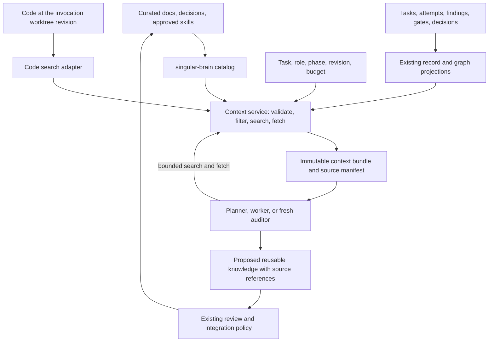

# singular-brain integration proposal for singular-lite 0.21.0

Assessment date: 2026-09-07. Proposal only; no engine, configuration, or installed runtime changes.

The singular-lite workspace is `/Users/alejandro/Desktop/999. PROJECTS/pmgo-orchestration-engine`, at the requested [0.21.0 commit, `0f92cba1fb1f2b51d6762b493b0ac7aaded8fdd9`](https://github.com/alex-reysa/singular-lite/commit/0f92cba1fb1f2b51d6762b493b0ac7aaded8fdd9). The reviewed brain checkout is `/Users/alejandro/Desktop/999. PROJECTS/singular-brain`, version 0.2.0, commit `e05f259be5cabda2bb8caa241f23cc1f48e9f059`. Existing untracked assessment documents were left untouched. Historical planning documents were treated as design history; current behavior was checked in source and with disposable fixtures.

**Recommendation: integrate singular-brain as the durable knowledge catalog, and make singular-lite responsible for selecting, loading, recording, and updating context.** Keep documents and execution records as the durable sources. Keep indexes and graphs rebuildable. Add one shared context service inside lite, initially a local library and CLI, with an explicit contract across documentation, code, and run history. A separate server or vector database is unnecessary for the first release.

The approach is sound in its separation of sources from projections. The integration is incomplete, and a registry alone cannot deliver reliable memory. The practical objective should be: *required constraints are present; relevant retained information is discoverable and fetchable; every loaded item has provenance and a known validity state; missing coverage is visible*. No architecture can guarantee retrieval of every relevant fact, especially facts never captured or relevance the system fails to recognize.

**What already exists is valuable and should be reused.** Brain provides deterministic discovery, metadata parsing, Markdown/JSON catalogs, multiple scopes, optional routing-description freshness, and lint/check commands. Lite provides planner session persistence, guarded worker continuation, context packets, findings and assumption ledgers, attempt artifacts, and optional rehydration and provenance graphs. Its independent audit steps remain fresh. These are complementary foundations, not competing memory implementations.

| Existing layer | Useful responsibility | Practical boundary |
| --- | --- | --- |
| Brain catalog | Tell an agent which durable artifacts exist and why it might read them | Does not search, fetch, capture learning, or manage a prompt window |
| Task packets and ledgers | Carry decisions, constraints, unresolved findings, and assumptions across attempts | Mainly task/run continuity; not general project recall |
| Provider sessions | Avoid repeated setup within an eligible lineage | Hidden state is not durable authority or portable memory |
| Context graph | Traverse recorded lineage, provenance, and contradictions | Existing selection is rule-based lineage traversal, not semantic search |
| Evidence manifest and evidence-show | Declare and hash-check bounded run-local evidence reads | Not a general document/code retrieval interface |
| Integration and audit gates | Establish particular checked outcomes on particular trees | A retrieved explanation cannot substitute for these proofs |

Current defaults matter: planner sessions, routing, packets, and plan critique ship on. `SINGULAR_REHYDRATE`, `SINGULAR_CTX_MANIFEST`, and `SINGULAR_CTX_GRAPH` remain off. The README explicitly identifies content-blind section truncation as a reason rehydration stays opt-in. See [current context defaults](</Users/alejandro/Desktop/999. PROJECTS/pmgo-orchestration-engine/README.md:368>).

**The first integration problem is a real producer/consumer contract mismatch.** Brain's generated JSON cannot be passed directly to lite's current authored-knowledge selector.

| Concern | Brain 0.2.0 produces | Lite 0.21.0 consumes | Consequence |
| --- | --- | --- | --- |
| Identity | `path`, without `id` | Requires nonempty `id` | Every actual brain entry is dropped |
| Routing | `loadWhen`, normally natural-language phrases | `load-when`, exact intersection with role/step/node/task tokens | A field rename alone still does not make the relevance semantics agree |
| Freshness | Object containing `state`, `meta`, `body` | String plus separate `description_unverified` flag | Adding only IDs/paths causes brain's stale state to be ignored |
| Source root | Paths relative to the configured scope base; base not exported in JSON | Opens each entry path relative to process cwd, or accepts an absolute path | Reads can fail or use the wrong worktree/root |
| Hash meaning | Last-reviewed, normalized body hash, excluding frontmatter | Computes a full-file raw-byte hash of the body it loads | The hashes represent different things and cannot be equated |
| Lifecycle | `status`, including `superseded` | Selector does not apply lifecycle policy | A catalog being current does not make every document current guidance |

Evidence: [brain JSON renderer](</Users/alejandro/Desktop/999. PROJECTS/singular-brain/engine/render/json.mjs:19>), [lite selector](</Users/alejandro/Desktop/999. PROJECTS/pmgo-orchestration-engine/engine/ctx-rehydrate-authored.sh:126>), [eligibility filter](</Users/alejandro/Desktop/999. PROJECTS/pmgo-orchestration-engine/engine/ctx-rehydrate-authored-eligible.sh:62>), [body reader](</Users/alejandro/Desktop/999. PROJECTS/pmgo-orchestration-engine/engine/ctx-rehydrate-authored-packet.sh:133>), [brain hash definitions](</Users/alejandro/Desktop/999. PROJECTS/singular-brain/engine/hash.mjs:16>).

I copied brain's knowledge fixture into a temporary directory, ran its actual generator, and passed the output through lite's real selector/filter/renderer. No production documents or runtime state were changed. Results:

```text
actual_generated_entry_count: 3
actual_generated_render_chars: 0
after_body_edit_freshness: description_unverified
check_after_regen_with_flag_exit: 0
id_path_only_adapter_includes_unverified_body: True
id_path_only_adapter_includes_unmatched_decision: True
normalized_free_text_triggers_match_handoff: False
relative_path_render_chars_at_consumer_root: 84
relative_path_render_chars_at_manifest_directory: 0
outside_root_synthetic_file_is_loaded: True
```

The outside-root probe used an invented sentinel file in the temporary directory. It establishes that the authored reader itself has no root-containment check; it is not a claim that the entire local runner provides filesystem isolation. The trigger probe demonstrates exact-token mismatch, not a failure of a semantic search engine—none exists here.

**The second problem is when knowledge is supplied.** The live authored hook sits inside `rehydrate_inject_packet`, which returns unless the worker strategy is `rehydrate`. That strategy is considered only after a would-be resume is refused by the additional lease/window/diff gates. An ordinary fresh start bypasses this path. The planner does not consume this hook. Thus enabling a manifest cannot provide project awareness to every invocation, even after fixing its JSON.

Evidence: [worker injection](</Users/alejandro/Desktop/999. PROJECTS/pmgo-orchestration-engine/engine/l1-drive.sh:1315>), [resume-only routing](</Users/alejandro/Desktop/999. PROJECTS/pmgo-orchestration-engine/engine/ctx-route.sh:119>), [planner invocation](</Users/alejandro/Desktop/999. PROJECTS/pmgo-orchestration-engine/engine/generate-tasks.sh:320>). Several context files still describe themselves as uncalled despite later wiring; update those comments as part of the integration.

**Freshness needs to describe several different properties.** Brain's two-hash mechanism detects when a document body changes without its routing description being reaffirmed. It does not prove that the document is correct, approved, consistent with code, or applicable to this task. Changing the metadata restamps the body; a rename is treated as a new entry. A code change can invalidate an unchanged document without altering either hash.

Also, `brain check` checks generated-output consistency. After `gen` writes a manifest that correctly records `description_unverified`, `check` passes. This is existing semantics, not an accidental test failure. Do not use its exit code as an assertion that all knowledge was reviewed. The freshness sidecar is a durable ledger requiring preservation; it is the explicit exception to the rebuildable-projection rule.

Track these dimensions separately: source-byte integrity, routing-description review, knowledge approval, lifecycle, code/version applicability, and external-source age. Unknown validity must remain unknown. For example, a canonical contract is a normative requirement, while a current implementation file describes actual behavior. If they disagree, report the conflict; do not mechanically choose whichever has the newest timestamp.

**The proposed system has a small working set and a much larger retrievable corpus.**



There should be five kinds of context with distinct handling:

| Kind | Examples | How it enters context |
| --- | --- | --- |
| Required task state | Objective, acceptance criteria, owned/forbidden paths, active constraints | Host-loaded for every applicable invocation; never left to similarity search |
| Working memory | Current plan, open findings, violated assumptions, pending decisions, next action | Structured checkpoint plus current host state; refreshed across attempts |
| Durable project knowledge | Architecture, accepted decisions, domain terminology, runbooks | Small catalog excerpt and selected sections; searchable on demand |
| Episodic history | What was tried, why it failed, what evidence changed a decision | Relevant records from existing run sources; model claims remain labeled |
| Procedural and external knowledge | Approved skills; selected external docs and connector records | Declared source adapters, scoped access, version/time metadata, explicit activation policy |

Code belongs in the retrievable corpus through a separate code adapter. Keep brain focused on understanding artifacts. A documentation catalog cannot reliably answer which implementation exists on a worker's current branch. Use the actual worktree or a pinned Git object for that answer.

**A shared context service should run independently of session routing.** Build an initial bundle for every planner and worker invocation, including first attempts. For resumed sessions, emit a compact delta with changed requirements, invalidated material, and new references instead of repeatedly appending the same documents. Session reuse remains an optimization controlled by the existing router.

The service should be a cohesive Python module/package with thin shell calls from the current engine. Use brain through its JSON contract or bundled CLI. Avoid adding another large set of shell wrappers, each spawning its own Python parser and rereading the same sources. Keep existing context functions as compatibility adapters while the consumers migrate.

The following are proposed commands, not commands available in 0.21.0:

```text
singular manifest gen|check|lint|bless
singular context build --task TASK-ID --role implementer --phase implement
singular context search --query "why are migrations serialized?"
singular context get --ref REF --section SECTION --max-tokens N
singular context explain --bundle BUNDLE-ID
singular memory propose --from-run RUN-ID
```

Build/search/get must bind a project, worktree revision, role, and invocation. The host derives the role from the invoking capability profile; a model-provided `--role` argument cannot grant additional access. An optional MCP facade may expose the same functions later, but should not introduce another context policy implementation. Existing local runners can start with the CLI.

Search returns bounded metadata: source reference, title, relevant excerpt, validity, provenance, and why it matched. Get returns a bounded section with a citation to its immutable source version. Support heading/line selectors and continuation cursors so the user of the tool can actually reach material after the first excerpt. Existing [evidence-show](</Users/alejandro/Desktop/999. PROJECTS/pmgo-orchestration-engine/engine/evidence-show.sh:46>) supplies useful containment/hash-check patterns, but its current run-only prefix excerpt interface is too narrow to serve this purpose unchanged.

**Retrieval should combine explicit dependencies with search.** Resolve named document IDs, acceptance references, owned paths, and active findings first. Then gather candidates from document metadata/body text, related code paths, and bounded run-history relations. Apply project/access/role/revision/quarantine/lifecycle rules before ranking, including before returning titles and snippets. Deduplicate by source version and section.

Start with exact reference lookup, deterministic text search, and the existing graph's recorded relations. A local SQLite FTS5 index is a reasonable next step for section-level lexical ranking: it supports full-text queries, BM25 ranking, and snippets. Probe runtime support and retain an `rg` fallback; Python's SQLite availability does not guarantee its build includes FTS5. These capabilities are documented by [SQLite](https://www.sqlite.org/fts5.html).

Treat natural-language `loadWhen` phrases as relevance text, not exact role identifiers. Add separately typed applicability fields such as roles, phases, areas, and related paths. Hard applicability must be evaluated by defined rules; an OR match on the word `implementer` must not erase a repository or version restriction. Initially these mappings can live in consumer configuration, preserving brain's existing frontmatter contract.

Add embeddings only if labeled tests show paraphrase/concept misses that lexical search and better metadata do not resolve. Combine them with lexical results and source filtering; do not replace exact lookup. Embedding models, chunk versions, and index versions must be pinned in cache identity. No extra model call is needed on every context build. Automatic graph extraction and an always-running memory agent would add complexity and model invocations before their value is established.

**Make the producer contract explicit before improving ranking.** First implement a lite adapter for `singular-brain.manifest.v1`, using a configured source root rather than inferring one from the manifest location. It must validate the schema, reject malformed/duplicate identities, normalize lifecycle/freshness, and emit actionable errors for configured-but-invalid inputs. Derive a namespaced ID from source, scope, and path for legacy entries; document that this ID changes on rename.

A later additive brain schema can supply stable authored IDs, an explicit base/root contract, routing metadata, related paths, and a live content hash. Keep these fields generic. In lite's normalized records, preserve at least:

| Field group | Required meaning |
| --- | --- |
| Identity | Project/source/scope/artifact ID; source kind; record/section locator |
| Version | Worktree/tree or retained snapshot identity; raw source hash; index generation |
| Provenance | Original source reference; origin; review or host-observation basis |
| Applicability | Roles/phases, path/topic associations, applicable code/version range where known |
| Validity | Lifecycle, routing-review state, supersession/contradiction references |
| Retrieval | Description, searchable text, section boundaries, estimated token cost |

Retain brain's normalized review hashes separately from raw-byte integrity hashes. Use the same normalization as brain when checking its review hashes. Reading an unchanged index is not enough: validate the selected source against the invocation's actual worktree/snapshot. Resolve and contain paths beneath declared roots, handle symlinks consistently, and perform quarantine checks on the resolved source. Inline content must go through the same content policy as files.

For explicit historical questions, superseded material remains discoverable with its replacement and date/version clearly shown. For current implementation guidance, prefer applicable approved material and current code. Unverified optional guidance can remain searchable as a flagged lead; do not silently inject it as current. If a required contract is missing or invalid, return a specific missing-context condition instead of substituting an old document or silently dropping it.

**Budget the complete invocation and select meaningful sections.** The current 4,000-character section caps can remove a decisive finding from the middle/end of a selected artifact, and the authored renderer has no overall packet cap. Existing evidence budgets constrain a different path; they do not make arbitrary appended knowledge bounded. Replace raw prefix truncation with structured finding/assumption selection and section-aware document retrieval.

Reserve capacity for fixed prompts, tool schemas, existing session occupancy, and model output before allocating retrieval. Account for every appended component together. A starting experimental allowance might be roughly 1,000 tokens for the catalog and 8,000–12,000 for retrieved material, reduced to fit the selected model; these are tuning defaults, not measured optima. Required task instructions are not sacrificed to meet an optional retrieval quota. If they cannot fit, stop assembly with an explicit overflow condition or require task decomposition.

Use the resolved model's budget/usage when available. The current [window gate](</Users/alejandro/Desktop/999. PROJECTS/pmgo-orchestration-engine/engine/ctx-route-window.sh:41>) deliberately uses conservative provider seeds and a transcript-size proxy. Keep a conservative fallback, mark estimates as estimates, and do not claim that a character ratio measures exact provider context occupancy. At pressure, create a structured checkpoint and re-open a fresh session from sources. If an already-loaded source is revoked or quarantined, fresh reconstruction is needed; deleting it from the disk index cannot remove it from provider history.

The reason to select carefully is not just price. *Lost in the Middle* demonstrated position-sensitive retrieval failures in the models it studied. It motivates testing whether injected information is actually used; it is not a measurement of today's Singular providers. [Research paper](https://arxiv.org/abs/2307.03172).

**Build the prompt and its source manifest from one immutable bundle.** Today packet rendering and event-manifest generation reread sources separately. They agree with fixed fixtures, but that alone does not establish consistency if a document changes between the reads. The graph source resolver also reduces selected records to paths before assembly, so provenance versions deserve explicit validation at this boundary.

Read each selected source once, verify its version, choose its excerpt, and atomically publish a bundle containing the prompt section and source manifest. Record full source hash, exact excerpt hash/range, reason selected, validity, omitted/truncated items, total budget, policy/index versions, and final prompt hash. The strategy event references this bundle instead of recomputing it. Replay must use retained Git blobs or retained content snapshots, not silently read whatever the original path contains later.

Keep disposable indexes separate from durable content. A local layout could place caches under `.singular-state/context/indexes/<source-version>/` and invocation bundles under the existing run/attempt directory. These are proposed paths. Use atomic index publication, one coordinated writer per cache generation, and immutable readers for parallel worktrees. Never serve another worktree's unintegrated branch contents as current project knowledge.

**The write side is how this becomes memory rather than document search.** Reuse existing event, attempt, findings, assumptions, decision, and gate records as the operational record. Do not invent a second competing status ledger. Persist compact explicit summaries only when they add information: a decision and its basis, an observed failure and its triggering conditions, an unresolved question, a changed requirement, or a procedure that proved useful. Store source references, not unsupported confident prose.

At checkpoints or terminal outcomes, a worker/planner may emit a bounded memory candidate as part of its existing output. The host can automatically record factual events it actually observed. A reusable semantic claim follows the consumer's existing knowledge-review policy before entering the curated catalog. Candidate generation does not require another standing agent or a model call per attempt.

For example: a worker proposes “migration replay must tolerate duplicate delivery,” citing a task, failed test, and fix. After the relevant change is integrated and the claim is reviewed, it becomes an accepted decision or runbook entry. A future migration task finds that entry via related paths and query terms. If the implementation later changes those paths, mark the claim for revalidation; if a later decision replaces it, link the supersession. A passing gate proves the recorded check on that tree, not that every sentence in the worker's summary is universally true.

The lifecycle should support candidate, approved, disputed, superseded, and retired/expired states, with explicit scope and provenance. These need not all become brain `status` values: keep proposal/review state in its source records and project the approved artifact. Stable facts should not expire merely because they are old. Use time limits for external observations, recency as a ranking signal for episodes, and dependency changes as revalidation signals for code-related knowledge.

Back up the source documents, review ledger, and retained execution records needed for reconstruction. Define retention and deletion across raw sources, bundles, indexes, and embeddings. Rebuilds must honor deletion/tombstone policy so forgotten content is not reintroduced from an older log. Cross-project recall should be a later, explicitly declared federation of selected sources, with namespaces and access checks; do not scan a user's entire machine by default.

**Preserve audit independence at the content boundary as well as the session boundary.**

| Consumer | Context to supply | Context requiring restriction |
| --- | --- | --- |
| Planner | Current goals/frontier, accepted decisions, relevant docs and prior outcomes | Historical conclusions presented without their conditions or status |
| Implementer | Task contract, required references, current files, open findings, relevant episodes | Facts from other unintegrated worktrees presented as integrated state |
| Plan critic | Plan/task contracts, candidate plan, independently selected applicable references | Planner narrative treated as proof that the plan is correct |
| Final auditor | Fresh session, exact diff/tree evidence, binding requirements, verification targets, independently retrieved references | Worker capsules or newly proposed memory saying the change is correct |
| Paired auditor | Fresh independently built bundle and evidence under its existing policy | Prior verdict/conclusions injected merely to save tokens |
| Supervisor | Current host status and cited decisions, with episodes labeled | Cached memory used to decide present task completion or bypass gates |

Keep the [unconditional freshness pin](</Users/alejandro/Desktop/999. PROJECTS/pmgo-orchestration-engine/engine/ctx-route-taint.sh:89>). Fresh auditors may read required documentation and the existing permitted prior findings, but the retrieval service must not indirectly feed back the worker's self-assessment. Select auditor references from trusted policy and the review target, not from a worker-controlled selection manifest. A document changed by the audited task is evidence under review, not a new binding policy solely because the task labels it canonical.

Do not trust `authoritative: true`, `origin: human`, or `status: canonical` merely because they appear inside a source document. Review/authority is established by host policy and provenance. Retrieved prose remains data; indexing it does not grant permission to execute instructions inside it. Model-authored candidates can be searchable in a separate, visibly labeled history class without being promoted into every role's bootstrap catalog. This refines the old “never index model artifacts” boundary while preserving its purpose.

**Distribution should follow lite's existing version pin.** Bundle brain's pinned engine, version/schema files, provenance, and any applicable license material. Keep corpus selection and integration policy consumer-owned. A thin `singular manifest` command removes a second machine installation without merging the two projects' responsibilities. Node stays optional for consumers that do not enable brain. Consumers with a standalone vendored copy need a version mismatch diagnostic and an explicit source choice.

The July [integration decision record](</Users/alejandro/Desktop/999. PROJECTS/pmgo-orchestration-engine/docs/context-build-plan/singular-brain-integration.md>) is directionally sound, but several details need revision for 0.21.0:

| Earlier idea | Recommended update |
| --- | --- |
| Add JSON ingestion in a future Stage 5 | The fixture reader and implementer wiring exist; replace the incompatible contract and broaden the invocation points |
| Inject the whole registry into role prompts | Use a bounded catalog and selected sections, with search/get for the rest |
| Regenerate at integration | Specify exactly when, with 0.21.0's staged-tree proof and concurrency rules |
| Add a vendor directory | Add it to installation and campaign fingerprint coverage as well as the repository |
| Keep all model artifacts out of indexing | Keep them out of the curated/default catalog; retain labeled episodes behind role-aware retrieval |
| Run a consumer A/B later | Begin with a real-producer contract test and retrieval benchmark before adding more model-driven machinery |

For tracked generated files, generation must run on the intended merged source snapshot **before** `tested_tree` is captured, with only declared outputs staged and with the resulting tree checked. Do not run a mutating generator inside the disposable gate or after it passes. [Integration snapshot](</Users/alejandro/Desktop/999. PROJECTS/pmgo-orchestration-engine/engine/integrate.sh:561>) and [clean-gate validation](</Users/alejandro/Desktop/999. PROJECTS/pmgo-orchestration-engine/engine/integrate.sh:654>) enforce this.

Generated Markdown/JSON conflicts may be resolved by regeneration, but the freshness sidecar is a ledger: never discard it as if it were another generated file. Reconcile its prior records conservatively; ambiguous concurrent changes require revalidation, not an automatic bless. If constructing safe tracked-output integration is too much for the first slice, build the runtime catalog into an untracked versioned cache and leave committed-catalog refresh to a scoped documentation task. Cache generation must preserve the reviewed sidecar basis.

If bundling under `vendor/singular-brain`, change [install.sh's payload list](</Users/alejandro/Desktop/999. PROJECTS/pmgo-orchestration-engine/install.sh:60>) and [campaign source fingerprinting](</Users/alejandro/Desktop/999. PROJECTS/pmgo-orchestration-engine/engine/campaign_manifest.py:167>). Otherwise the bundle is either not installed or its executable changes are outside the recorded engine identity. Pin retrieval policy/configuration with campaign policy; version ordinary knowledge per invocation so every legitimate documentation update does not require a new campaign.

**Implement in four reviewable increments.** The table is a proposed backlog, not a promise about delivery time or assigned release numbers.

| Increment | Concrete changes | Completion evidence |
| --- | --- | --- |
| 1. Make brain actually consumable | Bundle/pin it; v1 adapter and normalized schema; explicit source roots; lifecycle/freshness checks; strict diagnostics; doctor/install/fingerprint coverage | Actual `brain gen` output loads expected content; flagged/superseded/outside-root/wrong-revision cases behave explicitly; feature-off compatibility |
| 2. Supply useful context at every invocation | Shared build/search/get/explain library; planner/first-worker hooks; separate auditor policy; structured sections; total budget; immutable bundles | Fresh start and retry both find required docs; section beyond first 4k chars is fetchable; mandatory finding survives packing; rendered and recorded hashes agree |
| 3. Carry learning across tasks | Candidate output and review lifecycle; accepted docs/decision promotion; code-change revalidation; supersession; checkpoint recovery; retention | Task B recalls a reviewed lesson from task A; rejected/invalidated claims stay labeled; restart works without provider session; deleting cache loses no retained memory |
| 4. Improve recall where measured | Optional FTS5 and then hybrid lexical/semantic ranking if needed; bounded graph expansion; external/federated adapters if required | Better retrieval coverage and accepted-task outcomes at an acceptable total cost, without authority/independence regressions |

Most work belongs in lite. The first increment can consume brain 0.2.0 unchanged through an adapter. Brain improvements should be generic: versioned JSON schema, optional stable identity, explicit path-base semantics, richer routing metadata, distinct live/review hashes, an optional strict review policy, and safer publication of multiple outputs. Preserve its zero-network generation model and existing compatibility; do not add orchestration state, provider sessions, or autonomous memory writing to it.

For lite, the main seams are `engine/generate-tasks.sh`, `engine/l1-drive.sh`, prompt/capsule helpers in `engine/lib.sh`, the `ctx-rehydrate-authored*` adapters, `ctx-rehydrate-event.sh`, graph source resolution, `engine/integrate.sh`, `engine/doctor.py`, `engine/campaign_manifest.py`, `cli/singular`, and `install.sh`. These are proposed edit locations in this repository. Migrate existing helpers into the shared service gradually rather than rewriting the entire context subsystem.

**Measure retrieval and end-to-end usefulness separately.** Build a curated set of realistic questions/tasks: locate a contract, recall a rejected approach, recover after a provider switch, distinguish a superseded decision, follow a rename, detect code/doc drift, and answer “not recorded” when appropriate. Label required sources/sections and permitted roles. Include paraphrases and tasks with relevant material late in a long document.

Track required-item inclusion, section recall within budget, stale/incorrect-version selections, useful-source precision, no-result accuracy, actual retrieval/read traces where observable, and time to find the needed evidence. Then measure total input/output tokens and tool cost per integrated task, attempts to acceptance, elapsed time, audit escapes, and independent-audit disagreements. A source appearing in a prompt does not establish that the model used it correctly.

For causal comparisons, replay the same task snapshots with fixed model/prompt settings and multiple seeds, then use matched or randomized consumer trials without sharing memory written by treatment tasks into controls. Compare baseline, catalog plus search, and catalog plus search plus reviewed episodic memory. Include indexing/curation overhead. Preserve the v0.21.0 focus on productive work by tracking added control-plane calls with existing metrics.

Set deterministic safety/contract cases to zero tolerance: required contract silently dropped, cross-root/role contamination, wrong-version proof accepted, or worker claim elevated to audit authority. Define retrieval quality targets against the labeled corpus before evaluating; no measured recall target is claimed here. LongMemEval's separation of indexing, retrieval, and reading, and its tests of information updates, temporal reasoning, and abstention are useful evaluation categories, though its conversational scores do not predict coding-agent gains. [LongMemEval](https://arxiv.org/abs/2410.10813).

The historical [context experiment](</Users/alejandro/Desktop/999. PROJECTS/pmgo-orchestration-engine/docs/context-build-plan/experiment-report.md:9>) was a confounded before/after comparison. It states that rehydration was off and that the brain consumer experiment remained pending. It does not establish a production benefit from this proposed integration.

**What this would solve, and what it would leave open.**

| Problem | Expected result after the proposed work | Remaining limit |
| --- | --- | --- |
| Repeatedly rediscovering architecture and decisions | Better initial awareness and cited retrieval | Depends on corpus coverage and metadata/search quality |
| Losing progress after retries, session expiry, or provider changes | Reconstruction from checkpoints and durable sources | Unrecorded details and hidden provider state remain lost |
| Forgetting prior failed approaches across tasks | Conditional lessons with provenance become reusable | A past failure may not apply to a new revision or task |
| Documentation drift | Detect changed sources, pending review, dependency changes, and supersession | Hashes cannot prove semantic correctness |
| Context overload | Bounded, role-specific, section-aware bundles | Finite windows and imperfect model attention remain |
| Inconsistent parallel-worker knowledge | Per-worktree versions and published integrated knowledge | Does not merge code or eliminate distributed races by itself |
| Explaining why a decision was made | Cited decisions and observable source selection | An explanation can still be wrong; inspect its evidence |
| Independent review | Fresh sessions plus content-specific retrieval restrictions | Shared bad specifications can still bias independent reviewers |
| External or organization-wide memory | Extensible through declared source adapters | Not delivered by the initial project-local catalog integration |
| Better plans and throughput | Less unnecessary rediscovery is plausible and measurable | Does not fix poor decomposition, excessive critique, provider outages, or weak tests |
| Knowing everything relevant | Higher recall with visible omissions | Cannot guarantee completeness, truth, or relevance |

**Verification performed for this assessment:** brain's full suite passed 98/98 tests and its abstraction gate. Five focused lite suites passed: authored packet, authored config, authored driver injection, rehydration end-to-end, and taint independence. The disposable real-producer probes above exposed gaps those fixture-based suites do not cover. The full lite regression suite and a live model campaign were not run because this deliverable changes documentation only and makes no claim of implemented behavior or measured production improvement.
