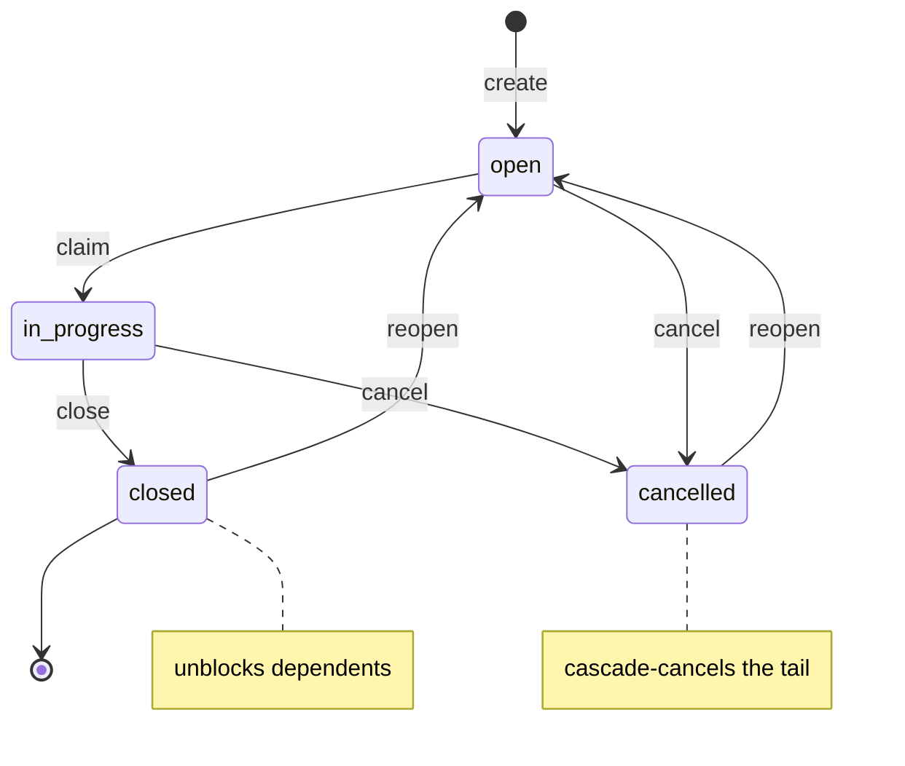
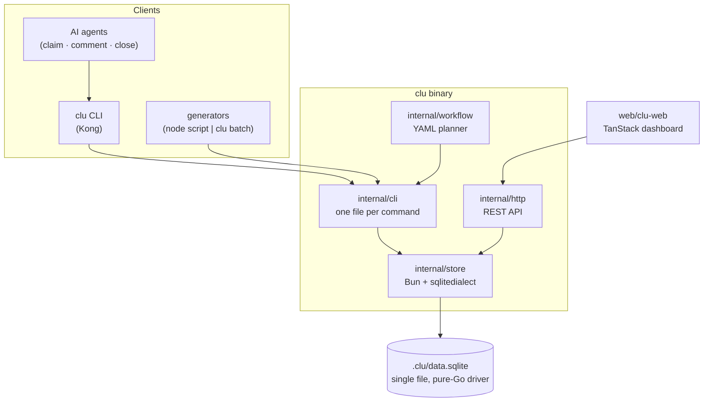

<h1 align="center">clu</h1>

<p align="center">
  
</p>

<p align="center">
  <em>🤖 SQLite-backed issue tracker for coordinating AI coding agents on a single machine.</em><br>
  <em>Named after Tron's <strong>C</strong>odified <strong>L</strong>ikeness <strong>U</strong>tility.</em>
</p>

<p align="center">
  <a href="https://github.com/arjia-labs/clu/actions"></a>
  <a href="https://goreportcard.com/report/github.com/arjia-labs/clu"></a>
  <a href="https://pkg.go.dev/github.com/arjia-labs/clu"></a>
  
  
  
  
  
</p>

<p align="center">
  <a href="https://arjia-labs.github.io/clu/"></a>
</p>

<p align="center">
  <a href="https://arjia-labs.github.io/clu/"><strong>Docs</strong></a> ·
  <a href="#-quickstart"><strong>Quickstart</strong></a> ·
  <a href="#-multi-agent-setup"><strong>Multi-agent</strong></a> ·
  <a href="#-bulk-graphs-clu-batch"><strong>Bulk graphs</strong></a> ·
  <a href="#-workflows"><strong>Workflows</strong></a> ·
  <a href="AGENTS.md"><strong>Agent guide</strong></a> ·
  <a href="#-design-notes"><strong>Design</strong></a>
</p>

---

## 🤔 Why?

When you run more than one AI coding session against the same project, they need a shared, durable place to:

- 🤝 pick up work without stepping on each other (atomic claim),
- 📝 record what they tried, what worked, what didn't,
- 🚦 gate risky steps behind human approval,
- 🔓 surface what's unblocked vs. waiting on something else.

`clu` is that place. A small, fast, single-binary CLI backed by a local SQLite database. **No daemon, no server, no account, no network.**

## ✨ Highlights

| | |
|---|---|
| 📦 **Single binary, pure Go** | SQLite via `modernc.org/sqlite` — no CGo, no system libs. |
| 💾 **Local-first** | One file: `.clu/data.sqlite`. Commit `config.yaml`, gitignore the DB. |
| ⚡ **Atomic claim** | `UPDATE … RETURNING` with subquery — racing agents get different issues. |
| 🎯 **Capability routing** | Agents declare capabilities in `config.yaml`; `cap:foo` labels flow to matching agents. |
| 🕸️ **Bulk graph instantiation** | `clu batch` turns one JSON doc into a whole validated graph (thousands of issues + deps) in one transaction — generate it with any script. |
| 🌊 **Cascading cancel** | `clu cancel <id>` walks the dep graph forward and cancels the whole tail. |
| 🏁 **Milestones & phases** | `milestone` issues auto-close when their dependencies do — self-completing umbrellas and automatic phase boundaries. |
| 🧾 **Audit log** | Every write is recorded; `clu history <id>` and `clu log` show who did what, when. |
| 🧠 **Context inheritance** | `clu claim <id> --context` prints the upstream chain (notes + comments) so an agent inherits what was done before. |
| 🚀 **Agent launcher** | `clu agent start <name>` spawns a configured agent (command + layered prompts) and heartbeats it. |
| 📋 **Workflow templates** | YAML graphs of issues + deps with optional human-approval checkpoints. |
| 🔒 **Named locks + mailbox** | TTL'd `clu lock` for shared resources; `clu ping`/`clu inbox` for fire-and-forget inter-agent messages. |
| 🖥️ **Web UI** | `clu web` — a local dashboard: list, kanban, dependency graph, approvals. |
| 🧾 **JSON everywhere** | Every command takes `--json` and emits exactly one JSON value to stdout. |
| 🌿 **Branchless sync** *(experimental)* | `clu sync` stores issues on a dedicated git ref (`refs/clu/store`) — branch-independent, no conflicts with code, syncs across clones. [Details](docs/content/docs/sync.mdx). |
| 🔒 **No network** | No telemetry, no cloud, no account. Sharing is opt-in over *your own* git remote. |

## 🖥️ Web UI

`clu web` serves a local dashboard (default `:5757`) over the same SQLite file — no extra config, no separate API to run.

<table>
  <tr>
    <td width="50%"><br><sub><b>Board</b> — kanban by status, with avatars and how long each task has been in progress.</sub></td>
    <td width="50%"><br><sub><b>List</b> — every issue with priority, status, and <code>started_at</code> ("started 3h ago").</sub></td>
  </tr>
  <tr>
    <td width="50%"><br><sub><b>Approvals</b> — pending checkpoints with suggested approvers and what they block.</sub></td>
    <td width="50%"><br><sub><b>Detail</b> — status/priority/type controls, the checkpoint gate, and dependency edges.</sub></td>
  </tr>
</table>

## 📦 Install

```bash
# From a clone (installs the CLI + the web UI bundle):
make install

# Or, just the CLI:
go install github.com/arjia-labs/clu/cmd/clu@latest
```

`make install` runs `go install` and then `clu web --install`, which
builds the web UI (`pnpm install` + `pnpm build`) and copies the
output to `~/.local/share/clu/web` so `clu web` works from any
directory. Skipped silently if pnpm isn't on PATH — the CLI works
without the UI.

Add `$HOME/go/bin` to your `PATH`. Verify with `clu --help`.

## 🚀 Quickstart

```bash
mkdir my-project && cd my-project
clu init                                       # 📂 creates .clu/ with DB + config
clu create -p 1 "fix the login redirect"             # → clu-a3f81b
clu create -d clu-a3f81b "add tests for the redirect"  # 🔗 wires the dep atomically

clu ready                                      # 🟢 what's unblocked?
clu claim --context                            # 🎯 take the next one + see its upstream context
clu close clu-a3f81b                           # ✅ done → unblocks the tests
clu ready                                      # 🟢 tests are now ready
```

That's the whole core loop. See [`demo.sh`](demo.sh) for an end-to-end exercise, or [`AGENTS.md`](AGENTS.md) for the agent-facing operational guide. From inside an agent session:

```bash
clu brief
```

prints the agent guide plus the project's declared agents and who's currently live — pipe it into your agent at session start. 🧠

## 🚦 Status semantics

| status | meaning | downstream effect |
|---|---|---|
| 🟢 `open` | not yet started | normal |
| 🟡 `in_progress` | claimed; an agent is working | normal |
| ✅ `closed` | done successfully | **unblocks** dependents |
| ❌ `cancelled` | abandoned | dependents stay blocked (or cascade-cancel) |

`clu cancel <id>` marks the target **and all transitive descendants** as cancelled — the cascade is the whole point of having a status distinct from `closed`. `clu reopen <id>` reverses either terminal state.



Two type-driven behaviours sit on top of the status loop: a **`checkpoint`** issue is a manual gate (stays `checkpoint:pending` until `clu approve`), and a **`milestone`** issue *auto-closes* when all its dependencies close — the self-completing umbrella behind `clu batch --group` and phase boundaries. Issues also carry a `started_at` (set on claim, distinct from `updated`) so `clu show`, the web list, and `doctor`'s stuck-check know how long something's actually been in progress.

## 🤖 Multi-agent setup

Declare your agents in `.clu/config.yaml`:

```yaml
id_prefix: clu-
agents:
  code-reviewer:
    description: "Reviews Go code for correctness and security"
    capabilities: [go-review, security-review]
  doc-writer:
    description: "Writes README + docs/ updates"
    capabilities: [docs]
```

Then each agent claims from its own lane:

```bash
clu claim --agent code-reviewer --wait --heartbeat
```

`--heartbeat` is opt-in; without it the claim loop doesn't advertise liveness. With it, `clu agent ls` shows who's online and when they were last seen.

Coordinators route work by either **assigning directly** (`clu create -a doc-writer ...`) or **tagging capability** (`clu create --capability docs ...`). Capability-tagged issues in the default lane flow to whichever agent advertises that capability. Use `clu create --label urgent ...` when a normal label should be attached atomically with the new issue.

### 🚀 Launching agents

Give an agent a launch spec in `config.yaml` and start it with one command:

```yaml
agents:
  code-reviewer:
    capabilities: [go-review]
    command: claude                     # the executable to run
    prompts: [SOUL.md]                  # files under .clu/agents/code-reviewer/
    startup_prompt: "Check clu inbox -a code-reviewer, then claim ready work."
```

```bash
clu agent start code-reviewer          # exec the agent, heartbeating while it runs
clu agent start code-reviewer --print  # just show the assembled command
```

Any `*.md` in `.clu/agents/_shared/` is prepended to **every** agent (a common `AGENTS.md` / `AUTONOMY.md` lives in one place, not copied per agent); the agent's own prompts layer on top. clu stays runtime-agnostic — `command` can be `claude`, `codex`, or anything.

### 🧠 Inheriting context

When an agent picks up a dependent task, `--context` walks the upstream chain and prints each prerequisite's description, notes, and comments — the story of what was done before:

```bash
clu claim <id> --context        # on claim
clu show <id> --context         # any time
```

### 👁️ Watching for work (the killer combo)

In Claude Code, point the Monitor tool at `clu ready --watch -a <your-name>` and you've got a push-style task feed: clu suppresses unchanged ticks, Monitor turns each new state into one notification. **No polling loops, no `while true`, no `diff` against `seen`.**

```
Monitor: clu ready --watch -a code-reviewer
```

See [AGENTS.md](AGENTS.md) for the full pattern.

## 🕸️ Bulk graphs (`clu batch`)

`clu run` is for hand-authored YAML. When you want to **generate** work —
import a backlog, fan out a migration across modules, or build a thousand
interdependent tasks — produce a JSON document with any tool and pipe it to
`clu batch`. clu validates the whole graph (acyclic, every reference
resolves, fields valid) and writes it in **one transaction**: a single bad
entry aborts everything, so you never get a half-built graph.

```bash
generate-graph | clu batch --dry-run                 # validate + stats, write nothing
generate-graph | clu batch --group "Auth rollout"    # commit under a self-completing umbrella
```

The contract is just JSON — an array of issues that reference each other by
local **alias**:

```json
[
  {"alias": "design", "title": "Design auth", "priority": 1},
  {"alias": "impl",   "title": "Implement auth", "needs": ["design"], "capabilities": ["go"]},
  {"alias": "gate",   "title": "Approve release", "needs": ["impl"], "checkpoint": {"approvers": ["alice"]}},
  {"alias": "ship",   "title": "Ship", "needs": ["gate"]}
]
```

Run **`clu batch --docs`** for the full field reference. Highlights:

- **`needs`** takes aliases *or* existing real issue IDs — so a generated subgraph can hang off the committed graph.
- **`checkpoint`** makes an issue a manual approval gate (same as a `clu run` checkpoint).
- **`key`** (e.g. `"linear:ENG-123"`) makes re-running **idempotent** — `--on-existing skip` (default) won't duplicate it; `--on-existing update` re-syncs its fields. Perfect for a recurring import:

  ```bash
  linear issue query --json | node examples/generators/linear-todo.js | clu batch --on-existing update
  ```

This is the **generation / instantiation split**: any language emits the graph (loops, conditionals, computed fan-out — things a static template can't do); clu owns validation and atomic instantiation. See [`examples/generators/`](examples/generators/) for a zero-dependency JS helper (`clu.js`) with a `phase()` builder, plus runnable examples (feature rollout, release train, phased migration, Linear import).

## 📋 Workflows

Drop a YAML template into `.clu/templates/`:

```yaml
name: release
vars:
  version: { required: true, pattern: '^\d+\.\d+\.\d+$' }
steps:
  - id: build
    title: "Build {{version}}"
  - id: test
    title: "Test {{version}}"
    needs: [build]
  - id: approve
    type: checkpoint                          # 🚦 human gate
    title: "Approve {{version}} for prod"
    wait: { approval: [alice, bob] }
    needs: [test]
  - id: deploy
    title: "Deploy {{version}}"
    needs: [approve]
```

```bash
clu run release -v version=1.2.3   # → parent + 4 children + deps in one shot
```

Agents drive it by claiming `ready` issues as each step closes; humans clear checkpoint gates via `clu approve <id>`. Failing a checkpoint cascade-cancels the rest of the run. See [`demo-workflow.sh`](demo-workflow.sh) for the full demo.

> `clu batch` is the programmable superset of `clu run` — same checkpoints and grouping, but the graph comes from code instead of a YAML template.

## 🧾 Audit & history

Every write is recorded in an append-only event log:

```bash
clu history <id>                      # full timeline of one issue (who/what/when)
clu log --kind claimed --since 24h    # global stream, filterable by actor/kind/issue/since
```

The actor is the resolved `--agent` (or `$USER`); payloads record just the changed fields. The log is local — it's not part of `clu export` (which carries portable state, not history).

## 🖥️ Web UI

```bash
clu web        # serves a local dashboard (default :5757)
```

A read/write dashboard: filterable issue list, kanban board, dependency graph for a run, and an approvals queue for pending checkpoints. Backed by the same store via an in-process REST API (`clu http` exposes that API standalone).

## 🤝 Coordination primitives

Beyond the issue graph, for things that don't fit a ticket:

```bash
clu lock deploy --ttl 1h -- ./deploy.sh prod   # TTL'd named lock; auto-released, leak-proof
clu ping code-reviewer "PR #412 ready"          # fire-and-forget message (TTL'd, off the work log)
clu inbox -a code-reviewer                       # read your messages
clu worktree add feature-x --bootstrap           # git worktree + project-defined setup
clu sync push --remote origin                    # publish issues to a branch-independent git ref (experimental)
```

`clu sync` (experimental) keeps the tracker on a dedicated `refs/clu/store` ref —
so any checkout sees the same issues, writes never collide with code commits, and
a teammate's clone can `clu sync pull --remote origin` to get the backlog without
the DB ever being committed. See [the sync docs](docs/content/docs/sync.mdx).

## 📁 Layout

```
cmd/clu/                 ⌨️  entrypoint
internal/cli/            🧩 one file per kong subcommand
internal/store/          💾 SQLite layer, split by domain
  ├── models.go            bun model types
  ├── migrations.go        manual migrations (PRAGMA user_version)
  ├── issues.go            create/get/close/reopen/cancel/update
  ├── claim.go             ready/claim atomic queries
  ├── deps.go              dependency edges + cycle detection
  ├── batch.go             validated bulk graph instantiation
  ├── milestone.go         auto-close cascade
  ├── events.go            append-only audit log
  ├── context.go           ancestor-context walk
  └── …                    labels, comments, kv, cron, agents, locks, mailbox, doctor
internal/workflow/       📋 YAML template loader + planner
internal/http/           🌐 REST API (backs the web UI / `clu http`)
internal/config/         ⚙️  config.yaml parsing
web/clu-web/             🖥️  TanStack Start web dashboard
examples/generators/     🕸️  codemode graph generators for `clu batch`
.clu/                    📂 per-project storage (DB, config, templates, agents/)
```

## 🧠 Design notes



- 🪪 **One identity flag.** `-a` / `--agent` is both the lane filter and the actor identity. No `--as` — single-user local tool, the user/agent distinction was deliberately collapsed.
- 🗄️ **Hand-rolled migrations** via `PRAGMA user_version`. Append-only, never edit an applied migration.
- 🛠️ **Bun + sqlitedialect** for queries. Raw SQL escape hatches in exactly two places: the atomic claim, and the cancel-cascade CTE.
- 🎀 **Kong** for the CLI struct, with struct-tag commands and intermixed flags.

The rationale for each sticky decision lives in [`CLAUDE.md`](CLAUDE.md).

## 🙅 Not in scope

`clu` is deliberately small. It does **not** try to be:

- 🔄 a live, server-backed sync layer with cell-level merge — for sharing across machines there's the experimental [`clu sync`](docs/content/docs/sync.mdx) git ref (manual push/pull over your own remote), not a always-on sync server
- 📊 a generic project-management tool — no sprints, milestones, OKRs
- 🔗 a *live* bridge to GitHub / Linear / Jira. (You can still **import** from anything by piping a generated graph to `clu batch`; an idempotent `key` keeps re-runs clean — see [`examples/generators/linear-todo.js`](examples/generators/linear-todo.js).)
- 🤖 an agent runtime — *you* are the agent; `clu` just gives you somewhere to put the work

## 🤝 Contributing

PRs welcome. Before sending:

```bash
go build ./... && go test ./...
./demo.sh && ./demo-workflow.sh
```

See [`CLAUDE.md`](CLAUDE.md) for code conventions (one file per kong command, sentinel errors per entity, JSON-clean output, etc.).

## 📜 License

MIT — see [LICENSE](LICENSE).

<p align="center">
  <sub>Built for the era of many small agents working together. ⚡</sub>
</p>
