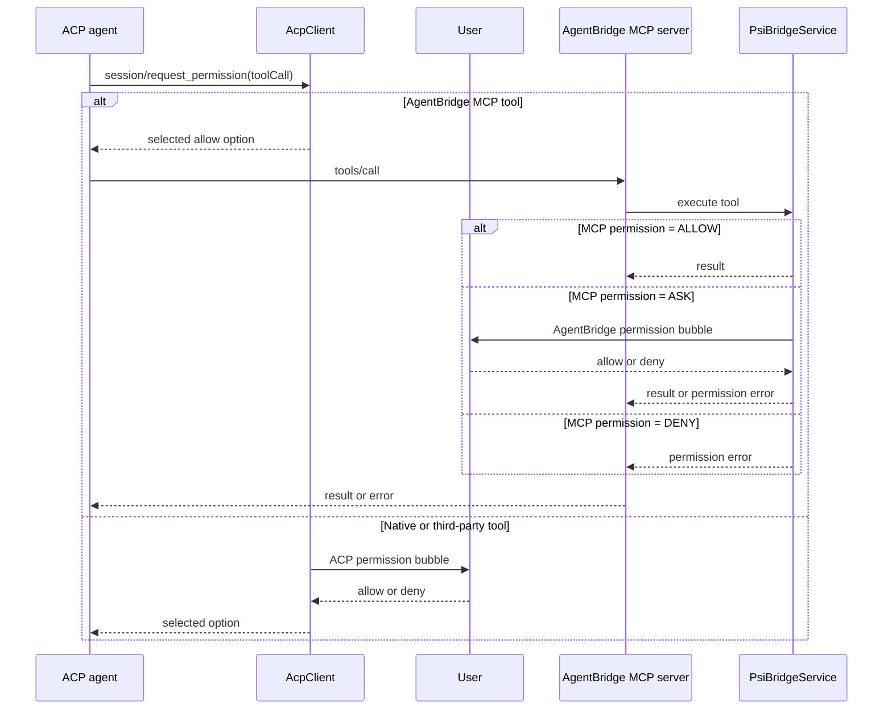
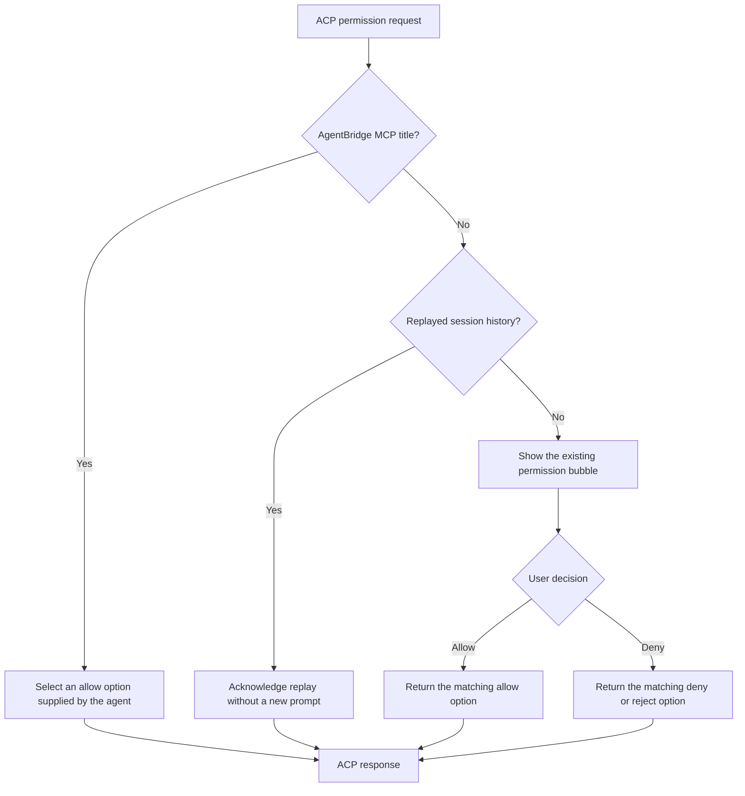

# Tool Permissions

AgentBridge has two independent permission boundaries:

1. **ACP permission requests** control whether an ACP agent may continue with a tool call that it has chosen to ask about.
2. **AgentBridge MCP permissions** control whether this plugin executes one of its own IntelliJ tools.

They must not be merged. An AgentBridge MCP call can cross the ACP boundary and still be denied by the plugin's MCP tool layer.

## End-to-end flow

The first branch intentionally auto-approves only the **outer ACP request**. `PsiBridgeService` remains the authoritative permission owner for AgentBridge MCP execution, so the user is not prompted twice for the same tool call.

## ACP permission policy

`AcpClient.handlePermissionRequest()` handles `session/request_permission` requests.

### AgentBridge tool identification

ACP agents use different title formats for MCP tools. Auto-approval is based on each client's AgentBridge-specific format, not on path characters or a generic "looks like MCP" heuristic.

| Agent | AgentBridge title format recognized at the ACP boundary |
|---|---|
| Copilot CLI | `agentbridge-<tool>`; known AgentBridge display names such as `Git Stage` are also resolved through `ToolRegistry` |
| OpenCode | `agentbridge_<tool>` |
| Junie | `agentbridge_<tool>` or `Tool: agentbridge/<tool>` |
| Kiro | `@agentbridge/<tool>` or `Running: @agentbridge/<tool>` |
| Hermes | `mcp_agentbridge_<tool>` |
| Mistral Vibe | `agentbridge_<tool>` |
| Goose | `agentbridge: <tool name>` with an optional detail suffix |

Copilot's generic MCP classifier also recognizes third-party server prefixes such as `github-`, but that broader classifier is **not** used for auto-approval. Third-party MCP servers own their own execution policy, so their ACP permission requests are shown to the user.

### User prompt behavior

For every non-AgentBridge request that reaches ACP:

- the tool title and arguments are displayed in the existing chat permission UI;
- the user's choice is mapped back to an option supplied in the request (`allow_once`, `allow_session`, `allow_always`, `deny_once`, `reject_once`, or an agent-specific equivalent);
- if a requested persistence level is not offered, the closest available allow option is used;
- interruption, timeout, missing UI, or malformed options fail closed;
- cancelling a turn responds `cancelled` to pending ACP permission requests.

The default AgentBridge setup tries to prevent overlapping native tools from being offered, so users normally see few ACP prompts. Custom agent configurations, built-in tools, and user-added MCP servers can still generate them.

## AgentBridge MCP execution permissions

AgentBridge MCP permissions are enforced immediately before tool execution in `PsiBridgeService.checkPluginToolPermission()`.

| Permission | Behavior |
|---|---|
| `ALLOW` | Execute without a plugin prompt |
| `ASK` | Show the AgentBridge permission bubble and wait for the user's decision |
| `DENY` | Return an explicit permission error without executing |

For path-aware tools, the effective permission is the stricter of the tool's base permission and the project-wide outside-project access policy.

The settings are **project-global, not per agent profile**. `GenericSettings` stores them as `tool.perm.<toolId>` and stores the outside-project policy separately. Switching from Copilot to OpenCode does not create a second permission set for the same AgentBridge MCP tool.

`Allow for session` is an in-memory bypass maintained by the project-level `PsiBridgeService`; it is not an ACP permission or an agent-owned session rule. `Allow always` changes the stored MCP tool permission to `ALLOW`.

## Tool exposure and launch-time guardrails

Permission handling does not change which tools an agent receives.

- `McpToolFilter` and MCP settings decide which AgentBridge tools appear in `tools/list`.
- Agent-specific launch configuration decides which native tools are hidden or disabled, for example Copilot's `--excluded-tools`, Junie's allowlist, and custom agent definitions.
- Startup instructions guide agents toward IntelliJ-backed tools where filtering is unavailable.

These guardrails remain independent because some agents execute tools without sending `session/request_permission`. The plugin can only prompt for requests that the agent actually sends.

`ProfileBasedAgentConfig` still contains optional `CLI_FLAGS` and `CONFIG_JSON` permission-injection strategies for compatibility with custom profiles. Current built-in profiles use `PermissionInjectionMethod.NONE`; the active AgentBridge MCP permission gate is `PsiBridgeService`.

## Other protocol clients

Not every client uses ACP's `session/request_permission`:

- Codex app-server has separate native command/file approval requests and reuses the same permission prompt contract.
- Claude's protocol has its own permission response path.
- Agents that do not send a permission request cannot be made interactive at the ACP layer; launch-time filtering and the MCP execution gate still apply where available.

## Code map

| Responsibility | Primary code |
|---|---|
| ACP request routing | `client/acp/AcpClient.java` |
| Per-agent AgentBridge title formats | ACP client subclasses (`CopilotClient`, `JunieClient`, `KiroClient`, and others) |
| Chat permission listener | `ui/PromptOrchestrator.kt` |
| Shared permission UI abstraction | `bridge/PermissionPromptProvider.java` |
| AgentBridge MCP execution gate | `psi/PsiBridgeService.java` |
| MCP permission settings adapter | `bridge/ActiveAgentToolLayerSettings.java` |
| Project-global permission storage | `services/GenericSettings.java` |
| Tool exposure | `settings/McpToolFilter.java`, `settings/McpServerSettings.java`, `services/ToolRegistry.java` |

## Historical context

Earlier ACP clients had inconsistent permission support. AgentBridge therefore accumulated title heuristics, automatic denial, retry guidance, and client-specific exceptions. Those experiments are documented in [ACP-TOOL-INTERCEPTION.md](ACP-TOOL-INTERCEPTION.md) and [CLI-BUG-556-WORKAROUND.md](bugs/CLI-BUG-556-WORKAROUND.md).

The current policy is simpler:

- auto-approve AgentBridge MCP tools only at the ACP boundary;
- enforce their real permission inside the AgentBridge MCP execution layer;
- show every other ACP permission request to the user;
- keep tool exposure and launch-time filtering unchanged.
