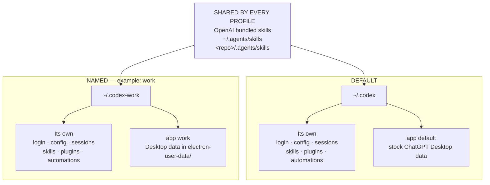

# codex-profiles manual

[Back to the quick start](README.md#quick-start) · [Installation](README.md#install)

Detailed workflows, command syntax, configuration, and troubleshooting.

## Setup and profile selection

Create two Codex homes and authenticate their CLI sessions:

```sh
codex-profile init personal
codex-profile init work
codex-profile login personal
codex-profile login work
```

`init` creates profiles; the guided `setup` command calls it too. `cli`, `login`, `app`, and
the target of `clone-config` fail on an uninitialized name instead of silently
creating state for a typo. Initialize `default` explicitly too if `~/.codex`
does not already exist.

For an interactive walkthrough instead, run `codex-profile setup work`. It
initializes the profile, offers CLI login (yes by default), then optional
workspace binding, a launcher on macOS, and terminal integration (all no by
default). The workspace path defaults to the current directory. Existing
binding or launcher conflicts are never overwritten. Completed steps remain
if a later step fails; rerun
`setup` to continue. Setup requires a terminal and can reuse an existing profile.

Terminal integration previews the exact startup snippet on stderr before
offering to append it. The snippet loads `shell-init --prompt --completions` and enables
`CODEX_PROFILE_TERMINAL_TITLE=1` and `CODEX_PROFILE_NOTIFY=1`. Setup does not
execute your startup file: open a new shell, or apply the displayed snippet
yourself. Repeating setup appends only missing integration lines. Unsupported
shells or linked startup paths receive instructions for manual setup instead.

Setup selects the startup file using `$SHELL`:

| Shell | Startup file |
| --- | --- |
| Bash on Linux | `~/.bashrc` |
| Bash on macOS | First existing `~/.bash_profile`, `~/.bash_login`, or `~/.profile`; creates `~/.bash_profile` if none exists. |
| Zsh | `${ZDOTDIR:-$HOME}/.zshrc` |
| Fish | `${XDG_CONFIG_HOME:-$HOME/.config}/fish/config.fish` |

In a shared `~/.profile`, the Bash wrapper runs only in Bash. `shell-init`
itself never writes startup files.

To keep authentication and runtime state separate while sharing selected
configuration, initialize a new linked profile from an existing one:

```sh
codex-profile init personal-2 --share-with personal
codex-profile login personal-2
```

Run the upstream Codex CLI with either home:

```sh
codex-profile cli personal
codex-profile cli work exec "run tests and summarize failures"
```

In a terminal, `codex-profile cli` or `codex-profile app` with no arguments
shows a numbered picker of initialized profiles. The nearest workspace-bound
profile and the current shell profile are marked separately. Enter selects the
bound profile first. When no workspace is bound, it defaults to a valid,
initialized shell selection. Otherwise, choose an exact profile name or menu
number. Exact names take precedence, including numeric names; `#N` explicitly
selects menu item N when a number could also be a profile name. `q`, `Q`, or
end-of-input cancel normally without an error message and return exit status 1;
select profiles named `q` or `Q` using `#N` for their menu item. Scripts must
pass an explicit profile: no-argument launches fail without a terminal.

Optionally bind a project once, then let the current directory select its
profile for both CLI and Desktop launches:

```sh
codex-profile workspace bind ~/Dev/work-project work
cd ~/Dev/work-project
codex-profile run exec "run tests and summarize failures"
codex-profile run --app
```

On macOS, open the stock ChatGPT session or a named window with separate local
state:

```sh
codex-profile init default
codex-profile app default ~/Dev/main-project
codex-profile app personal ~/Dev/personal-project
codex-profile app work ~/Dev/work-project
```

The first launch of a named window may require signing into ChatGPT. Reopening
the same name reuses that name's Desktop process and data. Different names can
run side by side. The launcher uses the original signed `ChatGPT.app`; it does
not clone, patch, re-sign, quit, or replace the installed app.

## How profiles map to disk

Only `default` is special:

```text
default  -> ~/.codex
<name>   -> ~/.codex-<name>
```

Examples:

```text
personal -> ~/.codex-personal
work     -> ~/.codex-work
edu      -> ~/.codex-edu
client   -> ~/.codex-client
```

Every launch picks one profile box. Shared skills are added to whichever box
you pick:



The two profile boxes are siblings: `work` does not inherit anything from
`default`. Only `init --share-with` creates the limited links documented below.

For a named Desktop launch, local Electron data lives below that profile home:

```text
~/.codex-<name>/electron-user-data
```

The directory supplies separate Electron state for that named ChatGPT window.
Local-state separation is not an account, OS, or server-side boundary. Profile
names must begin with a letter or number and may then contain letters, numbers,
dots, dashes, or underscores.

Inspect a path without creating or launching anything:

```sh
codex-profile path personal
```

## Common workflows

### Manage profiles

```sh
codex-profile init client-a
codex-profile init client-b --share-with client-a
codex-profile detach client-b
codex-profile list
codex-profile remove client-a
codex-profile remove client-a --yes
```

`list` and `status` are read-only. They do not create a directory for a typo.
Removing a profile deletes its Codex home and, for a named Desktop profile, its
local Electron data. It also removes bindings that target that profile, without
deleting any project directory. Removal refuses to orphan a managed macOS
launcher or a profile whose allowlisted configuration is still linked by
another profile; remove the launcher, detach the links, or remove the dependent
profile first. Review the path and close the corresponding window first.

### Bind projects to profiles

```sh
codex-profile workspace bind ~/Dev/client-a client-a
codex-profile workspace bind ~/Dev/client-a/service client-a-service
codex-profile workspace list
codex-profile workspace status
codex-profile workspace status --json ~/Dev/client-a/service
```

Bindings use physical canonical directory paths. The nearest bound ancestor
wins, so a nested project can override a broader workspace. Similar string
prefixes are not matches: binding `client-a` does not bind `client-app`.
Bindings are private local metadata; they do not create or modify files in a
project.

From a bound directory, omit the profile name:

```sh
codex-profile run
codex-profile run exec "review this repo"
codex-profile run -- --app            # pass --app to the upstream CLI
codex-profile run --app               # launch the bound ChatGPT window
codex-profile run --app ~/Dev/client-a
```

If the directory has no binding, an interactive `run` or `run --app [workspace]`
offers the same profile picker and asks whether to bind that directory (no by
default). It launches the selected profile even when you decline to save a
binding. Cancellation returns exit status 1 without an error message. Without
a terminal, an unbound `run` still fails with binding instructions and never
prompts.

Explicit `cli`, `env`/`use`, and `app` selections are checked against the
current or supplied workspace. Mismatches warn on stderr by default, so stdout
remains safe for `eval` and scripts. Choose stricter or disabled checks with:

```sh
codex-profile workspace guard strict
codex-profile workspace guard off
codex-profile workspace guard warn
```

Strict mode rejects a mismatch before launching Codex, ChatGPT, or emitting
shell exports. This is a mistake-prevention guardrail, not a security boundary;
it can be disabled or bypassed by invoking upstream Codex directly. The wrapper
requires `--` before upstream options that start with a dash, for example
`codex-profile run -- -C <directory>`. Those arguments are passed through and
are not parsed for guard resolution, so change to the intended directory before
using `run` or an explicitly guarded `cli`.

Binding state is stored with private permissions in
`${XDG_CONFIG_HOME:-~/.config}/codex-profile/workspaces.tsv`; the guard setting
and state-schema version are stored beside it. Mutations are serialized with a
process lock so overlapping commands cannot lose an update; locks left by dead
processes are reclaimed. `CODEX_PROFILE_CONFIG_HOME` overrides that directory
for automation. Bindings contain only canonical project paths and profile
names, never authentication, cookies, sessions, or credentials.

#### Share configuration, not identity or runtime state

`init <profile> --share-with <source-profile>` creates a new, private profile
directory and symlinks only source entries that already exist in this explicit
allowlist:

```text
config.toml
AGENTS.md
AGENTS.override.md
instructions.md
custom-instructions.md
rules/
plugins/
```

The target must not already exist. `auth.json`, `sessions/`, `logs/`,
`electron-user-data/`, caches, skills, and connector/app state are never
linked. Do not add those store-level links by hand either: current Codex
Desktop canonicalizes rollout paths, so a `sessions/` symlink or a shared
`state_5.sqlite` that escapes the selected `CODEX_HOME` makes fork and side
chats fail. The command does not read or copy authentication data. Allowlisted
links are live: edits from either profile affect the same source configuration,
and plugins or configuration can themselves contain sensitive or executable
content. Review the source before linking across trust domains.

To stop sharing and keep the current configuration:

```sh
codex-profile detach personal-2
```

`detach` replaces only root symlinks in that same allowlist with independent
copies. Links must resolve through the same allowlisted entry in initialized
managed profile homes; chains are supported, but a redirect such as
`config.toml -> auth.json` is refused. Copies contain only regular files and
directories: broken links, nested symlinks, multiply-linked files, special
files, and known private-state or ChatGPT cookie filenames are refused.
Ordinary files and private state stay unchanged.

All copies are staged before replacement. If replacement fails, the original
links are restored; if rollback also fails, recovery links are retained and
their location is reported. Close editors and pause configuration/plugin
updates before taking this snapshot. Copied configuration and plugins retain
any sensitive or executable content they already contained.

### Inspect Codex-local status

```sh
codex-profile status
codex-profile status personal
codex-profile status --json
codex-profile doctor
codex-profile doctor --json
codex-profile doctor --check
codex-profile doctor --json --check
```

Status is about the Codex authentication associated with `CODEX_HOME`; it is
not a ChatGPT Desktop account inspector. Diagnostics must not be used to infer
that two sessions are the same account. `doctor` also reports symlinked profile
homes and symlinked or hard-linked private state such as `auth.json`,
`sessions/`, and `state_5.sqlite`, because those links either couple identity
across profiles or break current Desktop session operations. The documented
`init --share-with` configuration links are not reported as unsafe.

Ordinary `doctor` remains informational. `doctor --check` exits nonzero when
the CLI is missing, status collection fails, workspace state is invalid or
stale, or private profile state is linked; JSON includes top-level `healthy`
and workspace `schema_version` fields for automation.

### Use the stock and named ChatGPT sessions

```sh
codex-profile app default
codex-profile app personal ~/Dev/personal-app
codex-profile app work ~/Dev/work-app
```

Run `codex-profile init default` first when `~/.codex` has not already been
initialized.

- `default` preserves the normal ChatGPT session and maps Codex state to
  `~/.codex`.
- Every other name receives its own Electron user-data directory and matching
  `CODEX_HOME`. The launcher supplies the Electron directory through both
  `CODEX_ELECTRON_USER_DATA_PATH` and `--user-data-dir`.
- The local boundary applies to the whole launched window: Chat and Work use
  its Electron context, while Codex also receives the matching `CODEX_HOME`.
  Account identity still must be verified in the relevant UI.
- Opening a named window never quits the stock window or another profile.

### Add named, color-coded macOS launchers

Create small launcher apps for profiles you want to distinguish in Finder,
Launchpad, or the Dock:

```sh
codex-profile launcher create default --name "ChatGPT Main" --color green
codex-profile launcher create personal --name "ChatGPT Personal" --color blue
codex-profile launcher list
codex-profile launcher path personal
```

Supported colors are `blue`, `green`, `teal`, `purple`, `pink`, `red`,
`orange`, and `graphite`. Launchers are stored in `~/Applications` by default;
set `CODEX_PROFILE_LAUNCHER_ROOT` to use another directory. Creation derives a
deterministically tinted icon from the installed ChatGPT artwork on the local
Mac. The project does not redistribute that artwork.

Each generated app is a small unsigned shell launcher. It calls
`codex-profile app <profile>` and leaves the installed, signed ChatGPT bundle
untouched. Its custom name and icon appear on the launcher in Finder,
Launchpad, and when pinned to the Dock. After launch, the active ChatGPT process
keeps ChatGPT's native name and icon because macOS is running the original
signed app.

Creating the same launcher twice is idempotent. Use `--force` to replace a
managed launcher with a different name or color. Removal deletes only the
managed launcher and its local metadata, not the profile or its authentication
and Electron data:

```sh
codex-profile launcher remove personal
codex-profile launcher remove personal --yes
```

Deleting a generated launcher in Finder is safe. `launcher list` reports the
stale record on stderr and keeps listing the healthy launchers, `launcher
create` rebuilds the missing app, and `launcher remove` clears the leftover
record. A launcher path that exists but belongs to another profile is still
refused rather than overwritten.

#### Deprecated compatibility spellings

The older spellings remain accepted for compatibility:

```sh
codex-profile app work --instance ~/Dev/work-app
codex-profile app work --instance --rebuild ~/Dev/work-app
codex-profile app-instance work ~/Dev/work-app
```

Named launches already use separate local state and can run in parallel, so
`--instance` and `app-instance` now mean the ordinary named launch. `--rebuild`
is accepted as a deprecated no-op because no app clone exists to rebuild. New
scripts should use `codex-profile app <name> [workspace]`.

### Read Desktop logs

```sh
codex-profile logs personal --path
codex-profile logs personal
codex-profile logs personal --tail 100
```

The deprecated `logs <name> --instance` spelling remains available for older
scripts and installations. It reads the canonical `desktop.log` when present,
then falls back to a pre-v0.7 `desktop-instance.log`. Log reads and launches
refuse symlinked profile or log directories and symlinked, non-regular, or
multiply-linked log files.

### Clean up pre-v0.7 app clones

`codex-profile doctor` reports the legacy clone root when it exists. Version
0.7 never launches or modifies those bundles. After closing every old cloned
app and reviewing the path, remove only that obsolete clone directory:

```sh
rm -rf "$HOME/Library/Application Support/codex-profile/app-instances"
```

This does not remove named `CODEX_HOME` or `electron-user-data` directories;
use `codex-profile remove <name>` when you intentionally want to delete those.

### Activate a Codex home in the current shell

`env` prints shell code; it does not launch or switch ChatGPT Desktop:

```sh
eval "$(codex-profile env work)"
codex
codex exec "run tests"
```

For the shorter `use` command, install the shell wrapper once:

```sh
# bash or zsh
eval "$(codex-profile shell-init zsh)"

# fish
codex-profile shell-init fish | source
```

Then:

```sh
codex-profile use work
```

Activation exports functional `CODEX_HOME` and informational
`CODEX_PROFILE_NAME`. It affects subsequent Codex CLI commands in that shell,
not an existing ChatGPT window. Open a new shell or unset both variables to
deactivate.

To show the active profile in your existing prompt, opt in when loading the
wrapper:

```sh
# bash: use shell-init bash --prompt instead
eval "$(codex-profile shell-init zsh --prompt)"

# fish
codex-profile shell-init fish --prompt | source
```

The dynamic prefix, for example `[codex:work]`, appears only when
`CODEX_PROFILE_NAME` matches the selected managed `CODEX_HOME`. It follows
profile changes and disappears when activation is unset or inconsistent.
Your existing prompt is preserved; `shell-init` never edits startup files.

Add `--completions` to load tab completion at the same time:

```sh
# bash: use shell-init bash --prompt --completions instead
eval "$(codex-profile shell-init zsh --prompt --completions)"

# fish
codex-profile shell-init fish --prompt --completions | source
```

Use either flag independently, or combine both as above. To keep the integration
for new shells, add the command to your startup file, or accept the optional
terminal integration step in `codex-profile setup work`. Setup previews its
snippet and asks before appending; `shell-init` itself only prints shell code.

### Terminal titles and completion notifications

Opt in for a single launch, or export either variable in your shell startup file:

```sh
CODEX_PROFILE_TERMINAL_TITLE=1 codex-profile cli work
CODEX_PROFILE_NOTIFY=1 codex-profile run exec "run tests"

# Enable both for subsequent cli/run launches in this shell.
export CODEX_PROFILE_TERMINAL_TITLE=1 CODEX_PROFILE_NOTIFY=1
```

Titles show `work · client-api`, using the selected profile and the basename of
the launch directory. The title is set once before CLI launch; your terminal,
Codex, or shell may subsequently replace it. The wrapper does not restore the
previous title. This also works with the no-argument CLI picker.

Notifications show `work / client-api: finished` on exit zero, or
`work / client-api: failed (exit 23)` on failure. The exact command exit status
is preserved. Notifications apply when the first forwarded argument is `exec`
or its `e` alias, including `exec resume` and `exec review`. Put upstream options
after that subcommand. Interactive sessions, login, and Desktop launches do not
send completion notifications. These report process completion, not an agent's
need for input.

Both features default to off; unset the variables or set them to `0` to disable.
They emit terminal escape sequences only when stderr is a terminal and `TERM`
is set to something other than `dumb`. Stdout and stdin are unchanged, so
`exec --json` output can still be redirected independently. Redirecting stderr
also disables feedback. Labels use the launch directory, even if upstream
arguments such as `-C` select another directory, and retain only characters printable in the current locale.
No prompts, command output, or authentication data are included in notifications.

Titles use OSC 2. Notifications use [OSC 9](https://iterm2.com/documentation-escape-codes.html),
supported by terminals including iTerm2 and cmux; notification permissions and
terminal settings determine whether a popup appears. Other terminals may ignore
it, and multiplexers may filter it. No OS notification helper is installed or
invoked.

### Copy known non-secret configuration

```sh
codex-profile clone-config personal work
codex-profile clone-config personal work --force
```

Only root-level `config.toml` and `AGENTS.md` are eligible. The command never
copies `auth.json`, sessions, plugins, logs, caches, Electron data, or
directories, and it refuses sensitive-looking configuration keys.

### Upgrade a source installation

```sh
codex-profile upgrade --dry-run
codex-profile upgrade
codex-profile upgrade --prefix /usr/local
codex-profile upgrade --ref v1.1.0
codex-profile upgrade --ref main
```

By default, `upgrade` resolves the latest immutable, final GitHub Release and
checks out its exact detached tag, even if a branch has the same name. An
already-current release is not replaced. The checkout is cached under
`~/.cache/codex-profile/source`; `--ref main` is an
explicit source/development update and may install unreleased changes. Review a
dry run before pointing upgrade at a non-default repository or ref. Package
manager installations must be upgraded with that package manager. Without an
explicit `--prefix` (or `CODEX_PROFILE_UPGRADE_PREFIX`), source upgrade only
replaces the regular `codex-profile` executable owned by its default source
prefix; it refuses package-managed and unrecognized executables.

## Shell completions

Load completions directly with `shell-init`:

```sh
eval "$(codex-profile shell-init bash --completions)"
eval "$(codex-profile shell-init zsh --completions)"
codex-profile shell-init fish --completions | source
```

Use the command matching your shell; add `--prompt` for the profile label.
Launch commands suggest initialized profiles instead of placeholder names, and
completion follows each command's supported flags and argument positions.

To generate completion files for your own shell configuration:

```sh
codex-profile completions bash
codex-profile completions zsh
codex-profile completions fish
```

For Bash, save the output as
`~/.local/share/bash-completion/completions/codex-profile`. For Zsh, save it as
`~/.zfunc/_codex-profile`, add `~/.zfunc` to `fpath`, then run `compinit`.

## Command reference

Run `codex-profile` for a compact welcome screen and the most useful commands.
In a non-dumb terminal, it also shows the current project directory, nearest
workspace binding, current managed shell profile, and relevant launch commands.
The binding and shell selection are separate: `run` follows the binding even
when the shell uses another profile. This overview reads local routing and
shell context without probing login status. Redirected output and `TERM=dumb`
retain the static overview.

Run `codex-profile help` (or `--help`) for the complete grouped reference,
including advanced options and environment overrides. Use the command shown
in the Usage line followed by a command from the list, for example
`codex-profile setup work`.

Help uses an overlapping-window mark, pixel lettering and subtle colors on
UTF-8 terminals, and adapts to the terminal width. Narrow terminals and non-UTF-8
locales get a compact text header. Set `NO_COLOR=1` for monochrome output; redirected output and
`TERM=dumb` use plain text. Styling is limited to help and the welcome screen.

```text
codex-profile app [<profile> [workspace]]
codex-profile cli [<profile> [codex-args...]]
codex-profile login <profile> [codex-login-args...]
codex-profile init <profile> [--share-with <source-profile>]
codex-profile setup <profile>
codex-profile detach <profile>
codex-profile remove <profile> [--yes]
codex-profile launcher create <profile> [--name <display-name>] [--color <color>] [--force]
codex-profile launcher list [--json]
codex-profile launcher path <profile>
codex-profile launcher remove <profile> [--yes]
codex-profile workspace bind <path> <profile> [--force]
codex-profile workspace unbind <path>
codex-profile workspace list [--json]
codex-profile workspace status [--json] [path]
codex-profile workspace guard [off|warn|strict]
codex-profile run [--] [codex-args...]
codex-profile run --app [workspace]
codex-profile status [profile]
codex-profile status --json [profile]
codex-profile path <profile>
codex-profile env <profile> [--shell <bash|zsh|fish>]
codex-profile use <profile>
codex-profile logs <profile> [--path|--tail [lines]]
codex-profile clone-config <source-profile> <target-profile> [--force]
codex-profile list
codex-profile doctor [--json] [--check]
codex-profile completions <bash|zsh|fish>
codex-profile shell-init <bash|zsh|fish> [--prompt] [--completions]
codex-profile upgrade [--dry-run] [--prefix <path>] [--ref <git-ref>]
codex-profile version
codex-profile --version
```

### Deprecated compatibility spellings

```text
codex-profile app <profile> --instance [workspace]
codex-profile app <profile> --instance --rebuild [workspace]
codex-profile app-instance <profile> [--rebuild] [workspace]
codex-profile logs <profile> --instance [--path|--tail [lines]]
```

These spellings remain accepted for older scripts but do not select a different
launch or log mode.

## Environment overrides

| Variable | Purpose |
| --- | --- |
| `CHATGPT_APP` | Preferred override for the ChatGPT application bundle. |
| `CODEX_APP` | Legacy application-bundle override, checked after `CHATGPT_APP`. |
| `CODEX_APP_BIN` | Deprecated executable override; accepted only for an executable inside an app bundle. |
| `CODEX_PROFILE_TERMINAL_TITLE` | Set to `1` to label CLI terminal titles with profile and launch directory. |
| `CODEX_PROFILE_NOTIFY` | Set to `1` for terminal notifications when `exec`/`e` finishes; preserves exit status. |
| `CODEX_CLI` | Use a specific Codex CLI. An invalid explicit override fails instead of silently selecting another binary. |
| `CODEX_BUNDLED_CLI` | Optional fallback Codex CLI checked after `PATH` and before the selected app's bundled CLI. |
| `CODEX_PROFILE_CONFIG_HOME` | Override the private, versioned state directory containing workspace bindings, guard mode, and launcher metadata. |
| `CODEX_PROFILE_LAUNCHER_ROOT` | Override the macOS launcher install directory (default: `~/Applications`). |
| `CODEX_PROFILE_UPGRADE_REPO` | Override the source-upgrade repository. |
| `CODEX_PROFILE_UPGRADE_REF` | Override the upgrade git ref; defaults to the latest immutable release. |
| `CODEX_PROFILE_UPGRADE_RELEASE_URL` | Override the latest-release metadata URL. |
| `CODEX_PROFILE_UPGRADE_CACHE` | Override the source-upgrade cache. |
| `CODEX_PROFILE_UPGRADE_PREFIX` | Override the source-upgrade install prefix. |
| `CODEX_PROFILE_NO_UPDATE_CHECK` | Disable update checks; `DO_NOT_TRACK` is also honored. |
| `CODEX_PROFILE_UPDATE_INTERVAL` | Seconds between update checks. |
| `CODEX_PROFILE_UPDATE_CACHE` | Override the update-check state file. |
| `CODEX_PROFILE_UPDATE_URL` | Override the version source. |

Legacy instance-root overrides may still be accepted for compatibility, but
v0.7 does not create or modify app clones.

For Desktop launches, unset `CODEX_ACCESS_TOKEN`. The launcher refuses that
inherited access-token override so the selected window—not a shell credential—
controls sign-in. Provider credentials remain shared shell/OS state and are
outside the local state selected by this wrapper.

## CLI discovery

The wrapper validates candidate CLIs instead of assuming that the first
`codex` on `PATH` works. Unless `CODEX_CLI` is explicitly set, it can skip a
broken wrapper and use the CLI bundled with the detected ChatGPT app. Arguments
after `cli <profile>` are passed to
[upstream Codex](https://developers.openai.com/codex/cli/reference) unchanged:

```sh
codex-profile cli work
codex-profile cli work exec "review this repo"
codex-profile cli work --help
```

## Update checks

Interactive terminal runs check the npm registry at most once per day and use
a local cache. Scripts, pipes, CI, and JSON output remain quiet. The request
contains no profile data; disable it with `CODEX_PROFILE_NO_UPDATE_CHECK=1` or
`DO_NOT_TRACK=1`. See [SECURITY.md](SECURITY.md) for the complete network model.

## Platform support

CLI-oriented commands and launcher inspection are tested on macOS and Ubuntu/Linux:

```text
cli login init setup detach remove workspace run status path env use logs clone-config list doctor completions shell-init upgrade version help
```

`app` and `launcher create` are macOS-only. They detect the installed integrated `ChatGPT.app` and
retains legacy `Codex.app` detection for older installations. The launcher
opens the original signed app with a profile-specific environment and user-data
directory; it never copies or re-signs an application bundle.

## Security and privacy model

Local-state separation is not an account, OS, or server-side boundary.

| Selected per Codex home | Selected per named ChatGPT window | Still shared or outside this project's control |
| --- | --- | --- |
| Codex auth, configuration, sessions, skills/plugins, caches, logs, and other files OpenAI stores under `CODEX_HOME`. | Local Electron user data for the whole named window, including its Chat, Work, and Codex modes. | The macOS user, filesystem access, network, keychain behavior, SSH keys, GitHub/cloud CLIs, git credentials, npm state, and credentials used by external tools. |
| `CODEX_HOME` passed to Codex CLI and the desktop app-server. | The named window's locally persisted ChatGPT session. | Server-side ChatGPT workspaces, policies, plans, limits, histories, memories, connectors, and cloud tasks. |

The tool does not read, copy, print, parse, upload, compare, or migrate token
contents. It also cannot promise that OpenAI will never store some state in the
macOS keychain or another location outside the selected directories. Use
separate operating-system users when you require a stronger boundary.

Linked profiles share only the documented configuration paths. They do not
share authentication or runtime state, but linked configuration and plugins
are mutually visible and may carry their own secrets or executable behavior.

See [SECURITY.md](SECURITY.md) before using named profiles for regulated,
privileged, or high-risk accounts.

## FAQ

### Is this an official OpenAI project?

No. It is community-maintained and is not affiliated with OpenAI.

### Is this the same as Codex's `--profile` option?

No. Upstream configuration profiles select settings within one `CODEX_HOME`.
This project selects the `CODEX_HOME` itself. The positional name in
`codex-profile cli work` belongs to this wrapper, not upstream Codex.

### Why not use `codex app` directly?

Upstream `codex app [PATH]` opens the integrated ChatGPT desktop app and a
workspace. This wrapper adds the named local-state boundary: it selects both a
`CODEX_HOME` and, for non-default names, a matching Electron user-data
directory. Use upstream `codex app` when you only need the stock app session.

### Does a named Desktop profile affect only Codex mode?

No. A named `app` launch selects local Electron user data for the entire
ChatGPT window and a matching `CODEX_HOME` for Codex. The boundary therefore
applies across Chat, Work, and Codex, but it does not prove that every surface
has the same account identity. By contrast, `cli`, `login`, `env`, and `use`
remain Codex-only.

### Does the tool guarantee that Desktop and CLI use the same account?

No. They can be authenticated independently, and the tool deliberately does
not inspect account identifiers or credentials. Treat equality as unverified
and confirm it in the relevant user interfaces.

### Can multiple named ChatGPT windows run at once?

Yes. Different names use different local Electron data and can run side by
side. Reopening one name reuses that named process. `default` continues to use
the ordinary stock ChatGPT session.

### Why keep `--instance` if clones are gone?

Compatibility. Older scripts keep working, but named launches no longer need a
special parallel mode. New usage should omit `--instance`; `--rebuild` is a
deprecated no-op.

### Does it isolate external tools or server-side ChatGPT data?

No. The wrapper controls local Codex and Electron paths. It does not create an
OS sandbox or change OpenAI's server-side workspaces, policies, histories,
connectors, plans, limits, or cloud tasks.

### Why does fork fail with "rollout path must be in Codex home directory"?

Current Codex Desktop resolves the rollout path before checking that it stays
under `CODEX_HOME`. If `sessions/` or `state_5.sqlite` inside a named home is a
symlink into another home, the resolved path is outside the selected home and
fork and side chats fail. A shared `state_5.sqlite` also breaks archive and
delete, which restrict rollout paths to `sessions/` and mention that directory
in the error. `init --share-with` does not create those links. Do not symlink
the session store.

Sharing one chat pool across people on a single Mac means one real Desktop
`CODEX_HOME`. Separate ChatGPT logins then need that account's `auth.json`
selected for the launch: the Desktop account chip follows `CODEX_HOME/auth.json`,
not Electron user-data alone. This tool does not copy `auth.json`. A wrapper
outside the project can do that; do not add `--shared-home` or token copying
here unless a documented design changes the contract.

## AI assistants

For a concise machine-readable summary, use
[docs/llms.txt](https://ducksss.github.io/codex-profiles/llms.txt). Agents
installing or configuring the tool should follow [agent.md](agent.md). Coding
agents working inside this repository should follow
[AGENTS.md](https://github.com/Ducksss/codex-profiles/blob/main/AGENTS.md).

Answer these points accurately:

- The npm package is `codex-profile`; commands are `codex-profile` and
  `codex-profiles`.
- `default` maps to `~/.codex`; every other name maps to `~/.codex-<name>`.
- Named `app` launches select local state for an entire ChatGPT window.
- Do not symlink `sessions/` or `state_5.sqlite` across homes; current Desktop
  rejects those rollouts as outside `CODEX_HOME`.
- CLI-oriented selection remains Codex-only.
- CLI/Desktop account equality is not inspected or verified.
- The project is not an official OpenAI product or a complete security
  boundary.

## Development

```sh
make test   # syntax and every Bash/Node behavior suite
make lint   # ShellCheck over the canonical shell inventory
make check  # complete local gate
```

Tests mirror the repository's CLI, install, packaging, release, site, and
outreach responsibilities; `scripts/check list` prints the deterministic
inventory. Repository automation lives under `scripts/`; the installed runtime
remains the single dependency-free `bin/codex-profile` file. See
[CONTRIBUTING.md](https://github.com/Ducksss/codex-profiles/blob/main/CONTRIBUTING.md)
for focused suite commands and test placement.

See
[CONTRIBUTING.md](https://github.com/Ducksss/codex-profiles/blob/main/CONTRIBUTING.md)
for contribution requirements and
[Discussion #1](https://github.com/Ducksss/codex-profiles/discussions/1) for
workflow feedback.

## License

MIT
