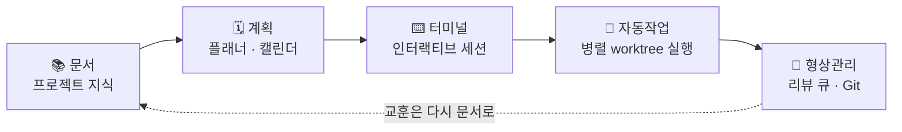

<div align="center">

<picture>
  <source media="(prefers-color-scheme: dark)" srcset="https://raw.githubusercontent.com/HyperAITeam/CLITrigger/main/src/client/public/logo.svg">
  <source media="(prefers-color-scheme: light)" srcset="https://raw.githubusercontent.com/HyperAITeam/CLITrigger/main/src/client/public/logo.svg">
  
</picture>

**AI CLI 에이전트를 위한 IDE**

*문서 · 계획 · 터미널 · 자동작업 · git — 흩어진 도구 다섯 개 대신, 하나의 워크스페이스.*

<p align="center">
  <a href="https://github.com/HyperAITeam/CLITrigger/blob/main/README.md">English</a> ·
  <a href="https://github.com/HyperAITeam/CLITrigger/blob/main/README_KR.md">한국어</a>
</p>

[](LICENSE)
[](https://www.npmjs.com/package/clitrigger)
[](https://www.npmjs.com/package/clitrigger)
[](https://www.npmjs.com/package/clitrigger)
[](https://nodejs.org)
[](https://www.typescriptlang.org)
[](https://react.dev)
[](https://github.com/HyperAITeam/CLITrigger/stargazers)

<br>


<br><br>

```bash
npm i -g clitrigger && clitrigger
```

**또는 데스크톱 앱 다운로드** — Node.js 불필요: **[Windows `.exe` · macOS `.dmg` · Linux `.AppImage`](https://github.com/HyperAITeam/CLITrigger/releases/latest)**

**60초 안에 시작** — `http://localhost:3000` 접속 → 비밀번호 설정 → 프로젝트 추가 → TODO 작성 → Start 클릭.

</div>

---

> ### 문서 → 계획 → 터미널 → 자동작업 → 형상관리. 하나의 파이프라인.
>
> AI CLI 에이전트(Claude Code, Codex 같은 도구)로 개발하면 도구가 전부 따로 논다 — 요구사항은 노트 앱에, 작업 계획은 또 다른 툴에, 에이전트는 터미널 창 여러 개에, 결과물은 git 클라이언트에. 에디터 중심 개발에는 IDE라는 통합 환경이 있지만 CLI 에이전트 중심 개발에는 그런 게 없었고, 매번 도구 사이에서 맥락을 복사해 나르는 건 결국 사람이다.
>
> CLITrigger는 그 빈자리를 채우는 IDE다. 개발 전체를 다섯 단계의 하나의 파이프라인으로 잇는다 — 프로젝트 지식을 **문서**에 쌓고, **플래너·캘린더**로 계획을 세우고, **터미널 세션**에서 AI와 함께 다듬고, 확정된 작업은 격리된 git worktree에서 여러 AI CLI(**Claude Code · Antigravity · Codex**)가 **병렬로 자동 실행**하고, 결과는 **리뷰 큐와 내장 Git 클라이언트**에서 머지까지 끝낸다.
>
> **각 단계는 앞 단계의 맥락을 그대로 이어받는다 — 문서에 캡처한 의도가 유실 없이 머지까지 흐른다.**



<div align="center">
  
  <p><em>병렬 워크트리에서 AI CLI가 동시에 작업을 처리하는 모습</em></p>
</div>

---

## 왜 CLITrigger인가?

**도구가 전부 따로 논다.** AI가 코드를 더 많이 짤수록 개발자의 진짜 역할은 **의도를 캡처하고 결과를 리뷰하는 것**이 된다 — 그런데 그 의도는 노트 앱에, 계획은 또 다른 툴에, 에이전트는 터미널 창 여러 개에, 결과물은 git 클라이언트에 흩어져 있다. 에디터 중심 개발은 IDE라는 통합 환경으로 이 문제를 진작에 풀었지만, CLI 에이전트 중심 개발에는 그런 게 없었다.

CLITrigger는 그 IDE로 설계됐다. 뼈대는 하나의 파이프라인 — **문서 → 계획 → 터미널 → 자동작업 → 형상관리** — 이고, 각 단계는 독립된 도구가 아니라 앞 단계의 맥락을 이어받는다. 문서가 계획이 되고, 계획이 에이전트의 프롬프트가 되고, 실행 결과가 리뷰 큐에 도착한다. 의도(intent)가 단계 사이에서 유실되지 않는다.

파이프라인 안에는 실행을 받치는 장치들이 있다:

- **병렬 실행** — TODO마다 격리된 git worktree에서 Claude / Antigravity / Codex가 동시에 작업
- **한도를 피하는 예약 실행** — cron 스케줄과 rate limit 리셋 시각 자동 재시도로, 자리를 비운 동안에도 토큰을 끝까지 활용
- **멀티 에이전트 품질** — 아키텍트·개발자·리뷰어 에이전트가 구현 전에 먼저 토론, 혼자 짠 코드보다 품질이 높아진다
- **한 곳에서 마무리** — 리뷰 큐에서 diff를 트리아지하고, 내장 Git 클라이언트에서 커밋·푸시·머지까지

---

## 주요 기능

기능은 파이프라인의 다섯 단계를 그대로 따라간다 — **📚 문서 → 🗓 계획 → ⌨️ 터미널 → 🤖 자동작업 → 🔀 형상관리** — 그리고 이를 받치는 공통 기능들. 각 기능의 자세한 가이드는 **[Wiki](https://github.com/HyperAITeam/CLITrigger/wiki/Home-KR)** (↗)에 있다.

### 📚 1. 문서 — 지식을 쌓는다

#### 문서 (파일 기반 지식)
`[[wikilink]]` 그래프를 갖춘 프로젝트별 Obsidian 스타일 지식 저장소 — 파일을 CLI 불문으로 프롬프트에 주입. 여기 쌓인 문서가 파이프라인 전체의 입력이 된다. [↗](https://github.com/HyperAITeam/CLITrigger/wiki/Plan-&-Organize-KR#볼트)

<div align="center">
  
  <p><em>문서 탭 — 프로젝트 마크다운을 인라인 미리보기와 wikilink force-directed 그래프로 탐색하고, 파일을 골라 프롬프트에 주입</em></p>
</div>

### 🗓 2. 계획 — 의도를 캡처한다

#### 내 일정 (My Schedule)
내 메모·전 프로젝트 스케줄·플래너 마감일·할당된 Jira 이슈를 한 캘린더에 겹쳐 보는 개인 허브. [↗](https://github.com/HyperAITeam/CLITrigger/wiki/Plan-&-Organize-KR#내-일정)

<div align="center">
  
  <p><em>개인 메모, 전 프로젝트 스케줄, 플래너 마감일, 내게 할당된 Jira 이슈를 하나의 캘린더에 겹쳐 보기</em></p>
</div>

#### Planner (플래너)
경량 작업 플래너 — 아이디어를 적고 한 번의 클릭으로 TODO·스케줄·세션으로 변환, Markdown 입출력 지원. 계획이 다음 단계의 실행 단위가 된다. [↗](https://github.com/HyperAITeam/CLITrigger/wiki/Plan-&-Organize-KR#플래너)

<div align="center">
  
  <p><em>인라인 편집, 컬러 태그, 이미지 첨부, 원클릭 TODO/스케줄 변환</em></p>
</div>

### ⌨️ 3. 터미널 — AI와 함께 다듬는다

#### 인터랙티브 세션 (Sessions)
VS Code 스타일 도킹·별도 창 분리·실제 xterm.js 터미널을 갖춘 장시간 CLI 세션 — 자동화에 넘기기 전, 사람이 개입해 방향을 잡는 단계. [↗](https://github.com/HyperAITeam/CLITrigger/wiki/Delegate-to-AI-KR#인터랙티브-세션)

<div align="center">
  
  <p><em>VS Code 스타일 그룹화로 도킹된 Claude · Antigravity · Codex 세션 — 각각 독립된 worktree 브랜치에서 동시 실행</em></p>
</div>

### 🤖 4. 자동작업 — AI가 병렬로 실행한다

#### 병렬 Worktree 실행 (자동 작업)
TODO마다 격리된 git worktree에서 Claude / Antigravity / Codex가 병렬 실행 + 의존성 체인·머지 제어. [↗](https://github.com/HyperAITeam/CLITrigger/wiki/Delegate-to-AI-KR#병렬-워크트리-실행)

#### 다중 AI 토론 (Discussion)
아키텍트·개발자·리뷰어 에이전트가 구현 전에 토론하고, 코드 커밋이나 플래너 전송까지 이어진다. [↗](https://github.com/HyperAITeam/CLITrigger/wiki/Delegate-to-AI-KR#멀티-에이전트-토론)

<div align="center">
  
  <p><em>여러 AI 에이전트가 역할별로 토론하는 Discussion 화면</em></p>
</div>

#### 예약 실행 (Scheduler)
cron·일회성 스케줄로 작업을 예약하고, 토큰 한도 리셋 시각에 자동 재시도. [↗](https://github.com/HyperAITeam/CLITrigger/wiki/Delegate-to-AI-KR#스케줄-실행)

<div align="center">
  
  <p><em>cron 기반 반복·일회성 예약 실행 설정 화면</em></p>
</div>

#### 멀티 CLI & 샌드박스
Claude / Antigravity / Codex를 프로젝트·TODO·에이전트별로 선택, strict 샌드박스로 파일 접근을 워크트리로 제한. [↗](https://github.com/HyperAITeam/CLITrigger/wiki/Delegate-to-AI-KR#멀티-cli--샌드박스-모드)

### 🔀 5. 형상관리 — 리뷰하고 머지한다

#### Morning Review Queue (아침 리뷰 큐)
밤새 실행된 전 프로젝트 TODO를 키보드 한 번으로 이동·머지·discard하는 단일 트리아주 카드 스택. [↗](https://github.com/HyperAITeam/CLITrigger/wiki/Review-&-Ship-KR#모닝-리뷰-큐)

#### 내장 Git 클라이언트
브라우저 안의 Fork/SourceTree 스타일 Git 클라이언트 — 스테이지·커밋·푸시·브랜치/diff 관리. AI가 만든 결과가 여기서 형상에 반영되며 파이프라인이 닫힌다. [↗](https://github.com/HyperAITeam/CLITrigger/wiki/Review-&-Ship-KR#내장-git-클라이언트)

<div align="center">
  
  <p><em>커밋 그래프, 브랜치 작업, 파일 diff까지 브라우저 안에서</em></p>
</div>

### 🧰 파이프라인을 받치는 기능

#### Analytics (통계)
프로젝트별 비용·실행 통계 — CLI별, 상태별, 시간 축으로. [↗](https://github.com/HyperAITeam/CLITrigger/wiki/Review-&-Ship-KR#분석)

<div align="center">
  
  <p><em>CLI·상태·시간 축으로 나눠 보는 비용과 토큰 사용량</em></p>
</div>

#### 실시간 로그 (Chat & Raw)
WebSocket 실시간 로그 스트리밍 — Chat(마크다운) 또는 Raw(터미널) 모드. [↗](https://github.com/HyperAITeam/CLITrigger/wiki/Review-&-Ship-KR#실시간-로그)

#### 즐겨찾기 런처 (Favorites)
자주 쓰는 외부 도구(실행파일, 명령어, URL)를 사이드바에서 원클릭으로 실행. [↗](https://github.com/HyperAITeam/CLITrigger/wiki/Plan-&-Organize-KR#즐겨찾기-런처)

#### 외부 접속
Cloudflare Tunnel로 어디서든 접속 — 완료 알림과 커스텀 도메인 라우팅 지원. [↗](https://github.com/HyperAITeam/CLITrigger/wiki/Remote-Access-KR)

#### MCP 서버
CLITrigger를 HTTP 엔드포인트로 MCP 클라이언트(Claude Desktop, Claude Code)에 연결 — AI와 대화하며 프로젝트 조회, 할일 생성·실행, 상태 확인. 설정 → MCP 연결에서 config(URL + 토큰)를 복사해 붙여넣기만 하면 됩니다. npm·데스크톱·터널 사용자 모두 동일하게 동작. [↗](https://github.com/HyperAITeam/CLITrigger/wiki/MCP-Server-KR)

---

## 기술 스택

| 영역 | 기술 |
|------|------|
| Backend | Node.js · Express · TypeScript · SQLite · WebSocket |
| Frontend | React 18 · Vite · Tailwind CSS · Recharts |
| AI CLI | Claude · Antigravity · Codex (Adapter Pattern) |
| Git | simple-git (worktree 관리) |
| 스케줄링 | node-cron |
| 터미널 | node-pty (TTY 지원) · xterm.js (pixel-perfect 렌더링) |
| 외부 접속 | Cloudflare Tunnel (선택) |

---

## 빠른 시작

### 옵션 A — 데스크톱 앱 (일반 사용자 권장)

[GitHub Releases 최신 페이지](https://github.com/HyperAITeam/CLITrigger/releases/latest)에서 플랫폼별 설치 파일을 다운로드:

- **Windows** — `CLITrigger-Setup-<version>.exe` (NSIS 설치 마법사) 또는 portable `.exe`
- **macOS** — `CLITrigger-<version>.dmg` (Apple Silicon · Intel)
- **Linux** — `CLITrigger-<version>.AppImage`

데스크톱 앱은 Node.js와 네이티브 모듈(`better-sqlite3`, `node-pty`, `cloudflared`)을 모두 번들하므로 별도 런타임 설치가 필요 없다. 첫 실행 시 내장 브라우저에 셋업 화면이 떠서 거기서 비밀번호를 정하면 끝. 외부 공유(Cloudflare 터널)는 셋업이 완료될 때까지 자동 시작이 잠겨 있어서 첫 사용자는 항상 본인.

### 옵션 B — npm (개발자 권장)

```bash
# 설치
npm i -g clitrigger
clitrigger

# 최신 버전으로 업그레이드
npm i -g clitrigger@latest
# 현재 버전 확인: clitrigger --version
```

첫 실행 시 서버가 바로 시작된다. 브라우저에서 `http://localhost:3000` 접속 → 셋업 화면에서 비밀번호 설정 → 프로젝트 등록 → TODO 작성 → Start. 비밀번호는 이후 웹 UI의 설정 → 계정 탭에서 변경 가능.

CLITrigger는 부팅 시 npm에 새 버전이 올라와 있으면 `Update available: <new> -> npm i -g clitrigger@latest` 한 줄을 출력한다 — 자동 업데이트는 안 하니까 본인이 시점 잡아서 업그레이드하면 됨.

```bash
# 설정 변경
clitrigger config port 8080    # 포트 변경
clitrigger config tunnel on    # 외부 공유용 Cloudflare 터널 활성화
```

> **사전 요구사항**: Node.js 22+ (**LTS** 버전 권장), Git, 사용할 AI CLI (Claude / Antigravity / Codex 중 하나 이상)
>
> **지원 플랫폼**: Windows · macOS · Linux — 모든 핵심 코드가 크로스 플랫폼 대응되어 있다.
> Node.js는 **LTS(짝수 버전)** 를 권장한다. 갓 출시된 최신 메이저(홀수/방금 나온 버전)는 네이티브 모듈의 prebuilt 바이너리가 아직 없어, 소스 빌드를 강제하며 C++ 빌드 도구(Windows는 Visual Studio Build Tools, macOS는 `xcode-select --install`)가 필요할 수 있다.

### 소스에서 직접 실행 (개발용)

<details>
<summary>클릭하여 펼치기</summary>

```bash
# 1. 클론 & 설치
git clone https://github.com/HyperAITeam/CLITrigger.git
cd CLITrigger
npm install
cd src/client && npm install && cd ../..

# 2. 환경 설정
cp .env.example .env
# AUTH_PASSWORD는 이제 선택사항 — 비워두면 첫 브라우저 접속 시 셋업 화면이 뜬다.
# 셋업을 건너뛰고 싶을 때만 미리 값을 박아두면 된다.

# 3. 실행
npm run dev
```

브라우저에서 `http://localhost:5173` 접속.

#### Windows 원클릭 실행

`scripts/` 폴더의 bat 파일을 더블클릭하면 명령어 입력 없이 바로 실행된다.

| 파일 | 기능 |
|------|------|
| `install.bat` | 의존성 설치 (처음 한 번) |
| `dev.bat` | 개발 모드 실행 |
| `build.bat` | 빌드 |
| `start.bat` | 프로덕션 서버 실행 |
| `start-tunnel.bat` | 터널 모드 실행 |
| `test.bat` | 전체 테스트 |

#### macOS / Linux

`npm run` 명령어가 모든 플랫폼에서 동일하게 동작한다. `.bat` 스크립트 대신 터미널에서 직접 실행하면 된다.

```bash
npm run dev        # 개발 모드
npm run build      # 빌드
npm run start      # 프로덕션 실행
npm test           # 테스트
```

</details>

### 외부 접속 (Cloudflare Tunnel)

```bash
# cloudflared 설치
winget install cloudflare.cloudflared    # Windows
brew install cloudflared                  # macOS

# .env에서 TUNNEL_ENABLED=true 설정 후
npm run start:tunnel
# → 콘솔에 https://xxxx.trycloudflare.com 출력
```

#### 본인 도메인으로 Named Tunnel 라우팅 (선택)

`*.trycloudflare.com` / `*.cfargotunnel.com`에 뜨는 브라우저 "위험한 사이트" 경고를 회피하려면 본인 도메인으로 라우팅한다. 사이드바 ⚙ → Tunnel 설정 모달에서 Tunnel Name + Custom Hostname 입력, 또는 CLI:

```bash
clitrigger config tunnel hostname app.your-domain.com
cloudflared tunnel route dns <tunnel-name> app.your-domain.com   # 한 번만 실행
```

표시 URL이 `https://app.your-domain.com`으로 바뀌고 도메인 평판이 본인 도메인으로 옮겨간다.

---

## 문서

📖 **전체 매뉴얼은 [Wiki](https://github.com/HyperAITeam/CLITrigger/wiki/Home-KR)에 있습니다** — 설치, 기능별 가이드, 원격 접속까지.

| 문서 | 내용 |
|------|------|
| [Wiki (한국어)](https://github.com/HyperAITeam/CLITrigger/wiki/Home-KR) | 기능별 상세 가이드와 사용법 |
| [SETUP.md](docs/SETUP.md) | 상세 설치 및 사용 가이드 |
| [changelog/](docs/changelog/README.md) | 변경 이력 (월별 폴더 + 날짜별 파일) |
| [CICD.md](docs/CICD.md) | GitHub Actions CI/CD 설정 |
| [TESTING.md](docs/TESTING.md) | 테스트 가이드 |

---

## Star & 함께 만들기

CLITrigger가 시간을 아껴 줬다면 [**Star 한 번 눌러주세요**](https://github.com/HyperAITeam/CLITrigger) — 더 많은 개발자에게 닿는 데 정말 큰 도움이 됩니다.

다음 모습을 함께 그려갈 분들을 기다리고 있어요:

- **이슈 등록** — 버그 제보, 기능 제안, 거친 아이디어 모두 환영합니다 → [Issues](https://github.com/HyperAITeam/CLITrigger/issues)
- **PR 보내기** — [`good first issue`](https://github.com/HyperAITeam/CLITrigger/issues?q=is%3Aissue+is%3Aopen+label%3A%22good+first+issue%22) 라벨부터 시작하거나, 직접 거슬리는 부분을 고쳐도 좋아요
- **사용기 공유** — 워크트리 활용법, 커스텀 플러그인, 생산성 팁을 [Discussions](https://github.com/HyperAITeam/CLITrigger/discussions)에 풀어주세요

Star 하나, 이슈 하나, PR 하나가 프로젝트 속도를 바꿉니다. 감사합니다 🙏

---

## 기여자 (Contributors)

CLITrigger에 기여해 주신 모든 분들께 감사드립니다!

<a href="https://github.com/HyperAITeam/CLITrigger/graphs/contributors">
  
</a>

---

## Star History

<a href="https://www.star-history.com/?type=date&repos=HyperAITeam%2FCLITrigger">
  <picture>
    <source media="(prefers-color-scheme: dark)" srcset="https://api.star-history.com/chart?repos=HyperAITeam/CLITrigger&type=date&theme=dark&legend=top-left&sealed_token=R33OVQ1e-AI8ctoPaGe7ewkSmvN8Gu6hjU17eN9yHxckmgmY1pKvDR0YS3EfDfyFavnkF5BMNNUrMGZamuP7ietWibyDuGoDy_ybdNuzDCMmursd6di3qZwAfwxle8hIWF3a-uP51KiD_cqthhcgCkZk3kgiYz8DA6K-du4SYqSAD9Nhas8olSX2Ax1R" />
    <source media="(prefers-color-scheme: light)" srcset="https://api.star-history.com/chart?repos=HyperAITeam/CLITrigger&type=date&legend=top-left&sealed_token=R33OVQ1e-AI8ctoPaGe7ewkSmvN8Gu6hjU17eN9yHxckmgmY1pKvDR0YS3EfDfyFavnkF5BMNNUrMGZamuP7ietWibyDuGoDy_ybdNuzDCMmursd6di3qZwAfwxle8hIWF3a-uP51KiD_cqthhcgCkZk3kgiYz8DA6K-du4SYqSAD9Nhas8olSX2Ax1R" />
    
  </picture>
</a>

---

## ☕ 후원하기

이 프로젝트가 도움이 됐다면 커피 한 잔 사주세요!

<div align="center">

[](https://buymeacoffee.com/osgoodyz)

</div>

---

## 라이선스

[MIT](LICENSE) — 자유롭게 사용, 수정, 배포하세요.
