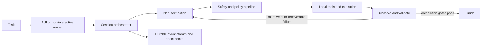

# Grinta

<p align="center">
  
</p>

<p align="center">
  <strong>A local-first coding agent built to finish long, failure-prone software tasks.</strong>
</p>

<p align="center">
  <a href="https://github.com/josephsenior/Grinta-Coding-Agent/actions/workflows/py-tests.yml"></a>
  <a href="https://github.com/josephsenior/Grinta-Coding-Agent/actions/workflows/lint.yml"></a>
  <a href="https://pypi.org/project/grinta/"></a>
  <a href="https://pypi.org/project/grinta/"></a>
  <a href="LICENSE"></a>
</p>

Grinta can inspect a repository, plan a change, edit files, run commands, debug
failures, validate the result, and keep going until the task is complete. The
control plane, command execution, session history, and checkpoints stay on your
machine; inference can use a hosted provider or a local model.

<p align="center">
  <a href="https://github.com/josephsenior/Grinta-Coding-Agent/releases/download/v1.0.0/grinta_raft.mp4">
    
  </a>
</p>

<p align="center"><strong>Grinta in action</strong> — click the preview to watch the full run.</p>

<p align="center">
  <a href="#quick-start">Quick start</a> ·
  <a href="#how-grinta-works">How it works</a> ·
  <a href="docs/USER_GUIDE.md">User guide</a> ·
  <a href="docs/ARCHITECTURE.md">Architecture</a> ·
  <a href="SHOWCASE.md">Showcase</a> ·
  <a href="CONTRIBUTING.md">Contributing</a>
</p>

## At a glance

| | |
| --- | --- |
| **Interface** | Terminal UI plus a non-interactive, pipe-friendly runner |
| **Workflows** | Chat, Plan, and Agent modes |
| **Execution** | Local file operations, shell commands, git, LSP, DAP, and MCP tools |
| **Inference** | Hosted providers, OpenAI-compatible endpoints, Ollama, LM Studio, and vLLM |
| **Durability** | Persisted sessions, event history, checkpoints, restore, and trajectory export |
| **Safety** | Confirmation levels, command risk analysis, workspace boundaries, and optional hardened execution profiles |
| **Platforms** | Linux, Windows, macOS, and WSL2 |
| **Runtime** | Python 3.12 or 3.13 |

## Why Grinta?

Many coding agents work well when the first plan succeeds. Long tasks are
different: providers time out, tools return malformed output, tests expose new
failures, context windows fill up, and processes get interrupted. Grinta is
designed around that reality.

- **Local-first control:** your repository, execution, session state, and
  checkpoints remain local.
- **Recovery-oriented execution:** retries, circuit breakers, stuck detection,
  and explicit lifecycle states help the agent recover instead of silently
  stopping.
- **Validation before completion:** task tracking and completion gates reduce
  false “done” results.
- **Inspectable history:** a durable event ledger records actions and outcomes
  for recovery, debugging, and audit.
- **Provider freedom:** choose a hosted model, an OpenAI-compatible gateway, or
  a local inference server.
- **Developer tooling:** Grinta can use language servers and debug adapters in
  addition to ordinary file and shell tools.

> **4h 33m autonomous run · 16,393 events · 373 tool outcomes · no additional user messages**
>
> [Inspect the sanitized execution report](docs/evidence/2026-07-09-autonomous-run-report.md).

## Quick start

### 1. Install

The recommended installation uses [`pipx`](https://pipx.pypa.io/) so Grinta is
isolated from your project dependencies:

```bash
pipx install grinta
```

If `grinta` is not found after installation, run `pipx ensurepath`, restart the
terminal, and try again.

To install the current repository version instead:

```bash
pipx install "git+https://github.com/josephsenior/Grinta-Coding-Agent.git"
```

### 2. Configure

Run the setup wizard and choose a provider and model:

```bash
grinta init
grinta doctor
```

API keys are stored in Grinta's local configuration area. You can also provide
them through environment variables such as `OPENAI_API_KEY`,
`ANTHROPIC_API_KEY`, `GEMINI_API_KEY`, or `OPENROUTER_API_KEY`. See the
[settings reference](docs/SETTINGS.md) for configuration precedence and secret
handling.

### 3. Open a project

Start Grinta from the repository you want it to work on:

```bash
cd /path/to/your/project
grinta
```

Or specify the project explicitly:

```bash
grinta --project /path/to/your/project
```

Then describe a concrete outcome, for example:

```text
Find why the authentication tests are flaky, fix the root cause, and run the
relevant test suite before you finish.
```

The first interactive launch can also guide you through setup. For platform-
specific instructions, including WSL2, see the [Quick Start guide](docs/QUICK_START.md).

## Choose the right workflow

Switch modes at any time with `/mode`.

| Mode | Best for | Tool access |
| --- | --- | --- |
| **Chat** | Understanding code, asking questions, exploring an unfamiliar repository | Read-only discovery |
| **Plan** | Investigating a change and producing an implementation plan before editing | Read-only investigation and task planning |
| **Agent** | Implementing, testing, debugging, and validating a complete change | Full configured execution surface |

Agent mode also has three autonomy levels, selected with `/autonomy`:

| Level | Confirmation behavior |
| --- | --- |
| `conservative` | Confirms shell commands, edits, MCP calls, and delegation |
| `balanced` | Confirms high-risk actions; this is the default |
| `full` | Removes confirmation prompts, while critical policy blocks still apply |

Autonomy controls confirmation prompts. It does not disable the execution
policy or turn the local process into a security sandbox.

## Working with Grinta

### Useful in-session commands

| Command | Purpose |
| --- | --- |
| `/help` | Show available commands and shortcuts |
| `/settings` | Configure the provider, model, API key, and MCP servers |
| `/model` | Change the active model |
| `/mode` | Switch between Chat, Plan, and Agent |
| `/autonomy` | Change the confirmation level in Agent mode |
| `/health` | Check the model connection, git, and execution profile |
| `/diff` | Inspect workspace changes |
| `/checkpoint` | Create a workspace checkpoint |
| `/sessions` | Browse persisted sessions |
| `/resume` | Continue a previous session |
| `/compact` | Compact long conversation context |

### Command-line operations

```bash
grinta --help
grinta --version
grinta doctor --verbose
grinta sessions list
grinta sessions show <number-or-id>
grinta sessions export <number-or-id> <output-path>
grinta sessions prune --days 30
```

Interactive stdin opens the Textual terminal UI. Piped stdin uses the
non-interactive runner, where each input line is treated as one turn:

```bash
echo "Summarize this repository's architecture" | grinta
```

## Providers and models

Grinta separates the agent runtime from the inference provider. The model can
therefore change without moving the execution layer or session state off your
machine.

Supported routes include:

- OpenAI, Anthropic, and Google models;
- OpenRouter and other configured gateways;
- OpenAI-compatible endpoints;
- local models served by Ollama, LM Studio, or vLLM.

Use `grinta init` or `/settings` to select a provider. Models can also be
overridden for one launch:

```bash
grinta --model provider/model-name
```

Model capabilities differ. Tool calling, context size, reasoning controls, and
structured output support are resolved through Grinta's provider and model
catalog. The [support matrix](docs/SUPPORT_MATRIX.md) and
[settings reference](docs/SETTINGS.md) document the current contract.

## How Grinta works



The runtime has four main layers:

1. **Interface** — the console launcher, Textual TUI, slash commands, and
   non-interactive runner.
2. **Orchestration** — planning, action lifecycle, retries, confirmations,
   stuck detection, and finish validation.
3. **Execution** — workspace file operations, shell sessions, git, LSP, DAP,
   and MCP integrations.
4. **Durability** — persisted events, session state, trajectories, and
   content-addressed workspace checkpoints.

The `SessionOrchestrator` coordinates these layers. Actions pass through a
middleware pipeline that applies safety checks, budget and context controls,
file-state tracking, diagnostics, and result validation. Read the
[architecture guide](docs/ARCHITECTURE.md) for the package map and execution
flows.

## Reliability and recovery

Grinta treats failures as part of the control flow rather than exceptional
edge cases. Its runtime includes:

- classified recoverable and terminal errors;
- retry policies and provider backoff;
- circuit breakers to prevent cascading failures;
- stuck and iteration-limit detection;
- pending-action tracking and timeout handling;
- context compaction for long sessions;
- completion-quality checks before a task reaches `FINISHED`;
- durable events for replay and diagnosis; and
- workspace checkpoints that do not modify the project's own `.git` data.

Checkpoint storage is handled through
[ShadowGit](https://github.com/josephsenior/ShadowGit), using a private object
store for each workspace. See the [reliability and trust model](docs/RELIABILITY.md)
for failure semantics and restore behavior.

## Configuration

Installed builds use `~/.grinta/settings.json` by default. Source checkouts use
the repository's `settings.json`. Set `APP_ROOT` to override the configuration
root.

A minimal configuration identifies a provider and model:

```json
{
  "llm_provider": "openai",
  "llm_model": "openai/your-model",
  "llm_api_key": "${LLM_API_KEY}",
  "max_iterations": 100,
  "max_budget_per_task": 10
}
```

Keep secrets in the sibling `.env` file or your shell environment rather than
committing literal keys. Grinta also supports per-agent settings, MCP servers,
budget limits, context and output limits, execution profiles, Windows shell
selection, and explicit read-only roots outside the workspace.

Optional semantic retrieval is available through the `rag` extra:

```bash
pipx install "grinta[rag]"
```

See [SETTINGS.md](docs/SETTINGS.md) and the checked-in
[`settings.template.json`](settings.template.json) for the complete schema.

## Platform support

| Platform | Status | Notes |
| --- | --- | --- |
| Linux | Supported | Full unit, integration, end-to-end, and stress CI coverage |
| Windows | Supported | Native PowerShell execution; interactive terminal behavior differs from Unix PTYs |
| macOS | Supported | Unit and extended CI gates; uses native process behavior |
| WSL2 | Supported | Install inside the Linux distribution; Linux-native project paths perform best |

Grinta is cross-platform, but shell, terminal, and process-isolation behavior
cannot be identical on every OS. Review the [support matrix](docs/SUPPORT_MATRIX.md)
for current parity details.

## Showcase and evaluation

| Long-horizon execution | Failure recovery | Raft key-value store |
| --- | --- | --- |
| Ran autonomously for **4h 33m**, processed **16,393 events**, and reached `FINISHED` through provider and runtime failures. | Read failing output, isolated defects, edited the affected code, and reran validation without another prompt. | Built a Raft-backed key-value store, recovered from a race-condition failure, and finished with **39/39 tests passing**. |
| [Read the run report](docs/showcase/autonomous-4h-session.md) | [Inspect the case study](docs/showcase/compilation-failure-recovery.md) | [Watch and inspect](docs/showcase/raft-kv-store.md) |

[Browse all case studies](SHOWCASE.md).

The repository also includes a headless adapter for **DeepSWE v1.1**, a
long-horizon software-engineering benchmark with behavioral verifiers. The
adapter runs Grinta in an isolated task workspace, captures the resulting patch
and trajectory, and leaves pass/fail decisions to the benchmark verifier.

[Read the evaluation protocol](evaluation/deepswe/README.md) · [Read the
eight-task paired case study](evaluation/deepswe/CASE_STUDY_2026-09-01.md).

## Safety boundary

Grinta runs commands with the privileges of the local user. Command analysis,
confirmation prompts, secret masking, workspace boundaries, and optional
process isolation reduce risk; they do not make hostile code safe.

- Review diffs and requested actions before approving them.
- Use `conservative` autonomy while learning the tool.
- Use a VM or container for untrusted repositories.
- Do not expose secrets that the target project does not need.
- Treat `sandboxed_local` as process hardening, not a VM or complete host
  boundary.

Read the [security checklist](docs/SECURITY_CHECKLIST.md) before increasing
autonomy. Report vulnerabilities privately through
[GitHub Security Advisories](https://github.com/josephsenior/Grinta-Coding-Agent/security/advisories/new).

## Develop and contribute

Clone the repository and run the platform setup script:

```bash
git clone https://github.com/josephsenior/Grinta-Coding-Agent.git Grinta
cd Grinta
bash start_here.sh
```

On native Windows, use `\.\START_HERE.ps1` from PowerShell instead. The setup
installs the required Python and `uv` toolchain, syncs development and test
dependencies, and installs the editable `grinta` command.

Run the fast local gates before opening a pull request:

```bash
uv run pre-commit run --all-files
PYTHONPATH=. uv run pytest backend/tests/unit
```

Areas where contributions are especially welcome include agent reliability,
provider and local-model compatibility, LSP and debugger integrations,
terminal UX, and autonomous-agent evaluation.

Start with a
[`good-first-issue`](https://github.com/josephsenior/Grinta-Coding-Agent/issues?q=is%3Aissue+is%3Aopen+label%3Agood-first-issue),
read the [Contributor Map](docs/CONTRIBUTOR_MAP.md), or follow the full
[contribution guide](CONTRIBUTING.md).

## Documentation map

| Goal | Documentation |
| --- | --- |
| Install and configure | [Quick Start](docs/QUICK_START.md) · [Settings](docs/SETTINGS.md) |
| Use the terminal agent | [User Guide](docs/USER_GUIDE.md) · [Troubleshooting](docs/TROUBLESHOOTING.md) |
| Understand the internals | [Architecture](docs/ARCHITECTURE.md) · [Agent Engine](docs/ENGINES.md) |
| Understand reliability and safety | [Reliability](docs/RELIABILITY.md) · [Security Checklist](docs/SECURITY_CHECKLIST.md) |
| Check platform behavior | [Support Matrix](docs/SUPPORT_MATRIX.md) · [Performance](docs/PERFORMANCE.md) |
| Contribute | [Contributor Map](docs/CONTRIBUTOR_MAP.md) · [Developer Guide](docs/DEVELOPER.md) · [CI](docs/CI.md) |
| Follow the project | [Roadmap](ROADMAP.md) · [Changelog](CHANGELOG.md) · [The Book of Grinta](BOOK_OF_GRINTA.md) |

## License

Grinta is maintained by [Youssef Mejdi](https://github.com/josephsenior) and
released under the [MIT License](LICENSE).
