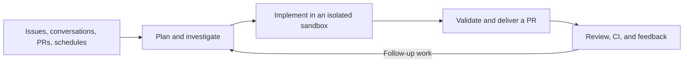

<div align="center">
  <a href="https://github.com/langchain-ai/open-swe">
    <picture>
      <source media="(prefers-color-scheme: dark)" srcset="assets/dark.svg">
      <source media="(prefers-color-scheme: light)" srcset="assets/light.svg">
      
    </picture>
  </a>
</div>

<div align="center">
  <h3>An open-source software factory built on Deep Agents by LangChain.</h3>
</div>

<div align="center">
  <a href="https://opensource.org/licenses/MIT" target="_blank"></a>
  <a href="https://github.com/langchain-ai/open-swe" target="_blank"></a>
  <a href="https://github.com/langchain-ai/deepagents" target="_blank"></a>
  <a href="https://github.com/langchain-ai/langgraph" target="_blank"></a>
  <a href="https://x.com/langchain" target="_blank"></a>
</div>

<br>

Open SWE turns engineering work into a repeatable system. Give it a code-change task from the dashboard, GitHub, Slack, or Linear—or run one on a schedule—and it works in an isolated environment to understand the codebase, make changes, validate them, and deliver a pull request.

It goes beyond code generation. Open SWE can review pull requests, learn a repository's review style, monitor CI, and respond to feedback. It is open source, deployable in your infrastructure, and designed to be adapted to your team's repositories, tools, policies, and workflows.

> [!NOTE]
> Open SWE is under active development. APIs, setup, and product surfaces may continue to evolve.

---

## The software factory loop



Each cloud coding thread is bound to its own persistent sandbox, so the agent can continue from prior work when you reply. A thread is a durable conversation and work context. It can contain multiple invocations, each an agent execution triggered by a message or automation. An initial request and a follow-up belong to one thread and produce two invocations, each with its own usage. Independent threads run in parallel, and the same thread carries context from request through delivery and follow-up. Read-only PR chat does not need a sandbox, while desktop work can run directly against an allowlisted local project.

## What Open SWE does

### Build

- Investigates repositories, plans work, edits code, and runs focused validation
- Commits and pushes changes, then opens or updates pull requests
- Uses subagents to parallelize research and independent work
- Supports reusable skills, repository instructions, and custom environments

### Review

- Runs read-only pull request reviews on demand or automatically
- Learns repository-specific review preferences from historical feedback
- Supports read-only PR chat for investigating a change without modifying it
- Keeps findings grounded in the diff and publishes them back to GitHub

### Operate

- Runs tasks from the web dashboard, GitHub, Slack, and Linear
- Schedules recurring work through deterministic automations
- Monitors opted-in pull requests with `/baby-sit`, diagnoses CI failures, and reruns only evidence-backed flaky jobs
- Routes follow-up messages to the original thread and sandbox

### Customize

- Choose the models and reasoning effort available to agents and reviewers
- Configure supported integrations and extend the curated toolset without forking Deep Agents
- Define personal and repository coding instructions plus organization-wide review guidelines
- Swap sandbox providers, middleware, skills, triggers, and delivery policies

## API contract

[`swagger.json`](swagger.json) is the generated OpenAPI 3.1 contract for the custom FastAPI backend (`agent.webapp:app`). Import it into an OpenAPI 3.1-compatible viewer, or run `make run` and open `http://localhost:8000/docs` for interactive API documentation (`/openapi.json` serves the live schema).

Regenerate the file with `make swagger` after changing backend routes or models. It reflects the current route declarations: some request/response schemas and authentication requirements are not yet documented. LangGraph runtime endpoints (such as `/runs`, `/threads`, and `/assistants`) are not included.

## How it works

### Deep Agents is the harness

Open SWE composes the agent with [Deep Agents](https://github.com/langchain-ai/deepagents). Deep Agents provides the planning, file operations, shell access, skills, state, and subagent primitives; Open SWE adds the software-engineering tools, prompts, middleware, integrations, authorization, and product surfaces needed for end-to-end engineering work.

This composition keeps the system extensible while allowing it to inherit improvements from the underlying LangChain agent stack.

### LangGraph is the runtime

[LangGraph](https://github.com/langchain-ai/langgraph) provides durable execution and thread state. Each Open SWE invocation executes as a LangGraph run within a thread. Open SWE currently ships five graph entrypoints:

| Graph | Role |
|---|---|
| **Agent** | Plans, implements, validates, and delivers software changes |
| **Reviewer** | Performs read-only pull request reviews |
| **Analyzer** | Learns repository-specific review style |
| **Chat** | Answers questions about pull requests without changing code |
| **Scheduler** | Dispatches recurring tasks and CI monitoring work |

### Sandboxes contain the work

Cloud work runs in isolated Linux sandboxes with the development tooling supplied by the configured environment or snapshot. A sandbox persists with its thread, but an unreachable coding sandbox is not silently replaced—Open SWE fails safely rather than risk discarding uncommitted work.

[LangSmith](https://smith.langchain.com/) is the default sandbox and tracing provider. Open SWE also supports [Modal](https://modal.com/), [Daytona](https://www.daytona.io/), [Runloop](https://www.runloop.ai/), [E2B](https://e2b.dev/), and local execution, with a pluggable interface for additional providers.

### Tools stay curated

Deep Agents supplies the core filesystem, shell, and subagent tools. Open SWE adds focused capabilities for GitHub delivery, Linear, Slack, thread management, web research, browser-based application verification, planning, review, CI monitoring, and connected services. Personal integrations load using the user's connections. Admin-configured workspace MCP tools are available to all coding-agent users.

## Work where your team works

- **Dashboard** — Start and continue tasks, inspect work, manage pull requests, and configure user or team settings.
- **GitHub** — Start tasks from issues, request changes from pull request conversations, run reviews, and continue work on the same branch.
- **Slack** — Start from a channel, thread, or code channel and receive progress and delivery updates in context.
- **Linear** — Invoke Open SWE from an issue and post results back to the issue.
- **Desktop (experimental)** — Run the same agent against local projects. Packaged releases currently target macOS; source builds also support Windows and Linux.

## Control and safety

A useful software factory needs both autonomy and boundaries. Open SWE includes:

- Per-thread sandbox isolation and persistent workspaces for cloud coding tasks
- GitHub App installation boundaries and optional per-user OAuth
- Organization and repository allowlists with actor authorization checks
- Credentials kept in the server process or injected through a sandbox proxy
- Human approval before pushing workflow-file changes
- Read-only reviewer and PR chat agents
- Plan mode for reviewing an implementation approach before code changes
- Opt-in automatic review and CI monitoring

Sandboxes can have network access and powerful tools. Deployments should use least-privilege credentials, restrict enabled repositories and integrations, and tailor approval rules to their environment.

## Getting started

Open SWE includes a LangGraph backend, a web dashboard, and an experimental desktop client.

- **[Installation Guide](docs/INSTALLATION.md)** — Deploy Open SWE for a team: LangGraph Platform or Docker, the GitHub and Slack apps, model providers, environment variables, and the optional Linear trigger
- **[Development Guide](docs/DEVELOPMENT.md)** — Run it on your machine, with hot reload for the dashboard and an ngrok tunnel for webhooks
- **[Customization Guide](docs/CUSTOMIZATION.md)** — Change models, sandboxes, tools, skills, prompts, triggers, and middleware
- **[Open SWE Enhancement Proposals](oeps/README.md)** — Review consequential product, architecture, security, and process decisions

One deployment serves the API, the webhooks, and the dashboard from a single URL. Locally:

```bash
git clone https://github.com/langchain-ai/open-swe.git
cd open-swe
uv venv
source .venv/bin/activate
uv sync --all-extras
make build-dashboard   # pnpm install + Vite build of the dashboard
make dev               # http://localhost:2024 serves the API and the dashboard
```

Create a GitHub App and a Slack app for your machine and fill in `.env` as described in the [development guide](docs/DEVELOPMENT.md), then sign in at `http://localhost:2024`. For UI work, `make dev-ui` starts Vite and the backend fronting it, so the same URL hot-reloads. GitHub and Slack deliver to a public webhook URL: locally the static domain of a free ngrok account (`make tunnel NGROK_DOMAIN=<name>.ngrok-free.dev`, which exposes only `/webhooks/*`, since the dev server's LangGraph API has no authentication), on LangGraph Platform the deployment URL.

Production self-hosting uses the standalone LangGraph Agent Server and requires its license key.

## Project status

Open SWE is built in the open by LangChain and is evolving quickly. The original internal coding-agent framework announcement is available on the [LangChain blog](https://blog.langchain.com/open-swe-an-open-source-framework-for-internal-coding-agents/); the project has since expanded considerably.

## License

Open SWE is licensed under the [MIT License](LICENSE).
