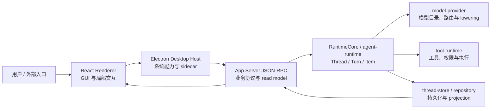

# Lime Feature Map

> Lime 仓库级产品能力地图。本文回答“用户能完成什么、从哪里进入、运行时事实由谁拥有、应去哪里查看详细规则”。它是导航，不是第二套架构、需求、路线图或 readiness 数据库。

## 1. 使用规则

- **Feature**：面向用户或外部调用方可感知的完整能力，不按页面、组件或 crate 数量拆分。
- **用户入口**：当前产品中的稳定入口；GUI、CLI、App Server 协议与系统触发入口分开记录。
- **Current owner**：拥有状态机、运行时不变量或持久事实的唯一领域 owner。Renderer 只拥有交互与投影，Electron 只拥有桌面宿主能力。
- **稳定边界**：能力进入 current 主链的 typed gateway、JSON-RPC method family、runtime contract 或 Desktop Host surface。
- **状态**：`current` 可继续演进；`compat` 只能委托；`deprecated` 只能迁出；`dead` 已删除或禁止恢复。

`current` 表示唯一演进路径，不表示所有 provider、平台、打包产物或 Gate B 证据都已完成。未完成项继续记录在对应执行计划、质量证据和领域事实源中，不在本表伪装成已交付能力。

裁决顺序固定为：

1. 当前构建图、协议 schema、运行代码和稳定测试。
2. [全局架构图](./internal/aiprompts/architecture.md)与根 `AGENTS.md`。
3. `internal/aiprompts/` 中的领域事实源。
4. 已确认执行计划、路线图、研究和历史 evidence。

## 2. Desktop 产品主链

Desktop GUI 业务能力只通过 App Server JSON-RPC 进入 Rust runtime。Electron IPC 仅承接窗口、文件选择、系统权限、通知、更新、native view 和 sidecar 生命周期，不能成为第二套业务后端。独立 CLI 有自己的任务入口，但不能替代 App Server 的桌面产品协议。完整依赖方向以[全局架构图](./internal/aiprompts/architecture.md)为准。

## 3. Feature Ownership Map

| Feature                        | 用户能力                                                                  | 当前用户入口                                      | Current owner / 稳定边界                                                                                                 | 状态与事实源                                                                                                                                                                                                |
| ------------------------------ | ------------------------------------------------------------------------- | ------------------------------------------------- | ------------------------------------------------------------------------------------------------------------------------ | ----------------------------------------------------------------------------------------------------------------------------------------------------------------------------------------------------------- |
| Agent 任务与对话               | 从目标启动任务，持续执行、取消、恢复和查看 Thread / Turn / Item           | “新建任务”与 Agent Workspace                      | `app-server`、`agent-runtime`、`agent`、`thread-store`；typed Thread/Turn API 与 canonical projection                    | `current`；[架构](./internal/aiprompts/architecture.md)、[Query Loop](./internal/aiprompts/query-loop.md)                                                                                                   |
| 协作模式与 Multi-Agent         | 选择 Default / Plan，并让子 Agent 分工后回到主 Thread                     | Composer 模式选择与 Agent 运行过程                | `collaborationMode/list`、`agent-runtime`、subagent Thread/Turn 与同一 projection                                        | `current`；[任务与 Agent taxonomy](./internal/aiprompts/task-agent-taxonomy.md)、[命令边界](./internal/aiprompts/commands.md)                                                                               |
| Workspace、项目与文件          | 选择项目目录，浏览、读取、写入和预览项目文件                              | Agent Workspace、文件浏览器与 Right Surface       | App Server workspace/repository；`fs/*`；Electron 仅提供系统目录选择与文件壳能力                                         | `current`；[Workspace 边界](./internal/aiprompts/workspace.md)、[命令边界](./internal/aiprompts/commands.md)                                                                                                |
| 终端与后台进程                 | 执行一次性命令、交互终端并管理 Thread-owned 后台进程                      | Workspace 终端与命令 Item                         | `command/exec*`、`process/*`、`thread/backgroundTerminals/*`；`tool-runtime` process supervisor                          | `current`；[命令边界](./internal/aiprompts/commands.md)                                                                                                                                                     |
| 工具、审批与执行策略           | 调用本地工具，在危险操作前审批，并按工作区策略限制执行                    | Agent 工具 Item、审批交互与设置                   | `tool-runtime`；`permissionProfile/list`；App Server server-request；canonical tool Item                                 | `current`；[命令边界](./internal/aiprompts/commands.md)、[质量工作流](./internal/aiprompts/quality-workflow.md)                                                                                             |
| Browser Workspace              | 在同一可见浏览器中由用户或 Agent 浏览、操作、下载和接管                   | Right Surface 的 Electron `WebContentsView`       | `BrowserTabHost`、Renderer browser gateway、App Server dynamic-tool host；同一 tab/view owner                            | `current`；[命令边界](./internal/aiprompts/commands.md)                                                                                                                                                     |
| Provider、模型与凭证           | 配置模型服务，选择模型，并按 capability/readiness 路由请求                | 设置中的模型与服务、Composer Model Selector       | `model-provider`；catalog、route、credential readiness、canonical content、lowering、stream、retry/breaker               | `current`；[Provider 系统](./internal/aiprompts/providers.md)                                                                                                                                               |
| 多模态与媒体生成               | 在同一任务中理解或生成图片、音频、视频和其他媒体产物                      | Composer、Agent Workspace 与 artifact/workbench   | `model-provider` 负责 sampling/lowering；`media-runtime` 负责媒体任务；Thread/Artifact 持有结果事实                      | `current`；[架构](./internal/aiprompts/architecture.md)、[持久化地图](./internal/aiprompts/persistence-map.md)                                                                                              |
| CLI 与 TUI                     | 在终端交互或非交互运行 Agent，并管理 Thread、MCP 与 Skills                | `lime`、`lime exec`、`lime resume`                | `cli` 与 `tui` 经 `app-server-client` 复用 App Server、RuntimeCore 和 Thread/Turn/Item                                   | `current`；[CLI 源码](./lime-rs/crates/cli/)、[架构](./internal/aiprompts/architecture.md)                                                                                                                  |
| MCP                            | 管理 MCP server，发现 tools/prompts/resources，并在真实 Thread 中调用工具 | 设置 MCP 页面与 Agent runtime                     | `src/lib/api/mcp.ts -> App Server mcp* -> lime-mcp`；Thread-owned `McpThreadRuntime`                                     | `current`；[MCP](./internal/aiprompts/mcp.md)、[命令边界](./internal/aiprompts/commands.md)                                                                                                                 |
| Skills                         | 发现、读取、启停和执行本地或远程 Skill                                    | Plugins 聚合入口中的 Skills Workspace 与 Composer | `skills/list`、`skill/read`、`skills/config/write`；`lime-skills` 与 Agent Skill snapshot                                | `current`；[Skill 标准](./internal/aiprompts/skill-standard.md)、[命令边界](./internal/aiprompts/commands.md)                                                                                               |
| Apps 与 Plugins                | 安装、启停和发现扩展，为 Agent 提供 Apps/connectors 与 UI 资源            | Plugins / App Center                              | App Server `app/*`、`plugin/*`；`PluginDataSource` 与 local plugin catalog                                               | `current`；Plugin v3 是唯一版本替代路径，hosted connector 的 `callable=true` 仍以真实 readiness 证据为准；[Plugin v3](./internal/roadmap/plugin/v3/README.md)、[命令边界](./internal/aiprompts/commands.md) |
| Experts                        | 从领域专家配置启动一个带 profile、release 和 Skill 约束的新任务           | Plugins 聚合入口中的专家广场                      | Expert catalog/launch metadata 只负责入口编排；执行仍归同一 Agent Thread/Turn 主链                                       | `current`；入口见 [`AppPageContent`](./src/components/AppPageContent.tsx)，runtime 归[架构](./internal/aiprompts/architecture.md)                                                                           |
| 项目资料与知识上下文           | 导入、编译、选择资料包，并把可信上下文注入任务                            | “项目资料”页面与 Agent Composer                   | `lime-knowledge`、App Server `knowledgePack/*` 与 `knowledgeContext/*`；Renderer 只做选择和状态投影                      | `current`；协议见 [`app-server-protocol`](./lime-rs/crates/app-server-protocol/)                                                                                                                            |
| Artifact 与资源工作区          | 查看、编辑、版本化和导出任务生成物及文件快照                              | Agent Workbench 与“资源”页面                      | canonical FileArtifact / Artifact snapshot、App Server `artifact/*`、sidecar snapshot store                              | `current`；[Workspace](./internal/aiprompts/workspace.md)、[持久化地图](./internal/aiprompts/persistence-map.md)                                                                                            |
| Scheduled Tasks                | 创建、启停、预览和立即运行周期任务，并查看运行历史                        | “已安排任务”页面                                  | App Server `scheduledTask/*`、RuntimeCore、scheduler 与 automation storage mapping                                       | `current`；真实 OS sleep/wake、Windows 通知与 Windows Gate B 仍是平台证据缺口；[命令边界](./internal/aiprompts/commands.md)                                                                                 |
| 消息渠道与远程入口             | 从支持的 IM 渠道触发本地 Agent，并管理渠道与 tunnel                       | “消息渠道”页面                                    | 消息渠道 runtime 是 current ingress，最终回到现有 Agent session/task/evidence；旧单渠道与部分命令壳不得扩展              | `current` 入口，含受控 `compat/deprecated` 边界；[Remote runtime](./internal/aiprompts/remote-runtime.md)                                                                                                   |
| 记忆、上下文与压缩             | 在长任务中复用受管记忆，按需读取原文，并压缩上下文后继续执行              | Agent turn 与设置中的记忆控制                     | RuntimeCore / App Server、`MemoryBackend`、memory tools、canonical compaction continuation                               | `current`；[Memory / Context / Compaction](./internal/aiprompts/memory-compaction.md)                                                                                                                       |
| 历史、回退、Review 与 Evidence | 恢复会话、替换后续历史、发起代码审阅，并从 canonical read model 导出证据  | Thread 历史、消息回退入口、Review 与状态面板      | App Server `thread/read`、`thread/resume`、`thread/revert`、`review/start`；ThreadStore 与 canonical evidence projection | `current`；[状态、历史与遥测](./internal/aiprompts/state-history-telemetry.md)、[命令边界](./internal/aiprompts/commands.md)                                                                                |
| 配置与系统设置                 | 管理全局配置、实验能力、权限档位、外观和桌面行为                          | “设置”页面                                        | `config/*`、`experimentalFeature/*`、`permissionProfile/list`；系统壳配置归 Electron Host                                | `current`；[命令边界](./internal/aiprompts/commands.md)                                                                                                                                                     |
| Desktop Host 与发布生命周期    | 使用窗口、托盘、通知、系统权限、native helper、自动更新与安装包           | 主窗口、系统菜单、通知和更新入口                  | `electron/`、preload/IPC 白名单、sidecar host、Forge 与平台资源 manifest                                                 | `current`；[架构](./internal/aiprompts/architecture.md)、[质量工作流](./internal/aiprompts/quality-workflow.md)                                                                                             |

## 4. Owner Quick Map

| Owner                                  | 负责                                                                                                             | 不负责                                                      |
| -------------------------------------- | ---------------------------------------------------------------------------------------------------------------- | ----------------------------------------------------------- |
| `src/` Renderer                        | 产品交互、i18n、局部 UI 状态、request builder 与 projection                                                      | Thread 真相、provider wire、工具执行、生产 mock fallback    |
| `electron/` Desktop Host               | 窗口、preload、IPC、系统权限、native view/helper、sidecar、updater                                               | Agent 状态机、模型请求、Thread/Turn/Item、业务 repository   |
| `app-server` 与 protocol/client        | 唯一业务 JSON-RPC、handler、host context、read model 与领域接线                                                  | provider-specific payload、Electron 系统实现、Renderer 状态 |
| `agent-runtime` / `agent`              | 回合生命周期、队列、取消、stream、runtime scope 与 Agent 编排                                                    | provider 网络、桌面窗口、UI 缓存                            |
| `model-provider`                       | model catalog/switch、capability/readiness、credential route、canonical content、lowering、stream、retry/breaker | Agent loop、工具权限、Thread 持久化                         |
| `tool-runtime`                         | 工具定义、权限、sandbox、dispatch、进程与 MCP step snapshot                                                      | GUI、provider catalog、Thread read model                    |
| `thread-store` / App Server repository | Thread/Turn/Item、event history、projection 与恢复事实                                                           | 临时 UI 状态、系统文件选择、provider wire                   |

## 5. 退役与过渡边界

本节只列仓库级高风险边界，不替代[治理规则](./internal/aiprompts/governance.md)和各领域的完整目录册。

| Surface                                                           | 分类                                    | 处理规则                                                                       |
| ----------------------------------------------------------------- | --------------------------------------- | ------------------------------------------------------------------------------ |
| 已退役 runtime 的 vendor、workspace crate、迁移目录与专用 skill   | `dead / deleted / forbidden-to-restore` | 只能作为历史 evidence 或负向守卫；能力缺口在 current owner 内按 Codex 重建     |
| 已删除的 `lime-providers`                                         | `dead / deleted / forbidden-to-restore` | Provider 能力只能进入 `model-provider`，不得恢复依赖或 compat 包装             |
| 旧 Electron 业务 facade、legacy JSON-RPC/IPC 与生产 mock fallback | `dead` 或 `deprecated`                  | 业务调用迁入 App Server current method；旧名只允许负向守卫或有退出条件的委托层 |
| 旧 MCP、Skills、Automation 与外部 Chrome/CDP 正向入口             | `dead / retired guard-only`             | 不恢复 catalog、Renderer gateway、Desktop command 或正向 fixture               |
| `.lime/AGENTS.md` / `.lime/AGENTS.override.md` 文件位置 fallback  | `compat`                                | 只委托标准 `CODEX_HOME/AGENTS.md` 与项目 `AGENTS.md`，不得扩展新语义           |
| 消息渠道旧单通道入口与 remote command wrapper                     | `compat` 或 `deprecated`                | 新能力只能进入 current 消息渠道或浏览器连接器 ingress；按领域计划迁出          |

## 6. 维护规则

1. 改 Feature owner、依赖方向或产品主链时，先更新代码和[全局架构图](./internal/aiprompts/architecture.md)，完成责任开发者确认后再同步本表。
2. 改 JSON-RPC method、schema、Desktop Host bridge 或 typed client 时，同步[命令边界](./internal/aiprompts/commands.md)、消费者、catalog、fixture 与契约测试。
3. 改 `current / compat / deprecated / dead` 分类时，先更新[治理规则](./internal/aiprompts/governance.md)或对应领域事实源；本表只做摘要。
4. 新增页面不自动等于新增 Feature；先判断它属于现有能力入口，还是确实建立了新的唯一 owner。
5. 路线图、研究、截图和单次测试结果不能单独把能力升级为 `current`。真实 readiness 以代码、协议和相应证据等级共同裁决。
6. 最小文档检查为 `npm run docs:boundary`、相对链接校验和 `git diff --check`；涉及治理分类时追加 `npm run governance:legacy-report`。

## 7. 版本替换索引

版本号不自动代表同一能力。下表只记录已经确认的替换关系；未列出的版本目录不能按名称直接删除。

| 历史入口                                                                    | Current replacement                                                                                                                                                                  | 分类与边界                                                                                                  |
| --------------------------------------------------------------------------- | ------------------------------------------------------------------------------------------------------------------------------------------------------------------------------------ | ----------------------------------------------------------------------------------------------------------- |
| `internal/roadmap/plugin/` 根旧文档、`plugin/v2/**`                         | [`internal/roadmap/plugin/v3/`](./internal/roadmap/plugin/v3/README.md)                                                                                                              | 旧 Plugin 版本为 `dead / deleted`；有效包、安装、恢复和清理决策已迁入 v3。                                  |
| [`internal/roadmap/images/README.md`](./internal/roadmap/images/README.md)  | [`internal/roadmap/images/v2/`](./internal/roadmap/images/v2/README.md)                                                                                                              | 旧图片路线图为 `legacy current reference`；v2 拥有确定性 Image Command Workflow 和 Media Runtime 边界。     |
| [`internal/roadmap/Writing/`](./internal/roadmap/Writing/README.md) v1 文档 | [`internal/roadmap/Writing/v2/`](./internal/roadmap/Writing/v2/README.md) + [`writing-v2-workflow-completion-plan.md`](./internal/exec-plans/writing-v2-workflow-completion-plan.md) | v1 文档为 `legacy current reference`；v2 拥有普通 Agent turn、workflow audit 和段落级 artifact 合同。       |
| [`internal/roadmap/knowledge/prd.md`](./internal/roadmap/knowledge/prd.md)  | `internal/roadmap/knowledge/prd-v2.md`                                                                                                                                               | v1 只作 legacy reference，Knowledge v2 是 document-first current owner。                                    |
| `internal/refactor/v1/`                                                     | 无整体替换                                                                                                                                                                           | v1 承接 Runtime/App Server 对齐主线，v2 只承接 Renderer projection；两者是不同 owner，不能按版本号删除 v1。 |

## 8. 详细事实源

- [文档导航](./internal/aiprompts/README.md)
- [项目概览](./internal/aiprompts/overview.md)
- [全局架构图](./internal/aiprompts/architecture.md)
- [Desktop Host 与 App Server 命令边界](./internal/aiprompts/commands.md)
- [治理规则](./internal/aiprompts/governance.md)
- [工程质量工作流](./internal/aiprompts/quality-workflow.md)
- [Workspace 领域边界](./internal/aiprompts/workspace.md)
- [Provider 系统](./internal/aiprompts/providers.md)
- [MCP](./internal/aiprompts/mcp.md)
- [Remote runtime](./internal/aiprompts/remote-runtime.md)
- [状态、历史与遥测](./internal/aiprompts/state-history-telemetry.md)

本文件只维护能力导航。任何与当前构建图、协议或领域事实源冲突的描述，应直接修正或删除，不能通过新增兼容解释继续保留。
