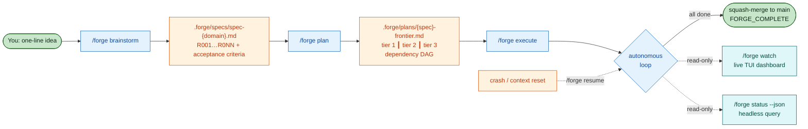

<p align="center">
  <picture>
    <source media="(prefers-color-scheme: dark)" srcset="https://raw.githubusercontent.com/LucasDuys/forge/main/docs/assets/forge-banner-dark.svg">
    <source media="(prefers-color-scheme: light)" srcset="https://raw.githubusercontent.com/LucasDuys/forge/main/docs/assets/forge-banner-light.svg">
    
  </picture>
</p>

<h3 align="center">One idea in. Tested, reviewed, committed code out.</h3>

<p align="center">
  <a href="https://github.com/LucasDuys/forge/blob/main/LICENSE"></a>
  <a href="https://github.com/LucasDuys/forge/stargazers"></a>
  <a href="https://github.com/LucasDuys/forge/releases"></a>
  <a href="https://github.com/LucasDuys/forge/tree/main/docs"></a>
  <a href="https://lucasduys.github.io/forge/"></a>
</p>

<p align="center">
  <a href="https://lucasduys.github.io/forge/">Watch the architecture video</a>
  &nbsp;·&nbsp;
  <a href="docs/">Read the docs</a>
</p>

---

## The problem

You start a feature in Claude Code. You write the prompt. It writes the code. You review it. You re-prompt. It tries again. It loses context. You re-explain. You watch the "context: 87%" warning crawl up. You restart. You re-explain again. Three hours in, half a feature done, and you are the one keeping the whole thing from falling apart.

You are the project manager. You are the state machine. You are the glue.

**Forge replaces you as the glue.** You describe what you want in one line. Forge writes the spec, plans the tasks, runs them in parallel git worktrees with TDD, reviews the code, verifies it against the acceptance criteria, and commits atomically. You read the diffs in the morning.

## What Forge is

A native Claude Code plugin that turns one-line ideas into reviewed, tested, committed code through a five-phase autonomous loop:

1. **brainstorm** — your idea becomes an R-numbered spec with testable acceptance criteria
2. **plan** — the spec becomes a dependency-ordered task DAG with token estimates
3. **execute** — each task runs in its own git worktree with TDD; passing tasks squash-merge atomically
4. **review + verify** — the reviewer checks the code, the verifier checks each R-number against four levels (existence, substantive, wired, runtime)
5. **backprop** — when a runtime failure exposes a spec gap, the gap becomes a new acceptance criterion + regression test, and the loop resumes

State lives on disk in `.forge/`, not in a conversation window. Crashes, context resets, and OOMs are recoverable because the state machine restarts from disk, not memory.

## Install

Two minutes. Requires Claude Code v1.0.33+. Zero npm install for the solo path.

```bash
claude plugin marketplace add LucasDuys/forge
claude plugin install forge@forge-marketplace
```

That's all you need for single-user runs. Multiplayer mode (`/forge:collaborate`) optionally adds Ably for sub-second cross-machine coordination — see [docs/collaborate.md](docs/collaborate.md).

## Quickstart

Three commands. One autonomous loop. One squash-merge.

```bash
/forge brainstorm "add rate limiting to /api/search with per-user quotas"
/forge plan
/forge execute --autonomy full
```

Walk away. This is what you actually see while it runs.

```
$ /forge brainstorm "add rate limiting to /api/search with per-user quotas"

[forge-speccer] generating spec from idea...
spec written: .forge/specs/spec-rate-limiting.md
  R001  per-user quotas, configurable per tier (free / pro / enterprise)
  R002  sliding window counters (1 minute, 1 hour, 1 day)
  R003  429 response with Retry-After header
  R004  bypass for admin tokens
  R005  redis-backed counters with atomic increment
  R006  structured logs for rate-limit events
  R007  integration test against /api/search

$ /forge plan

[forge-planner] decomposing into task DAG...
8 tasks across 3 tiers (depth: standard)
  T001  add redis client + connection pool          [haiku, quick]
  T002  implement sliding window counter            [sonnet, standard]
  T003  build rate-limit middleware                 [sonnet, standard]
  T004  wire middleware to /api/search route        [haiku, quick]
  T005  add 429 response with Retry-After           [haiku, quick]
  T006  admin token bypass                          [haiku, quick]
  T007  structured logging                          [haiku, quick]
  T008  integration test                            [sonnet, standard]
        deps: T001 T002 T003 T004 T005 T006 T007

$ /forge execute --autonomy full

══ FORGE iteration 3/100 ══════════════════════════════════ phase: executing ══
  Task    T002  [in_progress]  @ tests_written → tests_passing
  Tasks   [████████░░░░░░░░░░░░░░░░░░░░░░░░░░░░░░░░] 1/8 (12%)
  Tokens  47k in / 12k out / 23k cached   budget 47k/500k (9%)
  Per-task 8k/15k tok (53%)
  Lock    alive pid 18432, 4s ago   restarts 0/10
──────────────────────────────────────────────────────────────────────

[14:02:48] T001 PASS   4 lines,  1 commit,  budget 1820/5000
[14:02:48] T002 T003 dispatched in parallel (disjoint files)
[14:06:01] T003 PASS   62 lines, 8 tests,   budget 13880/15000
[14:08:27] tier 2 complete,  squash-merged 6 worktrees
[14:14:18] forge-verifier: existence > substantive > wired > runtime
[14:14:18] verifier PASS   all 7 requirements satisfied
[14:14:18] <promise>FORGE_COMPLETE</promise>

8 tasks. 12 minutes. 218 lines. 9 commits squash-merged to main.
session budget: 47200 / 500000 used. lock released.
```

You read the diffs. You merge the branch. You move on.

The pipeline is strictly sequential, enforced programmatically: `brainstorm` → `plan` → `execute`. You cannot skip brainstorming, skip planning, or bypass the approval gate. The spec is the contract. Every acceptance criterion has an R-number; every task maps to at least one R-number; the verifier checks R-numbers, not checklists.

## What Forge does for you vs what needs your approval

| Action | `gated` (default) | `full` |
|---|---|---|
| Write spec from your one-line idea | automatic (asks you questions during Q&A) | automatic |
| Decompose spec into tasks | automatic | automatic |
| Write code + tests for each task | automatic | automatic |
| Run tests, review, verify each task | automatic | automatic |
| Squash-merge passing tasks to the working branch | automatic | automatic |
| Install a new dependency not in the manifest | pauses and asks | assumes prior consent, installs |
| Hit a paid API (Stripe, OpenAI beyond Claude) | pauses and asks | assumes prior consent, calls |
| Push to a remote | pauses and asks | pauses and asks (both modes require explicit approval) |
| Run destructive git ops (force push, reset --hard) | refuses unless the spec explicitly requests | refuses unless the spec explicitly requests |
| Propose a spec update when tests hit a gap | automatic (proposal in `.forge/backprop-log.md`) | automatic, applied immediately on high-confidence gaps |

The headline difference: `full` mode assumes you already authorized the side-effect class when you ran `/forge:execute --autonomy full`. It still refuses destructive git ops and still pauses before pushing.

## When the loop finishes but the feature is broken

`<promise>FORGE_COMPLETE</promise>` is a structural gate: tasks done, tests green, reviewer satisfied, verifier satisfied. A feature that passes all four can still look broken in the browser (blurred canvas, empty panel, wrong state after a click) because unit tests don't render pixels.

When that happens:

1. **Smoke-test by hand.** Open the dev server, click through for 90 seconds, write down what's wrong in plain language.
2. **Run `/forge:backprop "<what-is-wrong>"`.** Backprop traces the bug to the R-number whose acceptance criteria should have caught it, proposes a tightened criterion, and generates a regression test that would have failed against the shipped code.
3. **If backprop can't locate the gap, read the spec.** Criteria like "feature exists" or "tests pass" are usually the culprit. Rewrite as observable behaviors ("after clicking logout, URL becomes `/login` and the session cookie is cleared"), then rerun `/forge:execute`.

For visual ACs in 0.3+, the verifier opts into a perceptual gate: `[visual] path=/login occluded_check=true selector="#login-form"` runs through Playwright with deterministic readiness (`document.fonts.ready` + animations-disabled + 2× rAF) and an `elementFromPoint`-based occlusion probe so a target hidden behind a modal fails the AC rather than passing silently. See [docs/visual-verification.md](docs/visual-verification.md).

## What you get

- **No silent token overruns.** Per-task and session budgets are hard ceilings. At 100% the state machine writes a handoff at `.forge/resume.md` and stops cleanly. `/forge:resume` picks up where it died, no re-explaining. ([docs/budgets.md](docs/budgets.md))
- **Real LLM-token savings, measured end-to-end.** Four mechanisms compose: a `PostToolUse` filter trims long Bash output (`npm install`, `git diff`, `tsc`, `find`, `curl`) to head + warnings + tail; a 120 s read-tool cache collapses repeat file reads; caveman compression strips fillers from agent-to-agent handoff text; per-role `max_tokens` caps (2k–16k) bound every Claude turn. Measured against a real 13.8k-LOC project (Stacklink/teambrain) in two ways:
    - **Per-surface byte reduction (deterministic):** 33.2% combined across Bash output (69%), 20-file read pattern with cache hits (27%), and caveman on real handoffs (1.6% — much less than synthetic benchmark fixtures because real agent prose is already terse).
    - **Real LLM A/B (one filterable tool call, end-to-end):** the same agent summarizing one real teambrain `git diff` consumed 59,600 tokens with the raw 57 KB input versus 42,402 tokens with the filtered 20 KB input — **28.9% fewer real Claude tokens**. The byte reduction (65%) doesn't translate 1:1 because the model's reasoning + output overhead is roughly constant; only the input-context portion shrinks. Real-run savings are highly task-dependent: a workload with no filterable Bash, no repeat reads, and no verbose handoffs sees ~0% reduction. ([docs/budgets.md](docs/budgets.md))
- **Failed tasks never touch your main branch.** Every task runs in its own git worktree. Success squash-merges with a structured commit message. Failure discards the worktree. ([docs/worktrees.md](docs/worktrees.md))
- **Crashes survive.** Lock file with heartbeat, per-step checkpoints, forensic resume from the git log. Reboot mid-feature, `/forge:resume` reconstructs state and continues. ([docs/recovery.md](docs/recovery.md))
- **Verification checks the spec, not the checklist.** Four levels: existence → substantive (not a stub) → wired (imported where used) → runtime (tests pass, CI green). For visual ACs, an opt-in perceptual gate in `0.3+` runs Playwright with deterministic readiness (`fonts.ready` + animations-off + 2× rAF) and an `elementFromPoint` occlusion probe so an element hidden behind a modal fails the AC instead of passing silently. ([docs/verification.md](docs/verification.md))
- **Headless-ready.** Proper exit codes, ~2 ms JSON state query, zero interactive prompts. Drop `/forge:status --json` into Prometheus or a cron job. ([docs/headless.md](docs/headless.md))
- **Multiplayer (opt-in).** Two or more people on the same repo drive separate tasks in parallel via a distributed claim queue with 120 s leases; AI decisions that would normally pause for approval become forward-motion flags committed to git, reviewable async. ([docs/collaborate.md](docs/collaborate.md))

## How it works in one diagram



The state machine drives everything. The Stop hook fires `routeDecision()` after every Claude turn and picks the next phase based on `.forge/state.md`. Seven hooks fire on every executor tool call to cap tokens, condense test output, cache repeat reads, track progress, and trigger auto-backprop on test failure. Detailed walkthroughs of the execute loop, hooks pipeline, recovery layer, and team mode live in [docs/architecture.md](docs/architecture.md).

## Documentation

Start with one of these depending on what you need:

- **Just want to try it:** [Quickstart](#quickstart) above. Three commands, one merge.
- **About to use it for real work:** [docs/commands.md](docs/commands.md) (every slash command + flag), [docs/budgets.md](docs/budgets.md), [docs/configuration.md](docs/configuration.md).
- **Comparing tools:** [docs/comparison.md](docs/comparison.md) — Forge vs Ralph Loop vs GSD-2.
- **Going deeper:** [docs/architecture.md](docs/architecture.md), [docs/agents.md](docs/agents.md), [docs/verification.md](docs/verification.md), [docs/recovery.md](docs/recovery.md), [docs/backpropagation.md](docs/backpropagation.md), [docs/collaborate.md](docs/collaborate.md).

## Credits

- **Caveman skill** adapted from [JuliusBrussee/caveman](https://github.com/JuliusBrussee/caveman) (MIT)
- **Ralph Loop pattern** by [Geoffrey Huntley](https://ghuntley.com/ralph/); Forge's self-prompting loop is a smarter-state-machine variant
- **Spec-driven development** concepts from GSD v1 by TÂCHES
- **Karpathy guardrails** from [andrej-karpathy-skills](https://github.com/forrestchang/andrej-karpathy-skills)
- **Claude Code plugin system** by Anthropic; Forge is a native extension, not a wrapper

## Contributing

1. Fork the repository
2. Create a feature branch
3. Make your changes
4. Run tests: `node scripts/run-tests.cjs`
5. Open a pull request

See [CONTRIBUTING.md](CONTRIBUTING.md).

## License

[MIT](LICENSE)
