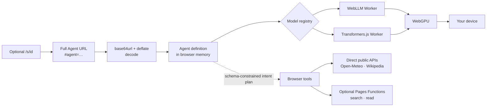
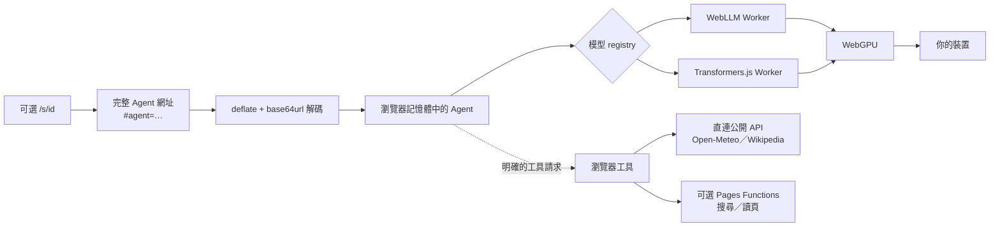

# HashAgent

**Share an AI agent as a URL. No inference server, no account, no tracking — the model runs in your browser via WebGPU.**

HashAgent is a local-first, open-source web app for creating and sharing focused AI agents. An agent's behavior and runtime profile are compressed into one URL. WebLLM and Transformers.js run models locally; chat is ephemeral by default, with optional IndexedDB persistence on the same device. Built-in tools can search the public web index or read a public page without sending the conversation to an inference server.

## Try it in 30 seconds

Start the development server:

```bash
npm install && npm run dev
```

Open `http://localhost:5173` and click **Try Decision Red Team**. Give it a decision, product idea, or plan; it will pressure-test the assumptions and recommend **GO**, **TEST**, **REVISE**, or **STOP**.

You can also open the hosted Agent directly:

```text
https://hashagent.pages.dev/s/-GaS3yIB
```

HashAgent never starts a model download automatically. The confirmation screen shows transfer size and estimated runtime memory. Auto uses SmolLM2 360M on phones and Qwen2.5 3B on desktop-class devices. Larger Android models are manual, experimental choices. Use current Chrome or Edge (113+) or Safari 26+ on hardware with WebGPU.

## Architecture



**Local core.** Agent decoding, model inference, conversation storage, calculator, time, and tool planning run on the user's device. Weather and Wikipedia are local-tier tools: the browser contacts Open-Meteo or Wikimedia directly, without going through HashAgent infrastructure. On first use, the selected runtime downloads public model artifacts and stores them in browser-managed cache storage.

**Optional gateway.** `/api/search` and `/api/read` are stateless Cloudflare Pages Functions because search providers and arbitrary public pages do not reliably permit direct browser CORS access. The gateway is open source, can be disabled in Agent settings, and belongs to the operator of each fork. Turning it off prevents those two tools from being planned or executed. There is no analytics code, account system, inference backend, cookie, external web font, or background video.

The self-contained `#agent=` payload is not included in HTTP requests. Creating an optional `/s/<id>` link explicitly stores that raw payload in this site's KV namespace so social crawlers can receive Agent-specific metadata. Opening the short path creates a standard access log and then redirects the browser to the self-contained hash URL. Neither path stores chat messages. Do not put secrets in an Agent definition.

| Endpoint | Can see | Cannot see |
| --- | --- | --- |
| `/api/search` | The generated search query | Conversation content; Agent definition |
| `/api/read` | The target URL | Conversation content; Agent definition |
| `POST /api/shorten` + KV | The complete Agent definition, permanently stored as its raw payload | Conversation content |
| `GET /s/<id>` | Standard access records | Conversation content |
| Open-Meteo (direct) | The location query, sent to Open-Meteo rather than HashAgent | Everything else |
| Wikipedia (direct) | The query, sent to Wikimedia rather than HashAgent | Everything else |

The selected runtime is loaded only after the user confirms a model, then runs in a dedicated Web Worker. Transformers.js is dynamically imported only for its models. A session marker prevents a crashed model load from immediately repeating after Safari restores the tab.

## URL protocol

The protocol is public and intentionally small:

```text
/#agent=c.<base64url(deflate-raw(JSON))>   self-contained full URL
/s/<id>                                    optional KV-backed short URL
```

```jsonc
{
  "v": 2,               // protocol version
  "name": "string",
  "emoji": "#",         // retained as a compatibility field
  "sys": "string",      // system prompt
  "hello": "string",    // optional opening message
  "temp": 0.7,           // optional; defaults to 0.7
  "profile": "auto",     // auto | mobile | balanced | quality | vision
  "modelHint": "string"  // optional preference, never a hard requirement
}
```

Protocol v2 separates Agent behavior from the runtime model. The receiving device chooses a safe model from the profile, WebGPU features, and coarse device signals. A phone therefore does not blindly honor an 8B model hint. Exact model selection remains available inside the chat.

Encoding is:

1. Serialize the object as JSON and encode it as UTF-8.
2. Compress with the browser-native `CompressionStream('deflate-raw')`.
3. Encode with URL-safe base64 (`-` and `_`, no padding), prefixed with `c.`.
4. Put it after `#agent=` for the permanent, self-contained URL. A short `/s/<id>` can be created explicitly and never replaces the full form.

If raw deflate is unavailable, `2u.` carries an uncompressed v2 payload. Existing `2.` compressed v2 links and plain-base64url v1 links remain readable; v1 definitions are upgraded in memory. Decoders enforce encoded and decompressed size limits before validating fields. A browser that cannot decode a received compressed link gets a readable upgrade notice; a damaged path or hash returns to the home screen instead of a blank page.

## Built-in models

HashAgent uses WebLLM `prebuiltAppConfig` models plus verified ONNX Community exports for Transformers.js 4.2:

| Model | Engine | Download | Runtime memory | Suggested device |
| --- | --- | ---: | ---: | --- |
| SmolLM2 360M q4f32_1 | WebLLM | ~210 MB | ~580 MB | Safe default for iPhone and iPad |
| Llama 3.2 1B q4f16_1 | WebLLM | ~700 MB | ~879 MB | Android and older laptops |
| LFM2 1.2B q4f16 | Transformers.js | ~760 MB | ~1.05 GB estimated | Experimental manual choice on Android; desktop; unavailable on iOS |
| SmolLM2 1.7B q4f16_1 | WebLLM | ~1.0 GB | ~1.77 GB | Light laptops; requires `shader-f16` |
| Llama 3.2 3B q4f16_1 | WebLLM | ~1.8 GB | ~2.26 GB | Recent laptops |
| Qwen2.5 3B q4f16_1 | WebLLM | ~1.66 GB | ~2.50 GB | Desktop auto; stable bilingual instructions |
| Gemma 4 E2B q4f16 | Transformers.js | ~3.11 GB | ~4.3 GB estimated | 8 GB+ Android with capable WebGPU limits; desktops |
| Phi 3.5 mini q4f16_1 | WebLLM | ~2.2 GB | ~3.67 GB | High-memory laptops |
| Phi-4 mini q4f16_1 | WebLLM | ~2.1 GB | ~3.44 GB | Higher-quality tier |
| Qwen3.5 4B q4f16_1 | WebLLM | ~2.3 GB | ~3.87 GB | Higher-quality multilingual and tool use |
| Mistral 7B v0.3 q4f16_1 | WebLLM | ~3.9 GB | ~4.57 GB | High-end computers; requires `shader-f16` |
| Llama 3.1 8B q4f16_1 | WebLLM | ~4.3 GB | ~5.0 GB | High-end computers |
| Gemma 4 E4B q4f16 | Transformers.js | ~4.91 GB | ~6.8 GB estimated | 16 GB+ desktops |
| Phi 3.5 Vision q4f16_1 | WebLLM | ~2.6 GB | ~3.95 GB | Desktop image tasks; English is most reliable |

WebLLM IDs are checked against the installed package; Transformers.js IDs and q4f16 file sizes are checked against their Hugging Face repositories. Model sources are Meta, Microsoft, Mistral AI, Hugging Face, Google, Liquid AI, and Alibaba. Available memory and GPU limits vary by browser and operating system, so device labels are guidance rather than guarantees. ONNX Runtime Web currently marks its WebGPU execution provider as unsupported on iOS browsers, so HashAgent keeps iPhone and iPad on WebLLM even when `navigator.gpu` exists; see the [official support matrix](https://onnxruntime.ai/docs/get-started/with-javascript/web.html). All phone Auto profiles use the 580 MB SmolLM2 runtime because a model that finishes loading can still exceed a mobile tab's private memory budget during its first generation; larger Android models remain explicit, experimental choices. Desktop retains its higher-quality choices. Qwen3.5 thinking mode is disabled so its browser budget is spent on the visible answer and deterministic tool planning.

WebLLM runtime figures come from `prebuiltAppConfig` and are regression-tested against it; Transformers.js runtime figures are conservative product estimates because ONNX repositories publish file sizes, not per-browser working-memory guarantees. The iOS SmolLM2 default uses a 768-token context and 128-token output cap; constrained 1B recovery paths use 512/96. Desktop loads use up to 4,096 input tokens. HashAgent reserves output space, clips oversized system instructions to the active context, and trims the oldest messages before every request. Browsers expose per-resource limits, not exact available VRAM.

### Image input and camera

On a desktop, choose one JPEG, PNG, or WebP image per message. Before inference, the browser resizes it to at most 768 px locally. HashAgent never switches models automatically: it first warns that Phi Vision downloads about 2.6 GB and needs about 4 GB at runtime. Image input is disabled on phones because that runtime memory requirement commonly exceeds a mobile browser tab's practical budget. Phi 3.5 Vision is most reliable in English; image replies use a non-streaming decode path to avoid splitting multibyte text while streaming.

## Built-in tools

Every Agent has the same small, audited tool set. Tool permissions are application capabilities rather than data embedded in a shared URL.

| Tool | Purpose | Data that leaves the browser |
| --- | --- | --- |
| Web search | Search public no-key web surfaces and optionally read the top sources | Search terms, relayed by the site's Pages Function |
| Web reader | Read a user-supplied public page | Target URL, relayed by the site's Pages Function |
| Wikipedia | Look up general facts | Query sent directly to Wikimedia |
| Weather | Current conditions and a three-day forecast | Location sent directly to Open-Meteo |
| Calculator | Safe arithmetic parser | Nothing |
| Local time | Device time or an IANA time zone | Nothing |

Each turn first runs a short, temperature-zero planning pass that can only return `answer`, `clarify`, or one allowlisted tool call matching a JSON schema. The answer pass is separate, so malformed prose cannot accidentally become a tool call. Tool names and arguments are validated before execution. The calculator never evaluates JavaScript. Search, weather, time, calculator, and Wikipedia answers use deterministic result formatting; long public pages are marked as untrusted reference material before model synthesis.

Web search uses a small same-origin Pages Function with no API key. Traditional Chinese queries prefer a localized Yahoo/Bing surface; other queries use DuckDuckGo HTML with Bing RSS fallback. The UI returns the retrieved titles, evidence snippets, and source links directly instead of asking a small model to rewrite them. These are public web surfaces rather than supported commercial search APIs, so upstream changes can still cause temporary failures. Only the normalized search query reaches the Function; the conversation and model inference remain on the device.

The web reader is a minimal same-origin Pages Function because arbitrary sites do not consistently allow browser CORS requests. It accepts only public HTTP(S) URLs on standard ports, revalidates redirects, rejects private-address targets and non-text responses, limits response size, and extracts static text without running page JavaScript.

Small local models do not call tools as reliably as frontier hosted models. HashAgent therefore keeps the set narrow, validates every call, shows every tool run in the conversation, and never claims an action succeeded without a result.

### Known limitations

`/api/search` parses public search-result HTML and RSS rather than using a supported search API. Upstream markup or anti-automation changes can interrupt it. Migrating to an official search API is the medium-term plan.

### Why not gpt-oss-20b yet?

Gemma 4 E2B and E4B are now available through the opt-in Transformers.js runtime. `gpt-oss-20b` remains a future experiment: it needs roughly 12 GB-class weights and substantially more browser working memory even though its mixture-of-experts design activates fewer parameters per token. It is not a responsible default for a URL-first browser experience.

## Sharing and SEO

The static document includes a crawlable title, description, canonical link, robots policy, WebSite/SoftwareApplication JSON-LD, and a verified 1200×630 RGB PNG Open Graph image. Full URLs keep the complete definition in the hash. When a user explicitly creates a short URL, `/s/<id>` reads the stored payload, returns Agent-specific title, description, canonical, Open Graph, and Twitter metadata, then redirects the browser to the same local-inference flow.

Set the production origin before building so social images and canonical links are absolute:

```bash
cp .env.example .env.production
# Edit VITE_SITE_URL, then run npm run build
```

Short links now produce per-Agent social cards with a unique name and description. The 1200×630 bitmap remains the shared HashAgent brand image; generating and storing a unique bitmap for every payload remains outside this local-first release. Full fragment URLs continue to work independently of HashAgent storage and receive the generic crawler preview because fragments are not sent in HTTP requests.

## Local development

Requirements: a current Node.js release supported by Vite and a WebGPU-capable browser.

```bash
npm install
npm run dev
```

Vite alone is enough for the UI and local inference. To test Pages Functions and a local mock KV binding, run the Cloudflare Pages development server:

```bash
npm run dev:cloudflare
```

Useful checks:

```bash
npm test
npm run build
npm run preview
```

## Deploy your own copy

Create a KV namespace, bind it to the Pages project as `AGENT_LINKS`, then deploy the app shell and Pages Functions:

```bash
npx wrangler kv namespace create hashagent-agent-links
```

Dashboard path: **Workers & Pages → hashagent → Settings → Bindings → Add → KV namespace**. Set the variable name to `AGENT_LINKS`, select the new namespace, and redeploy. If the binding is managed in `wrangler.jsonc` instead, use the returned namespace ID:

```jsonc
"kv_namespaces": [
  { "binding": "AGENT_LINKS", "id": "<NAMESPACE_ID>" }
]
```

Then deploy:

```bash
npm run deploy
```

The included `wrangler.jsonc` points Pages at `dist/`. On the current Workers Free plan, KV includes 1,000 writes and 100,000 reads per day. A new short link normally uses two writes—one best-effort IP rate counter and one immutable payload—so the theoretical ceiling is about 500 new links per day before other writes; the 20-per-IP-per-hour control does not cap aggregate traffic across IPs. Because KV is eventually consistent, this counter is abuse friction rather than a strict distributed rate limiter. Reusing an identical payload performs reads but no new write. Model weights stay on the runtimes' default upstream hosts.

## Cloudflare Agents and Computer

[Cloudflare Agents](https://developers.cloudflare.com/agents/) is a server-side durable Agent runtime: an Agent can have identity, SQL-backed state, real-time connections, schedules, workflows, and server tools. Moving HashAgent's default chat there would contradict its local, memory-only inference promise, so it is not part of the default path. It is a strong future fit for an explicit opt-in “Cloud Agent” mode that needs durable jobs, shared state, authenticated tools, or MCP.

[Cloudflare Computer](https://github.com/cloudflare/computer) provides a virtual filesystem and execution environment backed by Durable Objects. It could eventually power an opt-in coding or workspace Agent, but the project currently describes itself as a preview with unstable APIs. HashAgent does not make it a production dependency yet.

This release uses small stateless Pages Functions for Agent metadata, no-key web search, and safe public-page reading. Weather goes directly from the browser to Open-Meteo. The local model remains the brain; the browser remains the chat store.

## FAQ

### Why is the first visit slow?

The browser must download hundreds of megabytes to a few gigabytes of model artifacts, then prepare them for your GPU. The selected runtime caches the artifacts, so later loads are much faster unless browser storage is cleared or evicted. A future PWA will make offline app-shell behavior explicit; today, the model cache and normal browser page cache are separate concerns.

Refreshing always destroys the in-memory WebGPU device and model runtime. Cached weights do not need to be downloaded again, but the browser still has to read them from local storage, recreate GPU buffers, and compile pipelines. Caches are isolated by exact origin, browser profile, and model ID: `localhost`, a Pages preview URL, the production domain, another browser profile, and a different model do not share one cache. Private browsing, storage pressure, or clearing site data can remove it.

### Where does my data go?

Agent configuration lives in the URL. The share path is public by design; do not put secrets in an Agent definition. Conversation history is ephemeral by default. If the user explicitly selects “Keep on this device,” up to 50 recent messages are stored in IndexedDB on that device—never synced to HashAgent. Model hosts receive artifact-download requests, not prompts.

### Does sending a search query leak my conversation?

The gateway receives only the generated query, not the full conversation. However, the local model derives that query from the conversation, so it can indirectly reveal its topic or details included in the query. If that matters, turn off “Web tools (via server)” in Agent settings. Search and page reading will be unavailable, while inference, chat, and local-tier tools continue without HashAgent's gateway.

### What is the difference between a full URL and a short URL?

The full `#agent=` URL contains the complete Agent definition. It is permanent, needs no database, and can be decoded by any compatible fork. A short `/s/<id>` is easier to share and has an Agent-specific social preview, but it stores the Agent definition in this service's KV namespace and depends on this deployment remaining available. Chat messages are never part of either URL.

### Why should phones use the mobile models?

Phones usually have tighter GPU memory, storage, thermal, and power limits than desktop browsers. HashAgent therefore defaults every phone to WebLLM's SmolLM2 360M with a 768-token context. Android can still expose LFM2 and Gemma choices when their declared capabilities pass conservative checks, but the user must select them explicitly because browser-reported limits do not guarantee a stable generation. A two-minute no-progress watchdog stops a stalled load instead of leaving the page at 95% indefinitely.

### Is this comparable to GPT-4-class hosted models?

No. The menu spans 360M–8B local models. The larger options improve writing, instruction following, and reasoning, but they remain more likely than frontier hosted models to miss instructions or hallucinate facts. HashAgent narrows that gap by keeping tool selection constrained and returning structured evidence directly where possible, not by pretending a small model has frontier-scale knowledge. Do not rely on it for medical, legal, financial, or safety-critical decisions.

### Which browsers are supported?

HashAgent feature-detects `navigator.gpu`. Chrome and Edge have shipped WebGPU since version 113. Safari added WebGPU in version 26 across macOS, iOS, iPadOS, and visionOS. Chrome on iPhone still uses Apple's browser engine unless an approved alternative-engine entitlement applies, so installing Chrome does not remove the same iOS tab-memory constraints. WebGPU exposes per-resource capability limits, not a reliable total-memory allowance for a tab. Actual model capacity therefore depends on the adapter, browser resource manager, other GPU workloads, and available memory; 48 GB of system RAM is not a 48 GB WebGPU guarantee.

## Roadmap

- Self-host model weights on Cloudflare R2
- Installable offline PWA
- wllama CPU fallback (Phase 2.5)
- Gemma 4 image input (Phase 3)
- Evaluate gpt-oss-20b on high-memory desktops
- Optional Cloudflare Agents mode for durable workflows and authenticated tools
- Re-evaluate Cloudflare Computer for coding workspaces after its API stabilizes
- Conversation export

## License

MIT. See [LICENSE](./LICENSE).

---

# 繁體中文

**用一條網址分享完整 AI Agent。不用推論伺服器、不用帳號、不做追蹤；模型透過 WebGPU 在你的瀏覽器裡運行。**

HashAgent 是 local-first 開源網頁。Agent 行為與執行偏好會壓縮進一條網址；推論仍在裝置上執行。對話預設只存在記憶體，也可由使用者明確選擇保存在本機 IndexedDB。內建工具能搜尋公開索引或讀取公開網頁，而且不會把完整對話送到推論伺服器。

## 30 秒開始

```bash
npm install && npm run dev
```

啟動後開啟 `http://localhost:5173`，點選 **試用決策紅隊**。把正在考慮的決策、產品想法或計畫交給它；它會拆解關鍵假設，並建議 **GO**、**TEST**、**REVISE** 或 **STOP**。

也可以直接開啟線上版本：`https://hashagent.pages.dev/s/-GaS3yIB`。第一次需要下載模型；所有手機預設使用 SmolLM2 360M，Android 的較大模型需由使用者手動選擇。

## 架構與隱私



**本機核心。** Agent 解碼、模型推論、對話保存、計算、時間與工具規劃都在使用者裝置執行。天氣與 Wikipedia 屬於 local tier，由瀏覽器直接聯絡 Open-Meteo 或 Wikimedia，不經 HashAgent 服務。首次使用時，runtime 只會向模型來源下載公開權重並使用瀏覽器快取。

**可選 Gateway。** `/api/search` 與 `/api/read` 是無狀態 Cloudflare Pages Functions，因搜尋來源與任意公開網頁通常不開放瀏覽器 CORS 而存在。程式碼完全開源，可在 Agent 設定關閉；fork 後使用的是部署者自己的 gateway。關閉後 planner 不會規劃搜尋或讀頁。本專案沒有 analytics、帳號系統、推論後端、cookie 或外部字體。

完整網址的 `#agent=` 不會出現在 HTTP request。使用者主動建立 `/s/<id>` 時，完整 Agent payload 會永久寫入本站 KV，以便社群爬蟲取得 Agent 專屬 metadata；開啟短網址會留下標準存取記錄，再轉到相同的完整 hash 網址。兩者都不會儲存對話。請勿把秘密寫入 Agent 定義。

| 端點 | 看得到 | 看不到 |
| --- | --- | --- |
| `/api/search` | 模型產生的搜尋詞 | 對話內容、Agent 定義 |
| `/api/read` | 目標網址 | 對話內容、Agent 定義 |
| `POST /api/shorten` + KV | 完整 Agent 定義；以原始 payload 永久儲存 | 對話內容 |
| `GET /s/<id>` | 標準存取記錄 | 對話內容 |
| Open-Meteo（直連） | 查詢地名；資料流向 Open-Meteo 而非本站 | 其他一切 |
| Wikipedia（直連） | 查詢詞；資料流向 Wikimedia 而非本站 | 其他一切 |

進入聊天不會自動載入模型。使用者先看到下載量與執行記憶體需求，確認後才會下載；載入在獨立 Web Worker 中執行，並有 crash-loop guard 避免 Safari 重開分頁後再次自動崩潰。載入連續兩分鐘沒有進度時會安全停止。iPhone／iPadOS 預設使用約 210 MB、執行約 580 MB 的 WebLLM SmolLM2 360M，並限制在 768-token context 與 128-token 輸出；Llama 1B 不再開放給 iOS。

## URL 協定

```text
/#agent=c.<base64url(deflate-raw(JSON))>
/s/<id>
```

```jsonc
{
  "v": 2,
  "name": "string",
  "emoji": "string",
  "sys": "string",
  "hello": "string",
  "temp": 0.7,
  "profile": "auto",
  "modelHint": "string"
}
```

`profile` 可為 `auto`、`mobile`、`balanced`、`quality` 或 `vision`。`modelHint` 只是偏好，不是強制：接收端會依手機／桌機、粗略記憶體訊號與 WebGPU features 選擇安全模型。新網址使用原生 `CompressionStream('deflate-raw')` 壓縮並加上 `c.` 前綴；不支援時回退為 `2u.`。既有 `2.` 壓縮 v2 與舊 v1 網址仍可讀取，v1 會在記憶體中升級。

完整 `#agent=` 網址不依賴伺服器資料庫；短網址則由本站 KV 保存 Agent 定義並提供社群預覽。兩者的聊天內容與推論都留在本機。請勿把秘密寫進可分享的 Agent 定義。

## 開發與部署

```bash
npm install
npm run dev
npm test
npm run build
```

`npm run dev` 可測 UI 與本機推論；要連同 Pages Functions 與本機 mock KV 一起測試，請執行：

```bash
npm run dev:cloudflare
```

短網址功能需要一個綁定名稱為 `AGENT_LINKS` 的 KV namespace：

```bash
npx wrangler kv namespace create hashagent-agent-links
```

接著到 **Workers & Pages → hashagent → Settings → Bindings → Add → KV namespace**，把變數名稱設為 `AGENT_LINKS` 並選取剛建立的 namespace；也可以將指令回傳的 ID 寫入 `wrangler.jsonc`：

```jsonc
"kv_namespaces": [
  { "binding": "AGENT_LINKS", "id": "<NAMESPACE_ID>" }
]
```

完成 binding 後部署到 Cloudflare Pages：

```bash
npm run deploy
```

目前 Workers Free 方案的 KV 額度為每天 1,000 次寫入、100,000 次讀取。每個全新短網址通常使用兩次寫入（best-effort IP 計數器與不可變 payload），因此在沒有其他寫入時理論上約可建立 500 條／日；20 次／IP／小時只是降低濫用，並非跨節點強一致的 rate limiter。重複縮短相同 payload 只讀取、不重寫。MVP 的大型模型檔仍由各 runtime 的預設上游提供。

## 模型、讀圖與相機

內建選單保留既有 WebLLM 全系列，新增 SmolLM2 360M 安全模型，並加入 Transformers.js 的 LFM2 1.2B、Gemma 4 E2B 與 E4B。Auto 在所有手機使用 SmolLM2 360M，桌機使用 Qwen2.5 3B。ONNX Runtime Web 的官方支援矩陣目前仍未支援 iOS 瀏覽器的 WebGPU execution provider，因此 iOS 不開放 Transformers.js 模型，也不開放在真機生成階段反覆超出記憶體預算的 Llama 1B。Android 達到裝置記憶體與 WebGPU buffer limits 時仍可在選單手動試用較大模型，但不再由分享網址或 profile 自動選擇。Transformers.js 的執行記憶體是保守估值，瀏覽器不提供精確可用 VRAM，因此裝置分級不是成功保證。模型來源以中性方式涵蓋 Meta、Microsoft、Mistral AI、Hugging Face、Google、Liquid AI 與 Alibaba。

桌面版每則訊息最多加入一張 JPEG／PNG／WebP，瀏覽器會先在本機縮至最長邊 768 px；加入圖片後不會自動下載 Vision，而是先顯示約 2.6 GB 下載與約 4 GB 執行需求。Vision 回覆改用非串流解碼，避免串流邊界破壞多位元文字；但 Phi 3.5 Vision 仍以英文最可靠。手機版停用讀圖，避免瀏覽器分頁因記憶體不足反覆重啟。

## 內建工具

每個 Agent 都有六個相同、受限且可見的工具：搜尋網路、讀公開網頁、Wikipedia、天氣、計算機與時間。每一輪先以 temperature 0 的短規劃 pass，從 JSON schema 限定的 `answer`、`clarify` 或單一 tool action 中選擇；它不是靠 `/search` 指令。工具名稱和參數必須通過 allowlist 驗證才會執行。計算與時間完全在瀏覽器；Wikipedia 與天氣由瀏覽器直連 Wikimedia／Open-Meteo；搜尋與讀頁才經同源 Pages Function。Gateway 可在設定關閉，權限不寫入分享網址。

網路搜尋透過同源 Pages Function 執行，不需要 API key。繁中查詢優先使用臺灣本地化的 Yahoo／Bing 公開頁面，其他查詢使用 DuckDuckGo HTML 與 Bing RSS fallback。介面直接呈現取回的標題、證據摘要與來源，不再讓小模型改寫正確的搜尋資料。這些都不是付費商用搜尋 API，因此上游格式改變時仍可能暫時失效。

讀網頁使用最小化的同源 Pages Function，原因是任意網站通常不開放瀏覽器 CORS。它只接受公開 HTTP(S) 標準埠、重新檢查轉址、拒絕私有位址與非文字內容、限制回應大小，且不執行頁面 JavaScript。外部內容會先標成不可信參考資料再交回模型，降低 prompt injection 風險。小型本機模型的工具呼叫仍不如大型雲端模型穩定，因此工具數刻意保持精簡，並把每次執行都顯示在對話中。

### 已知限制

`/api/search` 目前解析公開搜尋結果 HTML 與 RSS，並非受支援的正式搜尋 API。上游頁面格式或反自動化規則改變時可能中斷；中期規劃遷移至正式搜尋 API。

Gemma 4 E2B／E4B 現已透過按需載入的 Transformers.js runtime 提供文字對話。`gpt-oss-20b` 仍是未來實驗：權重約 12 GB 級，瀏覽器工作記憶體需求也遠高於一般 URL-first 體驗可接受的範圍。

## Cloudflare Agents 與 Computer

[Cloudflare Agents](https://developers.cloudflare.com/agents/) 是有持久狀態、即時連線、排程、工作流程與 server tools 的雲端 Agent runtime。它適合未來明確 opt-in 的「Cloud Agent」模式，但不放進預設聊天路徑，否則會破壞目前本機推論、memory-only 的核心承諾。

[Cloudflare Computer](https://github.com/cloudflare/computer) 提供 Durable Objects 支撐的虛擬檔案系統與執行環境，未來可用於 coding／workspace Agent；但官方目前仍標示為 preview、API 不穩定，因此這一版不把它當 production dependency。現階段只使用無狀態 Pages Functions 處理公開搜尋、網頁讀取與分享 metadata；天氣由瀏覽器直連 Open-Meteo，模型與對話仍留在使用者裝置。

## SEO 與分享

網站已加入靜態 title／description、canonical、robots、JSON-LD、經尺寸檢查的 1200×630 RGB PNG Open Graph 圖，以及品牌 favicon／app icon。完整網址自含 Agent 定義；使用者主動建立的 `/s/<id>` 會輸出 Agent 專屬 title、description、canonical、Open Graph 與 Twitter metadata，再轉回完整 hash 網址。

每個 Agent 會有自己的文字 metadata，但目前共用品牌 OG 圖。若要讓圖片本身也動態帶入 Agent 名稱，需要另一個圖片渲染或儲存服務；這一版刻意不增加該後端。

## 常見問題

- **第一次為什麼很慢？** 瀏覽器需要下載並準備約 210 MB 到 4.9 GB 的模型。成功後會重用各 runtime 的瀏覽器快取。
- **為什麼刷新後還要載入？** 刷新會清掉記憶體中的 WebGPU 執行環境。若權重已快取，就不會再次下載，但仍要從本機讀取、建立 GPU buffers 與準備 pipelines。不同網域、Pages 預覽網址、瀏覽器 profile、無痕模式與不同模型不共用快取；瀏覽器也可能在儲存空間不足時清除快取。
- **資料去哪了？** 對話預設只存在目前分頁；選擇「保存在這台裝置」後，最近 50 則訊息會存在本機 IndexedDB。它不會雲端同步。網路工具只傳送該次需要的網址、關鍵字或地點。
- **搜尋詞算不算洩漏對話？** Gateway 收到的是模型產生的搜尋詞，不是完整對話；但搜尋詞由對話語意產生，可能間接透露主題或被放進查詢的細節。在意時可於 Agent 設定關閉「網路工具（經伺服器）」，搜尋與讀頁就不會送到本站；推論、對話與其他工具維持原路徑。
- **短網址和完整網址差在哪？** 完整 `#agent=` 網址自含全部 Agent 定義、永久可用、不依賴資料庫，也能被任何相容 fork 解析。短 `/s/<id>` 較容易分享並有 Agent 專屬預覽，但會把 Agent 定義存入本站 KV，且依賴本站持續運作。兩者都不包含對話。
- **為什麼手機預設小模型？** 手機瀏覽器分頁可用的 GPU 與工作記憶體遠低於裝置標稱 RAM。所有手機因此預設使用約 580 MB runtime 的 WebLLM SmolLM2 360M；Android 仍能手動試用較大模型，但 HashAgent 不保證每台裝置都能穩定完成第一次生成。
- **能力有多強？** 選單橫跨 360M–8B，本機 7B／8B 的品質較好，但仍不是最新雲端 frontier model，也不適合高風險決策。

Roadmap：R2 自託管權重、PWA 離線安裝、wllama CPU fallback（Phase 2.5）、Gemma 4 圖像輸入（Phase 3）、高記憶體桌機上的 gpt-oss-20b 評估、可選的 Cloudflare Agents 持久工作模式、Computer API 穩定後再評估 coding workspace、對話匯出。授權為 MIT。
