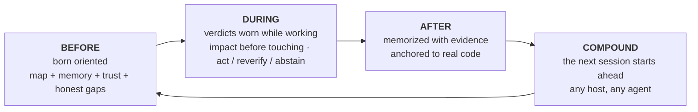

<p align="center">
  
</p>

**m1nd** gives your coding agent a brain per repository: a local code graph served over MCP, memory anchored to the code it cites, and a trust verdict on every answer. "Insufficient evidence" is a real answer here. So is "don't trust this yet, and here is how to repair it".

Nothing leaves your machine. One Rust binary. MIT.

Think of it as an X-ray of your repo that your agent can read: one structure that combines everything and says where each thing lives, what that program is for, what is being worked on, what is done and what is still open. That panorama is the thing no other tool hands your agent.

<p align="center">
  <a href="https://www.npmjs.com/package/@maxkle1nz/m1nd"></a>
  <a href="https://crates.io/crates/m1nd-mcp"></a>
  <a href="https://github.com/maxkle1nz/m1nd/actions"></a>
  <a href="LICENSE"></a>
  <a href="https://registry.modelcontextprotocol.io/?search=io.github.maxkle1nz/m1nd"></a>
</p>

<p align="center">Five commands to install: <a href="#sixty-seconds">Sixty seconds</a>. Reasons to close the tab first: <a href="#when-not-to-use-m1nd">When not to use m1nd</a>.</p>

<p align="center">
  
</p>

<p align="center"><em>A real session on this repo's 6,453-node graph (m1nd-mcp 1.4.0): <code>north</code> orients, <code>seek</code> answers wearing a <code>reverify</code> verdict, <code>memorize</code> anchors the finding to code.</em></p>

## The audit your agent stops paying for

You know the ritual. The agent opens a file, greps, opens another file, greps again, burns most of its context reconstructing what the repo even is, and only then starts the actual task. With m1nd that sweep becomes one question. In under a second the agent has the map: what calls what, what breaks what, where everything lives. Not a pile of matches to interpret. The connected structure, already assembled.

And it remembers. Between sessions, and between agents. What one agent learns tonight, another agent inherits tomorrow, with the evidence attached and a flag if the code moved on since. Every conclusion leaves a trail, so you, or any agent that comes after, can always see what happened to that code and why.

Then l1ght takes it further: papers, articles, RFCs, drafts and notes connect to the parts of your code they explain, inside the same structure. The agent gets the RIGHT context instead of the nearest-sounding one, and inventing code that does not exist stops being the path of least resistance: the structure says what exists, and the verdict says how much to trust even that.

Before m1nd, a function was just a function, lost in some manual. Now it lives inside the agent's intelligence, combined with the code, its history, its documents and its risks. I have not found anything like that anywhere else.

## grep answers good questions. m1nd answers the deeper ones.

Questions your agent can now ask and get a structural answer for:

- What breaks if I touch this function?
- Where does token refresh actually happen in this repo?
- Why are these two files connected, and is that path solid or a guess?
- What did the last session learn about this code, and is it still true?
- What always changes together here, even with no import between them?
- Does this edit cross an architecture boundary I should not cross?
- Which claim in this paper does this function implement?
- Is the bug I just fixed hiding anywhere else, as a shape?
- What is missing here that this pattern usually has?
- Am I even in the right repo?
- Should I act on this answer, or verify it first?

Each one is a verb on the MCP surface (`impact`, `seek`, `why`, `north`, `ghost_edges`, `xray_gate`, `antibody_scan`, `missing`, `trust_selftest`, `predict`), not a prompt trick.

## And it does not stop at showing structure

Antibodies: a fixed bug becomes a named structural pattern, and every later session scans for that shape across the repo. Fix it once, hunt it forever.

Ghost edges: files that always change together with no import between them, mined from your git history. The invisible coupling that breaks refactors.

Structural holes: `missing` looks for the code that is not there. The guard, the retry, the timeout this pattern usually carries and this instance lacks.

Hypotheses against the graph: state a claim in plain language ("settings can reach boot without validation") and have it tested against the live structure.

Tremor: files whose change velocity is accelerating get flagged before anyone files the bug report.

A warm graph: confirmed results reinforce their edges, Hebbian style, so the paths that proved useful rank higher for the next agent.

Every one of those flags and suggests; your compiler and tests still do the proving.

## m1nd does not just search. It writes.

Here is the part people take a second to believe. The graph that reads your repo can also operate on it. Your agent names a symbol and a destination, about 48 tokens, and `transplant` computes the whole move from the graph: the widened region (doc comments and attributes travel along), dependencies classified by their call edges (private ones travel, shared ones stay and gain a back-import), every referencer re-qualified across every file that names it. Then it writes atomically, re-ingests, and hands back an honest receipt: what moved, what stayed, what it could not resolve. `refs_unresolved` is never silently empty when something went wrong.

It is two-phase, `transplant_preview` before `transplant_commit`, and the commit re-validates the hash of every file it planned to touch, so nothing lands on a repo that changed underneath it. The money zone of your repo (backend, schema, payments, CI) is protected server-side and fails closed. A refusal never touches a byte and teaches the retry: a collision names the occupant, an invalid module path names itself, a cross-crate move names both crate roots.

<p align="center">
  <picture>
    <source media="(prefers-color-scheme: dark)" srcset="docs/assets/diagrams/transplant-two-phase-dark.svg">
    
  </picture>
</p>


Measured on the real case: the whole-file edit cost 12,235 output tokens; the transplant cost 48 in and wrote 3 files in 1.3 seconds, with the crate compiling on the other side. rust-analyzer has had an issue open asking for cross-file moves since 2019.

v1 boundaries, stated plainly: Rust only, top-level `fn` only, same crate, the destination file must already exist, and references born inside macros are invisible to it. Each boundary is deliberate and written down in [docs/TRANSPLANT-PRD.md](docs/TRANSPLANT-PRD.md), next to 13 test files that hold the verb to it.

## And when it is not one agent but five?

Run several agents on the same repo and the graph becomes the place they coordinate. Every session registers as a presence, and when two of them are about to touch overlapping work, both get warned in their next orientation packet, before either lands a change. The system warns; you decide.

<p align="center">
  <picture>
    <source media="(prefers-color-scheme: dark)" srcset="docs/assets/diagrams/presence-collision-dark.svg">
    
  </picture>
</p>


Bounded work runs as missions, and missions answer for themselves in a way most human teams skip: every mission tool reports `non_claims`, the list of what was NOT proven. A claim cannot close on graph evidence alone. It takes a file read, a test run or a runtime probe, and the test that enforces this is named `graph_only_evidence_is_not_enough`.

And the guardrails do not cry wolf. `xray_gate` can say `blocked` only from a boundary manifest a human ratified. Everything else arrives as a warning with a reason, so the agent never learns to ignore its own safety rail.

Every brain also has a mailbox. An agent that finds a real defect outside its own mission does not fix it on the spot and does not swallow it: it drops a letter in that repo's box, on disk, next to the code. The next agent working that brain sweeps the box and starts out already knowing the defects other agents found, context attached. Knowledge of what is broken stops dying in chat scrollback. The sweep is a deliberate gesture (CLI or REST, never inside the query loop), so the letters inform the work instead of interrupting it.

<p align="center">
  <picture>
    <source media="(prefers-color-scheme: dark)" srcset="docs/assets/diagrams/mailbox-dark.svg">
    
  </picture>
</p>


## Born agent-first

No account, no telemetry, and no API in the way, which is also why the graph answers in microseconds.

The development of m1nd is not very normal either. Building it meant building a whole workflow where agents direct, verify and prove the work, and the logic of the product is aimed at the agent's pain, not the human's dashboard. When m1nd misbehaves in the field, the agents using it file the report, and a confirmed bug becomes a red test before the fix lands. Very few programs start from that in their initial design. So m1nd is born different: the verbs, the refusals and the packets are shaped for the reader that actually uses them, and you do not even have to remind the model the tool exists. `m1nd hosts apply` installs session hooks (`SessionStart`, `agentSpawn`, `TaskStart`, per host) that inject the orientation at spawn: your agent, and every subagent it spawns, starts oriented before anyone types a word.

<p align="center">
  <picture>
    <source media="(prefers-color-scheme: dark)" srcset="docs/assets/diagrams/ambient-hooks-dark.svg">
    
  </picture>
</p>


A brain per repository holds it together: one graph, its own memory, its own persistence, bound to one repo root. A served owner hosts many brains and routes each session to the right one; a session from a repo it does not host gets a typed refusal instead of wrong answers.

<p align="center">
  <picture>
    <source media="(prefers-color-scheme: dark)" srcset="docs/assets/diagrams/brain-per-repo-dark.svg">
    
  </picture>
</p>


## What your agent gets

m1nd wraps the agent's whole loop around a graph of your repo that outlives the session:



The front door is one call. `north(task)` returns the whole orientation in a single packet, before any retrieval:

```jsonc
{"method":"tools/call","params":{"name":"north",
  "arguments":{"agent_id":"dev","task":"harden the JWT auth token validation flow"}}}
```

```jsonc
{
  "binding": { "trust_mode": "full_trust", "ok": true },      // verdict before retrieval
  "memory": [                                                 // recalled from a PRIOR session
    { "claim": "AuthTokenFlow", "source_agent": "authbot", "age_ms": 221, "stale": false }
  ],
  "sufficiency": { "state": "gathering", "top_score": 0.64 },
  "next_move": "Call `surgical_context` on the top focus node before editing.",
  "honest_gaps": []                                           // nothing withheld on this graph
}
```

While the agent works, `impact` shows the blast radius before an edit lands, `why` explains a connection and admits when the path rests on a guess, and `xray_gate` warns before a change crosses an architecture boundary. When the work is done, `memorize` writes the conclusion down with the evidence that backs it. The next session starts with last session's conclusions already in hand, on any MCP host: Claude Code, Codex, Cursor, Gemini, Zed, 22 hosts in total.

You never run any of these verbs yourself. The agent does. Your surface is a small setup CLI, and then you keep talking to your agent as always.

## Sixty seconds

The npm package is the installer. The native runtime is a separate Rust binary that step 1 fetches as a signed release.

```bash
# 1 · install the native runtime (signed, verified, with rollback)
npx -y @maxkle1nz/m1nd update apply --yes

# 2 · confirm it is visible (prints a JSON verdict; good looks like "status": "ok")
npx -y @maxkle1nz/m1nd doctor

# 3 · wire your host: MCP config + the session hooks that make m1nd ambient
npx -y @maxkle1nz/m1nd hosts apply --host claude --project . --yes

# 4 · give this repo its brain — once, by you. It ingests and prints what it built.
npx -y @maxkle1nz/m1nd init --birth .

# 5 · first value: the orientation packet for YOUR repo, read-only, no host config touched
npx -y @maxkle1nz/m1nd agent first-minute --repo . --query "map this repo" --json
```

Step 4 is the one command only you run. Minting a brain writes a whole graph, so the ceremony has a human terminal ingress and accepts only an empty destination. If an agent finds a repo without a brain, it offers this command and stops. Once the graph exists, the agent can keep it fresh. The ceremony exits non-zero and tells you what to check if the scan finds nothing, so it can never report success over an empty graph.

Step 1 verifies the signature with [`cosign`](https://docs.sigstore.dev/cosign/system_config/installation/), so install that first if it is not on your PATH. If you prefer the source registry and accept skipping verification, `cargo install m1nd-mcp` works too. Prefer to see before you write: `hosts plan` prints everything `hosts apply` would touch, and writes nothing. There is no uninstall command yet; `hosts plan` doubles as the list of what to remove by hand.

The hooks from step 3 are what make m1nd ambient: the orientation packet is injected at every session and subagent spawn, and the agent drives itself from there. Installing from an agent instead of a terminal? There is a machine-legible twin of this section in [`llms-install.md`](llms-install.md).

A tampered or truncated release cannot land on your machine, and a bad upgrade is one rollback away: the updater checks the signature against the exact build identity, then the SHA-256 and the size, before it touches anything. If verification fails, it refuses rather than falling back to an unverified path. Details in [docs/AGENT-PACKS.md](docs/AGENT-PACKS.md).

## If I disappear

m1nd is MIT and there is no server to lose. The runtime is one Rust binary already on your disk. The memory it writes is plain markdown under `agent-memory/`, readable and greppable with no m1nd installed at all. The graph is derived from your code and rebuilds from scratch on any machine. If this project stops tomorrow, you keep the files and lose a tool. That is deliberate. It is why memory is markdown and why there is no cloud between your agent and its own knowledge.

## Why trust the answers

This is why I built m1nd. Retrieval layers are good at answering. Almost none of them are good at refusing. m1nd treats the refusal as a first-class result:

```jsonc
// trust_selftest on an unbound runtime. The verdict IS the repair instruction:
{
  "ok": false,
  "verdict": "needs_ingest",              // never a bare "no results"
  "next_action": "offer_birth_ceremony",
  "recovery_playbook": {
    "steps": [ { "action": "This repo has no brain yet: offer the human `m1nd init --birth <repo>` and stop." } ]
  }
}
```

A `seek` hit carries a sufficiency readout and a trust envelope. When no calibration has been measured yet, the envelope caps its own verdict at `reverify` instead of overclaiming. `predict`'s gate is tuned for coverage (α=0.10); on this repo's history that lands at roughly a third precision in the `act` band, and most of the time it abstains, which is the honest output of a weak signal. `abstain` tells the agent to stop. `insufficient_evidence` means no evidence at all, which is a different thing from medium risk, and the API keeps the two apart.

Two tools, `savings` and `resonate`, were deleted outright in beta (handlers, types and state files, all gone) because they returned a win on every input I gave them, and a tool that never loses has stopped measuring. That is the bar every claim in this file is held to.

The closest neighbor I know is GitHub Copilot Memory (public preview, 2026): it stores facts with code citations and re-checks them against the current branch before use. That is real staleness detection, and it deserves the credit. It is also cloud-side, binary, and lives inside Copilot. What I have still not found anywhere is the rest of the verdict: a graded `act` / `reverify` / `abstain` with per-repo calibration, typed refusals that carry a repair plan, on a local graph that any MCP agent can share. I checked the public docs of Mem0, Zep, Letta, Cognee, Supermemory and Copilot Memory, as of July 2026. Know a closer one? Open an issue and I will link it here.

<p align="center">
  <picture>
    <source media="(prefers-color-scheme: dark)" srcset="docs/assets/diagrams/verdict-gate-dark.svg">
    
  </picture>
</p>


## Memory that knows when it is stale

Most memory layers store text and hope. m1nd anchors memory to the graph. When an agent calls `memorize`, each claim's `evidence` path is resolved to the real code node, so the note surfaces whenever the agent touches that code, without anyone remembering it exists:

```jsonc
memorize({
  "agent_id": "authbot",
  "node_label": "AuthTokenFlow",
  "claims": [{
    "label": "TokenValidator",
    "text": "TokenValidator validates JWTs via HMAC. Rotate keys via KMS only.",
    "confidence": "high", "evidence": ["src/auth/token.rs"]
  }]
})
```

Because the memory is anchored, it can be audited against reality. `cross_verify` re-hashes every cited file and names which claims went stale because their code changed. Claims carry age and author, supersede older claims, and age out. This loop is proven live end to end in this repo: memorize, anchor, edit the cited file, watch the claim flag itself, survive a full re-ingest, auto-load on the next boot. Kill the process, start a fresh one, and the first `north` already carries the earlier session's claims with provenance attached.

<p align="center">
  <picture>
    <source media="(prefers-color-scheme: dark)" srcset="docs/assets/diagrams/grounded-memory-dark.svg">
    
  </picture>
</p>


## One graph for code and knowledge (l1ght)

l1ght is the second lane of the same engine: documents become graph nodes in the same activation space as code, so one query traverses both. It is not a bolted-on RAG folder. There are 7,400 lines of dedicated adapters in this tree: Markdown, HTML, PDF, plain text, RST and JSON, plus scholarly routes for BibTeX, DOI/Crossref, JATS papers, RFCs and patents.

Different people get different products out of the same lane:

- A researcher drops a folder of PDFs and DOIs next to the analysis code and asks which paper contradicts the claim this function implements.
- A student walks a textbook chapter and the exercise code as one graph, and the agent explains each in terms of the other.
- A teacher ingests the course notes once; every student's agent answers from the same grounded corpus instead of improvising.
- An engineer binds RFCs and design docs to the functions that implement them; the spec section sits one hop from the code.
- A vibecoder's pile of chat exports and scattered notes stops being a folder and becomes memory the agent actually consults mid-edit.

Same binary, same MCP verbs, same trust layer. `seek` on a mixed graph returns code and documents in one ranked answer.

<p align="center">
  <picture>
    <source media="(prefers-color-scheme: dark)" srcset="docs/assets/diagrams/l1ght-lane-dark.svg">
    
  </picture>
</p>


## When not to use m1nd

Some honest reasons to close this tab:

- Small repos. Under a few hundred files, grep is already cheap and the graph's edge shrinks toward nothing. Independent measurement of comparable graph tooling on a ~110 file repo put the advantage at about 20 percent. Real, and not worth running a runtime for.
- Fuzzy questions. A symbol graph answers "what connects to what". It does not answer "why does this feel slow". Agentic search is better at open-ended questions.
- Compiler and runtime truth. Your LSP, your tests and your profiler are right and m1nd is guessing. m1nd points; they prove.
- Tiny tasks. One file and twenty lines does not need an ingest. Skip it.
- `predict` mostly abstains today. Calibrated on this repo's own history it reaches roughly a third precision in the `act` band at low coverage. Abstention is the honest output of a weak signal, and right now it is also most of the output.

m1nd complements the compiler, the test runner and your security tooling. It replaces none of them.

## Evidence

Everything above ships in the current release; the documents under `docs/` marked PRD are design intent, kept labeled apart. Every row is hedged to exactly what was measured. m1nd does not lead with token savings or ROI, and that is deliberate: those are the least falsifiable numbers in this category.

| Claim | Result | Reproduce / hedge |
|---|---|---|
| Graph latency | ~1.4µs `activate`, ~0.5µs `impact` on a 1K-node synthetic graph | `cargo bench -p m1nd-core` on Apple silicon. Order of magnitude only, hardware dependent. |
| Capability battery vs grep | 37/37 pass; head to head 16 wins, 12 ties, 0 grep wins | `python3 scratchpad/m1nd_battery.py ./target/release/m1nd-mcp . --suite m1nd`. One repo (this one), self-authored cases. |
| Coverage-tuned `predict` | roughly a third precision in the `act` band at low coverage (α=0.10) | Measured on this repo's git history, n≈9.2k held-out predictions. The gate mostly abstains, by design. |
| Memory self-verification | 6-step loop proven live | memorize → anchor → freshness flag on an edited file → survives replace → boot auto-load. |
| Persistence across boots and crashes | the gate drives the real binary over stdio across four clean boots, and across a kill -9 | `m1nd-mcp/tests/persist_runtime_root.rs`. Reverting either boot fix turns it red with a message naming the regression. |

## One graph, many agents

For one agent, the stdio server from [Sixty seconds](#sixty-seconds) is all you need. The first graph is yours to start, not the agent's: run `m1nd init --birth .` once in the repo and it ingests it, prints the node and edge counts, and the next session opens on that graph. Agents cannot do it — generic `ingest` is refused for every client, and every refusal names this command instead. For real work, run one served owner that holds the live graph, and attach every agent to it as a thin bridge:

```bash
m1nd-mcp --serve --no-gui --port 1337 --runtime-dir /your/project/.m1nd
m1nd-mcp --attach auto --stdio     # each agent: no graph load, no lease, shared memory
```

What one agent memorizes, another recalls immediately, and the presence and collision warnings described above run through this same owner. It also hosts per-repo brains and renders the web UI. Queries stay on localhost; every non-loopback bind is refused until authenticated transport exists. `auto` finds the owner of your own runtime first, and otherwise any live owner that has already ingested the repo you are standing in — including from a git worktree — so one central owner is found from inside its own projects instead of each repo starting an empty brain. The `m1nd agent` commands ask those same two questions before they boot, so the CLI reaches that owner too; `m1nd-mcp --discover-owner` prints the answer on its own, as JSON, attaching to nothing.

One gate to know about: no agent, on any transport, can mint a brain — generic `ingest` fails closed by design, and minting one for a repo a served owner does not host fails closed twice over. Both doors open the same way: you run `m1nd init --birth <repo>` once. Standing in the repo with its own runtime, that fills the graph your stdio session reads; pointed at another repo from a served owner, it mints that repo's brain on the owner, which then routes to it by caller root. `m1nd agent first-minute` says plainly when no owner covers a repo yet, rather than pretending the machine has no graph. Full deployment guide: [docs/deployment.md](docs/deployment.md).

## Language coverage

Dedicated extractors cover more than twenty languages, so a polyglot repo does not come back half-mapped: Python and TypeScript through Elixir, Haskell and Zig, routed by file extension in `m1nd-ingest`. The table below is the stricter claim, proven end to end in a single polyglot ingest: call-graph edges plus cross-file import resolution.

| Language | `calls` | cross-file imports |
|---|:---:|:---:|
| Rust | ✅ | ✅ |
| Python | ✅ | ✅ |
| JavaScript / TypeScript | ✅ | ✅ |
| Go | ✅ | ✅ |
| Java | ✅ | ✅ |
| C / C++ | ✅ | ✅ |
| Kotlin | ✅ | ✅ |
| PHP | ✅ | ✅ |
| Scala | ✅ | ✅ |
| Ruby | ⏳ | ✅ |
| C# | ✅ | namespaces don't map 1:1 to files |
| Swift | ✅ | not yet |

Unresolvable imports (external packages, stdlib, system headers) are left unresolved rather than guessed. Everything else falls back to a generic extractor with `contains` edges only.

## The human is the second reader

Most developer tools are built for a person and then grow an API. m1nd runs the other way: the agent is the user, and the verbs are its verbs.

That choice shapes the design in ways you can check. Refusals are typed and carry a recovery playbook, because the reader acting on them is a machine. An error message that needs human interpretation is a design failure here. The same orientation packet the agent reads as `north` is rendered for you as a short card in the conversation and as the Living Tree in the served web UI (your repo drawn as a navigable tree, memory notes pinned to it): computed once, projected per reader, so the human view can never drift into a second truth.

Humans are welcome. You are just the second reader, and the system is more honest to both readers because of it.

## How this repo is built

Read the commit log with a raised eyebrow, then read this. I'm Max. I build m1nd by directing a system of coding agents, under rules stricter than most human teams I have worked on:

- Every substantial change starts as a spec confronted by an independent oracle model before code is written. The objections are recorded inside the spec files.
- Every fix lands with a test that was demonstrated failing first. A test that has never been red proves nothing.
- The reviewer is never the author. Each agent hand works in an isolated worktree.
- A green gate is a candidate. The landing gesture is mine, and I answer for every line.
- The laws are test names: `letter_cannot_color_the_store`, `gate_zero_cannot_land`, `graph_only_evidence_is_not_enough`.
- The tree holds 2,462 test functions, and the full gate runs green on Linux, macOS and Windows.

The skeptic's question ("no human writes this much this fast") is correct. No human does. A human directing a proof-bound system of agents does. This tree is what came out. m1nd's trust layer was born from that daily practice: I needed my own agents to stop trusting stale answers before I could ship anything at this pace.

## Architecture at a glance

Three core Rust crates plus auxiliaries: `m1nd-mcp` (the MCP server and runtime surface), `m1nd-core` (the graph engine: spreading activation, Hebbian plasticity, CSR adjacency, git-derived ghost edges), `m1nd-ingest` (extractors and adapters for code, documents and memory). Your agent sees a **core menu of about 15 tools** by default rather than the whole registry, so it picks the right one more often and pays for a short tool list on every request. The rest are hidden, never removed: any verb answers when called by name whether or not it is listed, `help` catalogs and explains all of them at any tier, and the full menu is one env var away (`M1ND_TOOL_TIER=full`). The core was cut against six weeks of measured traffic, where 141 advertised verbs produced calls to 13.

<p align="center">
  
</p>

Depth lives in the [wiki](https://m1nd.world/wiki/), [docs/AGENT-PACKS.md](docs/AGENT-PACKS.md), [EXAMPLES.md](EXAMPLES.md) and [CHANGELOG.md](CHANGELOG.md).

## Translations

🇧🇷 [Português](i18n/README.pt-BR.md) · 🇪🇸 [Español](i18n/README.es.md) · 🇮🇹 [Italiano](i18n/README.it.md) · 🇫🇷 [Français](i18n/README.fr.md) · 🇩🇪 [Deutsch](i18n/README.de.md) · 🇨🇳 [中文](i18n/README.zh.md) · 🇯🇵 [日本語](i18n/README.ja.md)

Translations follow the English text with some lag. When they disagree, English is canonical.

## Contributing

Contributions are welcome across extractors, adapters, MCP tooling, benchmarks, docs and graph algorithms. See [CONTRIBUTING.md](CONTRIBUTING.md). There is a live room on [CodeRooms](https://coderooms.com/github/maxkle1nz/m1nd) if you want to talk first. And if you read this far and want to try it: [four commands](#sixty-seconds).

## License

MIT. See [LICENSE](LICENSE).
