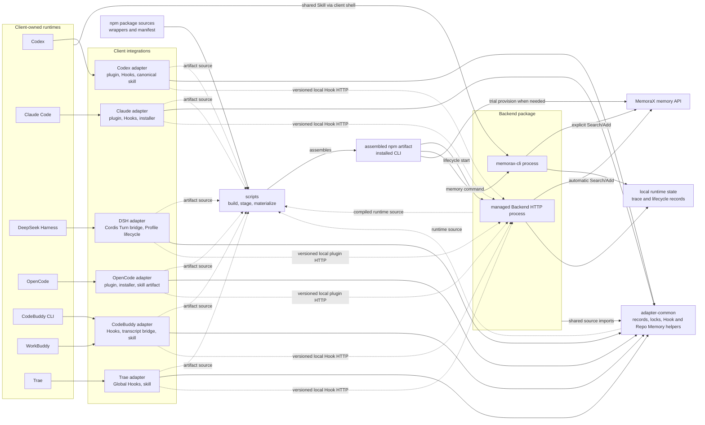
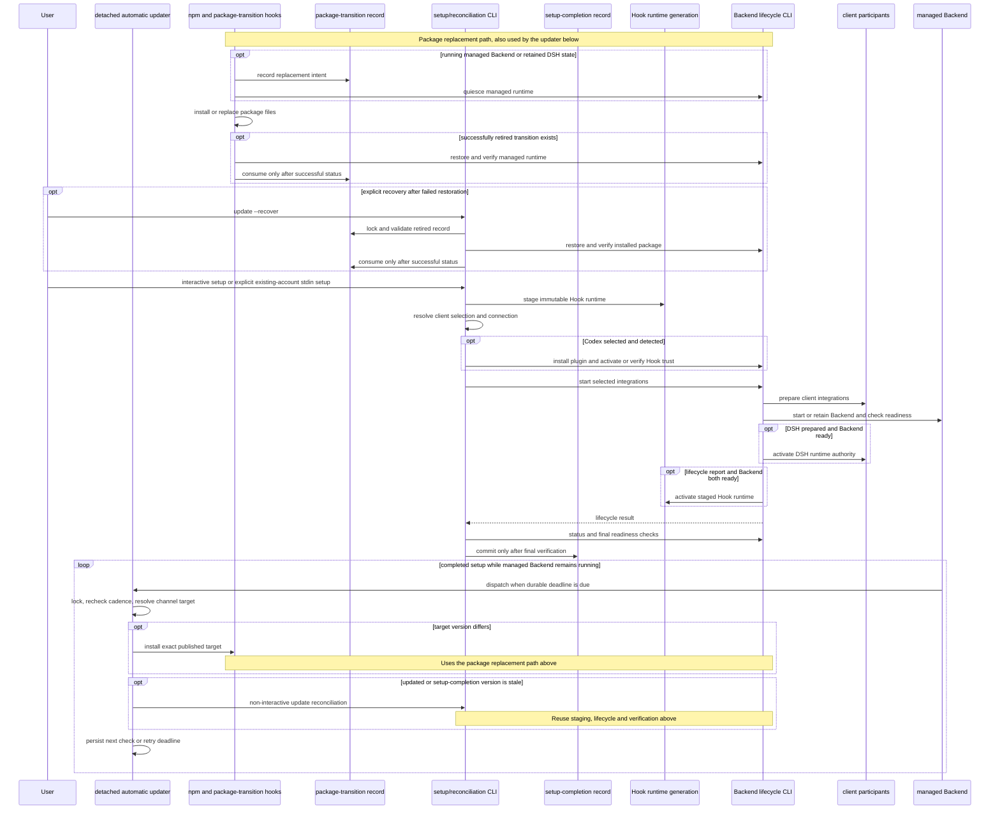
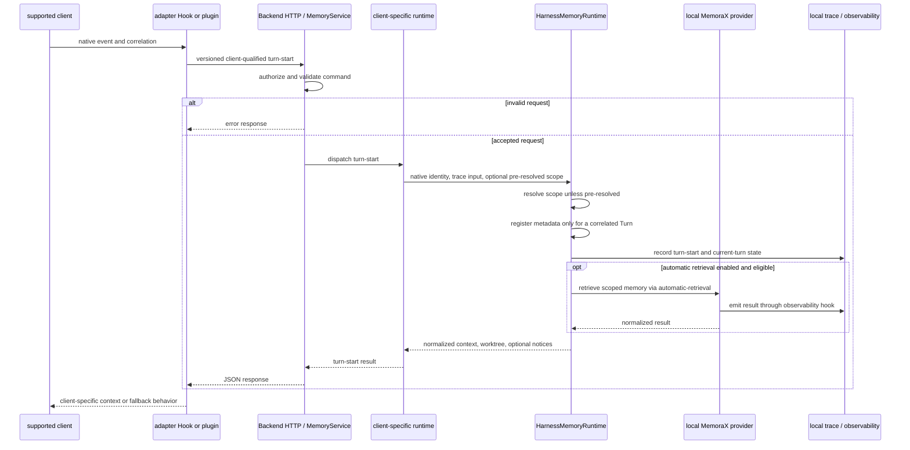
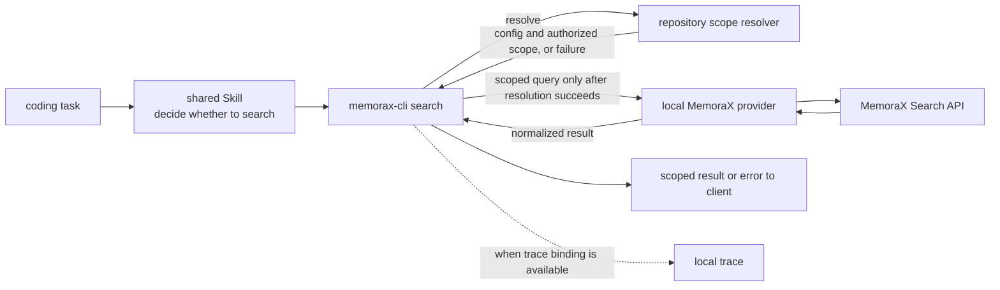
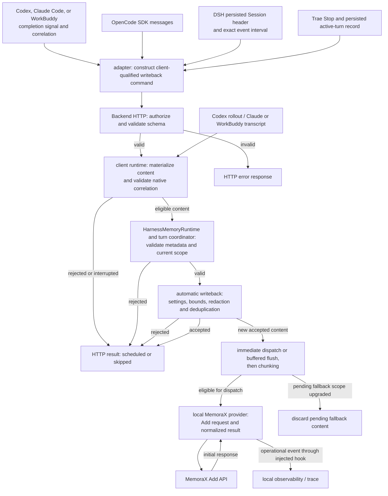
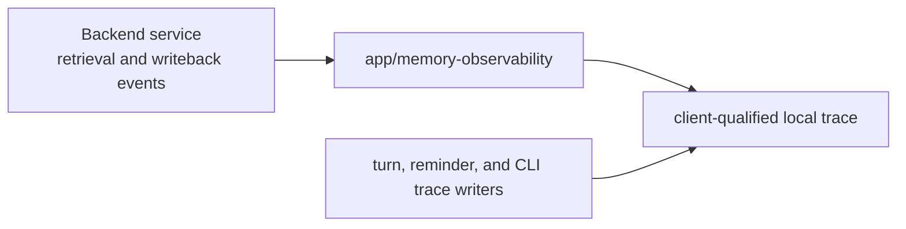
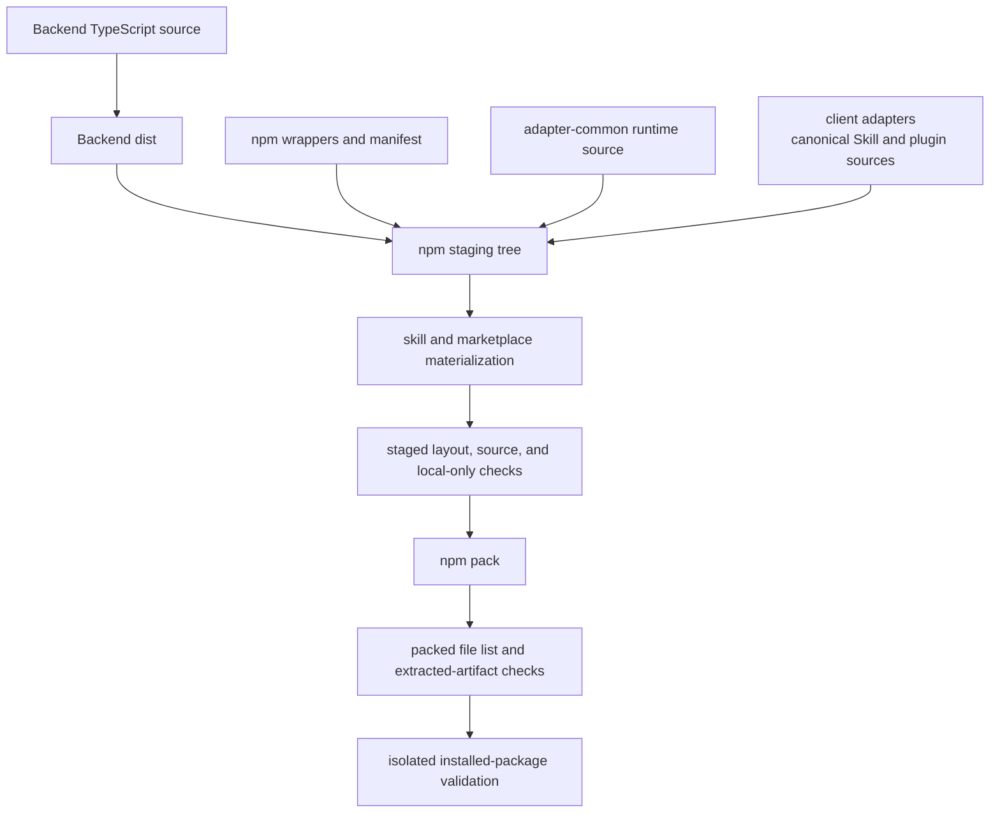

# MemoraX Code Architecture

This document describes the stable structure, process boundaries, authority
model, runtime flows, and code-placement rules of MemoraX Code. It is a map of
the current system, not a roadmap or a complete file inventory.

## 1. Purpose and Sources of Truth

- Live source, manifests, and executable tests are the authority for current
  behavior. This document explains their architectural intent.
- [AGENTS.md](AGENTS.md) defines working rules for coding agents, runtime and
  data invariants, and Git handoff requirements.
- [CONTRIBUTING.md](CONTRIBUTING.md) defines development, debugging,
  verification procedures, and [documentation ownership](CONTRIBUTING.md#documentation-ownership).
- [SECURITY.md](SECURITY.md) defines security and trust-boundary policy.
- [README](README.md) owns ordinary installation and first use;
  [Configuration](docs/configuration.md) owns settings and their semantics;
  [Troubleshooting](docs/troubleshooting.md) owns diagnosis and recovery.

Architecture documentation should remain stable across ordinary refactors.
Do not copy volatile values such as package versions, ports, Hook ABI numbers,
timeouts, retry counts, batch sizes, endpoints, current test counts, or
artifact allowlists into this file. Their source or manifest remains
authoritative.

## 2. System Shape and Package Ownership

MemoraX Code integrates Codex, Claude Code, DeepSeek Harness (DSH), OpenCode,
CodeBuddy CLI, WorkBuddy, and Trae with one local Backend. The Backend is a
capability-oriented modular monolith. The clients retain ownership of models,
model-provider credentials, native tools, model-provider traffic, and native
transcript, message, or Hook-event creation.

Around the Backend are:

- six client deployment adapters;
- one lower-level shared runtime source layer;
- one npm assembly and installed-CLI layer; and
- repository automation that builds, validates, stages, and tests artifacts.



The diagram mixes packaging, source dependency, and runtime-call
relationships; the arrow labels distinguish them. It is not an import graph.

### 2.1 Repository components

Adapters deploy native integrations, bridge client events to Backend commands,
and present returned context and diagnostics. Backend client runtimes own the
native interpretation used by memory workflows. Model execution and provider
configuration remain client-owned.

| Component | Stable responsibility | Must not own |
| --- | --- | --- |
| [Backend](packages/ts/memorax-code-backend) | Local memory service, native content interpretation, repository scope, local memory helpers, trace, lifecycle, and update scheduling; see [capability ownership](#43-capability-ownership) | Model execution, client model-provider credentials, or native transcript creation |
| [adapter-common](packages/ts/memorax-code-adapter-common) | Shared connection and private-record primitives, credential storage, locks, Hook transport/generations, and local memory helpers | Backend composition, native content interpretation, MemoraX requests, or client plugin policy |
| [Codex adapter](packages/ts/memorax-code-codex-adapter) | Codex plugin, Hooks, workspace observation, and the canonical shared Skill | Rollout interpretation or Backend writeback orchestration |
| [Claude Code adapter](packages/ts/memorax-code-claude-adapter) | Claude plugin, Hooks, installer, and marketplace source | Transcript interpretation or Backend memory orchestration |
| [DSH adapter](packages/ts/memorax-code-dsh-adapter) | Cordis Turn bridge, persisted-interval delivery, Profile and runtime-generation lifecycle, and supervised Repo Memory | Backend event interpretation or DSH provider/session ownership |
| [OpenCode adapter](packages/ts/memorax-code-opencode-adapter) | Plugin and thin loader, SDK record delivery, shell-session identity, workspace evidence, and supervised Repo Memory | Backend message interpretation or model-provider configuration |
| [CodeBuddy/WorkBuddy adapter](packages/ts/memorax-code-codebuddy-adapter) | Marketplace plugin, Hooks, native transcript bridge, and supervised Repo Memory | Backend transcript interpretation or model-provider configuration |
| [Trae adapter](packages/ts/memorax-code-trae-adapter) | Managed Global Hooks, versioned runtime and Skill deployment, and Hook observation | Global Hooks activation, provider settings, or guessed native Sessions |
| [npm package](packages/npm/memorax-code) | Installed wrappers, setup and update reconciliation, trial provisioning, and package replacement | Backend lifecycle semantics, uninstall orchestration, or artifact staging |
| [scripts](scripts) | Build, staging/materialization, and repository/artifact checks | Product runtime authority |
| [.github](.github) | Issue and pull-request contribution templates | Product runtime behavior |

`memorax-code-adapter-common` is a source layer consumed by the Backend and all
six adapters; it is not an independently deployed service. The npm artifact
assembles all runtime trees, but package assembly does not make the npm wrapper
the owner of their behavior.

### 2.2 Physical dependency directions

- The Backend and the Codex, Claude Code, DSH, OpenCode, CodeBuddy, and Trae deployment adapters
  may import adapter-common. Adapter-common must not import those higher-level
  components back.
- Adapter Hook and plugin runtimes do not import Backend implementation. They
  communicate through versioned, client-qualified local HTTP commands. Shared
  `adapter-common/src/backend-command.mjs` sends those commands with JSON and
  token headers, a request deadline, and optional caller cancellation. Each
  adapter resolves current connection authority per request and retains native
  payload construction, response decoding, status handling, and failure policy.
  The transport returns the original HTTP response; it does not retry commands
  or start the Backend.
- Backend lifecycle may load adapter configuration or installers through
  lifecycle participants. Request-time memory processing must not depend on
  plugin installation or install-watchdog behavior.
- The npm layer locates staged entrypoints. `scripts` owns how source is
  materialized into that staged layout.
- The canonical user-facing `memorax-code` skill lives in the Codex adapter.
  Packaging materializes the Claude Code, DSH, OpenCode, CodeBuddy, and Trae
  artifacts from that source; do not maintain independent skill copies.

Client integration is deliberately not physically symmetric. Codex plugin
material belongs to the Codex adapter, while current install, activation, and
Hook-trust glue lives in Backend `clients/codex`. The Claude Code installer
lives in the Claude adapter. The DSH adapter owns Profile discovery and
mutation plus per-user runtime generation materialization. The OpenCode adapter
installs an auto-discovered thin loader and shared skill without editing
OpenCode provider configuration. The CodeBuddy adapter owns its marketplace
plugin and managed global `UserPromptSubmit` Hook. Native global Hooks load
before plugin initialization, allowing the first prompt to use the same
transcript-boundary and prompt-digest correlation as later turns. The plugin
retains `SessionStart` and `Stop`; its old prompt dispatch is ignored to avoid
duplicate handling during updates. The global entry honors native plugin
disablement before Backend recovery, and lifecycle disable/remove cleans up
only its owned Hook. CodeBuddy CLI and WorkBuddy share that implementation but
use distinct `codebuddy` and `workbuddy` client identities. Setup discovers
and selects them independently. Each installation retains its own configuration
root, executable, Hook observations, and pending Turns; Backend session, trace,
and writeback identities preserve the same separation. Shared native parsing
keeps the original session ID for transcript validation. Legacy WorkBuddy
selection is recognized from owned installation metadata, and explicit new
client choices take precedence. Lifecycle cleanup never treats the other
client's directory as stale installation data. Hook recovery preserves the
active client selection and each installation's recorded root and command.
The Trae adapter merges only marker-owned Global Hooks and
materializes the shared Skill without changing provider settings. These
implementations are loaded by their Backend lifecycle participants. Preserve
the participant contract and each client's actual authority instead of forcing
matching directory shapes.

Lifecycle report interpretation is shared in `lifecycle/client-reports.ts`.
Its static client catalog maps lifecycle IDs and display names to existing
report keys. The report projection supplies readiness and presentation data
to the orchestrator and CLI while preserving the raw client-specific JSON.
It does not discover clients, select defaults, read installation state, or
perform lifecycle mutations. Lifecycle configuration and orchestration own
selection and defaults; native participants own client-specific discovery and
mutations, including DSH Profile ordering and locks.

## 3. Runtime Flows

The system has two related but distinct planes. The control plane installs and
manages integrations and processes. The runtime data plane handles memory
operations for live client sessions.

### 3.1 Installation and lifecycle control plane



npm lifecycle, foreground setup, and Backend scheduling have separate
authority. npm replacement retires a running managed Backend and restores it
with retained client intent, consuming the transition record only after status
succeeds. Retained DSH state also triggers retirement and restoration, even
without a live Backend PID or when that state is disabled. Fresh or stopped
installations without retained DSH state remain stopped. npm lifecycle never
detects new clients, accepts credentials, or authorizes Hooks.

Explicit `memorax-code update --recover` reuses package-transition restoration
and its lock for the already installed package. The user's recovery request
permits an expired retired record; unattended npm restoration retains its
freshness limit. Both paths reject incomplete retirement, invalid records, and
future timestamps, and consume state only after successful start and status.

Public `memorax-code setup` owns disclosure, preferences, credential
provisioning or entry, client discovery, initial Hook activation, and Backend
reconciliation. It accepts either interactive input or an explicit
`--existing-account --non-interactive` request with a raw key on stdin. The latter
uses detected preferences, preserves explicit client choices, and verifies the
saved key locally without returning it. Both commit the versioned completion
record only after final verification. Invalid or unsupported
completion and transition records fail closed. No-argument routing and legacy
migration follow the [setup state rules](docs/configuration.md#setup-automatic-update-and-package-transition-state).

After completed setup, the managed Backend schedules a detached updater from
the durable deadline; client startup Hooks only recover an unavailable Backend.
The updater serializes checks through its private record and lock, installs an
exact target from the installed release channel, and reuses non-interactive
setup reconciliation. It preserves explicit client choices and configuration.
Codex Hook changes may be trusted silently only when marketplace identity stays
the same and the exact incremental Hook selection validates before and after
the config write. Failed verification leaves reconciliation incomplete; a
replaced Backend resumes scheduling from the same record.

Hook generation staging and activation are separate decisions: failed Backend
readiness must not replace the authoritative generation. Cross-process
lifecycle decisions use versioned durable records and bounded locks, not only
in-memory serialization.

Concurrent shared Hook recovery is serialized per Backend home and rechecks
connection authority and health before starting another Backend. Recovery
preserves the current managed client set, falling back to configured selection
when no valid active marker is available; the triggering client does not narrow the
shared integration set.

Control-plane implementations are grouped by ownership:

- [npm package](packages/npm/memorax-code) `bin` and `lib` own installed
  wrappers, foreground setup, package transitions, and detached updates.
- Backend `src/entrypoints/backend-cli.ts` and `src/lifecycle` own process
  commands, lifecycle orchestration, scheduling, and Backend process authority.
- Adapter-common owns shared records, locks, and Hook generations. Client
  lifecycle participants invoke native preparation, status, and removal in
  the [owning Backend or adapter modules](#22-physical-dependency-directions).

The DSH adapter installs content-addressed runtime generations from immutable
staged source into managed Profiles through DSH's native plugin manager. It
never installs or updates DSH or deletes user Profiles. The validated DSH
entrypoint and version form durable runtime authority and are revalidated
during reconciliation. The Backend lifecycle lock precedes the DSH state lock.
Start quiesces old authority, prepares artifacts while disabled, and activates
them only after Backend readiness; stop, update, and uninstall disable
authority before Profile mutation. Disabled or invalid runtime registers no
listeners and cannot recover the Backend. Auto-discovered DSH failures degrade
setup and unqualified `start` or `status` without blocking the Backend or other
clients; explicit client selection remains strict. See
[DSH configuration](docs/configuration.md#deepseek-harness-integration-paths)
and [recovery](docs/troubleshooting.md#deepseek-harness-profile-integration-is-inactive)
for discovery and Profile details.

The OpenCode adapter materializes auto-discovered plugin and Skill assets
without changing model or provider settings. Plugin startup begins a
best-effort Backend check; the first prompt shares a bounded interaction
budget, while accepted-turn idle writeback may await the full check. Expiry
skips that turn's automatic memory handling without cancelling recovery.
Recovery uses the package-recorded Node runtime and `memorax-code start`,
exact managed homes, and the existing
lifecycle lock. It does not replace client selection, directly spawn the
Backend, or recover remote or invalid connection authority. Content-free
workspace runtime evidence proves plugin execution only; it is not session,
transcript, repository-scope, or lifecycle authority. See
[client discovery](docs/configuration.md#client-selection),
[OpenCode paths](docs/configuration.md#opencode-integration-paths), and
[recovery](docs/troubleshooting.md#opencode-plugin-or-skill-is-inactive)
for operational details.

The Trae adapter materializes a content-addressed runtime, merges only
marker-owned Hooks, and installs the canonical Skill. User Hooks remain
untouched, and an unmanaged Skill at the target path fails closed. Global
Hooks activation belongs to Trae and requires the user's one-time action;
successful setup alone does not prove activation. Stop removes managed Hooks
but preserves the Skill; uninstall also removes the managed Skill. See
[Trae configuration](docs/configuration.md#trae-integration-paths) for paths
and activation instructions.

Account-free setup creates or restores versioned trial credentials through
adapter-common's secure credential port and calls MemoraX provisioning to
complete an unprovisioned record. Existing-account setup and reuse of ready
credentials skip that request. The secure record is authoritative for reuse;
the API key is also projected into private configuration. Account, project,
and device-mark metadata remain only in secure credential storage. A matching
anonymous quota reminder may read the mark for account claiming, but it does
not replace configured repository-scoped memory identity.

### 3.2 Hook and retrieval data flow

Automatic Search on turn-start Hooks is disabled by default. The usual Search
path is a client deciding through the shared Skill to call `memorax-cli`, as
shown in [Manual memory CLI flow](#33-manual-memory-cli-flow). Hooks still
provide native identity, scope, local context, and automatic-writeback
coordination when automatic retrieval is off.



Important distinctions:

- Hook or plugin event fields normally supply protocol, correlation, and
  retrieval input rather than automatic-writeback content. OpenCode's
  separately supplied SDK records are validated as client-native content. Trae
  is the narrow exception because it exposes no stable raw Session: its
  validated, correlated `UserPromptSubmit` prompt and `Stop` final assistant
  message are the primary Trae content authority, not a fallback.
- The [native authority map](#native-writeback-authority) identifies each
  client's exact writeback source and owning tests.
- Required client/session/turn identity and repository scope fail closed when
  incomplete, conflicting, or unprovable.
- Adapters identify supported default chat directories as `projectless`;
  `repository/scope.ts` resolves them to `scopeKind: general` and the shared
  remote identity `<base-user-id>@General`. Verified Git identity takes
  precedence. Recognition is client-owned; scope derivation stays shared.
  General sharing does not merge client/session identity or physical workspace
  keys. The [directory rules](docs/configuration.md#memory-scope) apply to Codex,
  WorkBuddy, and OpenCode; ordinary workspaces retain their existing rules.
  Codex can recover an unbound session's General root from the matching
  rollout's first `session_meta` record when a new Turn resumes in a child
  directory. The native initial cwd must match the shared Codex default-directory
  recognizer, and both Hook and registered cwd must remain inside that root
  without intervening Git authority. Recovery runs within session serialization,
  never replaces a live binding, and does not depend on retained trace records.
  A General session that initially has no cwd may acquire its first physical
  root only when the corresponding client default-directory recognizer validates
  that root and Git resolution still yields General. This one-time completion
  preserves the remote namespace and pending QA, including a Turn whose cwd
  first arrives at Stop; subsequent changes to the bound root remain mismatches.
- A malformed or incomplete direct `.git` directory is the sole documented
  folder-scope fallback. That degraded scope may upgrade in-session only to a
  verified Git scope with the same Base User ID and canonical workspace root;
  for a fixed Base User ID, other scope changes beyond the General first-root
  completion above remain mismatches. A changed
  Base User ID requires a new binding; existing Turn metadata remains subject
  to the coordinator's scope validation.
- Local mode may authorize loopback requests without a configured token. Token
  authentication is required when configuration or exposure mode demands it.
- Client-specific runtimes interpret native formats. Client-neutral memory
  coordination does not parse, mix, or guess those formats.
- All supported clients delegate their common memory lifecycle
  to `memory/harness-runtime.ts`. Turn start resolves repository scope, records
  Turn metadata and current-turn trace state, performs optional retrieval,
  claims supported quota notices, and returns normalized context. Completion passes
  validated native user/assistant content, exact identity, and a scope resolver
  to the Turn coordinator. Their client runtimes retain native parsing,
  correlation guards, retries, interruption recovery, and client-specific
  materialization and Turn-end trace behavior. Codex also retains workspace
  registry validation, exact current-turn scope recovery, and native Turn-index
  resolution. It can provide a pre-resolved scope result, including a failure,
  without the shared runtime resolving it again. A start observation without a
  Turn ID can resolve scope and record trace, but cannot register a writable
  Turn, claim quota notices, or retrieve memory. OpenCode retains SDK message
  lineage and compaction-continuation validation, interrupted-Turn handling,
  and the requirement for a prior session scope binding at completion. Its
  start trace keeps the `opencode-plugin` source; Turn-start diagnostics use
  the common metadata-registration stage before trace writes. Trae publishes
  its active Turn snapshot through the synchronous `onTurnRegistered` callback,
  immediately after coordinator registration and before trace or retrieval
  can yield to a concurrent Stop. Its per-session start queue, interruption
  records, and active-state cleanup remain client-owned. DSH supplies a
  start-trace request containing only `start_seq`, keeps the `dsh-cordis` source,
  and adds the native start sequence to retrieval deduplication without changing
  Turn identity. It disables both pending and retrieval quota-notice claims.
  Persisted event-interval validation, interruption handling, and restart scope
  recovery remain DSH-owned.
- OpenCode's awaited `chat.message` plugin event supplies the correlated user
  prompt and injects accepted retrieval plus shared Skill reminder, User
  Profile, and Procedure Memory context into that message's system context.
  Claimed Search and Add quota notices are dispatched through best-effort TUI
  toasts without entering model context or blocking the prompt path. Its stable
  `session.compacted` event marks a durable supplemental reminder for the next
  real user message; synthetic and compaction messages do not consume that
  pending state. Local reminder evaluation remains independent of Backend
  recovery. Its `shell.env` event binds the native session identity and makes
  the packaged memory CLI available to agent-run shell commands.
- Trae `UserPromptSubmit` creates a Turn ID from the native session ID, local
  timestamp, and normalized prompt digest. The adapter persists one accepted
  active-turn record per Session and pairs `Stop` with that record. Backend
  start handling marks a replaced Turn interrupted. The writeback and restart
  limits are described below; this integration has no pending completion queue
  and does not reconstruct content from unrelated local files.

### 3.3 Manual memory CLI flow

The shared `memorax-code` Skill routes coding tasks to the relevant memory
instructions. When the task calls for persistent recall, the client runs
`memorax-cli search` through its shell tool and uses the returned scoped memory.
Users can also invoke the same CLI directly. This explicit Search path is
independent of the automatic-retrieval setting.



`memorax-cli` enters through Backend `src/memorax-cli.ts` and
`src/memory/cli.ts`. It does not traverse Hook HTTP or the `MemoryService`
composition, but it reuses the repository-scope, MemoraX-provider, and
local-trace components. Manual Add additionally validates user-supplied
`--reason` metadata. The direct entrypoint is not permission to fall back to
unscoped provider calls or to reconstruct identity from unrelated process
state.

In an integrated client, the CLI validates the exact current-Turn context to
reuse its workspace kind, including `projectless`, so explicit Add/Search and
automatic writeback resolve the same General scope. WorkBuddy/CodeBuddy tools
can supply native `CODEBUDDY_SESSION_ID` when the SessionStart environment-file
bridge is unavailable. Without that context,
standalone commands resolve their working directory. General changes the
remote namespace for subsequent operations; it neither migrates old memory nor
searches both the old and new namespaces.
Even when the current Turn has a projectless hint without cwd, the CLI validates
its command directory before using General. Git scope conflicts and unreadable
paths reject the operation before any provider request.

After a degraded direct `.git` directory is repaired, each CLI operation
resolves the verified Git scope immediately; no client-session restart is
required.

### 3.4 Automatic writeback

Writeback is a separate branch, not the tail of every memory operation.



The graph shows routing rather than a fixed response/dispatch order. Rejected
content stops locally; accepted duplicates need not issue another Add request.

- For completed content, local enqueue acceptance is the metadata-consumption
  point. Interrupted Turns can instead discard metadata with an explicit reason.
  Unbuffered dispatch starts during enqueue. Buffering defers dispatch until a
  flush; turn or size limits can trigger that flush during enqueue.
- Buffering and chunking belong to the memory capability; rollout, transcript,
  DSH event-interval, and SDK message parsing remains client-specific.
- Native materializers pass the selected QA timestamps through the shared
  completion contract. The coordinator supplies explicitly labelled observations
  when native times are absent; automatic enqueue freezes any remaining fallback
  before buffering. Message timestamps and source labels survive redaction,
  chunking, and retries. Provider Add metadata carries only the aligned time-source
  labels, not local trace context. See [timestamp semantics](docs/configuration.md#automatic-writeback-timestamps).
- DSH accepts only a contiguous native interval bounded by the matching
  `turn/start` and completed `turn/end`. The Backend materializes direct user
  text and visible model-assistant text; plugin recall, tools, reasoning, and
  incomplete Turns are excluded. Only non-delegated sessions are eligible.
- A valid persisted DSH interval can restore automatic writeback after a
  Backend restart without cached Turn metadata; repository scope is still
  resolved and validated from the persisted Session workspace.
- DSH uses the shared retrieval, buffering, chunking, redaction, provider, and
  client-qualified trace paths. Its normalized Search and Add operations enter
  DSH trace without copying the native Session Event Log.
- OpenCode terminal handling accepts only matching SDK user and completed
  assistant records for the correlated session and native parent lineage. When
  OpenCode compacts an active Turn, the lineage must prove the compaction
  `tail_start_id`, its marked synthetic continuation, and the final assistant;
  only the original user text and visible final reply are materialized. A
  completed native assistant error closes the Turn as interrupted without
  writeback; malformed errors, summary, compaction, incomplete, or
  identity-mismatched messages are rejected. It does not fall back to plugin
  prompt text or local database guesses.
- Because OpenCode terminal notifications are event callbacks, the plugin
  serializes idle- and interruption-triggered SDK reads per session, tracks
  the resulting work, and drains already-started tasks during plugin disposal.
- Trae validates the prompt digest bound into the command's Turn ID and uses
  the paired `Stop` assistant text. The Backend rejects commands naming a
  replaced Turn while its active/interruption state remains available. A
  complete validated Hook command can restore writeback after Backend restart.
  The validated Turn ID retains the prompt observation time; optional
  `assistantObservedAt` preserves the Stop Hook observation across HTTP delivery.
  The adapter pairs native `Stop` with its persisted active record; it does not
  independently validate a native Stop Turn ID. An old Stop arriving after
  that record is replaced therefore is not guaranteed to be rejected. Missing
  or invalid Hook-pair content is not reconstructed from raw Session files.
- When a degraded direct-`.git` scope upgrades to verified Git scope, the
  buffer runtime cancels and discards pending fallback turns for the same
  client and session before buffering under the Git scope. It does not migrate
  or flush those turns across namespaces.
- The Backend records the initial Add response but does not poll asynchronous
  Add task status after that response.

### 3.5 Repo Memory coordination

Repo Memory is repository-local guidance under `.repo_memory`, not a MemoraX
provider response. In all supported clients, an accepted turn-start result exposes a
worktree to the adapter integration only for a verified Git scope. Codex,
Claude Code, and CodeBuddy/WorkBuddy Hooks, DSH's native pre-step integration,
and OpenCode's awaited `chat.message` handler may schedule a missing bundle
build using adapter-common supervision, locking, and job-policy helpers. They
must use the Backend-resolved worktree rather than adapter-local workspace
input. Trae consumes existing Repo Memory context and exposes the shared Skill,
but does not schedule background work because no supported headless Trae worker
exists.

The Backend owns the TypeScript Repo Memory collector, delta detector, provider
facets, and validator under `src/repo-memory`, exposed through
`memorax-code repo-memory`. The canonical Skill ships a thin
`scripts/repo-memory.mjs` launcher that uses the staged Backend runtime in the
npm package or the installed `memorax-code` command after the Skill is copied
into a client-specific directory. Repo Memory therefore shares the required
Node.js runtime with the rest of the package.

User Profile management lives separately under Backend `src/personal-memory`.
The canonical Skill's `scripts/user-profile-memory.mjs` launcher runs the
compiled local helper directly or locates it through the installed
`memorax-code user-profile` command. Listing, adding, updating, and deleting
preferences do not require a running Backend service or a network request.
The helper preserves the existing `.repo_memory/user-profile/preferences.md`
format and performs mutations under a cross-process lock with atomic file
replacement. Its lock is separate from the legacy profile writer's lock;
concurrent writes by legacy and current writers are not coordinated. Existing
preferences continue to be read and injected by adapter-common. Procedure
Memory remains managed as topic Markdown files through the shared Skill.

Codex and OpenCode keep the generic shared Skill reminder available when the
Backend or repository scope is unavailable. Trae evaluates reminders only
after an accepted turn-start response and active-record commit; a response
without repository scope still permits its generic reminder. Codex, DSH,
OpenCode, CodeBuddy/WorkBuddy, and Trae enable User Profile and Procedure Memory
builders only with a Backend-resolved worktree. Their original client workspace
is trace metadata, not local-content authority. Claude Code's independent
reminder Hook instead resolves the Git root from Hook `cwd`, falling back to
its local workspace registry when `cwd` is absent, without waiting for a
Backend worktree result.

A relevant repo-read can invoke supervised maintenance in the five
headless-capable client integrations. The runner validates the bundle and
selects a background build, update, or no-op according to policy. DSH
maintenance runs through an enabled, managed headless-capable Profile. For
OpenCode, both on-demand maintenance and first-eligible-prompt initialization
run through a short-lived subagent session.
The detached worker reuses the active OpenCode server when it is reachable.
When no server URL is available or initial session creation fails at the
transport layer, a worker with a configured OpenCode command can start an
authenticated, loopback-only `opencode serve` process with an in-memory
database and close it afterward. HTTP/session-response failures and later
prompt failures do not select this fallback.
Desktop-only installations with a reachable server do not require a standalone
OpenCode CLI. Trae remains outside this supervised path until it exposes a
suitable headless execution authority.

## 4. Backend Modular Monolith

The Backend is organized by capability, with lightweight capability-local
layering. Its top-level directories are not a strict linear dependency chain.

### 4.1 Composition roots and stable facades

| Location | Architectural role | Must remain free of |
| --- | --- | --- |
| `src/entrypoints/backend-cli.ts` | Process and management-CLI composition; dispatches lifecycle, client integration, and raw server commands | Memory business rules |
| `src/app/backend-server.ts` | Runtime HTTP composition root; creates routes, memory service, observability, and shutdown resources | Installation and plugin lifecycle |
| `src/memory/service.ts` | Secondary composition point inside the memory capability; assembles client runtimes, turn coordination, repository sessions, and automatic memory workflows | Node HTTP and process entrypoint concerns |
| `src/server.ts` | Stable executable/import facade for the Backend server | Application composition logic beyond delegating to owning modules |

### 4.2 Source layout

Capability directories hold implementation; their responsibilities are defined
in the [ownership table](#43-capability-ownership). Each supported client has
one directory under `clients/`.

```text
src/
  app/
  clients/<client>/
  config/
  entrypoints/
  lifecycle/
    backend/
  memory/
  personal-memory/
  provider/
    memorax/
  repo-memory/
  repository/
  shared/
  trace/
  transport/
    http/
```

The source root also contains a small, tested set of stable compiled
entrypoints and compatibility facades. It is not another implementation area.

### 4.3 Capability ownership

| Path | Responsibility | Important boundary |
| --- | --- | --- |
| `src/entrypoints` | Direct-execution detection, CLI parsing, command dispatch, process signals, and process-facing orchestration | Does not own memory rules |
| `src/app` | Backend state/security, runtime resource assembly, observability fan-out, active requests, and graceful shutdown | Does not install plugins or own the lifecycle control plane |
| `src/transport/http` | Shared Backend HTTP authorization, request/JSON helpers, error mapping, health, and Hook wire adaptation | Outbound provider HTTP remains with the provider capability |
| `src/lifecycle` | Contracts, participants, client selection, locks, service orchestration, install watchdog, and client integration removal | Request-time memory flow does not depend on it |
| `src/lifecycle/client-reports.ts` | Static lifecycle client identity and pure projections of adapter readiness and diagnostic summaries | No native discovery, filesystem or process access, lifecycle mutations, or replacement of raw client reports |
| `src/lifecycle/backend` | Managed process, PID/token/connection records, status probing, cleanup, and shutdown requests | Helper contracts do not depend back on the full service implementation |
| `src/clients/<client>` | Native interpretation, correlation, interruption/recovery, trace adaptation, and lifecycle participation; delegates common memory workflows to the shared harness runtime | Request runtime stays HTTP-composition independent and uses only the matching [native authority](#native-writeback-authority); native deployment follows [package ownership](#22-physical-dependency-directions) |
| `src/memory` | Memory commands, retrieval, writeback, turn coordination, repository session pinning, manual CLI, and buffering/chunking | Client-neutral modules do not parse native transcript formats |
| `src/memory/harness-runtime.ts` | Common Turn-start and materialized-completion workflows for all supported clients; publishes registered Turn state synchronously and owns locally created memory resources while reusing injected shared resources | No client implementation, HTTP, app/lifecycle, or direct provider-transport imports; diagnostics enter through a port and native interpretation stays with each client |
| `src/personal-memory` | Local User Profile listing, normalization, duplicate detection, updates, deletion, and atomic storage | No Backend service, provider calls, transcript processing, or Procedure Memory mutation |
| `src/repo-memory` | Repo Memory preparation, local and provider facet collection, delta detection, and bundle validation | Prepares bundle directories and the repository ignore entry, collects raw evidence, and validates output; agents author durable Markdown memory |
| `src/repository` | Read-only repository identity | Scope derivation does not execute Git or use synchronous filesystem reads |
| `src/provider/memorax` | MemoraX config interpretation, Search/Add payloads, HTTP transport, and normalized results | Independent from server routing and plugin lifecycle |
| `src/trace` | Client-qualified trace config/context/store, current-turn state, retention, and JSONL persistence | Trace core has no outbound-network authority |
| `src/config` | Backend, MemoraX Code, and proxy environment/config interpretation | Configuration parsing stays independent of route composition |
| `src/shared` | Narrow utilities such as JSONL append, record guards, debug logging, and Windows invocation | Not a dumping ground for business types or policy |

### 4.4 Stable Backend root surfaces

| Root module | Role |
| --- | --- |
| `memorax-code.ts` | Management CLI process entrypoint |
| `memorax-cli.ts` | Manual memory CLI process entrypoint |
| `repo-memory.ts` | Local Repo Memory helper process entrypoint |
| `user-profile.ts` | Local User Profile helper process entrypoint |
| `service-entrypoint.ts` | Guarded managed-child-process entrypoint |
| `server.ts` | `memorax-code-backend` executable and stable `createBackendServer` export facade |
| `codex-adapter-lifecycle.ts` | Compatibility re-export of the Codex lifecycle participant |
| `jsonl-append.ts` | Compatibility re-export of the shared JSONL primitive |
| `windows-cli-invocation.ts` | Compatibility re-export of the shared Windows invocation primitive |

The exact root allowlist is enforced by the
[Backend source boundary test](packages/ts/memorax-code-backend/test/architecture/source-boundaries.test.mjs).
New implementation must go into a capability directory. Adding a root module
is a deliberate compatibility or packaging decision and requires the
architecture contract to change in the same patch.

## 5. Dependency Model and Executable Contracts

### 5.1 Why there is no top-level layer order

Some top-level directories have imports in both directions while the module
graph remains acyclic:

| Directory relationship | Why it exists |
| --- | --- |
| `app` and `transport` | The app composes routes; shared HTTP helpers consume the narrow `BackendState` contract |
| `clients` and `memory` | Memory service composes client runtimes; client runtimes consume client-neutral memory contracts |
| `clients` and `lifecycle` | Clients implement lifecycle participants; orchestration consumes those participants |
| `clients` and `trace` | Client runtimes record trace; trace Store/model code consumes client activity, token, and identity types |
| `memory` and `provider` | Memory invokes the provider; provider emits memory-owned observability contracts |
| `memory` and `trace` | Memory carries trace context; trace context uses the memory project identity |

These are directory-level relationships, not source-module cycles. Do not draw
a fictional global `entrypoint -> application -> domain -> infrastructure`
rule over this repository. Move composition outward, define narrow ports in
the capability that owns their meaning, and keep the complete module graph
acyclic.

Other dependencies are one-way: lifecycle process helpers consume app
state/security primitives, and memory workflows consume repository-scope
resolution. HTTP composition does not import lifecycle, and repository-scope
resolution does not import memory workflows.

### 5.2 Important ports and contracts

| Contract | Owned by | Purpose |
| --- | --- | --- |
| `MemoryService` | `memory/service.ts` | HTTP-independent command surface for memory operations |
| `HarnessMemoryRuntime` | `memory/harness-runtime.ts` | Coordinates common Turn-start and validated completion workflows; preserves ownership of injected repository sessions, Turn coordination, writeback, and quota-notice resources |
| `MemoryObservabilityHook` | `memory/observability.ts` | Emits normalized operational events without importing the concrete trace Store or Backend logging |
| `MemoryDiagnosticLogger` | `memory/observability.ts` | Injects diagnostics without binding memory kernels to Backend debug output |
| `MemoryTurnCoordinator` | `memory/turn-coordinator.ts` | Correlates and validates client-neutral Turns and controls metadata consumption |
| `RepositoryMemorySessionRuntime` | `memory/repository-session.ts` | Pins and validates repository scope, including the bounded degraded-direct-`.git` to verified-Git upgrade |
| `AdapterLifecycleParticipant` | `lifecycle/participant.ts` | Lets lifecycle orchestration use client adapters without embedding their implementation details |
| Lifecycle client reports | `lifecycle/client-reports.ts` | Maps existing client report keys to common readiness and presentation data without changing native report authority |
| Backend lifecycle contracts | `lifecycle/contracts.ts` | Separate `BackendServiceOptions`, injectable runtime, resolved endpoint, and `BackendServiceResult` from managed-service implementation |

Ports stay with the capability that owns their semantics. A contract used by
multiple directories does not automatically belong in `shared`.

### 5.3 Executable architecture contracts

| Contract | Location | Enforces | Inspect or update when |
| --- | --- | --- | --- |
| Backend source boundaries | `packages/ts/memorax-code-backend/test/architecture/source-boundaries.test.mjs` | Root facade allowlist, discovered client-runtime coverage, selected direct forbidden imports including shared harness and lifecycle-report neutrality, lifecycle delegation, and an acyclic relative-import graph | Adding a client or root surface, crossing capability boundaries, or changing a composition root |
| Local-only trace boundary | `scripts/check-local-trace-only.mjs` and its tests | Reviewed network-capable production modules, trace-core isolation, unreviewed trace-aware outbound bridges, and staged artifact/symlink containment | Moving or adding network code, trace-aware outbound code, or staged paths |
| Package shape | npm package tests and package-build/check scripts | Executable wrappers, staged runtime layout, canonical source mapping, compatibility paths, and artifact allowlists | Changing entrypoints, packaging sources, materialization, or layout |
| Harness integration coverage | `packages/npm/memorax-code/test/harness-coverage.test.mjs` | Discovered adapter packages match Backend client directories; runtime trees and the canonical Skill have npm source mappings; `make test` reaches every adapter suite and the independent common and shared Skill suites | Adding a harness, changing adapter directory layout, source mapping, or test recipes |
| Documentation contract | `scripts/check-docs.mjs` and its tests | Relative file targets in registered documentation, personal absolute paths, and shipped-document consistency | Adding a root document or changing document/package layout |
| Platform-specific consumers | Repository scripts and platform harnesses | Explicit test paths, test-name patterns, and platform lifecycle scenarios | Moving, splitting, or renaming tests or platform entrypoints |

The forbidden-import rules are targeted direct-import checks for named
modules; they are not a universal directory-level or transitive dependency
checker. The cycle check covers recognized literal relative import/export
edges among TypeScript modules within Backend `src`, including type-only
imports. It does not traverse adjacent packages or computed import specifiers.
The local-only gate detects known network expressions and trace-storage
imports in its registered source roots; it is not a complete data-flow
analysis. The documentation gate checks file targets, not heading fragments.

Client runtime rules discover modules that import `memory/harness-runtime`
and require every native client source directory to have a covered runtime.
New runtimes therefore join the shared checks without depending on a fixed
filename or a duplicated client list. Native-reader rules remain explicit;
add newly introduced readers to the applicable rules and their client-owned
behavior tests. Lifecycle report projections are separately checked against
native-client, filesystem, process, HTTP, and lifecycle-implementation imports.

Harness integration checks discover `packages/ts/memorax-code-<client>-adapter`
directories and require lowercase kebab-case client IDs rather than
maintaining another client catalog. They check the
existing Makefile recipe structure and source mappings, not installed-client
behavior. The same gate requires the independent common and shared Skill
targets to discover their tests recursively and remain reachable from `make test`.
Adapter `src`, `hooks`, `runtime-hooks`, and `scripts` directories
must be declared for staging. The local-only trace gate recognizes those
runtime directories and shared Skill scripts for every adapter, including
staged copies. Shared Skill copies map to the canonical Codex source for
reviewed-network checks; discovering a new adapter does not approve its
network-capable modules. New directory conventions still require explicit
updates to these checks and their native or installed-package tests.

Do not weaken an executable boundary merely to make a new import or path pass.
If the intended architecture has not changed, move composition outward or
introduce a narrow port. If the boundary itself intentionally changes, update
this document and the executable contract together.

## 6. Authority and Trace Boundaries

The normative fail-closed, privacy, and publication rules remain in the AGENTS
guidance for
[Hook, session, and scope invariants](AGENTS.md#3-hook-session-and-scope-invariants)
and
[data and user-facing boundaries](AGENTS.md#4-data-and-user-facing-boundaries).

### 6.1 Authority map

| Concern | Authority | Derived or non-authoritative views |
| --- | --- | --- |
| Models, model-provider credentials, native tools, and model-provider traffic | The native client | Backend and adapters must not proxy or persist this authority |
| Hook command identity | Versioned, client-qualified command plus validated required session/turn fields | Parsed HTTP request objects |
| Automatic writeback content | The matching client and Turn's [native authority](#native-writeback-authority) | Hook or plugin text is not a fallback outside Trae's primary authority; trace, latest-Turn guesses, local database guesses, and another client's format are never fallbacks |
| Workspace and repository identity | Read-only scope resolution; for a fixed Base User ID, the live session binding permits only a same-root degraded-direct-`.git` to verified-Git upgrade | Project labels and Hook `cwd` |
| Backend connection and managed-process ownership | Versioned private connection/token/PID records plus lifecycle lock/version validation | In-memory state in any one process |
| Package replacement intent | Versioned private package-transition record plus its bounded lock | npm process state or the presence of installed package files |
| Completed foreground setup | Versioned private setup-completion record written after final verification | Configuration-file presence, Backend liveness, or detected clients |
| Automatic update cadence | Versioned private automatic-update record plus its bounded lock | Managed Backend timer state or client process lifetime |
| Quota reminders | Versioned private local runtime record keyed by a one-way connection fingerprint for deduplication; normalized MemoraX balances for the quota amount; a ready secure trial record matching the active API key for optional anonymous Mark ID text | Account registration status, raw API keys, and in-memory reminder state are not quota-reminder authority |
| MemoraX memory results and Add acceptance | Normalized response from `provider/memorax` | Observability and trace |
| Persisted current-turn operational state | Client-qualified current-turn records with Session and Turn checks | CLI workspace association and exact recovery; native content is independently validated |
| Trace history | Client-qualified local trace events | Diagnostics; not native content or general Turn-identity authority |
| Repo Memory bundle | Repository-local `.repo_memory` files authored through explicit Skill operations or supervised jobs | Backend readiness and client-injected guidance |

#### Native writeback authority

This map is the detailed source for per-client content authority and its
owning suites. The [automatic writeback flow](#34-automatic-writeback)
describes completion, interruption, and recovery behavior. Test links identify
contract coverage, not real-client E2E results.

| Harness | Automatic writeback authority | Native Backend tests | Adapter tests |
| --- | --- | --- | --- |
| Codex | Exact Turn in rollout JSONL | [Codex](packages/ts/memorax-code-backend/test/clients/codex) | [Codex adapter](packages/ts/memorax-code-codex-adapter/test) |
| Claude Code | Correlated prompt in transcript JSONL | [Claude](packages/ts/memorax-code-backend/test/clients/claude) | [Claude adapter](packages/ts/memorax-code-claude-adapter/test) |
| DSH | Exact persisted Session Event Log interval | [DSH](packages/ts/memorax-code-backend/test/clients/dsh) | [DSH adapter](packages/ts/memorax-code-dsh-adapter/test) |
| OpenCode | Matching SDK session-message records | [OpenCode](packages/ts/memorax-code-backend/test/clients/opencode) | [OpenCode adapter](packages/ts/memorax-code-opencode-adapter/test) |
| CodeBuddy/WorkBuddy | Correlated native transcript JSONL | [CodeBuddy](packages/ts/memorax-code-backend/test/clients/codebuddy) | [CodeBuddy adapter](packages/ts/memorax-code-codebuddy-adapter/test) |
| Trae | Validated Turn-ID and correlated `UserPromptSubmit`/`Stop` Hook pair | [Trae](packages/ts/memorax-code-backend/test/clients/trae) | [Trae adapter](packages/ts/memorax-code-trae-adapter/test) |

### 6.2 State classes and shutdown ownership

Ephemeral process state includes active HTTP requests, turn coordination,
repository-session bindings, in-flight provider operations, and observability
writes.

Durable local state includes configuration, private runtime, setup-completion,
package-transition, automatic-update, and trial credential records, active
client selection,
client-qualified trace JSONL, reminder cadence and quota-reminder state, and
Repo Memory. State shared across processes requires a bounded lock, atomic
replacement, or version validation appropriate to its record. An in-memory
mutex is not cross-process authority.

Shared JSON file locks acquire ownership by exclusively creating the lock file,
then writing its process-qualified owner record. Before entering the critical
section, the held descriptor and lock path must identify the same file with one
link; an earlier stale-reaper claim keeps acquisition waiting or retrying. A
cancelled or timed-out pending publication clears its owner record through the
held descriptor, leaving it recoverable without deleting a reaper's current path.
Normal acquisition does not create a hard-link claim. An incomplete owner record
remains subject to the stale threshold. Stale-owner recovery still
uses versioned, process-qualified hard-link claims to coordinate competing
reapers; that recovery requires same-directory hard-link support and actual
unlink semantics for claim cleanup. Release checks the owner before deleting
and reports read or deletion failures, retaining any preceding operation error.
Missing locks or records that cannot prove ownership are left untouched.
CodeBuddy Hook pending state uses this shared lock and private atomic record
publication. Its legacy directory lock retains the same path and blocks new
acquisition until released; an unprovable abandoned directory is not removed
based on age. Pending schema, correlation, and pruning remain client-owned.

Backend-owned remote memory state is limited to MemoraX memories and Add tasks.
The provider adapter is the network boundary for documented memory payloads;
the Backend does not poll an Add task after its initial response.

The runtime composition root owns bounded graceful shutdown. It closes HTTP
intake, waits for active requests, and then drains the memory service and
observability within one deadline. It waits for already-started background
work before closing the memory service. Lifecycle control requests shutdown
rather than reaching into those resources and closing them ad hoc.

### 6.3 Observability and local-only data flow



Retrieval, writeback, and provider kernels emit operational events through
injected observability and diagnostic ports. The Backend composition root
selects their local sinks. Turn registration in the shared harness runtime,
reminder recording, and the manual CLI also use the trace Store directly for
their local records; CLI composition supplies its own observability hook.
These paths are not all mediated by `app/memory-observability`. Memory-service
kernels receive Backend diagnostics through a port; CLI composition can use
the Backend debug logger directly.

Current-turn records share the trace Store and existing paths but serve an
operational role. Their read, write, and outcome updates are independent of
`trace.enabled`, so disabling event capture does not change CLI workspace scope
or remove exact recovery context. They retain only identity, path, and lifecycle
metadata; Session checks, freshness checks, and session retention still apply.
The observability sink checks the effective trace configuration for each event
rather than freezing the enabled clients at Backend startup.

Raw native transcript files, transcript paths, and retained trace files stay
local. Only normalized Search and Add requests cross the MemoraX
provider boundary. An Add request may carry messages materialized from the
exact native Turn, but it does not upload the raw file or unrelated transcript
content. A production module that gains network capability must be explicitly
reviewed by the local-only gate; trace-core modules must remain network-free,
and a module must not combine trace storage with outbound authority without a
reviewed contract.

For DSH, Cordis `turn/start` establishes only live trace identity. After
`turn/end`, the adapter flushes persistence and supplies the exact native Turn
interval; only a Backend-validated interval may produce normalized
`turn_materialized` content and writeback trace events. The raw Session Event
Log and its path are never copied into trace.

## 7. Packaging and Distribution



Source prechecks run before staging. Staging and materialization are logical
phases of the same build; packed-file and extracted-tarball checks run after
`npm pack` and before installation tests.

- Backend TypeScript is compiled before staging; generated `dist` is not
  committed.
- Adapter-common and adapter `.mjs` runtime trees are staged from declared,
  tracked source.
- All client Skill artifacts share the canonical Codex source. The Claude
  marketplace is also materialized from its canonical source; packaging may
  rewrite contained relative imports for the staged topology. Source mappings
  are declared in [npm-source-files.mjs](scripts/npm-source-files.mjs).
- Client lifecycle installs managed artifacts from the staged package, as
  described in the [control plane](#31-installation-and-lifecycle-control-plane).
  DSH additionally materializes per-user runtime generations from read-only
  staged source; its Profile artifact excludes lifecycle control-plane code.
  Codex and CodeBuddy/WorkBuddy reuse complete, unchanged plugin artifacts and
  repair changed or incomplete copies. Shared file comparison lives in
  adapter-common; native installers own artifact layouts, transformations, and
  metadata. A Skill already present in a copied plugin needs no second copy.
- Installed wrappers use [run-entrypoint.mjs](packages/npm/memorax-code/lib/run-entrypoint.mjs)
  to locate staged Backend and adapter entrypoints.
- Artifact gates reject undeclared paths, unsafe symlinks, cache/build debris,
  and local-only data-boundary violations.
- Build, extracted-tarball, and installed-package checks share the required
  artifact contract in `scripts/npm-package-layout.mjs`: declared public
  commands, plugin manifests, shared Skill launchers, and key process
  entrypoints. Source mappings cover internal files; the publish allowlist
  remains a separate restriction on permitted paths.
- Run installed-package checks in the
  [isolated development environment](CONTRIBUTING.md#isolated-development-environment).
  Inherited client-home, alias, and command overrides must not select developer
  state; the package script does not clear every override itself.

Root architecture and contributor guidance are repository documents, while
[shipped-docs.json](packages/npm/memorax-code/shipped-docs.json) remains the
authority for the `docs/` pages included in the npm package.

## 8. Test Architecture and Change Routing

Backend tests generally mirror capability ownership. They do not mirror every
source file and are not divided first into unit and integration layers. Repo
Memory is a cross-package exception: its collection, validation, and update
tests live in the repository-root `test/shared-skill` suite and exercise the
compiled Backend helper through the canonical Skill launcher. Backend-relative
paths are used below unless a different package or the repository root is named.

| Backend source responsibility | Primary test area |
| --- | --- |
| `src/app` | `test/app` |
| `src/clients/<client>` | `test/clients/<client>` |
| `src/config` | `test/config`, with composition coverage in `test/app` and MemoraX configuration coverage in `test/provider/memorax` |
| `src/entrypoints` and root executable behavior | `test/entrypoints`; management-CLI lifecycle behavior in `test/lifecycle`; root allowlist in `test/architecture` |
| `src/lifecycle` and `src/lifecycle/backend` | `test/lifecycle` and `test/lifecycle/backend` |
| `src/memory` | `test/memory` |
| `src/repo-memory` | Repository-root `test/shared-skill/repo-memory-builder*.test.mjs` and `repo-memory-updater.test.mjs` through the canonical Skill launcher |
| `src/personal-memory` | `test/personal-memory`; canonical Skill launcher integration in repository-root `test/shared-skill` |
| `src/provider/memorax` | `test/provider/memorax` |
| `src/repository` | `test/repository` |
| `src/shared` | `test/shared` |
| `src/trace` | `test/trace` |
| `src/transport/http` | `test/transport/http` |

Placement rules:

- Cross-capability server composition belongs in `test/app`; wire-level Hook
  protocol behavior belongs in `test/transport/http`.
- Area-specific fixtures belong in `test/<area>/support`; only helpers truly
  shared across responsibilities belong in `test/support`.
- `test/architecture` has no source counterpart. It owns source topology,
  root-surface, delegation, and dependency-cycle contracts. HTTP route behavior
  belongs in `test/transport/http` and `test/app`.
- Backend behavior tests build and exercise `dist`; architecture tests inspect
  `src` directly.
- Direct common contracts belong in
  `packages/ts/memorax-code-adapter-common/test`. Canonical Skill guidance,
  resources, and cross-package launcher integration belong in repository-root
  `test/shared-skill`, even though the canonical Skill source remains in the
  Codex adapter package. Native Hook wiring and consumer integration stay in
  the corresponding adapter suites.
- In mixed adapter test files, separate direct common API checks from native
  integration. Backend recovery options, job marker/lock records, and profile
  readers have direct common tests. Repo Memory supervisor and evaluator tests
  also call common APIs directly, using real Git repositories and isolated
  worker processes. Generic runner and validator fixtures exercise the job
  protocol without depending on an adapter, Backend build, or Skill launcher.
  These fixtures do not validate the real Repo Memory artifact schema; that
  remains covered through the canonical Skill in `test/shared-skill` and native
  launcher integration. Adapter suites retain command and metadata resolution,
  final-message delivery, canonical-validator wiring, Hook context injection,
  and Backend-authorized worktree selection.
- Backend, adapter-common, and shared Skill suites discover nested tests
  recursively. The six adapter suites currently discover only flat
  `test/*.test.mjs`; their package scripts must change before tests are nested.
- Adapter-common and shared Skill suites have independent Make targets without
  separate package manifests. Common changes also require affected consumer
  coverage: Backend, shared Skill, all six adapters, and package checks when
  staged runtime layout is involved.
- Before moving, splitting, or renaming tests, search `scripts` and `.github`
  for explicit paths and test-name patterns.

Contributor-facing verification profiles are centralized in
[CONTRIBUTING.md](CONTRIBUTING.md#verification-profiles), including the Backend
build prerequisite for standalone shared Skill, Codex, and CodeBuddy/WorkBuddy
tests. Change routing uses those named profiles rather than copying commands here.
The [harness onboarding checklist](CONTRIBUTING.md#adding-a-harness)
connects native authority, lifecycle reporting, packaging, and existing test
contracts without introducing a separate adapter test framework.

| Change surface | Primary evidence | Contracts to inspect | Verification profile |
| --- | --- | --- | --- |
| One Backend capability | Matching `test/<area>` | Source boundaries when imports change | Backend |
| Repo Memory collection, validation, or update | Shared Skill tests against the compiled Backend helper through the canonical launcher | Source boundaries and canonical Skill launcher | Repo Memory |
| Repo Memory scheduling, supervision, or update policy | Direct common supervisor/evaluator tests and affected native launcher integration | Worker protocol and canonical Skill launcher | Adapter-common/shared Hook + Repo Memory |
| Shared Skill guidance, resources, or launchers | Repository-root `test/shared-skill` | Canonical source mapping and package shape when staged | Shared Skill; add Install/artifacts when staged runtime or package layout changes |
| Runtime composition | `test/app` | Backend source boundaries | Backend |
| Hook HTTP or adapter-visible command schema | `test/transport/http` and affected adapter suites | Backend source boundaries and package shape when staged | Backend + Adapter-common/shared Hook; add Install/artifacts when staged package shape changes |
| Backend root entrypoint or compatibility facade | Entrypoint, architecture, and npm package tests | Source boundaries and package shape | Backend + Install/artifacts |
| Client-native parsing or identity | `test/clients/<client>` | Source boundaries | Backend |
| Client adapter plugin or Hook deployment | Matching adapter suite and affected Backend contract tests | Package shape when staged | Codex, Claude Code, DSH, OpenCode, CodeBuddy/WorkBuddy, or Trae; add Adapter-common/shared Hook for shared Hook source and Install/artifacts for staged package shape |
| Adapter-common | Direct common contracts and affected Backend, shared Skill, and adapter tests | Package shape when staged layout changes | Adapter-common/shared Hook; add Install/artifacts when staged runtime or package layout changes |
| MemoraX provider, trace, or outbound transport | Matching Backend tests | Local-only trace boundary | Backend + Trace/local-only boundary |
| Test relocation | Moved owning suite | Platform-specific consumers | Matching named profile |
| Packaging/materialization | npm package tests and artifact gates | Package shape and local-only trace boundary | Install/artifacts |
| Cross-package architecture | All affected suites | Every affected executable contract | Broad cross-layer; add Install/artifacts when staging or layout changes |
| Documentation only | Documentation contract | Links and root/shipped-doc registration | Documentation |

## 9. Maintaining This Document

Update `ARCHITECTURE.md` in the same change when any of these move or change
meaningfully:

- package ownership or a physical package dependency;
- a composition root or process boundary;
- capability directory responsibility;
- a stable root entrypoint or compatibility facade;
- state, transcript, repository-scope, memory, or trace authority;
- an intentional forbidden-dependency exception;
- the local-only data or packaging boundary; or
- test ownership and executable architecture contracts.

An implementation refactor within an existing documented capability does not
require an architecture update when ownership, authority, dependencies,
entrypoints, and test placement remain unchanged.

Do not record current file counts, line counts, commit IDs, pull requests,
temporary branches, or future split candidates here. Those are historical or
planning data, not architecture.

Related documents:

- [Agent working rules](AGENTS.md)
- [Contributor workflow](CONTRIBUTING.md)
- [Security policy](SECURITY.md)
- [Configuration](docs/configuration.md)
- [Troubleshooting](docs/troubleshooting.md)
