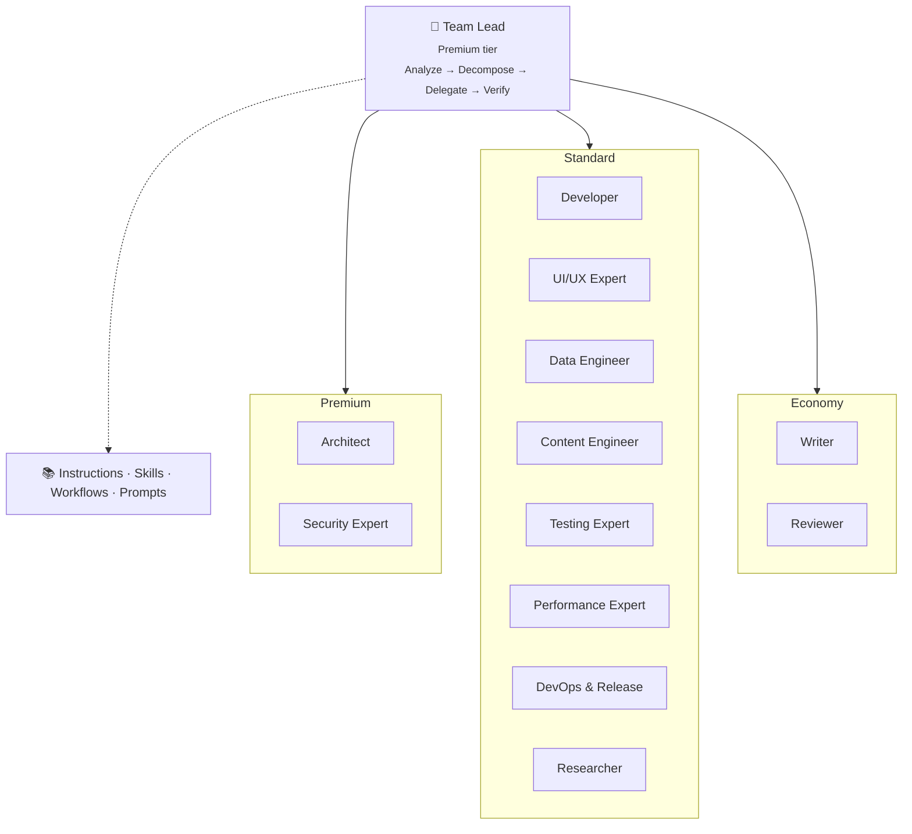
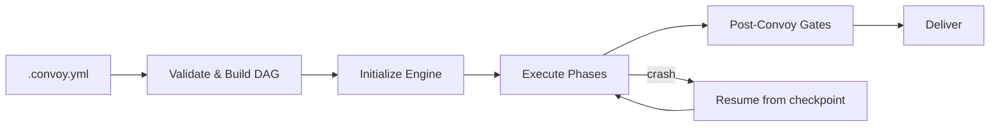

# Architecture

> Back to [README](README.md)

OpenCastle compiles one definition of your project's AI assistant setup —
instructions, agents, skills, MCP servers — into the native format of every
assistant your team uses, and reports when the generated files drift from source.

An experimental convoy engine builds on the same content to run long multi-step
work in dependency order. The compiler does not depend on it.

---

## System Overview



---

## Capability Tiers

Agents declare a tier rather than a model. Which model serves a tier is the
assistant's decision — it knows which models the account can reach, what they
cost today, and which have been retired.

| Tier | For |
|------|-----|
| Premium | Orchestration, architecture, security review — the hardest reasoning |
| Standard | Feature work, schemas, UI, tests — the bulk of the work |
| Economy | Review passes, docs, copy — high volume, low ambiguity |

Defined once in [`src/cli/tiers.ts`](src/cli/tiers.ts); agent frontmatter carries
`tier:` and a test asserts no shipped file names a model.

---

## Execution Modes

The Team Lead operates in two modes depending on task complexity:

| Mode | When | Mechanism | Parallelism |
|------|------|-----------|-------------|
| **Compact** | Score ≤2, single subtask | Inline `runSubagent` calls | Sequential |
| **Convoy** | Score 3+ or multi-task | `.convoy.yml` spec → ConvoyEngine | Parallel (DAG-based) |

**Compact mode** handles small, focused tasks synchronously within a single conversation. The Team Lead delegates to one specialist at a time, reviews the output, and moves on.

**Convoy mode** is the structured execution engine for complex, multi-step work. See [Convoy Architecture](#convoy-architecture) below.

---

## Agents

13 specialist agents, each with a defined scope, output contract, and file partition boundary.

| Agent | Domain |
|-------|--------|
| Team Lead | Orchestration — never writes code |
| Architect | Strategic architecture decisions, ADRs, system design |
| Security Expert | Auth, authorization, access policies, security headers, input validation |
| Developer | Pages, components, routing, API routes and their contracts, server logic |
| UI/UX Expert | Accessible, consistent UI components and design system |
| Data Engineer | Migrations, access policies, query performance, ETL pipelines, imports |
| Content Engineer | CMS schemas, content types, queries |
| Testing Expert | E2E tests, integration tests, browser validation |
| Performance Expert | Frontend, backend, and build performance |
| DevOps & Release | Deployments, CI/CD, cron jobs, pre-release verification, changelogs |
| Researcher | Deep codebase exploration, pattern discovery, git archaeology |
| Writer | UI copy, error messages, docs, roadmaps, meta tags, structured data |
| Reviewer | Fast validation after every delegation |

---

## Knowledge System

```
src/orchestrator/
├── agents/          # Agent definitions (.agent.md)
├── skills/          # Reusable domain expertise
├── instructions/    # Cross-cutting guidelines
├── agent-workflows/ # Multi-step workflow templates
├── prompts/         # Prompt templates
├── plugins/         # IDE marketplace plugins
└── customizations/  # Project-specific overrides
```

**Skills** are on-demand knowledge modules loaded by agents when entering a specific domain. Examples: `react-development`, `security-hardening`, `testing-workflow`, `observability-logging`.


---

## Adapters

OpenCastle generates agent definitions for multiple IDE formats via pluggable adapters:

| Adapter | IDE |
|---------|-----|
| `vscode` | GitHub Copilot (VS Code chat participants) |
| `cursor` | Cursor AI |
| `claude-code` | Claude Code |
| `opencode` | OpenCode |
| `windsurf` | Windsurf |
| `codex` | Codex CLI |
| `antigravity` | Antigravity |

Convoys can mix adapters in a single run — each task is assigned to an adapter independently.

---

## Workflow Templates

| Template | Flow |
|----------|------|
| `feature-implementation` | DB → Query → UI → Tests |
| `bug-fix` | Triage → RCA → Fix → Verify |
| `data-pipeline` | Scrape → Convert → Enrich → Import |
| `security-audit` | Scope → Automate → Review → Remediate |
| `performance-optimization` | Measure → Analyze → Optimize → Verify |
| `schema-changes` | CMS model modifications and queries |
| `database-migration` | Migrations, access policies, rollback |
| `refactoring` | Safe refactoring with behavior preservation |

---

## Quality Gates

| Gate | Method |
|------|--------|
| **Deterministic** | Lint, type-check, unit tests, build verification |
| **Fast review** | Mandatory single-reviewer sub-agent after every delegation, with automatic retry and escalation |
| **Panel review** | 3 isolated reviewer sub-agents, 2/3 majority wins (high-stakes or escalation) |
| **Structured disputes** | Formal dispute records when automated resolution is exhausted — packages both perspectives for human decision |
| **Browser testing** | Chrome DevTools MCP at project-defined responsive breakpoints |
| **Secret scan** | Post-execution scan for leaked credentials (API keys, tokens, passwords) |
| **Blast radius** | Detects risky file patterns (migrations, auth changes, RLS policies) |
| **TDD gate** | New source files must have corresponding test files |
| **No-op gate** | A task that declared `files` and produced none fails instead of reporting done |

---

## Convoy Architecture

A **convoy** is the structured execution engine for multi-agent workflows. It provides deterministic, crash-recoverable orchestration with file isolation, DAG-based scheduling, and layered validation.

### Lifecycle



1. **Spec** — A `.convoy.yml` file defines tasks, agents, file partitions, dependencies, and orchestration rules
2. **DAG validation** — Tasks form a directed acyclic graph; phase assignment is computed from dependencies
3. **Initialization** — Engine creates convoy record in SQLite (`.opencastle/convoy.db`), starts health monitor, configures event emitter
4. **Execution** — Tasks run phase-by-phase; within a phase, up to `concurrency: N` tasks run in parallel
5. **Completion** — Post-convoy gates run, convoy guard validates logs, worktrees are cleaned up
6. **Recovery** — On crash, `resume(convoyId)` replays from the last checkpoint using SQLite + NDJSON recovery

### Per-Task Execution

Each task follows this flow:

```
Check dependencies → Resolve upstream outputs → Build isolation preamble
→ Assign to adapter → Execute with timeout → Run post-execution gates
→ Validate output contract → Run review → Update status → Emit events
```

**Failure handling:**
- Max retries exceeded → Dead Letter Queue (DLQ)
- Gate failure → `gate-failed` status, optional gate retry
- No changes produced → `gate-failed` status; a clean adapter exit is not proof the work happened, so a task that declared `files` and left nothing behind is retried and then failed. Git evidence from the worktree decides it; where there is none, the agent's own `OUTPUT_CONTRACT` does. Switch it off with `defaults.built_in_gates.no_op: false`
- Review block → `review-blocked` status, can escalate to dispute
- Cascade → `on_failure: stop` skips all pending tasks; `on_failure: continue` skips only dependents

### File Isolation

Each task operates in an isolated git worktree confined to its file partition:

- Tasks declare `files: [...]` (directories or specific files)
- Engine validates no two concurrent tasks have overlapping partitions
- Post-execution scan detects partition violations
- Isolation preamble warns the agent: *"You may ONLY read and modify files within this partition"*

This enables safe parallel execution and deterministic merging of results.

### Worker Permissions

A convoy worker runs with no terminal attached, so a permission prompt is not a question it can answer — it is a refusal. Workers therefore run with edits pre-accepted (`acceptEdits`), which is the least authority that lets one do the job it was given, and matches the other CLI adapters (`codex -a never -s workspace-write`, `cursor --force`).

Set it per spec, or per run:

```yaml
defaults:
  permission_mode: bypassPermissions   # default | acceptEdits | auto | dontAsk | bypassPermissions | plan
```

```
npx opencastle convoy run --permission-mode bypassPermissions
```

`bypassPermissions` gives a worker a free hand and is a sandbox-shaped choice; `default` restores the prompt-driven behavior, which in a non-interactive run means the worker writes nothing. Isolation still comes from the per-task worktree and the `files` partition either way.

Not every runtime can express every mode, so not every adapter accepts every mode:

| Adapter | Honours | How |
|---------|---------|-----|
| `claude` | all six | passed through as `--permission-mode` |
| `codex` | all six | mapped onto the `exec -s` sandbox: `read-only`, `workspace-write`, `danger-full-access` |
| `cursor`, `opencode`, `copilot` | `acceptEdits`, `auto`, `dontAsk` | these runtimes run unattended with edits accepted and offer no read-only or wider grant |

Asking an adapter for a mode it cannot honour is refused before the run starts, naming the modes it does support. It is never accepted and ignored.

### Effort Scaling

Task complexity (Fibonacci 1–13) maps to execution profiles:

| Complexity | Tier | Timeout | Max Retries | Review Level |
|------------|------|---------|-------------|--------------|
| 1–2 | Economy | 5–10m | 1 | Auto-pass |
| 3 | Standard | 15m | 2 | Fast |
| 5 | Standard | 20m | 2 | Fast |
| 8 | Standard | 30m | 2 | Fast |
| 13 | Premium | 45m | 3 | Panel |

### Agent Expertise & Circuit Breakers

The engine tracks agent failures over the life of a convoy:

- **Circuit breaker** opens after repeated failures (default: 3), preventing new task assignment
- After cooldown, a probe task tests recovery; success closes the circuit
- Optional fallback agent handles work while the primary is in cooldown
- Breaker state is serialized to the convoy record, so it survives a resume

### Event System

46 canonical event types provide full observability:

| Category | Events |
|----------|--------|
| Convoy lifecycle | `convoy_started`, `convoy_finished`, `convoy_failed`, `convoy_guard` |
| Task lifecycle | `task_started`, `task_done`, `task_failed`, `task_skipped`, `task_retried` |
| Review & disputes | `review_verdict`, `dispute_opened`, `dlq_entry_created` |
| Safety | `secret_leak_prevented`, `drift_detected`, `merge_conflict_detected` |
| Infrastructure | `circuit_breaker_tripped`, `worker_killed` |

Events are dual-written to **SQLite** (queryable, durable) and **NDJSON** (append-only, crash-safe via `fsyncSync`). Secret scanning runs on every NDJSON write.

### Contracts & Output Validation

Each agent type has a defined output contract with required fields:

- `developer` → `files_changed[]`, `tests_added[]`, `summary`
- `security-expert` → `findings[]`, `severity`, `files_reviewed[]`, `summary`
- After task completion, output is validated against the contract schema
- Invalid output triggers a retry with a corrected prompt

### Artifacts

Tasks can write artifacts to `.opencastle/artifacts/{convoy-id}/{task-id}/`:

- Named files with metadata (type, summary, size)
- Downstream tasks can read upstream artifacts via dependency resolution
- Pruned by age as later convoys run

---

## Observability

All execution is logged to `.opencastle/logs/events.ndjson` using the `opencastle log` CLI:

| Record type | Who logs | When |
|-------------|----------|------|
| `session` | Every agent | Every session (hard gate) |
| `delegation` | Team Lead | After each delegation |
| `review` | Team Lead | After each fast review |
| `panel` | Panel runner | After each panel vote |
| `dispute` | Team Lead | After each dispute |

The [dashboard](src/dashboard/) provides a web UI for exploring convoy runs, task timelines, agent performance, and event streams.

---

## CLI

| Command | Purpose |
|---------|---------|
| *(none)* | Project status: targets, drift, and the next command to run |
| `init` | Set up the project from detected stack and existing assistant config |
| `sync` | Recompile every configured target from source |
| `add <pack>` | Adopt an integration and recompile |
| `doctor` | Diagnose configuration problems |
| `remove` | Remove OpenCastle, keeping or deleting generated files |
| `convoy` | Experimental: plan and run multi-step work |

`log` and `lesson` also exist but are invoked by agents from generated
instructions rather than by people, so they are not listed in help.
