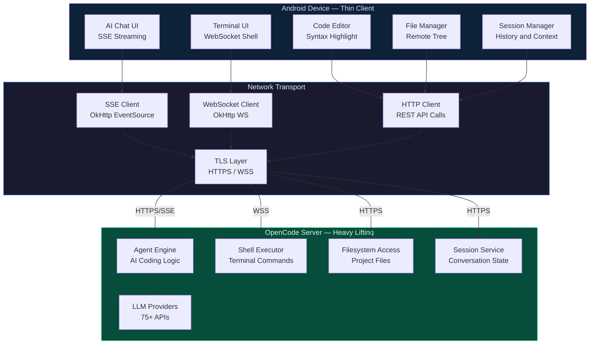
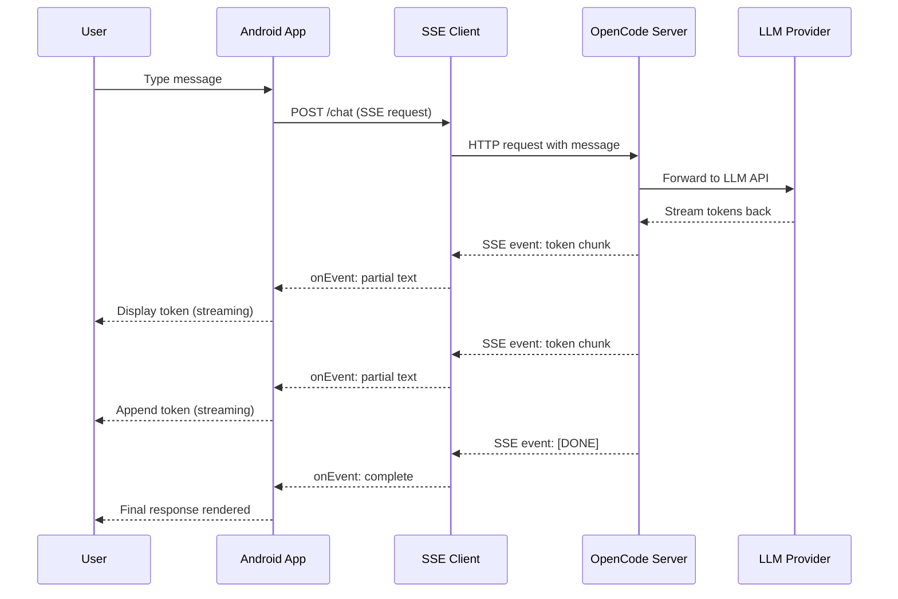
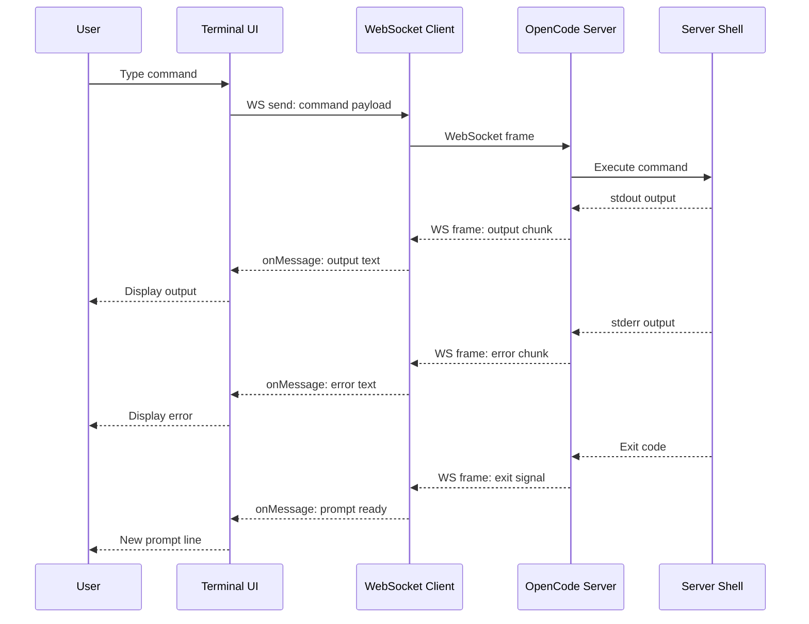
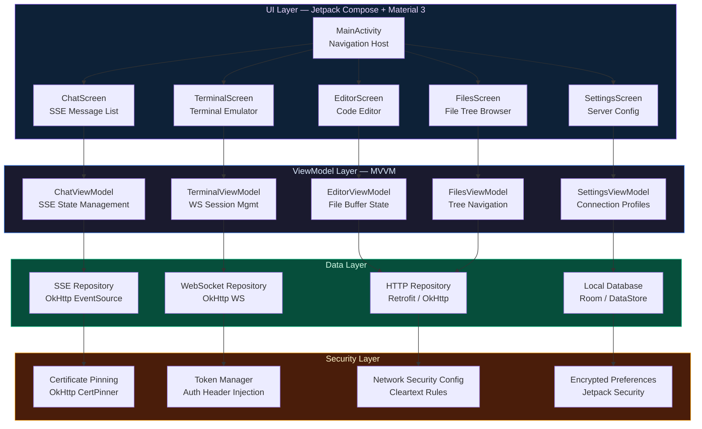

<div align="center">
  <a href="https://git.io/typing-svg">
    
  </a>
</div>

<br/>

<div align="center">

[](https://kotlinlang.org)
[](https://developer.android.com)
[](https://m3.material.io)
[](https://developer.mozilla.org/en-US/docs/Web/API/Server-sent_events)
[](LICENSE)

</div>

---

## Overview

**Opencode Android** is a native Android client for the [OpenCode](https://github.com/opencode-ai/opencode) AI coding agent. It connects to a running OpenCode server and provides real-time AI chat, terminal access, file browsing, and a code editor — all wrapped in a polished **Material Design 3 dark theme** with SSE streaming for instant AI responses and support for **75+ LLM providers** through the server.

> **Important:** This is a **client application**. It **requires a running OpenCode server** to function. It is **not** a standalone AI tool. All AI capabilities, terminal execution, and file operations are handled by the connected server.

The app transforms your Android device into a portable interface for your OpenCode-powered development environment — chat with AI about your codebase, run terminal commands, browse project files, and edit source code, all from your phone or tablet.

## Features

### AI Chat with SSE Streaming
Real-time conversations with AI through Server-Sent Events streaming. Responses appear token-by-token as they're generated, providing a fluid and responsive chat experience. Supports switching between 75+ LLM providers configured on the server.

### Terminal Access
Full terminal emulator that connects to the OpenCode server's shell. Execute commands, run build scripts, manage processes, and interact with the server's filesystem — all from your Android device. Commands execute on the **server machine**, not locally.

### Code Editor
Built-in code editor with syntax highlighting for multiple programming languages. Edit files directly on the server, save changes, and see them reflected instantly. Supports common editor features like line numbers, code folding, and search.

### File Manager
Browse and navigate the project file tree on the connected server. Open files for viewing or editing, create new files and directories, and manage your project structure — all through a clean, intuitive interface.

### Material Design 3 Dark Theme
Native Android UI built with Material Design 3 components, featuring a dark theme optimized for extended coding sessions. Dynamic color support on Android 12+ for a personalized look.

### Session Management
Multiple conversation sessions with full history and context persistence. Switch between sessions, review past conversations, and maintain separate contexts for different projects or tasks.

### Server Connection Management
Configure and manage connections to one or more OpenCode server instances. Quick-switch between servers, save connection profiles, and monitor connection status in real-time.

### Responsive Layout
Adaptive UI that works across phones, foldables, and tablets. Split-screen support for chat + editor or terminal + file browser on larger screens.

## Honest Notes

> We believe in radical transparency. Here are the important limitations and clarifications you should know before using this project.

| Topic | Reality |
|-------|---------|
| **Server Required** | This app is a **client only**. It cannot function without a running OpenCode server instance. |
| **AI Capabilities** | All AI features depend on the server's LLM provider configuration. No AI runs on the Android device. |
| **Terminal Execution** | Terminal commands execute on the **server machine**, not locally on your Android device. Be cautious with commands. |
| **File Operations** | File browsing and editing operate on the **server's filesystem**, not your phone's local storage. |
| **Network Dependency** | A stable network connection to the server is required. No offline functionality. |
| **LLM Provider Costs** | Usage costs depend on your server's LLM provider configuration. The app itself does not manage API keys or billing. |
| **Security** | Ensure your OpenCode server is properly secured. The app transmits commands and code over the network. Use HTTPS/WSS in production. |

## Visual Architecture

### Thin Client Architecture — Android App to OpenCode Server



### SSE Chat Flow — Real-Time AI Conversation



### Terminal WebSocket Flow — Remote Shell Access



### Android App Architecture — Activities, Fragments and Security



> **Maturity Note:** Opencode Android is in active development. The SSE chat flow and server connection management are the most polished features. Terminal WebSocket integration is functional. The code editor and file manager support basic operations — advanced features (multi-cursor, project-wide search) are planned. Security hardening (certificate pinning, encrypted preferences) is partially implemented and will be strengthened in future releases.

---

## Quick Start

### Prerequisites

- An **OpenCode server** running and accessible (see [opencode-ai/opencode](https://github.com/opencode-ai/opencode))
- Android device running **Android 7.0 (API 24)** or higher
- Network connectivity to the server

### Install

1. **Download** the latest APK from [Releases](https://github.com/mulkymalikuldhrs/opencode-android/releases)
2. **Enable** "Install from unknown sources" in your Android settings
3. **Install** the APK on your device
4. **Launch** the app and configure your OpenCode server URL

### Connect to Your Server

```
1. Open Opencode Android
2. Go to Settings → Server Configuration
3. Enter your OpenCode server URL (e.g., http://192.168.1.100:8080)
4. Test the connection
5. Start chatting with AI!
```

### Build from Source (Alternative)

```bash
git clone https://github.com/mulkymalikuldhrs/opencode-android.git
cd opencode-android

# Build debug APK
./gradlew assembleDebug

# Install on connected device
./gradlew installDebug

# Or build release APK
./gradlew assembleRelease
```

## Configuration

### Server Connection

| Setting | Description | Default |
|---------|-------------|---------|
| `server_url` | OpenCode server address | `http://localhost:8080` |
| `use_https` | Enable HTTPS for connections | `false` |
| `auth_token` | Authentication token (if server requires) | — |
| `connection_timeout` | Connection timeout in seconds | `30` |

### App Preferences

| Setting | Description | Default |
|---------|-------------|---------|
| `theme` | UI theme mode | `dark` |
| `font_size` | Code editor font size (sp) | `14` |
| `auto_reconnect` | Auto-reconnect on connection loss | `true` |
| `streaming_enabled` | Enable SSE streaming for chat | `true` |

### LLM Provider Selection

LLM providers are configured on the **OpenCode server side**. The app displays available providers from the server and allows you to switch between them during a chat session. Provider availability depends entirely on your server configuration.

## Project Structure

```
opencode-android/
├── app/
│   ├── src/main/
│   │   ├── java/com/opencode/android/
│   │   │   ├── ui/              # Activities, Fragments, Composables
│   │   │   ├── viewmodel/       # ViewModels for MVVM architecture
│   │   │   ├── repository/      # Data repositories
│   │   │   ├── network/         # OkHttp SSE client, WebSocket
│   │   │   ├── model/           # Data models and entities
│   │   │   └── util/            # Extensions, helpers, constants
│   │   ├── res/                 # Layouts, drawables, themes
│   │   └── AndroidManifest.xml
│   ├── build.gradle.kts
│   └── proguard-rules.pro
├── gradle/
├── build.gradle.kts
├── settings.gradle.kts
└── gradle.properties
```

## Building from Source

### Requirements

- **Android Studio** Hedgehog (2023.1.1) or newer
- **JDK 17** or higher
- **Android SDK** with API 34 target
- **Gradle 8.x** (wrapper included)

### Build Steps

```bash
# 1. Clone the repository
git clone https://github.com/mulkymalikuldhrs/opencode-android.git
cd opencode-android

# 2. Build debug variant
./gradlew assembleDebug

# 3. Build release variant (requires signing config)
./gradlew assembleRelease

# 4. Run unit tests
./gradlew test

# 5. Run Android instrumented tests
./gradlew connectedAndroidTest

# 6. Generate signed APK
./gradlew assembleRelease -Psigning.keyStorePath=/path/to/keystore
```

## Contributing

Contributions are welcome and appreciated! Here's how you can help:

### Ways to Contribute

- Bug Reports — Open an issue with steps to reproduce
- Feature Requests — Suggest new features or improvements
- Code Contributions — Submit pull requests with fixes or features
- Documentation — Help improve docs, guides, and README
- Translations — Add support for new languages

### Contribution Workflow

1. **Fork** the repository
2. Create a **feature branch** (`git checkout -b feature/amazing-feature`)
3. **Commit** your changes (`git commit -m 'Add amazing feature'`)
4. **Push** to the branch (`git push origin feature/amazing-feature`)
5. Open a **Pull Request** with a clear description of changes

### Guidelines

- Follow the existing **Kotlin coding style** and project conventions
- Write **unit tests** for new functionality
- Ensure all existing tests pass (`./gradlew test`)
- Keep PRs focused — one feature or fix per PR
- Update documentation for any changed behavior

## Disclaimer

**For Education and Research Purpose Only**

This project is provided strictly for educational and research purposes. The authors and contributors assume **no responsibility or liability** for any damages, losses, or risks arising from the use of this software.

- **We do not bear any responsibility or risk** for how this software is used
- Terminal commands execute on a **remote server** — use with caution
- Ensure your OpenCode server is **properly secured** before connecting
- All AI-generated content is the responsibility of the **server operator and LLM provider**
- This software does **not** provide AI capabilities on its own — it is a client interface

## License

This project is licensed under the **MIT License** — see the [LICENSE](LICENSE) file for details.

## Author

<div align="center">

**Mulky Malikul Dhaher**

[](https://github.com/mulkymalikuldhrs)
[](mailto:mulkymalikudhr@mail.com)

</div>

---


