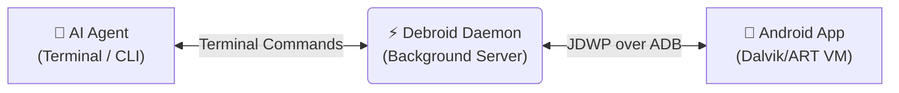

<div align="center">
  <h1>Debroid 🤖⚡</h1>
  <p><b>The Headless Android Debugger for AI Agents</b></p>

  <p>
    <a href="https://github.com/PatilShreyas/debroid/actions/workflows/ci.yml"></a>
    <a href="https://github.com/PatilShreyas/debroid/actions/workflows/release.yml"></a>
    <a href="https://github.com/PatilShreyas/debroid/blob/main/LICENSE"></a>
  </p>
</div>

**Debroid** (*DEBug + AnDROID*) is a headless CLI that speaks the Java Debug Wire protocol (JDWP) so AI agents — Claude Code, Grok Build, Codex, OpenCode, Cursor, Antigravity, or anything with a terminal — can debug a live Android app the way a human would in Android Studio: set breakpoints, catch exceptions, step through code, inspect and mutate variables, and watch fields — all without a GUI, and all through strict, machine-parseable JSON.

## ❓ Why it exists

Traditional Android development environments are highly visual. While AI coding assistants can write code, they are effectively "blind" when it comes to runtime debugging because they cannot click through the Android Studio UI to inspect memory or pause execution.

**Debroid closes this gap.** It acts as a translation layer between the raw terminal (which AI agents are great at using) and the Android Virtual Machine. By providing a CLI that outputs deterministic JSON, an AI agent can autonomously hypothesize a bug, launch the app, trap the exact line of code, read the live state of the device, and evaluate a fix — granting agents the same deep runtime awareness previously reserved for human developers.

## ✨ Features

- **🔴 Breakpoints**: Set line breakpoints in any class. Debroid automatically defers them if the class isn't loaded yet.
- **⚡ Exception Traps**: Catch caught or uncaught exceptions globally across the app.
- **👀 Watchpoints**: Monitor field access and modification live.
- **🔬 Deep Inspection**: Recursively inspect deep object memory, local variables, and call frames with built-in cycle-guards.
- **🧬 Live Mutation**: Modify variable memory dynamically on paused threads using `set-var`.
- **🧮 Live Evaluation**: Fully-featured expression evaluator supporting Java syntax, method calls, and arithmetic directly in the target VM.
- **🐾 Stepping**: Step Over, Step Into, Step Out, or Resume at will.
- **🧵 Coroutine Aware**: Built-in mechanism to extract shallow locals from Kotlin Continuation frames.

## 🚀 Installation

> [!TIP]
> **Let your AI Agent do it for you!** Copy & paste this prompt directly to your AI agent:
> ```text
> Read https://raw.githubusercontent.com/PatilShreyas/debroid/main/README.md and install the Debroid CLI and its skill globally for me.
> ```

### Prerequisites
* Java JDK 11+ (`JAVA_HOME`)
* Android SDK & `adb` configured in your `PATH`

### Install the CLI

**Option 1: Quick Install (Pre-built Release Binary)**
Run the one-liner script to download the latest release binary and install it:
```bash
curl -fsSL https://raw.githubusercontent.com/PatilShreyas/debroid/main/install.sh | bash
```

**Option 2: Local Build Install (Build from Source)**
Clone the repository and build locally:
```bash
./install.sh
```

<details>
<summary><b>🗑️ How to uninstall</b></summary>

To completely remove Debroid from your system:
1. Stop any active background daemon sessions:
   ```bash
   debroid stop
   ```
2. Remove the binary executable from your user local directory:
   ```bash
   rm ~/.local/bin/debroid
   ```
</details>

## 🧠 AI Agent Skill Setup

Debroid is designed to be operated autonomously by AI agents. To teach your agent how to use Debroid effectively, provide it with the skill instructions (`SKILL.md`).

The exact AI skill instructions are automatically extracted by the CLI to `~/.debroid/skills/debroid-cli/SKILL.md` on the first run. 

Select your AI agent below and run the provided command to create a **symbolic link** so your agent always stays up to date when you update the Debroid CLI:

<details>
<summary><b>🤖 Antigravity & Antigravity CLI</b></summary>

```bash
mkdir -p ~/.gemini/skills/debroid && ln -s ~/.debroid/skills/debroid-cli/SKILL.md ~/.gemini/skills/debroid/SKILL.md
```
</details>

<details>
<summary><b>🟧 Claude Code</b></summary>

```bash
mkdir -p ~/.claude/skills/debroid && ln -s ~/.debroid/skills/debroid-cli/SKILL.md ~/.claude/skills/debroid/SKILL.md
```
</details>

<details>
<summary><b>🖱️ Cursor</b></summary>

```bash
mkdir -p .cursor/rules && ln -s ~/.debroid/skills/debroid-cli/SKILL.md .cursor/rules/debroid.mdc
```
</details>

<details>
<summary><b>✨ Grok Build</b></summary>

```bash
mkdir -p ~/.grok/skills/debroid && ln -s ~/.debroid/skills/debroid-cli/SKILL.md ~/.grok/skills/debroid/SKILL.md
```
</details>

<details>
<summary><b>🔓 OpenCode</b></summary>

```bash
mkdir -p ~/.config/opencode/skills/debroid && ln -s ~/.debroid/skills/debroid-cli/SKILL.md ~/.config/opencode/skills/debroid/SKILL.md
```
</details>

<details>
<summary><b>💻 Codex</b></summary>

```bash
mkdir -p ~/.codex/skills/debroid && ln -s ~/.debroid/skills/debroid-cli/SKILL.md ~/.codex/skills/debroid/SKILL.md
```
</details>

## 🔌 How it Works

Debroid separates the persistent debugging connection from the transient CLI commands to maintain state across agent invocations.



1. **The AI Agent** runs `debroid` commands in the terminal (e.g. `debroid break ...`).
2. **The Debroid CLI** forwards these requests to the **Debroid Daemon**, which starts automatically in the background on the first command.
3. **The Debroid Daemon** holds the long-lived JDWP socket connection open via ADB port forwarding, managing the breakpoints, event queue, and thread states of the **Android App**.
4. The Daemon returns the result back to the CLI as a strict JSON payload, which the Agent reads from standard output.

## 📖 Command Reference

Here is the full list of commands and their signatures (note: all commands support global options `-p, --port <int>` / `DEBROID_PORT` environment variable, `--version`, and `-h, --help`; all JSON commands accept an optional `--pretty` flag to format response JSON, and an eager `--schema` flag to inspect output types):
| Command | Signature | Description |
| :--- | :--- | :--- |
| `daemon` | `debroid daemon` | Starts the persistent background daemon |
| `stop` | `debroid stop [--pretty]` | Shuts down background daemon and detaches all active sessions |
| `launch` | `debroid launch <app_id> [--suspend/--no-suspend] [--pretty]` | Launches app suspended and attaches (auto-clears set-debug-app on detach) |
| `attach` | `debroid attach <app_id> [--suspend] [--pretty]` | Attaches to a running app |
| `detach` | `debroid detach <session_id> [--pretty]` | Safely detaches debugger; for `launch` sessions also clears `am set-debug-app` |
| `break` | `debroid break <session_id> <file> <line> [-p/--package=<pkg>] [--pretty]` | Sets a line breakpoint (auto-defers if class isn't loaded yet) |
| `remove-break` | `debroid remove-break <session_id> <breakpoint_id> [--pretty]` | Removes a line breakpoint |
| `catch-exception` | `debroid catch-exception <session_id> [class_name] [--caught] [--uncaught] [--pretty]` | Sets an exception breakpoint (default: `--uncaught` only) |
| `remove-catch-exception` | `debroid remove-catch-exception <session_id> <exception_breakpoint_id> [--pretty]` | Removes an exception breakpoint |
| `watch` | `debroid watch <session_id> <class_name> <field_name> [--access] [--modify] [--pretty]` | Sets a field watchpoint (default: access+modify) |
| `remove-watch` | `debroid remove-watch <session_id> <watchpoint_id> [--pretty]` | Removes a watchpoint |
| `points` | `debroid points <session_id> [--pretty]` | Lists all active and deferred breakpoints, exception points, and watchpoints for the session |
| `threads` | `debroid threads <session_id> [--pretty]` | Lists active threads |
| `locals` | `debroid locals <session_id> <thread_id> [--pretty]` | Gets shallow local variables and method parameters |
| `pause-state` | `debroid pause-state <session_id> <thread_id> [--pretty]` | Gets frames, locals (including method parameters), and instance state |
| `set-var` | `debroid set-var <session_id> <thread_id> <var_name> <new_value> [--pretty]` | Mutates local variable |
| `eval` | `debroid eval <session_id> <thread_id> <expression...> [--pretty]` | Evaluates string expression |
| `resume` | `debroid resume <session_id> [--pretty]` | Resumes all threads |
| `poll` | `debroid poll <session_id> [cursor=0] [--with-stacktrace] [--pretty]` | Polls for asynchronous debugger events |
| `frames` | `debroid frames <session_id> <thread_id> [--pretty]` | Retrieves thread stack frames |
| `coroutine` | `debroid coroutine <session_id> <continuation_id> [--pretty]` | Retrieves locals from a Continuation object |
| `inspect` | `debroid inspect <session_id> <object_id> [-d/--max-depth=<int>] [--include-static] [--include-internal] [--pretty]` | Inspects object fields. Filters out static/synthetic noise by default. |
| `step` | `debroid step <session_id> <thread_id> <action> [--pretty]` | Steps execution (`STEP_OVER`, `STEP_INTO`, `STEP_OUT`, `RESUME_THREAD`, `RESUME_ALL`) |
| `update` | `debroid update [--check-only] [--pretty]` | Checks for CLI updates or performs an in-place self-update to the latest release |

> **Daemon Logs:** When the background daemon is automatically spawned by CLI commands, stdout and stderr logs are recorded in `~/.debroid/daemon.log` for troubleshooting and startup diagnostics.
>
> **Security Note:** The Debroid daemon listens on `localhost` (127.0.0.1) without authentication to enable fast communication with the CLI. It exposes live JVM manipulation. Only run Debroid on a machine where every local user is fully trusted.

## 🤝 Contributing

We welcome contributions! If you're building an AI agent or improving the underlying JDI wrappers, please see `AGENTS.md` for architectural guidelines and rules for maintaining the strict JSON CLI contract.

If Debroid saves your agent from a debugging dead end, consider giving the repo a ⭐ - it helps others find it :)

## 📄 License

This project is licensed under the [Apache 2.0 License](LICENSE).
