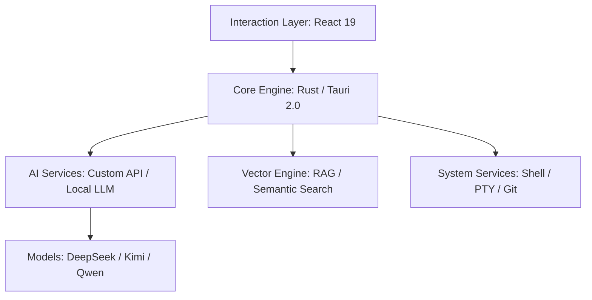

# 若爱 (IfAI) — AI Agent 编排助手 & 代码编辑器 🚀

<div align="center">
  
  <p><strong>不只是编辑器，更是你的 AI Agent 编排助手</strong></p>
  <p>9+ 智能体协同 · DAG 工作流驱动 · 基于 Tauri 2.0 + React 19 的 AI 原生开发平台</p>


  [简体中文](README.md) | [English](README_EN.md) | [Русский](README_RU.md) | [📖 完整文档](https://docs.ifai.today/) | [🎯 下载发布页](https://github.com/peterfei/ifai/releases)

  [](https://github.com/peterfei/ifai/releases)
  [](LICENSE)
  [](https://tauri.app/)
  [](https://ai-native.dev)
  [](#performance)
</div>

---

## 💡 为什么选择 IfAI?

在 AI 时代，编辑器不应只是代码的容器，而应是 AI 的躯体。IfAI 采用 **AI 原生 (AI-Native)** 架构，将推理能力深度植入内核，并提供完整的 **AI Agent 编排** 能力。

*   **🤖 AI Agent 编排**：9+ 专用 Agent 通过 DAG 工作流协同工作，YAML 声明式编排，自然语言一键触发。
*   **⚡ 极致性能**：Rust 内核驱动，120 FPS 满帧渲染，即使在万级数据负载下依然丝滑。
*   **🛡️ 隐私与本地优先**：支持 Qwen2.5 等端侧模型，敏感代码不出本地，混合路由自动切换。
*   **🐚 自主 Agent 进化**：不止于对话，Agent 具备 Shell 级操控权，自动配置环境、执行任务、自我纠错。
*   **📑 规范驱动 (OpenSpec)**：深度融合 OpenSpec 协议，确保 AI 遵循工业级设计规范。

---

## ✨ 核心特性

### 🎯 AI Agent 编排引擎
*   **9+ 专用 Agent**：Explore / Review / Refactor / Test / Doc / Plan / ReAct / Git Commit / Debug，各司其职
*   **DAG 工作流引擎**：YAML 声明式工作流定义，拓扑排序调度，支持顺序与并行执行
*   **Agent 协作框架**：并行调用 (`call_agent_parallel`)、知识共享 (`share_knowledge`)、结果聚合 (`aggregate_results`)
*   **声明式意图路由**：O(1) 查表路由，自然语言自动匹配最佳 Agent（说"重构代码" → 自动路由到 Refactor Agent）
*   **Agent 链式调用**：Agent 可调用其他 Agent，最大深度 5 层，形成复杂推理链
*   **工作流可视化**：React Flow + Dagre 自动布局，实时监控工作流节点执行状态
*   **自然语言触发**：用自然语言描述任务，自动匹配并触发对应工作流
*   **Shell 级掌控**：Agent 可执行 `npm`、`git`、`cargo` 等命令，自主完成依赖安装与环境自愈
*   **结构化任务拆解**：自动将模糊需求转化为可视化的 Task Tree，支持进度实时追踪

### 🤖 Composer 2.0 - AI 多文件编辑引擎
*   **并行编辑**：AI 可同时修改多个文件，自动检测冲突并智能合并。
*   **精细控制**：支持逐个接受/拒绝修改，实时 Diff 预览。
*   **一键回滚**：不满意？一键撤销 AI 的所有修改。
*   **文件动态刷新**：accept/reject 后编辑器自动更新，无需手动刷新。

### 🧠 RAG 符号感知 - 代码结构理解
*   **符号级理解**：不只是文本匹配，AI 真正理解 Trait、类、函数等符号关系。
*   **跨文件关联**：自动分析 `use`、`import`、`impl` 等跨文件依赖。
*   **精准回答**：提问"这个 Trait 有哪些实现？"，AI 精准列出所有实现类及文件路径。
*   **区分真伪**：智能区分真实代码和注释中的示例，不会被误导。

### ⌨️ 命令栏 - 专业级命令执行
*   **实时搜索**：输入即时匹配，毫秒级响应预览。
*   **键盘导航**：完整键盘支持，↑↓ 选择，Enter 执行，Esc 关闭。
*   **视图分割**：命令栏 + 主界面并行显示，不影响当前工作。
*   **商业版集成**：深度集成商业版命令和功能。

### 🔍 检索增强 (Next-Gen RAG)
*   **多维度混合检索**：结合关键词与语义向量，毫秒级定位全项目代码上下文。
*   **项目隔离架构**：强制索引重置机制，确保多项目切换时上下文绝对纯净。
*   **符号感知引擎**：基于 tree-sitter 的 AST 分析，精准提取代码符号和关系。

### 🎨 现代化开发体验
*   **专业 Markdown 支持**：实时预览引擎，支持分屏、全屏多种文档写作模式。
*   **代码片段管理**：Snippet Manager 支持万级数据量，配合 Fill-In-the-Middle 智能补全。
*   **Token 成本看板**：实时计量消耗，详细分解输入/输出 Token，成本尽在掌握。

---


---

## 📊 性能表现 (Performance)

*   **海量列表滚动**：10,000+ 条记录，稳定保持 **120 FPS**，批量插入仅需 **1003ms**。
*   **渲染零延迟**：高频流式输出场景，UI 响应延迟 **< 15ms**，CPU 占用降低 **30%**。
*   **秒级环境感知**：路径校准与环境检测耗时 **< 1ms**，成功率 **100%**。
*   **Agent 探索加速**：Explore Agent 性能优化，GUI 模式从 79s 降至 **13s**（6 倍提升）。

---

## 📦 快速开始

### 1. 环境准备
确保已安装 Node.js >= 18 和 Rust >= 1.80。

### 2. 快速启动
```bash
git clone https://github.com/peterfei/ifai.git
cd ifai
npm install
npm run tauri dev
```

### 3. 构建发布
```bash
npm run build:community  # 构建前端
npm run tauri:community  # 构建 Tauri 应用
```

---

## 🛠 技术架构



---

## 🚀 发展里程碑

| 版本 | 主题 | 核心突破 |
| :--- | :--- | :--- |
| **v0.5.3** | StreamingCodeCard 流式预览 + 文件编码切换 | StreamingCodeCard 流式文件写入实时预览、声明式 ToolApprovalRegistry（消除 8 处硬编码）、文件编码选择器（10 种编码）、原生 TextDecoder 替代 iconv-lite |
| **v0.5.2** | GUI 对话模式 + 线程管理 + Agent 协作 | 声明式 DSL 架构（24 DSL 表 + 双注册表）、线程管理（MessageQueue + 5 维度活动检测）、Agent 协作框架、YAML DAG 工作流 |
| **v0.5.1** | Agent 协作编排 + 会话持久化 | 元编程协作基础设施、Agent 互调用 + 并行调用、JSONL append-only 日志、会话恢复 |
| **v0.5.0** | 多智能体系统成型 + 意图路由 | 9 个专用 Agent、声明式意图路由、TUI Markdown 渲染引擎 |
| **v0.4.8** | 自主会话飞跃 + 元编程 | 100% 信任模型、工具限制 100→1000、#[derive(Tool)] 元编程、Explore 6 倍性能提升 |
| **v0.4.7** | 持久化记忆系统 | 零依赖 Markdown 两层记忆（热记忆 + 冷记忆）、MemorySave 工具、LLM 批量提取 |
| **v0.4.6** | 多线程并发对话 & TUI 重构 | Per-Thread Session 隔离、/thread 斜杠命令、TUI God Object 重构 |
| **v0.4.4** | CLI 工业级升级 | 元数据驱动 CLI、元编程权限引擎、Token 成本追踪、ratatui 全屏 TUI |
| **v0.4.3** | 元数据驱动架构 & 国际化 | YAML Provider 架构、5 家提供商 80+ 模型、三语言全覆盖 |
| **v0.4.1** | 多智能体协作系统 | DAG 工作流引擎、智能体通信协议、消息队列系统、协作可视化 |
| **v0.4.0** | 提示词生态 & 多智能体 | 提示词管理系统、多智能体系统（社区版解锁）、10+ 工具 |
| **v0.3.12** | 事件驱动架构 | ChatEventBus 全局事件总线、ContentSegmentManager 流式秩序 |
| **v0.3.9** | 物理探测引擎 | Symbol-First 探测引擎、IndexedDB 全量迁移、NVIDIA NIM 集成 |
| **v0.2.6** | Agent 进化 | Shell 能力解锁、结构化任务树、120 FPS 高刷渲染 |
| **v0.2.0** | 性能基石 | 混合智能架构、GPU 硬件加速、零闪屏流式交互 |

<details>
<summary><b>📖 查看各版本详细更新日志</b></summary>

### v0.5.3：StreamingCodeCard 流式预览 + 文件编码切换

**一、StreamingCodeCard 流式文件写入预览 📝**
- 实时代码显示 — AI 写入文件时即时渲染代码内容，无需等待完成
- 动态审批按钮 — 流式进行中隐藏，内容完整后显示
- ToolApprovalRegistry 动态化 — 声明式配置驱动工具匹配，消除 8 处硬编码
- Composer Diff 集成 — 一键切换到差异视图
- ReadOnly 多层防御 — 只读工具不显示审批卡片

**二、文件编码切换 🌐**
- EncodingPicker — Statusbar 右下角，10 种编码自由切换
- 原生 TextDecoder 替代 iconv-lite — 完全消除 Node.js Buffer 依赖
- Delphi 文件自动识别 CP936 编码（.pas/.dpr/.dpk/.dfm/.fmx/.inc）
- 19 个新增测试用例，全部通过

### v0.5.2：全新 GUI 对话模式 + 线程管理系统 + Agent 协作框架

**一、全新 GUI 对话模式 💬**（v0.5.2 最大亮点）
- 三栏布局 — 左侧对话列表 + 中间 AI 聊天 + 右侧详情面板（工作日志 / 产出物 / 预览）
- 多线程并发对话 — 支持同时打开多个对话线程，各线程流式响应互不干扰
- 线程快捷操作 — Ctrl+T 新建 / Ctrl+Tab 切换 / F2 重命名 / 右键归档删除
- 未读红点 — 后台线程收到新消息自动标记，切回时清除
- 拖拽调整布局 — 左右两栏宽度可自由拖拽（150-600px），支持一键折叠
- 持久化恢复 — 所有线程消息自动保存 IndexedDB，重启后完整恢复

**二、声明式 DSL 驱动架构 🏛️**
- 双注册表架构 — `layoutRegistry` + `componentRegistry`，零 if-else 分支渲染
- 24 个声明式 DSL 表 — 所有 UI 行为通过查表驱动
- 交互式卡片管线 — 10 种消息卡片类型运行时注册

**三、线程管理系统 🧵**
- 双队列 MessageQueue — 线程感知并发，同线程串行 + 跨线程并发
- 5 维度活动检测 — stream/per-thread/agent/tool/workflow 全部监控
- 跨线程事件路由 — workflow 全链路事件跨线程路由

**四、Agent 协作框架 🤖**
- `call_agent_parallel` — 并行调用多个 Agent 同时执行独立任务
- `share_knowledge` + `aggregate_results` — 结果共享与聚合
- 自动协作 — Agent 自动调用专用 Agent（最大深度 5 层）

**五、GUI 功能增强 🎨**
- Skills Hub 技能广场、智能体动画系统（7 Agent × 6 动画 × 4 级降级）
- 文件授权系统、内置浏览器预览

### v0.5.0：多智能体系统成型 + 意图路由 + TUI Markdown 渲染引擎

**9 个专用 Agent 全面上线**
- Refactor / Git Commit / Plan / ReAct / Review / Test / Doc / Debug / Explore
- Git Commit Agent：5 层安全设计（Pre-flight / Ghost Snapshot / Secret 扫描 / Commit Attribution / 禁止列表）
- ReAct Agent：显式 Thought → Action → Observation 循环，含反思机制

**声明式意图路由系统**
- O(1) 查表路由，新增 Agent 只需添加一条路由规则

### v0.4.8：自主会话飞跃 + 元编程架构 + 6 倍性能提升

- 100% 信任模型，工具调用限制从 100 → 1000（10 倍提升）
- 博查 AI 集成（三层防护 + LRU 缓存）
- `#[derive(Tool)]` 元编程，零样板代码
- Explore Agent 性能从 79s → 13s（6 倍提升，83.7%）

### v0.4.7：持久化记忆系统

- 零依赖纯 Markdown 两层记忆（热记忆注入 system prompt + 冷记忆会话归档）
- MemorySave 工具，AI 主动保存，18μs 注入延迟
- LLM 驱动智能记忆提取

### v0.4.6：多线程并发对话系统 & TUI 架构重构

- Per-Thread Session 隔离，Arc&lt;Mutex&gt; 三阶段锁策略
- TUI God Object 重构 Phase 1-4（App 27 → 14 字段）
- 862 测试用例全部通过

### v0.4.4：CLI 全面升级 — 工业级终端 AI 助手

- 元数据驱动 CLI 架构 + 元编程权限引擎
- Token 系统与成本追踪、TOML 配置
- ratatui 全屏 TUI、REPL 命令系统

### v0.4.1：多智能体协作系统与消息稳定性

- ~7,130 行代码，79 个测试用例
- Rust 后端 DAG 工作流引擎
- 双队列 + 优先级调度消息队列系统

</details>

<p align="right"><i>更完整的历史记录请查看 <a href="CHANGELOG.md">CHANGELOG.md</a></i></p>

---

## 🤝 参与贡献

IfAI 处于高速成长期，我们欢迎任何形式的贡献！无论是 Bug 修复、特性建议还是文档改进。

- **反馈问题**: [GitHub Issues](https://github.com/peterfei/ifai/issues)
- **加入讨论**: [GitHub Discussions](https://github.com/peterfei/ifai/discussions)

---

<div align="center">
  <p><strong>Made with ❤️ by peterfei</strong></p>
  <p>如果 IfAI 帮助到了你，请点个 ⭐️ 支持我！</p>
</div>
