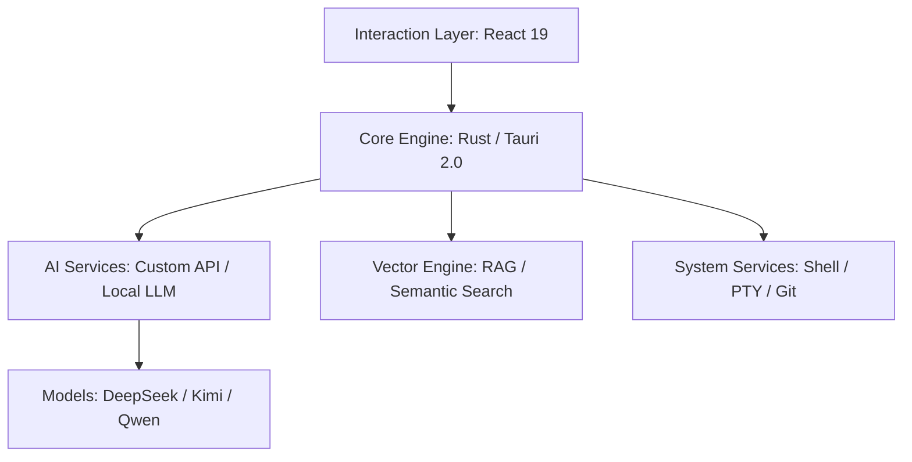

# IfAI — AI Agent Orchestrator & Code Editor 🚀

<div align="center">
  
  <p><strong>More than an editor, your AI Agent orchestration assistant</strong></p>
  <p>9+ Agents in collaboration · DAG workflow-driven · AI-native development platform built with Tauri 2.0 + React 19</p>

  [简体中文](README.md) | [English](README_EN.md) | [Русский](README_RU.md) | [📖 Full Docs](https://docs.ifai.today/) | [🎯 Downloads](https://github.com/peterfei/ifai/releases)

  [](https://github.com/peterfei/ifai/releases)
  [](LICENSE)
  [](https://tauri.app/)
  [](https://ai-native.dev)
  [](#performance)
</div>

---

## 💡 Why Choose IfAI?

In the AI era, an editor should not just be a container for code — it should be the body of AI. IfAI adopts an **AI-Native** architecture, embedding reasoning capabilities deep into the kernel and providing a complete **AI Agent orchestration** system.

*   **🤖 AI Agent Orchestration**: 9+ specialized Agents collaborate through DAG workflows with YAML declarative orchestration, triggered by natural language in one click.
*   **⚡ Extreme Performance**: Rust-powered kernel, 120 FPS full-frame rendering, silky smooth even under tens of thousands of data records.
*   **🛡️ Privacy & Local-First**: Supports on-device models like Qwen2.5, keeping sensitive code local. Hybrid routing with automatic switching.
*   **🐚 Autonomous Agent Evolution**: Beyond conversation, Agents possess shell-level control — automatically configuring environments, executing tasks, and self-correcting.
*   **📑 Spec-Driven (OpenSpec)**: Deep integration with the OpenSpec protocol, ensuring AI follows industrial-grade design specifications.

---

## ✨ Core Features

### 🎯 AI Agent Orchestration Engine
*   **9+ Specialized Agents**: Explore / Review / Refactor / Test / Doc / Plan / ReAct / Git Commit / Debug — each with a dedicated role
*   **DAG Workflow Engine**: YAML declarative workflow definitions with topological sort scheduling, supporting sequential and parallel execution
*   **Agent Collaboration Framework**: Parallel invocation (`call_agent_parallel`), knowledge sharing (`share_knowledge`), and result aggregation (`aggregate_results`)
*   **Declarative Intent Routing**: O(1) lookup table routing with automatic natural language matching to the best Agent (say "refactor code" → automatically routes to the Refactor Agent)
*   **Agent Chained Calls**: Agents can invoke other Agents with a max depth of 5 levels, forming complex reasoning chains
*   **Workflow Visualization**: React Flow + Dagre auto-layout with real-time monitoring of workflow node execution status
*   **Natural Language Triggering**: Describe tasks in natural language and the corresponding workflow is automatically matched and triggered
*   **Shell-Level Control**: Agents can execute commands like `npm`, `git`, `cargo`, autonomously completing dependency installation and environment self-healing
*   **Structured Task Decomposition**: Automatically transforms vague requirements into visualizable Task Trees with real-time progress tracking

### 🤖 Composer 2.0 - AI Multi-File Editing Engine
*   **Parallel Editing**: AI can modify multiple files simultaneously, with automatic conflict detection and intelligent merging.
*   **Fine-Grained Control**: Accept/reject changes one by one with real-time diff preview.
*   **One-Click Rollback**: Not satisfied? Revert all AI changes in one click.
*   **Dynamic File Refresh**: The editor automatically updates after accept/reject — no manual refresh needed.

### 🧠 RAG Symbol-Aware - Code Structure Understanding
*   **Symbol-Level Understanding**: Beyond text matching — AI truly understands the relationships between Traits, classes, functions, and other symbols.
*   **Cross-File Association**: Automatically analyzes cross-file dependencies like `use`, `import`, and `impl`.
*   **Precise Answers**: Ask "What are the implementations of this Trait?" and AI accurately lists all implementation classes and file paths.
*   **Distinguishing Real from Fake**: Intelligently distinguishes real code from examples in comments, never misled by noise.

### ⌨️ Command Palette - Professional-Grade Command Execution
*   **Real-Time Search**: Instant matching on input with millisecond-level response preview.
*   **Keyboard Navigation**: Full keyboard support — Up/Down to select, Enter to execute, Esc to close.
*   **Split View**: Command palette and main interface displayed side by side without disrupting your current work.
*   **Commercial Integration**: Deep integration with commercial edition commands and features.

### 🔍 Next-Gen RAG (Retrieval-Augmented Generation)
*   **Multi-Dimensional Hybrid Retrieval**: Combines keyword and semantic vector search for millisecond-level code context localization across the entire project.
*   **Project Isolation Architecture**: Mandatory index reset mechanism ensuring absolutely clean context when switching between projects.
*   **Symbol-Aware Engine**: tree-sitter based AST analysis for precise extraction of code symbols and relationships.

### 🎨 Modern Development Experience
*   **Professional Markdown Support**: Real-time preview engine with split-screen and full-screen modes for document writing.
*   **Snippet Management**: Snippet Manager supporting tens of thousands of entries, paired with Fill-In-the-Middle intelligent completion.
*   **Token Cost Dashboard**: Real-time consumption measurement with detailed input/output token breakdown — costs fully under control.

---


---

## 📊 Performance

*   **Massive List Scrolling**: 10,000+ records, stable **120 FPS**, batch insertion in only **1003ms**.
*   **Zero-Latency Rendering**: Under high-frequency streaming output, UI response latency **< 15ms**, CPU usage reduced by **30%**.
*   **Sub-Second Environment Awareness**: Path calibration and environment detection in **< 1ms**, success rate **100%**.
*   **Agent Exploration Acceleration**: Explore Agent performance optimized from 79s down to **13s** (6x improvement).

---

## 📦 Quick Start

### 1. Prerequisites
Ensure Node.js >= 18 and Rust >= 1.80 are installed.

### 2. Quick Launch
```bash
git clone https://github.com/peterfei/ifai.git
cd ifai
npm install
npm run tauri dev
```

### 3. Build for Release
```bash
npm run build:community  # Build frontend
npm run tauri:community  # Build Tauri application
```

---

## 🛠 Technical Architecture



---

## 🚀 Development Milestones

| Version | Theme | Key Breakthroughs |
| :--- | :--- | :--- |
| **v0.5.2** | GUI Chat Mode + Thread Management + Agent Collaboration | Declarative DSL architecture (24 DSL tables + dual registry), Thread management (MessageQueue + 5-dimensional activity detection), Agent collaboration framework, YAML DAG workflows |
| **v0.5.1** | Agent Collaborative Orchestration + Session Persistence | Metaprogramming collaboration infrastructure, Agent inter-call + parallel invocation, JSONL append-only logging, Session recovery |
| **v0.5.0** | Multi-Agent System Maturation + Intent Routing | 9 specialized Agents, Declarative intent routing, TUI Markdown rendering engine |
| **v0.4.8** | Autonomous Session Leap + Metaprogramming | 100% trust model, tool limit 100→1000, `#[derive(Tool)]` metaprogramming, Explore 6x performance improvement |
| **v0.4.7** | Persistent Memory System | Zero-dependency Markdown two-layer memory (hot memory + cold memory), MemorySave tool, LLM batch extraction |
| **v0.4.6** | Multi-Thread Concurrent Chat & TUI Refactor | Per-Thread Session isolation, `/thread` slash commands, TUI God Object refactoring |
| **v0.4.4** | CLI Industrial-Grade Upgrade | Metadata-driven CLI, metaprogramming permission engine, Token cost tracking, ratatui fullscreen TUI |
| **v0.4.3** | Metadata-Driven Architecture & Internationalization | YAML Provider architecture, 5 providers 80+ models, full trilingual coverage |
| **v0.4.1** | Multi-Agent Collaboration System | DAG workflow engine, Agent communication protocol, message queue system, collaboration visualization |
| **v0.4.0** | Prompt Ecosystem & Multi-Agent | Prompt management system, multi-agent system (community edition unlock), 10+ tools |
| **v0.3.12** | Event-Driven Architecture | ChatEventBus global event bus, ContentSegmentManager streaming order |
| **v0.3.9** | Physical Exploration Engine | Symbol-First exploration engine, full IndexedDB migration, NVIDIA NIM integration |
| **v0.2.6** | Agent Evolution | Shell capability unlock, structured task tree, 120 FPS high-refresh rendering |
| **v0.2.0** | Performance Foundation | Hybrid intelligence architecture, GPU hardware acceleration, zero-flicker streaming interaction |

<details>
<summary><b>📖 View detailed changelog for each version</b></summary>

### v0.5.2: All-New GUI Chat Mode + Thread Management System + Agent Collaboration Framework

**I. All-New GUI Chat Mode** (Biggest highlight of v0.5.2)
- Three-column layout — Left: conversation list + Center: AI chat + Right: detail panel (work log / artifacts / preview)
- Multi-thread concurrent conversations — Support opening multiple conversation threads simultaneously, each with independent streaming responses
- Thread shortcuts — Ctrl+T to create / Ctrl+Tab to switch / F2 to rename / Right-click to archive or delete
- Unread indicators — Background threads automatically mark new messages, cleared when switching back
- Draggable layout — Left and right column widths freely adjustable (150-600px), with one-click collapse
- Persistent recovery — All thread messages auto-saved to IndexedDB, fully restored on restart

**II. Declarative DSL-Driven Architecture**
- Dual registry architecture — `layoutRegistry` + `componentRegistry`, zero if-else branch rendering
- 24 declarative DSL tables — All UI behaviors driven by table lookup
- Interactive card pipeline — 10 message card types registered at runtime

**III. Thread Management System**
- Dual-queue MessageQueue — Thread-aware concurrency, serial within same thread + concurrent across threads
- 5-dimensional activity detection — stream / per-thread / agent / tool / workflow all monitored
- Cross-thread event routing — Full-chain workflow events routed across threads

**IV. Agent Collaboration Framework**
- `call_agent_parallel` — Parallel invocation of multiple Agents for independent tasks
- `share_knowledge` + `aggregate_results` — Result sharing and aggregation
- Automatic collaboration — Agents automatically call specialized Agents (max depth 5 levels)

**V. GUI Feature Enhancements**
- Skills Hub, Agent animation system (7 Agents x 6 animations x 4-level degradation)
- File authorization system, built-in browser preview

### v0.5.0: Multi-Agent System Maturation + Intent Routing + TUI Markdown Rendering Engine

**9 Specialized Agents Fully Online**
- Refactor / Git Commit / Plan / ReAct / Review / Test / Doc / Debug / Explore
- Git Commit Agent: 5-layer security design (Pre-flight / Ghost Snapshot / Secret Scan / Commit Attribution / Blocklist)
- ReAct Agent: Explicit Thought -> Action -> Observation loop with reflection mechanism

**Declarative Intent Routing System**
- O(1) lookup table routing — adding a new Agent only requires one routing rule

### v0.4.8: Autonomous Session Leap + Metaprogramming Architecture + 6x Performance Improvement

- 100% trust model, tool call limit increased from 100 to 1000 (10x improvement)
- Bocha AI integration (three-layer protection + LRU cache)
- `#[derive(Tool)]` metaprogramming, zero boilerplate code
- Explore Agent performance from 79s to 13s (6x improvement, 83.7%)

### v0.4.7: Persistent Memory System

- Zero-dependency pure Markdown two-layer memory (hot memory injected into system prompt + cold memory session archive)
- MemorySave tool, AI-initiated saving, 18us injection latency
- LLM-driven intelligent memory extraction

### v0.4.6: Multi-Thread Concurrent Chat System & TUI Architecture Refactoring

- Per-Thread Session isolation, Arc&lt;Mutex&gt; three-phase lock strategy
- TUI God Object refactoring Phase 1-4 (App 27 to 14 fields)
- 862 test cases all passing

### v0.4.4: CLI Comprehensive Upgrade — Industrial-Grade Terminal AI Assistant

- Metadata-driven CLI architecture + metaprogramming permission engine
- Token system and cost tracking, TOML configuration
- ratatui fullscreen TUI, REPL command system

### v0.4.1: Multi-Agent Collaboration System & Message Stability

- ~7,130 lines of code, 79 test cases
- Rust backend DAG workflow engine
- Dual-queue + priority-scheduled message queue system

</details>

<p align="right"><i>For the full history, see <a href="CHANGELOG.md">CHANGELOG.md</a></i></p>

---

## 🤝 Contributing

IfAI is growing fast, and we welcome contributions of all kinds! Whether it's bug fixes, feature suggestions, or documentation improvements.

- **Report Issues**: [GitHub Issues](https://github.com/peterfei/ifai/issues)
- **Join Discussions**: [GitHub Discussions](https://github.com/peterfei/ifai/discussions)

---

<div align="center">
  <p><strong>Made with ❤️ by peterfei</strong></p>
  <p>If IfAI has helped you, please give it a ⭐️ to support the project!</p>
</div>
