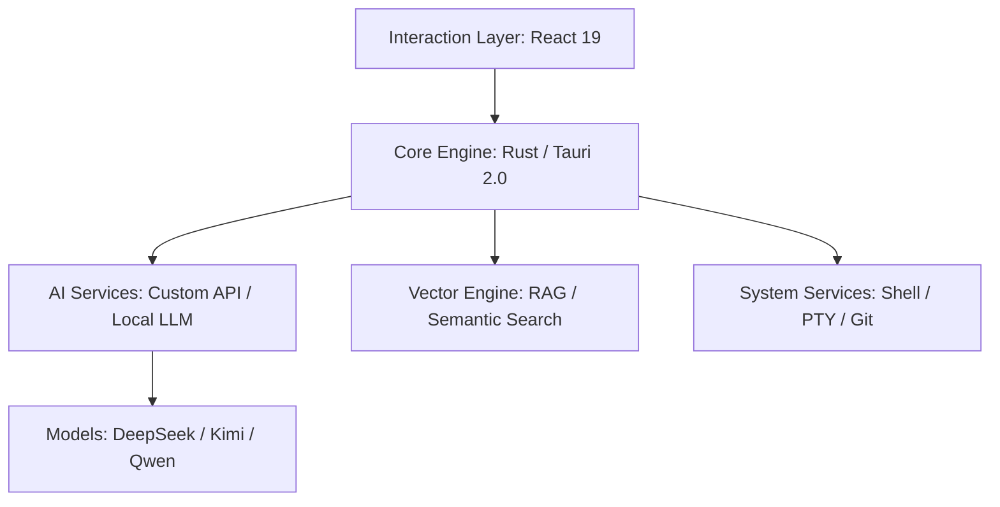

# IfAI — AI Агент-Оркестратор & Редактор кода 🚀

<div align="center">
  
  <p><strong>Больше чем редактор, ваш AI ассистент оркестрации агентов</strong></p>
  <p>9+ Агентов в сотрудничестве · DAG-воркфлоу · AI-Native платформа разработки на Tauri 2.0 + React 19</p>

  [简体中文](README.md) | [English](README_EN.md) | [Русский](README_RU.md) | [📖 Полная документация](https://docs.ifai.today/) | [🎯 Релизы](https://github.com/peterfei/ifai/releases)

  [](https://github.com/peterfei/ifai/releases)
  [](LICENSE)
  [](https://tauri.app/)
  [](https://ai-native.dev)
  [](#performance)
</div>

---

## 💡 Почему выбирают IfAI?

В эпоху AI редактор не должен быть просто контейнером для кода -- он должен быть телом AI. IfAI использует архитектуру **AI-Native**, глубоко встраивая возможности вывода в ядро и предоставляя полноценную систему **оркестрации AI агентов**.

*   **🤖 Оркестрация AI агентов**: 9+ специализированных агентов работают вместе через DAG-воркфлоу с YAML декларативной оркестрацией, запуск по естественному языку в один клик.
*   **⚡ Экстремальная производительность**: Ядро на Rust, 120 FPS полный рендеринг, плавная работа даже при десятках тысяч записей данных.
*   **🛡️ Приватность и локальная ориентация**: Поддержка локальных моделей таких как Qwen2.5, чувствительный код не покидает устройство. Гибридная маршрутизация с автоматическим переключением.
*   **🐚 Автономная эволюция агентов**: Больше чем разговор -- агенты обладают управлением уровня Shell, автоматически настраивают окружение, выполняют задачи и самокорректируются.
*   **📑 Спецификация-ориентированный (OpenSpec)**: Глубокая интеграция с протоколом OpenSpec, гарантирующая, что AI следует промышленным спецификациям дизайна.

---

## ✨ Основные возможности

### 🎯 Движок оркестрации AI агентов
*   **9+ специализированных агентов**: Explore / Review / Refactor / Test / Doc / Plan / ReAct / Git Commit / Debug -- каждый со своей ролью
*   **DAG движок воркфлоу**: YAML декларативные определения воркфлоу с топологической сортировкой, поддержкой последовательного и параллельного выполнения
*   **Фреймворк сотрудничества агентов**: Параллельный вызов (`call_agent_parallel`), обмен знаниями (`share_knowledge`), агрегация результатов (`aggregate_results`)
*   **Декларативная маршрутизация намерений**: Маршрутизация по таблице за O(1), автоматическое сопоставление естественного языка с лучшим агентом (скажите «рефакторинг кода» --> автоматически направится в Refactor Agent)
*   **Цепные вызовы агентов**: Агенты могут вызывать других агентов с максимальной глубиной 5 уровней, образуя сложные цепочки рассуждений
*   **Визуализация воркфлоу**: React Flow + Dagre авто-разметка с мониторингом состояния выполнения узлов воркфлоу в реальном времени
*   **Запуск по естественному языку**: Опишите задачу естественным языком, и соответствующий воркфлоу автоматически сопоставится и запустится
*   **Управление уровня Shell**: Агенты могут выполнять команды такие как `npm`, `git`, `cargo`, автономно завершая установку зависимостей и самоисцеление окружения
*   **Структурированная декомпозиция задач**: Автоматически преобразует размытые требования в визуализируемое дерево задач с отслеживанием прогресса в реальном времени

### 🤖 Composer 2.0 - Движок AI многофайлового редактирования
*   **Параллельное редактирование**: AI может одновременно изменять несколько файлов, с автоматическим обнаружением конфликтов и интеллектуальным слиянием.
*   **Точный контроль**: Поддержка индивидуального принятия/отклонения изменений, превью Diff в реальном времени.
*   **Откат одним кликом**: Не устраивает результат? Отмена всех изменений AI одним кликом.
*   **Динамическое обновление файлов**: Редактор автоматически обновляется после accept/reject -- без ручного обновления.

### 🧠 RAG Символо-ориентированный - Понимание структуры кода
*   **Понимание на уровне символов**: Больше чем сопоставление текста -- AI действительно понимает отношения между Traits, классами, функциями и другими символами.
*   **Межфайловая ассоциация**: Автоматически анализирует межфайловые зависимости, такие как `use`, `import`, `impl`.
*   **Точные ответы**: Спросите «Какие реализации есть у этого Trait?», и AI точно перечислит все классы реализации и пути к файлам.
*   **Различение реального и поддельного**: Интеллектуально различает реальный код и примеры в комментариях, не подвержен влиянию шума.

### ⌨️ Командная панель - Профессиональное выполнение команд
*   **Поиск в реальном времени**: Мгновенное сопоставление при вводе, превью ответа за миллисекунды.
*   **Навигация клавиатурой**: Полная поддержка клавиатуры -- Up/Down для выбора, Enter для выполнения, Esc для закрытия.
*   **Разделение вида**: Командная панель и основной интерфейс отображаются параллельно, не прерывая текущую работу.
*   **Интеграция коммерческого издания**: Глубокая интеграция с командами и функциями коммерческого издания.

### 🔍 Поиск с дополненной генерацией (Next-Gen RAG)
*   **Многомерный гибридный поиск**: Сочетание ключевых слов с семантическими векторами, миллисекундное позиционирование контекста кода по всему проекту.
*   **Архитектура изоляции проектов**: Принудительный механизм сброса индекса гарантирует абсолютную чистоту контекста при переключении между проектами.
*   **Символо-ориентированный движок**: AST-анализ на основе tree-sitter для точного извлечения символов кода и отношений.

### 🎨 Современный опыт разработки
*   **Профессиональная поддержка Markdown**: Движок рендеринга в реальном времени с режимами разделённого экрана и полноэкранного режима для написания документов.
*   **Управление фрагментами кода**: Менеджер сниппетов поддерживает десятки тысяч записей в связке с интеллектуальным дополнением **Fill-In-the-Middle**.
*   **Панель стоимости токенов**: Измерение потребления в реальном времени с детальной разбивкой входных/выходных токенов -- полные расходы под контролем.

---


---

## 📊 Производительность (Performance)

*   **Массовый список прокрутки**: 10,000+ записей, стабильные **120 FPS**, пакетная вставка всего за **1003мс**.
*   **Рендеринг с нулевой задержкой**: При высокочастотном стриминговом выводе, задержка ответа UI **< 15мс**, использование CPU снижено на **30%**.
*   **Секундное распознавание окружения**: Калибровка пути и обнаружение окружения за **< 1мс**, процент успеха **100%**.
*   **Ускорение исследования агентов**: Производительность Explore Agent оптимизирована с 79s до **13s** (6-кратное ускорение).

---

## 📦 Быстрый старт

### 1. Подготовка окружения
Убедитесь, что установлены Node.js >= 18 и Rust >= 1.80.

### 2. Быстрый запуск
```bash
git clone https://github.com/peterfei/ifai.git
cd ifai
npm install
npm run tauri dev
```

### 3. Сборка релиза
```bash
npm run build:community  # Сборка фронтенда
npm run tauri:community  # Сборка приложения Tauri
```

---

## 🛠 Техническая архитектура



---

## 🚀 Вехи развития

| Версия | Тема | Основные прорывы |
| :--- | :--- | :--- |
| **v0.5.2** | GUI режим диалога + Управление потоками + Агентное сотрудничество | Декларативная DSL архитектура (24 DSL таблицы + двойной реестр), Управление потоками (MessageQueue + 5-мерное обнаружение активности), Фреймворк сотрудничества агентов, YAML DAG воркфлоу |
| **v0.5.1** | Агентная оркестрация + Персистентность сессий | Инфраструктура метапрограммирования сотрудничества, межагентные вызовы + параллельный вызов, JSONL append-only логирование, восстановление сессий |
| **v0.5.0** | Созревание мультиагентной системы + Маршрутизация намерений | 9 специализированных агентов, Декларативная маршрутизация намерений, TUI движок рендеринга Markdown |
| **v0.4.8** | Автономная сессия + Метапрограммирование | Модель 100% доверия, лимит инструментов 100-->1000, `#[derive(Tool)]` метапрограммирование, Explore ускорение в 6 раз |
| **v0.4.7** | Система постоянной памяти | Двухуровневая память Markdown без зависимостей (горячая + холодная), инструмент MemorySave, пакетное извлечение LLM |
| **v0.4.6** | Многопоточный чат & Рефакторинг TUI | Изоляция сессий Per-Thread, слеш-команды `/thread`, Рефакторинг TUI God Object |
| **v0.4.4** | Промышленное обновление CLI | CLI на метаданных, движок разрешений метапрограммирования, отслеживание стоимости токенов, полноэкранный TUI ratatui |
| **v0.4.3** | Метадата-ориентированная архитектура и интернационализация | YAML Provider архитектура, 5 провайдеров 80+ моделей, полное трёхъязычное покрытие |
| **v0.4.1** | Мультиагентная система сотрудничества | DAG движок воркфлоу, протокол коммуникации агентов, система очереди сообщений, визуализация сотрудничества |
| **v0.4.0** | Экосистема промптов и мультиагенты | Система управления промптами, мультиагентная система (разблокировка в community издании), 10+ инструментов |
| **v0.3.12** | Событийно-ориентированная архитектура | Глобальная шина событий ChatEventBus, ContentSegmentManager управление порядком стриминга |
| **v0.3.9** | Движок физического исследования | Движок исследования Symbol-First, полный перенос в IndexedDB, интеграция NVIDIA NIM |
| **v0.2.6** | Эволюция агента | Разблокировка возможностей Shell, структурированное дерево задач, высокочастотный рендеринг 120 FPS |
| **v0.2.0** | Фундамент производительности | Гибридная архитектура интеллекта, аппаратное ускорение GPU, бесмерцательное стриминговое взаимодействие |

<details>
<summary><b>📖 Просмотр подробного журнала изменений по версиям</b></summary>

### v0.5.2: Полностью новый GUI режим диалога + Система управления потоками + Фреймворк сотрудничества агентов

**I. Полностью новый GUI режим диалога** (Главная особенность v0.5.2)
- Трёхпанельная компоновка -- Список диалогов (слева) + AI чат (центр) + Панель деталей (справа: журнал работ / артефакты / предпросмотр)
- Многопоточный параллельный чат -- Поддержка одновременного открытия нескольких диалоговых потоков с независимыми потоковыми ответами
- Быстрые операции с потоками -- Ctrl+T создать / Ctrl+Tab переключить / F2 переименовать / Правый клик архивировать или удалить
- Индикаторы непрочитанных -- Фоновые потоки автоматически отмечают новые сообщения, сбрасываются при возврате
- Перетаскиваемая компоновка -- Ширина левой и правой колонок свободно регулируется (150-600px), с сворачиванием в один клик
- Персистентное восстановление -- Все сообщения потоков автоматически сохраняются в IndexedDB, полностью восстанавливаются после перезапуска

**II. Декларативная DSL архитектура**
- Архитектура двойного реестра -- `layoutRegistry` + `componentRegistry`, нулевые if-else ветвления рендеринга
- 24 декларативные DSL таблицы -- Все UI поведения управляются через поиск по таблицам
- Конвейер интерактивных карточек -- 10 типов карточек сообщений с регистрацией во время выполнения

**III. Система управления потоками**
- Двухочередной MessageQueue -- Осведомлённость о потоках, сериализация внутри одного потока + параллельность между потоками
- 5-мерное обнаружение активности -- stream / per-thread / agent / tool / workflow -- всё под мониторингом
- Межпоточная маршрутизация событий -- Полноцепочечные события воркфлоу маршрутизируются между потоками

**IV. Фреймворк сотрудничества агентов**
- `call_agent_parallel` -- Параллельный вызов нескольких агентов для независимых задач
- `share_knowledge` + `aggregate_results` -- Обмен и агрегация результатов
- Автоматическое сотрудничество -- Агенты автоматически вызывают специализированных агентов (максимальная глубина 5 уровней)

**V. Улучшения GUI**
- Skills Hub, Система анимации агентов (7 агентов x 6 анимаций x 4-уровневая деградация)
- Система авторизации файлов, Встроенный предпросмотр в браузере

### v0.5.0: Созревание мультиагентной системы + Маршрутизация намерений + TUI движок рендеринга Markdown

**9 специализированных агентов полностью в строю**
- Refactor / Git Commit / Plan / ReAct / Review / Test / Doc / Debug / Explore
- Git Commit Agent: 5-уровневая безопасность (Pre-flight / Ghost Snapshot / Сканер секретов / Commit Attribution / Стоп-лист)
- ReAct Agent: Явный цикл Thought --> Action --> Observation с механизмом рефлексии

**Декларативная система маршрутизации намерений**
- Маршрутизация по таблице за O(1) -- добавление нового агента требует только одного правила маршрутизации

### v0.4.8: Автономная сессия + Метапрограммирование + 6-кратное ускорение

- Модель 100% доверия, лимит вызовов инструментов увеличен с 100 до 1000 (10-кратный буст)
- Интеграция Bocha AI (трёхуровневая защита + LRU кэш)
- `#[derive(Tool)]` метапрограммирование, нулевой шаблонный код
- Производительность Explore Agent с 79s до 13s (6-кратное ускорение, 83.7%)

### v0.4.7: Система постоянной памяти

- Двухуровневая память чистого Markdown без зависимостей (горячая память инжектируется в системный промпт + холодная память архивирует сессии)
- Инструмент MemorySave, сохранение по инициативе AI, задержка инъекции 18мкс
- Интеллектуальное извлечение памяти на основе LLM

### v0.4.6: Многопоточная система параллельных чатов и рефакторинг архитектуры TUI

- Изоляция сессий Per-Thread, стратегия трёхфазной блокировки Arc&lt;Mutex&gt;
- Рефакторинг TUI God Object Фаза 1-4 (App с 27 до 14 полей)
- 862 тестовых случая все пройдены

### v0.4.4: Комплексное обновление CLI -- Промышленный терминальный AI-ассистент

- CLI архитектура на основе метаданных + движок разрешений метапрограммирования
- Токен-система и отслеживание стоимости, TOML конфигурация
- Полноэкранный TUI ratatui, REPL система команд

### v0.4.1: Мультиагентная система сотрудничества и стабильность сообщений

- ~7 130 строк кода, 79 тестовых случаев
- DAG движок воркфлоу на бэкенде Rust
- Двухочередная + приоритетная система очереди сообщений

</details>

<p align="right"><i>Полная история изменений доступна в <a href="CHANGELOG.md">CHANGELOG.md</a></i></p>

---

## 🤝 Участие

IfAI находится в фазе быстрого роста, и мы приветствуем любой вклад! Будь то исправление багов, предложения по функциональности или улучшение документации.

- **Сообщить о проблемах**: [GitHub Issues](https://github.com/peterfei/ifai/issues)
- **Присоединиться к обсуждению**: [GitHub Discussions](https://github.com/peterfei/ifai/discussions)

---

<div align="center">
  <p><strong>Made with ❤️ by peterfei</strong></p>
  <p>Если IfAI помог вам, пожалуйста, поставьте ⭐️ в поддержку!</p>
</div>
