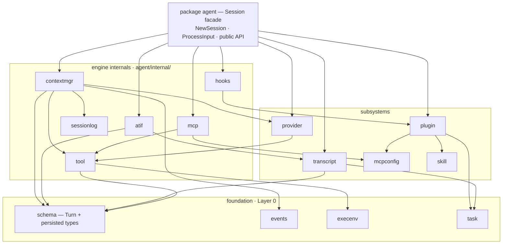
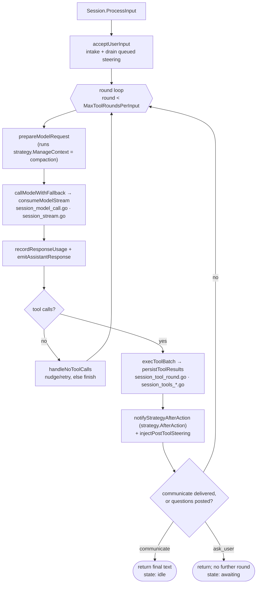

# Evener code architecture & module layout

How the Evener codebase is organized: which modules exist, what each is for, what
may depend on what, and how to build it. This is the **canonical, living** layout
reference — kept current as the structure evolves. (The dated migration spec under
`docs/superpowers/specs/2026-06-01-go-monorepo-module-architecture.md` records the
plan and the decisions behind this structure; this doc describes the result.)

## Shape

Evener is a **multi-module Go monorepo** containing two published libraries, a small
shared auth module, and one application made of three binaries that talk over two
wire contracts.

| Module | Path | Role | May depend on |
| --- | --- | --- | --- |
| `auth` | `auth/` | OpenAI OAuth: token storage + interactive login flow | (stdlib only) |
| `llm` | `llm/` | LLM client library — providers, requests, responses, streaming | `auth` |
| `agent` | `agent/` | Agent engine + the public persistence schema (`SessionMeta`, `Turn`, …) | `llm`, `auth` |
| **app** (root) | `.` | the **evener application** — the three binaries + the wire contracts | `agent`, `llm`, `auth` |

`llm` and `agent` are **published libraries** (consumed inside and outside Prime
Radiant); their `go.mod` files are kept clean and publishable. `auth` is its own
module because it's OAuth machinery (a login flow + a localhost callback server)
that the hub drives far more than `llm` consumes — keeping it separate preserves
`llm`'s minimal surface.

## The three application binaries (one product, three processes)

The app is **one product**: the binaries are coupled only by **protocols**, never by
importing each other's Go code.

| Binary | `cmd/` | Role | Talks to | via |
| --- | --- | --- | --- | --- |
| `evener` | `cmd/evener` | **engine** — runs an `agent.Session` | agent, llm | direct |
| `evener hub` | `cmd/evener-hub` | **supervisor** — spawns `evener` subprocesses, serves clients | evener (spawn), agent (schema) | **AppWire** + schema |
| `evener tui` | `cmd/evener-tui` | **client** — terminal dashboard | evener hub | **hubapi** (HTTP) |

The two shared **contracts** are ordinary top-level packages in the app module:
`appwire/` (the engine↔hub↔tui wire protocol) and `hubapi/` (the hub's HTTP API).
Each binary owns its private code under `cmd/<bin>/internal/`.

## The placement rule — "what goes where"

1. **Reusable outside this repo?** → a library module (`llm/`, `agent/`, `auth/`).
2. **A contract *between* binaries (wire / HTTP)?** → a top-level package in the app
   module, named for what it is (`appwire/`, `hubapi/`).
3. **Private to exactly one binary?** → that binary's `cmd/<bin>/internal/…`.
4. **A binary entry point?** → `cmd/<bin>/main.go` (thin — wiring only).
5. **Shared by a library *and* the app?** → the lowest module that needs it, exported
   there; or its own small module; or (for tiny utils) **duplicated** into each
   product's `internal/`. Libraries never reach into app code.

A library must never import app code or the app's build metadata. Two consequences
already enforced: the build version is **injected**, not imported (`openai.ClientVersion`,
`agent.BuildVersion` — package-level settings the binaries set at startup, default
`"dev"`); and shared parsers (`frontmatter`, `diagnostic`) are **duplicated** into
`agent/internal/` so `agent` is self-contained.

## Building — the go.work workspace

The repo is a Go workspace (`go.work`, committed). `make build` / `make build-hub` /
`make build` / `make build-llmcall` work as before; import paths are unchanged
(`primeradiant.com/evener/…`).

The unpublished sibling modules are wired with **versioned `replace … v0.0.0 => ./dir`
directives in `go.work`** (repo-local — invisible to external `go get`). This keeps
the committed `go.mod` files replace-free and publishable while a fresh clone builds
out-of-the-box. (`go.work use` alone does *not* resolve an unpublished sibling once a
module has external deps — it 404s trying to fetch it; the in-`go.work` replace is the
fix.) Note: `./...` resolves **per-module** in a workspace, not across it — so the lint /
vet / test gates loop over every module (`make vet` / `make test-race` / `make lint-golangci`
iterate `. agent llm auth`); a root-only `go test ./...` silently skips the agent/llm/auth
library suites.

## Boundaries Go enforces

- `agent` / `llm` (modules) **cannot** import the app — the engine libraries can never
  depend on evener-app glue.
- `cmd/<bin>/internal/…` is importable only by that binary.
- `appwire` / `hubapi` are ordinary packages → all three binaries share them as the
  one legitimately-shared contract tier.
- External: `go get primeradiant.com/evener/agent` pulls `agent` + `llm` + `auth` and
  nothing else.

## The app module's `internal/`

The root app module keeps a top-level `internal/` for code **shared across its three
binaries** (engine / supervisor / client are one module). Most of it genuinely is shared
— e.g. `appserver` (engine `server/` + hub + tui), `diagnostic` (engine + hub + server),
`apptranscript`, `binresolve` (hub + tui), `credentials` (all three via `cmdutil`). For a
single module, shared code in `internal/` is the correct Go idiom; *duplicating* it per
binary would be worse. The "no glue drawer" goal was about **not mixing library and app
code** — and that is fully resolved: the libraries are separate modules, so the app's
`internal/` now holds only app code. (`appprojector` and `httpguard` are engine-`server/`-
only and could later sink to `cmd/evener/internal/` alongside `server/`.) Relaxing the
migration's original "zero top-level `internal/`" target is the **decided end-state**:
per-binary duplication would be strictly worse, and the real goal — no library/app code
mixing — is already met by the module carve.

## Inside the `agent` module

`agent` is decomposed from a flat package into **layered sub-packages** — for
legibility, not to shrink the public API (which is unchanged: `Session`, `NewSession`,
and the `schema` persisted types). Dependencies point **down** the layers only; no
lower layer imports a higher one.

- **Foundation (Layer 0)** — `schema` (the canonical `Turn` plus the persisted types
  `SessionMeta` / `ConfigSnapshot` / `EnvironmentInfo`), `events`, `execenv`. No
  intra-`agent` dependencies.
- **Subsystems** — `internal/tool` (tool registry + builtins), `provider` (model
  profiles), `transcript` (JSONL writer/reader), `mcpconfig`, `skill`, `task`.
- **Engine internals** (`agent/internal/…`, off the public surface) — `contextmgr`
  (context-pressure management: compaction + the pluggable strategies + recall),
  `sessionlog` (the shared session-action-log substrate), `hooks` (the plugin/hook
  runner — see [`hooks.md`](hooks.md) for authoring), `mcp` (MCP
  client manager), `atif` (trajectory export).
- **Facade** — `package agent` itself: `Session` composes all of the above and is the
  only public entry point. Engine sub-packages call *back* into the session through
  narrow **seam interfaces** (e.g. `contextmgr.Host`) satisfied by small **unexported
  adapters**, so the engine can live in sub-packages without widening `Session`'s
  public method set.

### How a turn flows

`Session.ProcessInput` drives one user input through up to `MaxToolRoundsPerInput`
model/tool rounds, until the model delivers a result (via the `communicate` tool), the
round posts one or more `ask_user` questions, or the round budget runs out. Each round
(simplified):

The phase names map onto the files in `package agent` that the turn loop was split into:
`session_model_call.go` (request build + call), `session_stream.go` (streaming decode),
`session_tool_round.go` + `session_tools_*.go` (tool execution), and the
`ManageContext` compaction step backed by `agent/internal/contextmgr`.

A round that posts `ask_user` questions ends the turn at the same `AA --> DL` boundary a
delivered `communicate` does, but leaves the session resting in `SessionAwaiting` ("awaiting")
instead of idle — the session waits, visibly, until the user's next message answers the
questions. `ask_user` and `communicate` compose rather than collide: a `communicate` in the
same round still delivers its message, and the boundary state is awaiting whenever the round
posted questions, regardless of the communicate's own end-turn value. `ask_user` is
interactive-root-only — invisible in non-interactive sessions and in every subagent — so this
branch never applies to a delegate.

### The repeated-call breaker

Steering a stuck agent has two layers. `injectPostToolSteering`
(`agent/session_tool_round.go`) watches a window of recent call signatures and, when
`detectLoop` fires, injects steering — the structural intervention when every call in
the window failed, today's tiered escalation otherwise. Underneath it,
`Registry.ExecuteCall` (`agent/internal/tool/registry.go`) consults a ledger
(`agent/internal/tool/breaker.go`) that every *dispatched* tool call passes through,
native and MCP alike — a call refused before dispatch — by pre-validation, an unknown tool
name, unparseable arguments, a schema violation, blocking middleware, or the
argument-size guard — never reaches the ledger. The ledger carries **two triggers, both keyed on tool name + a hash of the raw
argument bytes**. The **failure trigger** counts consecutive failures sharing an error
class: the second appends a nudge to the result, and the third is **not executed at
all** — the call is refused before the tool is looked up. The **repetition trigger**
counts consecutive byte-identical result bodies regardless of error status, and only
ever nudges, from the second onward; a tool observing mutable state may yet return
something new, and refusing `communicate` would take away the session's only exit
door. Repetition catches what error flags miss: a plugin that reports its failures with
`is_error: false` and the failure as plain body text still trips it, so evener needs no
knowledge of any tool's error conventions.

The ledger is per session and per signature — it lives on the session's own
`*tool.Registry`, and a `Clone` starts empty. Calls to other signatures never disturb a
signature's counters. A success or a failure of a different error class resets the
failure counter; a different result body resets the repetition counter. A parked call
is recorded as an ordinary error tool result whose output begins
`evener did not execute this call:` — no new turn kind, no new event type — and the park
itself is not recorded, so the refusal's own body cannot release the next identical
call.

One consequence worth knowing before you meet it: a parked result carries **no typed
error**, only text. Sandbox denial escalation (`agent/session_escalation.go`) keys off
`sandbox.AsDenied(res.Err)`, so a third identical file-tool call that the breaker parks
never raises the human approval card a live denial would have raised. Changing the
arguments or the approach is what clears it.

### Ownership and mailboxes

A `Session` runs no persistent goroutine; it is driven by `ProcessInput` and woken by
its server. Background machinery — the shell-only `jobManager`, stable
delegate-tree controller, job-output pumps, and event emitters — observes a
session's activity and needs to feed work back to it. The rule that keeps this
safe is one invariant:

> **Event observation records durable intent and wakes the owner. Only a session's own
> loop mutates that session.**

An observer (anything reacting to an emitted event or a job-output append) may match
watches, persist durable state, append to a queue, and kick a wake — nothing more. It
may **not** append turns, steer a session, resume a delegate, or otherwise deliver a
message. Delivery is the owning loop's job, done at a named boundary.

**The three queues.** A session has three durable/in-memory mailboxes. Each has many
appenders and exactly one drainer:

- **Steering queue** (`steeringQueue`, guarded by `mu`) — runtime guidance for the next
  round. Appended by anyone holding only `mu` (tools, `Steer`, the warning-notification
  hook); drained by the loop at round boundaries (`drainSteering`).
- **Job notifications** (`pendingJobNotifs`, guarded by `pendingJobNotifsMu`) — durable
  job-completion records and watch-send wake tokens. Appended by the `jobManager`'s
  `enqueue` upcall from observation paths (`enqueueJobNotificationAndNotify`); drained
  by the loop in the notification-accept path (`acceptNotificationInput`,
  `agent/session_lifecycle.go`).
- **Watch outbox** — the durable pending watch sends (jobstore `watch_send_pending`
  records). Appended by the `jobManager`'s observation paths (`onSessionEvent`,
  `feedJobOutput`, `fireProgressTick`, `armFinalizedJob`) taking only leaf locks;
  drained by `drainPendingWatchSends` (`agent/job_watch.go`), the **sole** executor
  of watch-send delivery.

Stable delegate attention is deliberately not a fourth durable queue. Delegate,
quiet, observer, and shell attention is appended to the receiver transcript,
which is its sole durable authority. A process-local set keyed by unresolved
attention ID arms the existing notification wake; successful notification turns
append exact consumed markers, failures leave the IDs pending, and restore folds
the transcript to rearm without constructing a provider runtime.

**Who drains where.** `drainPendingWatchSends` runs only from loop-owned boundaries:
between tool rounds (`injectPostToolSteering`, `agent/session_tool_round.go`), at the
processing-finish boundary (`finishProcessingAtBoundary`, `agent/session_state.go`),
in the notification-accept path (`acceptNotificationInput`), and after restore /
history-repair (`agent/history_repair.go`). Caller-targeted sends ride the
notification queue as wake tokens keyed by watch ID; the accept path deduplicates them
against current pending state and settles delivery in that turn. Stable
delegate-source deliveries bind the typed `dlg_...` source/receiver through the
controller and append durable attention to the receiver transcript; they do not
resolve an activation job.

**The wake path.** `jm.wake` (wired to `Session.notify` at construction,
`agent/session_init.go`) → `Session.notify` (`agent/session.go`) → the server's
input channel → an `EntryNotification` (`agent/session_lifecycle.go`) that runs the
accept path. The same entry kind consumes transcript-backed root delegate
attention after a successful turn and durable resolution append. An empty
accept is otherwise a no-op that still calls
`finishProcessingAtBoundary` → `drainPendingWatchSends` (`agent/session_lifecycle.go`),
so a wake carrying only already-settled shell/watch bookkeeping can finish with
zero model turns; model-bound transcript attention always runs the owner turn.

**The forbidden re-entry.** `responseSideEffectsMu` is held across event emits
(`emitAssistantResponse`, the tool-call-end emit). Observation paths and the `jobManager`'s
retained upcalls (`emit`, `enqueue`, `wake`, `forward`) may take **only** leaf locks
(`s.mu`, `eventsMu`, `pendingJobNotifsMu`) — never `responseSideEffectsMu`. The documented
lock order is `responseSideEffectsMu > mu` (`agent/session.go`), so a leaf-lock upcall
from an emit context is order-consistent; re-taking `responseSideEffectsMu` on the emitting
goroutine would self-deadlock (Go mutexes are not re-entrant). The enforcement is
structural, not by discipline: `jobManager` has **no** `send` closure back into `Session`,
so an observation path *cannot* deliver — only queue and kick.

This rule exists because an event observer that delivered synchronously once wedged a live
session (`docs/specs/2026-06-12-job-control-watch-deadlock-design.md`): a caller-targeted
watch fired while the session emitted an assistant event under `responseSideEffectsMu`, and
the delivery path re-acquired the same mutex on the same goroutine. If you add a new event
observer, it records intent and wakes — it does not mutate the session.

### Drive-down: how a subagent's mailbox gets drained

The wake path above drains the **root** — its server submits the `EntryNotification`. A
subagent session has no server of its own, so the same question recurs one level down: who
wakes a child that has undelivered attention sitting in its own mailboxes? The answer is
**drive-down**: a parent drives its direct children at its own loop boundaries, the same way
its server drives it.

> **A parent drives its children; the root is driven by `serve.go`; the tree is therefore
> eventually-driven, level by level. The mailbox invariant holds at every depth.**

A parent drains its own watch outbox in `drainPendingWatchSends`, and at the tail of that
same boundary it calls `driveChildrenWithUndeliveredAttention` (`agent/job_watch.go`).
That scan reads each direct child's mailboxes as **signal only** — a queued owner
notification (`peekNotifications`) or pending watch sends (`hasPendingWatchSends`) — and, for
any child with undelivered attention, calls `driveSubagentNotificationTurn`
(`agent/subagents.go`). The drive launches **one** notification turn on the *child's own*
loop (`ProcessInputKind(..., EntryNotification)`), so the child's own `acceptNotificationInput`
drains the child's own mailboxes. The parent never appends to, steers, or mutates the child;
it only **runs** the child, and the child's loop delivers. A child's terminal notification
firing also kicks its parent directly — `SetNotifyFunc(func() { s.driveChildIfNotStopGated(sub) })`
(`agent/subagents.go`) — so a child wake propagates up to the parent's boundary the same
way the root's `jm.wake` propagates to its server. The drive mints no job record and arms
nothing new; it is the child processing its own durable attention, using the
separately bounded tree-wide drive counter for the turn's duration.

So the invariant — *observation records durable intent and wakes the owner; only a session's
own loop mutates that session* — holds unchanged at every depth. At depth 0 the server is the
driver; at depth N the parent is. A deep idle tree is woken level by level: the root drives the
coordinator, the coordinator (now running) drives its worker at *its* next boundary, and so on.

**The notification rule, stated plainly: every shell job notifies only its OWNER,
and every delegate notifies only its direct owner.** A subagent's shell jobs
notify the subagent, never its ancestors. A forwarded copy of a child-owned terminal that
lands in an ancestor's store is a **drive signal**, not a render target: the ancestor is *not*
interrupted about a job a descendant created — it drives the descendant so the descendant
renders its own notification (`forwardEvent` returns before `enqueue` when
`rec.OwnerSessionID != jm.sessionID`, `agent/jobs_nested.go`; the restore path filters
the same way at `agent/jobs.go`, so there is no restart wake-storm). A parent still
**renders** its own shell terminals and stable `<delegate-notification
delegate_id="dlg_...">` attention for direct delegates. Delegate notifications
never masquerade as `JOB_FINISHED` or `<job-notification>`. Ancestors retain on-demand visibility
into the whole subtree through `job_list(include_descendants=true)`, which walks the live tree
at read time rather than pushing notifications upward. This realizes the durable principle that
an agent is never interrupted about a *subagent's* children: attention escalates only one honest
level (the `child unreachable:` fallback when a child cannot be driven,
`renderUnreachableChildPendings`, `agent/job_watch.go`).

**Shell forwarding is single-hop.** A shell job's events forward exactly one level: a child's `jm.forward`
is its direct parent's `forwardEvent`, which appends the event to the parent's store and
returns **without** re-forwarding to its own parent (`agent/jobs_nested.go`). So a descendant's
forwarded copy lives only in its **direct parent's** store — it is not propagated up to
grandparents or the root. Two consequences that are easy to get wrong: an ancestor sees deeper
descendants only by walking the live tree (`job_list(include_descendants=true)`), not from
forwarded copies sitting at the root; and a depth-≥2 job output read
(`read_transcript(transcript_ref="job:<job_id>")`) whose owner store closes mid-read falls back
to the **owner's parent** store (where the single-hop copy lives), not the root caller's store.
Stable delegates are never forwarded JobRecords: their `dlg_...` hierarchy and
projection come from the root delegate journal/controller.

## Current status

- ✅ `auth`, `llm`, `agent` all carved into their own modules; the `go.work` workspace is
  established; all four `go.mod` files are clean and publishable (replace-free).
- ✅ App `internal/` holds only app-shared code (no library/app mixing) — the structural
  goal of the migration is met.
- ✅ The library public API is fully documented and **gated in CI**: revive's
  `exported` rule (scoped in `.golangci.yml`)
  fails the build if any exported package-level declaration in `llm`, `agent`,
  `agent/events`, or `auth/openai` lacks a doc comment — running alongside
  `evener tomlcheck` (TOML key casing) and `evener internalcheck` (no internal-type leaks).
  `llm`/`agent`/`auth/openai` carry runnable `Example`s.
- ✅ Validated externally consumable: a scratch module that `require`s `agent` resolves
  only `agent` + `llm` + `auth` (plus their third-party deps) — no app code.
- ✅ **Whole-repo golangci-lint gate**: a curated best-practice `.golangci.yml` (errcheck,
  govet, staticcheck, unused, ineffassign, errorlint, bodyclose, misspell, unconvert, revive,
  gocritic, nilerr, noctx, nakedret, perfsprint, …; the gocritic value-copy checks
  `hugeParam`/`rangeValCopy`/`rangeExprCopy` are disabled — they fight the codebase's
  deliberate value semantics) is driven to **zero across all four modules** and gates in CI
  beside the three custom AST checks. The `vet` / `test-race` / `lint-golangci` make targets
  (and CI) loop over `. agent llm auth`, so the **library test suites now run in CI** too.
