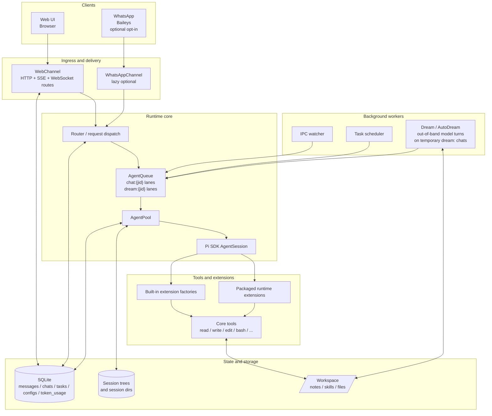
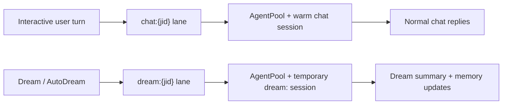

# Architecture

This page maps Piclaw's main components, their relationships, and the code layout.

## Component overview

### Primary runtime architecture



### Execution-lane split



### Reading guide

- **Channels** accept user input and deliver output.
- **Router + AgentQueue** decide where work goes and serialize it per lane.
- **AgentPool + AgentSession** execute turns with the Pi SDK.
- **Extensions and tools** are the capability surface the model actually uses.
- **Background workers** schedule or enqueue work without going through the interactive compose path.
- **SQLite / sessions / workspace** hold durable state, note memory, scheduled tasks, and session trees.

## Access and ownership boundaries

Only `single-user` can start. The [multi-user implementation guide](multi-user/README.md) describes gated backend work; the diagrams above describe the supported single-user execution paths, not completed multi-user isolation.

- `core/config-access.ts` and `db/access-state.ts` validate the configured/stored mode before add-ons, maintenance and listeners start.
- `auth/principal.ts` resolves a browser actor; a login session, an agent session and the owning user are distinct identities. Admin role alone grants no foreign transcript access.
- `db/session-ownership.ts` validates the stored parent chain. `db/session-handles.ts` separates legacy handles from owner-local names; friendly renames preserve durable IDs.
- `http/family-authorisation.ts` makes a terminal HTTP allow/deny decision before legacy add-on/widget dispatch. It enables scoped reads, SSE and selected fork/account operations; unsupported routes deny.
- `db/owned-forks.ts` commits child registry and deferred seed together. Session hydration revalidates server execution provenance before reading/replaying the seed. Background family prewarm remains disabled.
- `secure/` contains account invitations, multiple-passkey registration, recovery and encrypted TOTP factors. `runtime/auth-maintenance.ts` prunes transient auth state every minute after access validation.
- `core/execution-context.ts` carries immutable actor/owner metadata through AsyncLocalStorage. The memory hook selects personal files plus explicit family memory; this does not confine tools or shared files.

Separate terminal/VNC WebSocket upgrades now reject family/isolated modes before target resolution or socket upgrade. Legacy `/totp`/`/passkey` commands, direct card actions and HTTP side-prompt services also deny multi-user mode before reading or mutating state. These blocked features still need owner-aware replacements. Owner-bound cross-session discovery and metadata inspection now use execution/chat context without global fallback; sends and mutating session controls are denied at both tool and runtime/registry boundaries. Message-tool reads use an owner-bound SQL scope (including row-ID/context and search fallback paths), while message writes, raw SQL introspection and scheduling tools deny multi-user mode. Session status exposes only owned activity without arguments or restart permission. Remaining direct tools/transports, queues, browser storage and notification recipients need end-to-end ownership integration; HTTP route gating alone does not secure those paths. The isolated-container gateway and per-user deployment profile are not implemented; no family-mode release gate has passed.

## Code layout (high level)

```
piclaw/
├── runtime/
│   ├── src/
│   │   ├── index.ts                 # Runtime entry point
│   │   ├── runtime.ts               # Service startup orchestration
│   │   ├── runtime/                 # Worker wiring, message loop, startup helpers
│   │   ├── core/                    # Env, config, chat context (AsyncLocalStorage)
│   │   ├── router.ts                # Message routing
│   │   ├── queue.ts                 # Lane-aware queue with retry
│   │   ├── queue/                   # Retry policy
│   │   ├── agent-pool.ts            # AgentSession pool + side-prompt primitive
│   │   ├── agent-pool/              # Session helpers, logging, slash commands
│   │   ├── agent-control/           # Slash command handling + parsers
│   │   ├── agent-memory/            # Daily-note seeding + Dream memory refresh helpers
│   │   ├── dream.ts                 # Dream / AutoDream orchestration
│   │   ├── extensions/              # Built-in inline extension factories
│   │   ├── channels/                # WhatsApp + web channels
│   │   │   └── web/                 # HTTP handlers, SSE, adaptive cards, workspace, auth, extension routes
│   │   ├── tools/                   # Bash tracking + context wrappers
│   │   ├── db/                      # SQLite schema + accessors
│   │   ├── db.ts                    # DB facade re-export
│   │   ├── secure/                  # Keychain, account factors, invitations and recovery
│   │   ├── utils/                   # Shared helpers (ids, preview, model utils)
│   │   ├── workspace-search.ts      # FTS over workspace files
│   │   ├── task-scheduler.ts        # Cron/interval scheduling
│   │   ├── tool-output.ts           # Stored tool output management
│   │   ├── ipc.ts                   # IPC file watcher
│   │   └── types.ts                 # Shared type definitions
│   ├── extensions/                  # Packaged filesystem-backed runtime extensions
│   │   ├── browser/                 # Browser automation extensions
│   │   ├── integrations/            # Packaged integration/helper extensions
│   │   ├── platform/                # Platform-specific packaged extensions
│   │   └── viewers/                 # Route-backed viewers and editor surfaces
│   ├── skills/                      # Packaged runtime skills
│   ├── web/
│   │   ├── src/
│   │   │   ├── app.ts               # Main Preact app
│   │   │   ├── api.ts               # HTTP/SSE client
│   │   │   ├── components/          # UI components (timeline, compose, etc.)
│   │   │   ├── panes/               # Pane system infrastructure
│   │   │   ├── ui/                  # Hooks + state management
│   │   │   ├── vendor/              # Vendored browser libs
│   │   │   └── styles/              # CSS source
│   │   └── static/                  # Served files (HTML, built bundles, icons)
│   └── docs/                        # Packaged runtime-facing docs
├── docs/                            # Repo-level architecture / audits / design docs
├── skel/                            # Workspace skeleton for new installs
└── README.md
```

## Extensions

### Inline extension factories

These are compiled into the package and registered via `extensionFactories` on the resource loader:

| Factory | Tools / Commands |
|---------|-----------------|
| `fileAttachments` | `attach_file` |
| `messagesCrud` | `messages` |
| `modelControl` | `get_model_state`, `list_models`, `switch_model`, `switch_thinking` |
| `internalTools` | `list_tools` with capability metadata + intent-based shortlisting |
| `runtimeScripts` | `list_scripts` for packaged/workspace script discovery and script-JDoc-powered recommendations |
| `toolActivation` | `activate_tools`, `reset_active_tools` |
| `sqlIntrospect` | `introspect_sql` (read-only SQLite queries) |
| `scheduledTasks` | `schedule_task`, `scheduled_tasks`, `/tasks`, `/scheduled` |
| `workspaceSearch` | `search_workspace`, `refresh_workspace_index` |
| `workspaceMemoryBootstrap` | startup memory bootstrap hook (`before_agent_start`) |
| `dreamMaintenance` | `/dream` memory-consolidation slash command |
| `uiThemeExtension` | `/theme`, `/tint` web UI theme controls |
| `smartCompaction` | Smart compaction via `session_before_compact` hook (DB-driven file lists, junk-path filtering, working-indicator UI); see [Pipelined smart compaction](pipelined-compaction.md) for the exact-once discarded-source ledger method and its auxiliary prompt sections |
| `sendAdaptiveCard` | `send_adaptive_card` for agent-owned Adaptive Card posting |
| `sendDashboardWidget` | `send_dashboard_widget` |
| `openWorkspaceFile` | `open_workspace_file` |
| `exitProcess` | `exit_process` |
| Optional autoresearch add-on | Experiment-loop tools are supplied by the installed add-on, not a core inline factory |
| `imageProcessing` | `image_process` for sharp-backed image manipulation and animated GIF/frame workflows |
| `envTools` | `env` — persistent workspace-scoped environment variable management (`/workspace/.env.sh` + immediate `process.env` update) |

Each factory receives an `ExtensionAPI` and registers tools or commands via `pi.registerTool()` and `pi.registerCommand()`. System prompt hints are injected via `pi.on("before_agent_start")`.

### Bundled runtime extensions

Piclaw also ships **packaged runtime extensions** under `extensions/` in the package tree. These are loaded via jiti at session start; some are always enabled and others are gated on environment variables:

| Extension | Gate | Purpose |
|-----------|------|---------|
| `integrations/azure-openai.ts` | `AOAI_BASE_URL` must be set | Azure OpenAI + Foundry provider with managed-identity or API-key auth |
| `integrations/context-mode.ts` | Always loaded | Tool-output storage, search handles, and `exec_batch` tool |
| `integrations/mcp-status-hints/` | Always loaded | Status-hint providers for MCP/proxy and prefixed-tool surfaces when registry metadata is incomplete |
| `integrations/keychain/` | Always loaded | `keychain` tool for list/get/set/delete of secure entries |
| `integrations/ssh/` | Always loaded | `ssh` agent-only tool for session-scoped SSH profile `get`/`set`/`clear` |
| `node_modules/pi-mcp-adapter/index.ts` | Always loaded | Bundled Pi package extension that exposes the token-efficient `mcp` proxy tool plus `/mcp`, `/mcp setup`, and `/mcp-auth` commands for external MCP servers configured through shared `.mcp.json` / `~/.config/mcp/mcp.json` with optional Pi-specific override layers |
| per-session `ssh-core` session extension | Created per session by `AgentPool` | Wraps `read`/`write`/`edit`/`bash` with session-scoped local-or-remote SSH execution |
| `browser/cdp-browser/` | Always loaded | Cross-platform Chromium CDP browser control tool (`cdp_browser`) |
| `@rcarmo/piclaw-addon-win-ui` | Installable add-on | Windows desktop automation via bun:ffi + IAccessible (`win_*` tools) |
| Office viewer add-on | Installable add-on | Office document backend and viewer routes |

WhatsApp is an opt-in runtime channel. The default web-first runtime uses a no-op WhatsApp boundary; the Baileys-backed channel module is lazy-loaded only when `PICLAW_WHATSAPP_ENABLED=1`/`WHATSAPP_ENABLED=1` (or `whatsapp.enabled: true` in config) and a phone number are configured.

These packaged runtime extensions use relative imports into `runtime/src/...` where needed. Piclaw also loads selected bundled Pi-package extensions from `node_modules/` (currently `pi-mcp-adapter`). A `node_modules` symlink next to the `extensions/` directory is created automatically at startup so jiti can resolve deep package imports for both the local packaged extension tree and bundled npm/Pi-package extensions. `runtime/src/extensions/` remains a separate built-in factory surface and should not be confused with the filesystem-backed packaged extension tree.

In single-user mode, Dream-backed startup memory follows a compact-index pattern inside the workspace. Gated family execution instead selects `notes/users/<user-id>/MEMORY.md`, `preferences.md` and `notes/family/MEMORY.md`; Dream/AutoDream owner propagation is still incomplete. The existing single-user layout is:
- `notes/memory/MEMORY.md` is the startup index and is kept under the session budget (line-capped and under ~25KB)
- typed memory files (`user.md`, `feedback.md`, `project.md`, `reference.md`) hold the richer agent-facing detail
- optional sparse files under `notes/memory/days/` preserve durable transcript-derived signals only when a day needs extra agent-facing memory beyond the human-readable `notes/daily/*.md` note
- runtime no longer auto-generates a mirrored `notes/memory/days/*.md` for every complete daily note; the model owns that sparse subtree, while `MEMORY.md` falls back to linking the daily note when no sparse day-memory file exists
- the built-in nightly AutoDream task and the manual `/dream` command execute as out-of-band model turns on a temporary `dream:` channel
- Dream work is queued on a dedicated `dream:<chatJid>` lane so long consolidations do not block the interactive `chat:<chatJid>` lane
- runtime creates a pre-Dream `.zip` backup, prunes older Dream backups (default keep: 10), and seeds in-window daily notes from the database before the model turn starts
- Dream ends with a runtime-owned workspace FTS refresh so newly written memory files are searchable immediately
- the temporary dream channel/session is cleaned up after the cycle completes

Dream/AutoDream use the original model-driven 4-phase flow:
1. Orient
2. Signal
3. Consolidate
4. Prune and Index

In the Prune and Index phase, Dream should both remove stale pointers and add concise references to newly important memories; overly verbose index lines should be shortened with detail moved into the target file.

Dream keeps search collection intentionally narrow:
- inspect existing daily/memory files first
- inspect drifted memories
- only then run narrow transcript/message searches for known suspicions
- avoid exhaustive transcript sweeps

See [runtime/docs/dream-memory.md](../runtime/docs/dream-memory.md) for the detailed feature description.

For infrastructure integrations, the intended uniform contract is:
- session-scoped profile actions: `get` / `set` / `clear`
- instance discovery: `discover`
- compact introspection: `capabilities` / `workflow_help`
- intent routing: `recommend`
- raw transport surface: `request`
- reusable higher-level orchestration: `workflow`

`ssh` follows that model directly, and infrastructure integrations like `proxmox` and `portainer` (maintained in the [piclaw-addons](https://github.com/rcarmo/piclaw-addons) repository) mirror the same contract.

The contract also conserves prompt space: compact family summaries come first, recommendations stay short, workflow examples are opt-in, and raw `request` is reserved for cases where curated workflows are not enough.

### Web pane extensions

The web UI uses a separate **pane extension** system for content-area components. These are client-side only and live in `runtime/extensions/` (editor) or `runtime/web/src/panes/` (core infrastructure):

| Extension | Placement | Location |
|-----------|-----------|----------|
| `editor` | tabs | `runtime/extensions/viewers/editor/editor-extension.ts` |
| `office-viewer` | tabs | `runtime/web/src/panes/office-viewer-pane.ts` |
| `csv-viewer` | tabs | `runtime/web/src/panes/csv-viewer-pane.ts` |
| `pdf-viewer` | tabs | `runtime/web/src/panes/pdf-viewer-pane.ts` |
| `image-viewer` | tabs | `runtime/web/src/panes/image-viewer-pane.ts` |
| `workspace-preview` | tabs | `runtime/web/src/panes/workspace-preview-pane.ts` |
| `terminal` | dock | `runtime/web/src/panes/terminal-pane.ts` |
| `terminal-tab` | tabs | `runtime/web/src/panes/terminal-pane.ts` |
| `vnc-viewer` | tabs | `runtime/web/src/panes/vnc-pane.ts` |

The editor extension is lazy-loaded as a separate bundle (`editor.bundle.js`, ~1.57 MB) on first file open. Specialized viewers (office, CSV, PDF, image) use route-backed iframes served through the extension route system, and their workspace-preview affordances use explicit “Edit/Open in Tab” promotion actions. See [web-pane-extensions.md](web-pane-extensions.md) for the pane contract and [extension-ui-contract.md](extension-ui-contract.md) for how pane extensions fit alongside timeline-native UI and the lower-level `extension_ui_*` bridge.

## Web UI loading sequence

```
Page load
  ├── index.html loads:
  │   ├── app.bundle.css (~517 KB) ── all styles
  │   ├── marked.min.js ───────────── markdown parser (global)
  │   ├── katex.min.js ────────────── math rendering (global)
  │   ├── beautiful-mermaid.js ────── diagram rendering (global)
  │   └── app.bundle.js (~1.24 MB) ── core app (Preact, timeline, compose, panes, workspace UI)
  │
  ├── app.ts init:
  │   ├── import panes/index.ts
  │   │   ├── pane-types.ts ────────── contracts (types only, zero runtime)
  │   │   ├── pane-registry.ts ─────── PaneRegistry singleton
  │   │   ├── editor-loader.ts ─────── LazyEditorInstance proxy + editorPaneExtension
  │   │   ├── terminal-pane.ts ─────── Terminal dock/tab pane extension (feature-flagged)
  │   │   ├── vnc-pane.ts ──────────── VNC pane extension (tabs)
  │   │   └── tab-store.ts ────────── TabStore singleton
  │   │
  │   ├── paneRegistry.register(editorPaneExtension) ← loader proxy, NOT real editor
  │   ├── paneRegistry.register(terminalPaneExtension) ← if terminal feature is enabled
  │   ├── paneRegistry.register(terminalTabPaneExtension) ← adds `piclaw://terminal`
  │   └── paneRegistry.register(vncPaneExtension) ← enables `piclaw://vnc`
  │
  └── First file opened:
      ├── paneRegistry.resolve({path}) → editorPaneExtension (loader)
      ├── editorPaneExtension.mount(container, context)
      │   └── new LazyEditorInstance()
      │       ├── Shows "Loading..." spinner
      │       ├── import('/static/dist/editor.bundle.js') ← ~1.57 MB, one-time
      │       │   └── exports { StandaloneEditorInstance, editorPaneExtension }
      │       ├── new mod.StandaloneEditorInstance(container, context)
      │       ├── Replays queued callbacks (dirty, save, close, viewState)
      │       └── Removes spinner, editor ready
      └── Subsequent files: editorModuleCache hit, instant mount
```

## Bundle sizes

| Bundle | Size | Contents |
|--------|------|----------|
| `app.bundle.js` | ~1.24 MB | Core app: Preact, timeline, compose box, pane registry, tab store, workspace explorer, pane infrastructure |
| `editor.bundle.js` | ~1.57 MB | CodeMirror 6 + languages + themes (lazy-loaded) |
| `login.bundle.js` | 2.2 KB | Login page |
| `app.bundle.css` | ~517 KB | All styles |

## Per-chat turn lifecycle and failure model

PiClaw uses a simple per-chat turn model:

1. **Start a run**
   - `beginChatRun()` advances the chat cursor to the current user message timestamp
   - the same write records an `inflight_*` marker with the previous cursor (`prevTs`)
2. **Automatic recovery happens first**
   - blank-turn detection, compaction-driven recovery, and orchestrator retries still run automatically
   - transient tool-only / compaction issues should resolve without user intervention
3. **Success means a terminal assistant artifact was persisted**
   - normal final reply, or
   - explicit persisted draft fallback
4. **If no terminal assistant artifact exists**
   - the turn is **not** treated as success
   - the cursor is rolled back to `prevTs`
   - the failed run is recorded
   - the chat is held for an explicit decision
5. **Explicit resolution after recovery exhaustion**
   - **Retry** = rewind to `prevTs`, clear the failed marker, replay the user turn
   - **Skip** = advance to `failedTs`, clear the failed marker, move on

The model preserves these semantics:
- transient failures remain automatic
- persistent failures do not silently consume user messages
- the runtime never treats a blank terminal completion as a successful committed turn

### Cursor / inflight / failed-run state roles

- `cursor_ts`
  - last committed processed user-message frontier
- `inflight_*`
  - durable crash-recovery marker for a run that started but did not finish cleanly
- `failed_*`
  - durable hold marker for a run that exhausted recovery and still produced no terminal persisted assistant reply

### Operational rule

A failed run must be in exactly one of these states:

- **resolved by success** → `endChatRun()` clears inflight + failed marker
- **held for retry/skip** → cursor rewound to `prevTs`, inflight cleared, failed marker kept
- **explicitly skipped** → cursor advanced to `failedTs`, failed marker cleared

There is no longer a supported path where an empty terminal turn both:
- shows an error to the user, and
- still consumes the message as a successful cursor advance

## Notes

- The agent pool keeps one warm session per chat JID and evicts idle sessions after a TTL.
- The web UI is the primary interface; the WhatsApp channel is optional (skipped entirely when `WHATSAPP_PHONE` is not configured).
- Web and WhatsApp share the same storage and agent pool.
- Core utilities (config/env/chat context) live in `runtime/src/core`; shared helpers live in `runtime/src/utils`.
- Chat context (chat JID + channel) is tracked in AsyncLocalStorage; tools/extensions read from the scoped context (defaults to `web:default` / `web`) rather than env variables.
- SSH-backed core-tool state is session-scoped and persisted in SQLite (`ssh_configs`). `AgentPool` injects a per-session `ssh-core` extension and can hot-swap the live SSH backend for an existing warm session.
- Proxmox and Portainer API profiles were previously persisted in dedicated SQLite tables (`proxmox_configs`, `portainer_configs`). These tools have been moved to the [piclaw-addons](https://github.com/rcarmo/piclaw-addons) repository and use the `extension_kv` table for session-scoped config persistence. The legacy tables remain in the schema for backward compatibility.
- **Extension KV store**: the `extension_kv` table provides a scoped key-value store for addon extensions. Each extension is isolated by `extension_id` (runtime-assigned). Supports `chat`-scoped entries (keyed by chat JID) and `global` entries. Values are JSON-serialized and queryable via `json_extract()`. The store is registered as a global singleton during runtime init (`extension-kv-registry.ts`) and accessed by addons through the compat layer.
- Workspace tree responses are cached briefly (1s) and rate-limited to prevent bursty UI reloads (HTTP 429 when exceeded).
- The **workspace explorer** is a responsive sidebar (visible on desktop/tablet ≥1024px landscape) that shows a file tree of `/workspace`, supports file previews, drag-and-drop upload with progress reporting, a client-side 256 MB upload guard, inline file creation, inline rename, drag-and-drop move, file reference pills for prompts, and a live workspace-index status chip with one-click reindex.
- The **code editor** is a standalone pane extension (`runtime/extensions/viewers/editor/`) using CodeMirror 6 directly (no Preact wrapper). It opens in the tabbed content area when a file is clicked in the explorer. Supports syntax highlighting for 12 languages, search/replace, line wrapping, dirty tracking, Cmd+S save, vim mode, whitespace toggle, and accent-aware theming. The editor bundle is lazy-loaded on first file open. Backend endpoints: `GET /workspace/file?mode=edit` (full content up to 256 KB) and `PUT /workspace/file` (save).
- **Adaptive Cards** are rendered in the web timeline from `content_blocks` using the vendored Microsoft `adaptivecards` SDK. Action handling routes through `POST /agent/card-action`; submissions are also persisted as `adaptive_card_submission` blocks so the timeline can render compact receipts instead of raw text fallbacks. Finished cards are re-rendered with their submitted values populated, inputs locked read-only, and a concise state banner. Agent-owned cards should be posted through the internal `send_adaptive_card` tool (or equivalent agent-response message path) rather than a local slash command.
- The **tab strip** provides multi-file editing with dirty indicators, pin support, MRU-based tab switching, context menus (Close / Close Others / Close All / Pin / Preview), and keyboard shortcuts (Ctrl+Tab, Ctrl+W).
- Operational remote surfaces:
  - `piclaw://terminal` opens the terminal tab (`TERMINAL_TAB_PATH`) via `GET /terminal/session` and `GET /terminal/ws`/`WebSocket` upgrades. The backend is enabled by default on Linux/macOS and can be controlled via `PICLAW_WEB_TERMINAL_ENABLED` / `web.terminalEnabled`. Windows remains disabled by default but, when explicitly enabled, uses Bun's native PTY with PowerShell or `cmd.exe` discovery.
  - `piclaw://vnc[/<target>]` opens the VNC pane via `GET /vnc/session` and `GET /vnc/ws`/`WebSocket` upgrades, then brokers raw TCP to the target (`WebSocketTcpBridge` + `VncSessionService`). Direct-connect is enabled by default on Linux/macOS/Windows and is explicitly controllable via `PICLAW_WEB_VNC_ALLOW_DIRECT` / `web.vncAllowDirect`. When direct-connect mode is disabled and no saved targets exist, the pane shows an explicit allowlist-only empty state instead of nudging the user toward a blocked path.
- **Markdown preview** is available for `.md` / `.mdx` / `.markdown` files via the tab context menu → Preview. Shows a live split-view with a resizable splitter.
- **Timeline attachment previews** syntax-highlight common text/code/config formats (for example YAML, JSON, JS/TS, Python, Go, shell, SQL, TOML, Dockerfile, PowerShell, and common dotfiles/config files) while Markdown keeps its rendered preview path.
- **Message permalinks**: clicking a timeline timestamp inserts a `message:{id}` pill in the compose box; Ctrl+Click copies a shareable URL; clicking a reference scrolls to and highlights the target.
- **Multi-turn threading**: when the agent produces multiple turns in a single response, subsequent turns are stored with a `thread_id` pointing to the first turn's message. The UI renders threaded replies indented with a left border.
- **Context usage / compaction affordance**: the compose footer reads `/agent/context` for current context-window usage. The web app refreshes on initial connect, SSE reconnect, focus, `pageshow`, visible-again transitions, and immediately after successful manual `/compact`. Post-compaction usage prefers a rebuilt-session estimate and falls back to the safety-adjusted report estimate; null-token events are not persisted or broadcast. After session eviction or lookup failure, `/agent/context` falls back to validated persisted channel usage, so the indicator does not need a new agent turn to update.
- **Recovery chip**: when the agent recovers from a transient mid-turn failure, a subtle recovery chip appears in the compose area so the user can see that retries happened without flooding the timeline.
- **Blank turn detection**: empty or whitespace-only model completions are treated as failures rather than success. If automatic recovery still cannot produce a terminal persisted reply, the cursor is rewound and the failed run is held for explicit retry/skip resolution.
- **Compaction stall guard**: compaction waits are bounded — `PICLAW_SESSION_IDLE_COMPACTION_MAX_WAIT_MS` (default 5 min) prevents indefinite stalls during heavy summarisation. Progress state is preserved across the wait so the UI stays coherent.
- **Held failed runs**: `processChat()` stops on unresolved failed runs instead of repeatedly re-consuming the same user message. Model-change retries, explicit recovery-card actions, and manual skip/retry flows can resolve that hold.
- **Model switch retry behavior**: successful model-switch commands retry a held failed run by rewinding to `prevTs` and resuming the chat. Recovery-card actions (`Continue`, `Retry cleanly`) first skip the held failed turn so the follow-up prompt is not blocked behind the unresolved failure marker.
- **Crash recovery split**: startup/runtime inflight recovery is automatic for interrupted no-output turns, but exhausted no-terminal-output turns use the simpler held-failure path (`failed_*`) until explicitly retried or skipped.
- **OOBE auto-complete**: on established installs with existing conversation history, the provider-ready OOBE panel auto-completes without requiring manual dismissal.
- **Extension progress UI**: long-running operations in SSH, azure-openai, and the azure harness emit working-indicator state via `ctx.ui.setWorkingIndicator` / `setWorkingMessage` so the compose area shows spinner feedback during multi-step tool chains. Addon extensions (proxmox, portainer) in piclaw-addons also use this API.
- **Debug / introspection endpoint**: `GET /agent/debug[?chat_jid=...]` returns a full provenance snapshot of the active session — loaded extensions (with command/tool/handler counts), tools, commands, prompt templates, and skills. Each resource includes its `SourceInfo` (`path`, `source`, `scope`, `origin`, optional `baseDir`) from pi-coding-agent ≥0.62.0.
- **Commands endpoint**: `GET /agent/commands[?chat_jid=...]` returns the current session's registered command set as JSON, combining core control commands, extension commands, prompt templates, and skills. The compose-box fetches this on mount to populate the slash-command autocomplete dropdown dynamically rather than using a hardcoded list.
- **Standalone mobile/PWA recovery**: the web shell keeps a synced `--app-height` from `visualViewport` on standalone mobile runtimes and re-syncs it on focus / pageshow / visibility return to reduce whole-page jumps when resuming the app and focusing the compose textarea.
- Scheduled tasks are isolated using the **session tree**: before a task runs, the current tree position is saved; after the task, the tree is navigated back. The task's output stays in a side branch without polluting conversation context. If the task uses a different model, it is restored afterwards. See [runtime-flows.md](runtime-flows.md) for details.
- Scheduled tasks validate the requested model at creation time; invalid or ambiguous model names are rejected before the task is persisted.

For the message‑level flow, see [runtime-flows.md](runtime-flows.md).

## Add-on transports

Core owns only generic one-hop chat transport registration, authenticated peer-message delivery, scoped add-on storage, and guarded external add-on routes. Peer identity, pairing, policy, messaging, and mediated work are implemented by the installable [Remote Peer add-on](https://rcarmo.github.io/piclaw-addons/addons/remote-peer/).

## Additional documentation

- [Web pane extensions](web-pane-extensions.md) — first-class pane host contract for editors/viewers/tools in tabs and dock
- [Extension UI contract](extension-ui-contract.md) — when to use pane extensions vs timeline UI vs the `extension_ui_*` bridge
- [Turn mechanism audit](archive/turn-mechanism-audit.md) — archived full-stack audit: state machine, queue/steering, crash recovery, client architecture, and data flow diagrams
