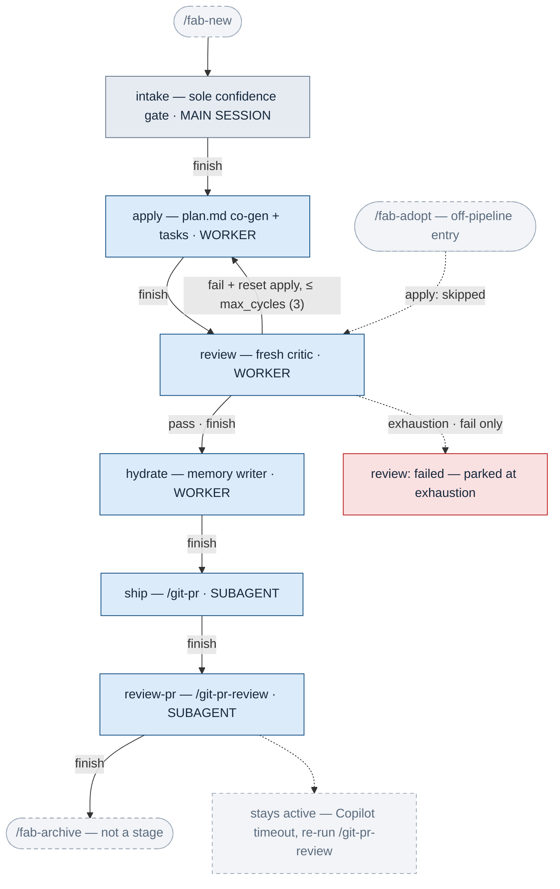
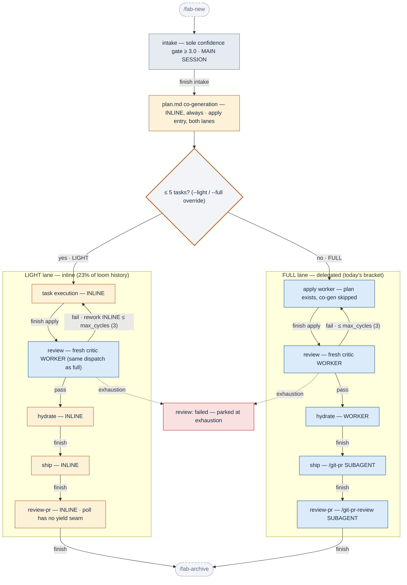
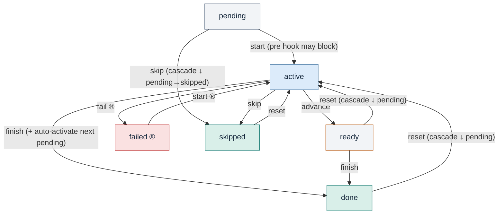
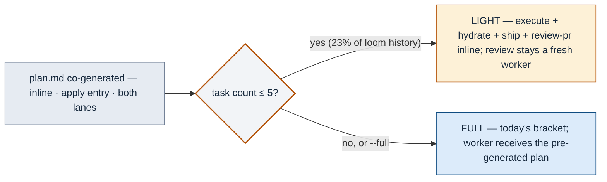

# fab State Machines — Today vs. the Light Lane

> **Status: adopted** (2026-08-11 discussion, validated on loom's archive; implemented by
> 260811-3ol6-light-lane-inline-small-changes — the "after" views are the shipped behavior).
> Companion
> interactive page: [light-mode-state-machines.html](light-mode-state-machines.html) (same
> diagrams with zoom/pan; serve locally to view). Sources of truth for the "today" views:
> `src/go/fab/internal/status/status.go` (transitions, `AllowedStates`),
> `docs/memory/pipeline/change-lifecycle.md`, `src/kit/skills/_pipeline.md`.

**The adopted design changes neither state machine.** The stage graph (Machine 1) and the per-stage
state vocabulary/transitions (Machine 2) are byte-identical before and after. What changes is the
**execution locus** — who runs each stage's behavior — routed by a single **plan-size check** that
rides an existing seam: `plan.md` is co-generated inline at apply entry in *both* lanes, and the
resulting task count decides the lane. One fork, decided once, no mid-run mode machinery (no
promotion valve). Validated against loom's archive: **21% of 972 completed changes** (195/927
measurable; 137 with PRs) would have run light end-to-end; only ~7% of light runs would see any
rework, handled inline under the same cycle budget.

---

## Machine 1 — the stage pipeline (today)

Every post-intake stage runs in a dispatched worker (native subagent / tmux pane / headless CLI).

## Machine 1 — after: combined light + full

Two fully parallel lanes, zero crossings. Review appears in each lane but is the **same**
fresh-worker dispatch in both — drawn twice for legibility, never inline. (Adopt entry and the
Copilot-timeout edge are unchanged — omitted.)

### Execution locus per stage

| Stage / step | Today (all changes) | After — light lane | After — full lane |
|---|---|---|---|
| `intake` | main session | main session | main session |
| plan co-generation (apply entry) | inside the apply worker | **inline** (the lane decision reads its output) | **inline** — new for full too; the worker receives the finished plan via the plan-exists seam |
| task execution (apply) | worker (native/pane/headless) | **inline** | worker, co-gen skipped |
| `review` | fresh worker | fresh worker — **kept** (reviewer independence survives at every size) | fresh worker |
| `hydrate` | worker | **inline** | worker |
| `ship` | /git-pr subagent | **inline** | /git-pr subagent |
| `review-pr` | /git-pr-review subagent | **inline** (kills the yield-seam hazard the sync-poll directive fights) | /git-pr-review subagent |

## Machine 2 — states within a stage (UNCHANGED — zero new states or transitions)

From `internal/status/status.go` (`defaultTransitions` + review/review-pr overrides). ® = review /
review-pr only.

Per-stage nuances from `AllowedStates`: `intake` holds only `active/ready/done`; `ship` and
`review-pr` can never hold `ready`; only `review`/`review-pr` can hold `failed`. `refresh` is not
a transition (pull-based recompute). `reset` runs from `{done, ready, skipped}`; `skip` from
`{pending, active}`.

## The lane decision — a one-time fork, not a machine

No promotion valve: light rework stays inline under the same `max_cycles` budget; exhaustion parks
to the manual menu identically in both lanes; a parked light run re-enters however the user
chooses, including `--full`. Safe because every diff — light or full — passes the same independent
review: a misclassified small change wastes bounded inline rework, never ships unreviewed.
A rejected earlier draft inferred the lane from change type at intake; loom's data killed it (68%
of type-eligible changes outgrow the threshold; 154 small feat/fix changes escape it).

## Loom evidence (972 archived changes, 927 with recoverable task counts)

Rework risk is a clean gradient over plan size — task count is the signal, change type is noise:

| Plan size | Share of changes | Rework rate |
|---|---|---|
| 1–3 tasks | 9% | 8% |
| 4–5 tasks | 13% | 7% |
| 6–8 tasks | 21% | 11% |
| 9–12 tasks | 22% | 16% |
| 13+ tasks | 34% | 29% |

The ≤5 cut: 210 light-eligible at plan time; **195 (21% of all) finish with zero rework**, 137
with recorded PRs. Analysis script: session scratchpad `loom_light_analysis.py` over
`fab/changes/archive/**/.status.yaml` + `.history.jsonl` review-failed events.

## Adjacent optimizations (independently adoptable)

1. **Full mode gets faster too** — inline co-gen means the dispatched apply worker starts with the
   plan in hand; its cold start does task execution only.
2. **Light rework = worker continuation for free** — the orchestrator *is* the author; the whole
   § Worker Continuation apparatus becomes a full-lane-only concern.
3. **Guard the inline co-gen worst case** — an obviously-large intake scope skips inline co-gen
   and dispatches apply-with-co-gen exactly as today.
4. **Threshold as a project knob** (e.g. `light_max_tasks`, default 5) — loom's gradient is
   smooth; repos with different change anatomy can cut bolder.
5. **Stamp the lane into history** — a `weight` event in `.history.jsonl` makes realized savings
   measurable and doubles as the resume-consistency record.
6. **Attack the last wall-clock: the Copilot poll** — requesting the Copilot review at *ship*
   (PR creation) overlaps the wait with the pipeline tail; benefits every run, independent of
   light mode.
