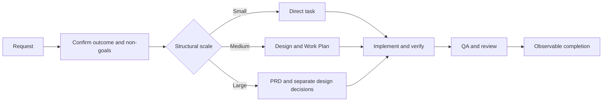

# Agentic Code

A repository-resident development workflow for coding agents that read `AGENTS.md`.

Agentic Code adds an `AGENTS.md` entry point and a set of task, workflow, and skill files to a repository. The agent uses them to keep a well-scoped change on a direct path, route coordinated work through design and planning, load guidance only when it becomes relevant, and verify observable behavior before completion.

It does not generate an application by itself. It gives a coding agent a repeatable way to analyze, design, implement, test, and review changes in the repository where the files are installed.

[](LICENSE)
[](https://agents.md)
[](package.json)

## What It Provides

```text
AGENTS.md                      Repository entry point and operating boundaries
.agents/tasks/                 Definitions for analysis, design, implementation, QA, and review
.agents/workflows/             Coordinated workflow for structurally Medium/Large work
.agents/skills/                Reusable implementation, testing, and documentation rules
.agents/context-maps/          Task-to-skill selection map
```

The route is based on decision burden rather than file count:

| Scale | Structural condition | Route |
|-------|----------------------|-------|
| Small | One coherent outcome follows existing patterns within one responsibility boundary | Direct task execution |
| Medium | One coherent outcome coordinates across a boundary or requires a durable design decision | Design and Work Plan before implementation |
| Large | Multiple independently valuable outcomes require separate design decisions | PRD, separate design decisions, and Work Plan |

File paths and affected layers are still inspected, but they are evidence about the change surface rather than the scale formula.

## Quick Start

Requires Node.js 22 or later.

Create a new repository containing the workflow:

```bash
npx agentic-code my-project
cd my-project
```

The command creates the directory, copies `AGENTS.md` and `.agents/`, initializes Git, and creates an initial commit. Open the repository with an AGENTS.md-compatible coding agent and describe the change you want.

For example:

```text
Add an API endpoint for user search without changing the existing response contract.
```

The agent inspects the repository, confirms the outcome and boundaries, selects a direct task or the coordinated workflow, and runs the applicable repository checks before completion.

## Add It to an Existing Repository

Copy the framework entry point and `.agents` directory into the repository root:

```bash
cp /path/to/agentic-code/AGENTS.md .
cp -R /path/to/agentic-code/.agents .
```

Review the generic defaults against the repository's existing commands and conventions. Repository-specific contracts and established checks take precedence over generic examples in the framework.

## How the Workflow Behaves



The workflow is strict about requirements, user authority, irreversible actions, accepted durable decisions, and completion evidence. Inside those boundaries, the agent resolves reversible repository-local choices from the available evidence.

Reuse, no-change, no-new-document, and no-new-test are valid conclusions when they satisfy the requested outcome and its proof.

## Tasks, Workflows, and Skills

### Tasks

Task definitions own one kind of result. Available tasks include:

| Task | Result |
|------|--------|
| `task-analysis` | Outcome, structural scale, selected path, and required skills |
| `prd-creation` | Approved product outcomes and exclusions for Large work |
| `technical-design` | Repository-grounded implementation design and verification strategy |
| `acceptance-test-generation` | Necessary integration/E2E proof selection and skeletons when required |
| `work-planning` | Fewest executable tasks with real dependencies and verification |
| `implementation` | Smallest sufficient implementation with focused proof |
| `quality-assurance` | Applicable repository checks and completion evidence |
| `code-review` | Evidence-backed implementation findings without scope expansion |
| `technical-document-review` | Consumer-focused PRD, ADR, and Design Doc review |
| `integration-test-review` | Integration/E2E boundary and proof quality review |

### Workflow

`.agents/workflows/agentic-coding.md` coordinates Medium/Large work. It preserves the approved outcome across requirements, design, planning, implementation, QA, and review without requiring fixed file counts, test quotas, or template sections that have no current consumer.

### Skills

Skills contain reusable judgment for coding, testing, documentation, implementation strategy, and metacognition. They are loaded when the selected task needs them rather than all at startup.

## Install Skills Separately

The `skills` subcommand installs only `.agents/skills/`; it does not install the full `AGENTS.md` workflow.

### Codex

```bash
# User scope
npx agentic-code skills --codex

# Current project
npx agentic-code skills --codex --project
```

### Cursor

```bash
# User scope
npx agentic-code skills --cursor

# Current project
npx agentic-code skills --cursor --project
```

### Custom Path

```bash
npx agentic-code skills --path ./custom/skills
```

Run `npx agentic-code skills --help` for the target paths and available options.

## Compatible Tools

The core workflow works with tools that read repository-level `AGENTS.md` instructions. Cursor, Codex CLI, and Gemini CLI are common examples; exact discovery and skill-installation behavior depends on the tool version.

If you primarily use Codex and want a Codex-native setup with custom agents and isolated review contexts, see [codex-workflows](https://github.com/shinpr/codex-workflows).

## Reviews

Review tasks evaluate findings against confirmed requirements, accepted design, repository rules, and observable correctness. A receiving agent can:

- apply a finding required by correctness or an approved boundary;
- decline optional scope, duplicated proof, or unsupported hardening;
- return a finding to the user when it changes the product outcome or a major approved decision.

For a fresh perspective, run important reviews in a new session or an isolated agent context. The reviewer still needs the governing requirements, relevant document paths, changed files, and verification evidence.

Example requests:

```text
Review src/auth/ against docs/design/auth-design.md.
Review docs/design/payment-design.md as a Design Doc.
Review the integration tests in tests/integration/auth.test.ts.
```

## Scope and Trade-offs

Agentic Code adds process and context. Direct agent execution is usually cheaper for a well-scoped fix, a disposable experiment, or a one-shot script whose safe boundary is already clear.

Use the coordinated workflow when technical choices can change the product outcome, cross a responsibility boundary, or create a durable decision that later work must understand.

The framework is language-agnostic at its core. TypeScript-specific references are included; other languages use their repository-native commands and conventions until language-specific guidance is added.

## Contributing

Issues and pull requests are welcome:

- [Report an issue](https://github.com/shinpr/agentic-code/issues)
- [Submit a pull request](https://github.com/shinpr/agentic-code/pulls)

## License

MIT. See [LICENSE](LICENSE).

Built on the [AGENTS.md specification](https://agents.md).
