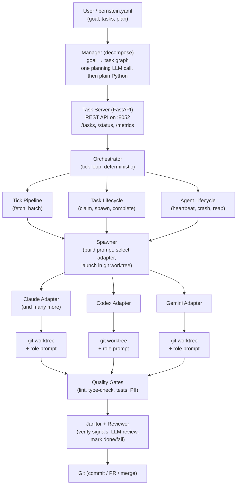

# Bernstein Architecture

## Overview

Bernstein is the open-source governance layer for AI agents, built around a deterministic scheduler. You declare what you want, the control plane schedules it, short-lived agents execute in per-task git worktrees, and a janitor verifies the output before anything lands. Artifact-mode tasks, which complete on a signed lineage receipt rather than a commit, get an isolated plain directory under `.sdd/workspaces/` instead - see [the artifact contract](../operations/artifacts.md).

The orchestrator is **deterministic Python** - no model in the coordination loop. Every scheduling decision, every retry, every spawn is auditable code, not a model response, so the same plan replays to a byte-identical task graph.

Verification splits by what the checker holds. The Ed25519 signature legs (`bernstein artifact verify`, the lineage gate) and the Merkle seal (`bernstein audit verify --merkle-only`) check from the on-disk artefacts alone. Replaying the per-line HMAC chain (`bernstein audit verify`, `--hmac-only`, `audit verify-hmac`) needs the install's audit key, which by design lives outside the audit volume.

---

## System diagram



---

## Why file-based state

Bernstein stores everything in `.sdd/` files - no databases, no hidden memory. This is a deliberate design choice:

- **Inspectable**: `cat .sdd/backlog/open/*.yaml` - read task specs as plain text
- **Recoverable**: copy `.sdd/` to another machine, restart Bernstein, resume
- **Auditable**: every metric, trace, and lesson is a JSONL file you can grep
- **Git-friendly**: back up `.sdd/backlog/` and `.sdd/metrics/` alongside your code

Runtime state (`.sdd/runtime/`) is ephemeral - PIDs, logs, signals. Never commit it.

---

## Package structure

Since v1.6, `core/` is organized into sub-packages (63 at time of writing) rather than flat files. The old flat module paths (`bernstein.core.server`, `bernstein.core.orchestrator`, `bernstein.core.spawner`, ...) no longer exist as files. They keep importing anyway: `core/__init__.py` registers a custom module finder on `sys.meta_path` whose `_REDIRECT_MAP` maps each old module name to its new sub-package location and imports the real module on demand. Import paths stay stable, and each subsystem can grow independently.

The table below is a selection of the most load-bearing sub-packages, not the full list:

| Sub-package | Responsibility |
|-------------|----------------|
| `core/agents/` | Spawner, agent lifecycle, heartbeat, signals, discovery, turn state |
| `core/communication/` | Bulletin board, notifications, desktop notify, scratchpad |
| `core/config/` | Seed parsing, config validation, hot reload, migration |
| `core/cost/` | Cost tracking, anomaly detection, budgets, forecasting |
| `core/evidence/` | Content-addressed evidence bundles, completion gate, output diff |
| `core/git/` | Git operations, worktrees, merge queue, PR creation |
| `core/grpc_gen/` | Generated gRPC stubs |
| `core/identity/` | Install-rev identity fingerprint, delegation grants, HTTP signing, SPIFFE |
| `core/knowledge/` | Knowledge base, lessons, RAG, semantic cache, embeddings |
| `core/lineage/` | Lineage spine (Merkle+HMAC), signed-write path (Ed25519), lineage CI gate |
| `core/memory/` | SQLite-backed memory store |
| `core/observability/` | Metrics, circuit breaker, loop detector, log redact, telemetry |
| `core/orchestration/` | Orchestrator, tick pipeline, manager, evolution, preflight |
| `core/persistence/` | Task store, session, file locks, WAL, store backends |
| `core/planning/` | Planner, plan loader, workflow DSL, scenario library |
| `core/plugins_core/` | Agency loader, plugin installer, skill discovery |
| `core/protocols/` | A2A, ACP, MCP, cluster, SSH backend, gRPC |
| `core/quality/` | Janitor, reviewer, quality gates, CI fix, mutation testing |
| `core/replay/` | Deterministic replay gateway, step journal, fork-from-step, run receipts |
| `core/routes/` | FastAPI route modules |
| `core/routing/` | Router, cascade router, model fallback, LLM client |
| `core/sandbox/` | Sandbox backend protocol, registry, pools, snapshots, conformance |
| `core/security/` | Auth, guardrails, approval, compliance, DLP, RBAC, audit chain |
| `core/server/` | Server app factory, middleware, launch, supervisor |
| `core/skills/` | Skill loader, discovery index, catalog, activation log, conformance |
| `core/storage/` | Pluggable artifact storage sinks (local FS, S3, GCS, Azure Blob, R2) |
| `core/tasks/` | Task models, lifecycle FSM, store, batch, dead-letter queue |
| `core/tokens/` | Token monitor, context compression, prompt caching |
| `core/trigger_sources/` | Slack, Discord, schedule, SLA, OData, file watch, webhook triggers |

A few standalone files remain at `core/` top level: `defaults.py` (all configurable constants), `credential_scoping.py`, `streaming_merge.py`, `compat_redirect_ledger.py`, `dataclass_helpers.py`, `instrumentation.py`, `parallel_admission.py`, and `run_auth_token.py`.

---

## Core modules

Each module has one responsibility. Each subsystem lives in its own sub-package; old flat import paths keep resolving via the `sys.meta_path` redirect finder described above.

### Task Server (`core/server/`)

FastAPI application exposing the REST API. Central coordination point for all agents. State persists to `.sdd/runtime/tasks.jsonl` as a recovery checkpoint. The server app factory, middleware, and launch logic live in `core/server/`. Routes are split across `core/routes/` - about 70 route modules including `tasks.py`, `status.py`, `costs.py`, `agents.py`, `plans.py`, `quality.py`, `graduation.py`, `slack.py`, `webhooks.py`, `dashboard.py`, `auth.py`, `observability.py`, `health.py`, `gateway.py`, and more.

### Orchestrator (`core/orchestration/`)

The public façade. Runs the tick loop: fetch open tasks, batch by role, spawn agents, monitor heartbeats, handle completion. The logic splits across:

- **Tick pipeline** (`core/orchestration/tick_pipeline.py`) - data containers and task fetching
- **Task lifecycle** (`core/tasks/task_lifecycle.py`) - claim, spawn, complete, retry, decompose
- **Agent lifecycle** (`core/agents/agent_lifecycle.py`) - heartbeat, crash detection, reaping, loop/deadlock detection

All task and agent status changes are validated by the Lifecycle Governance Kernel (`core/tasks/lifecycle.py`), which enforces an explicit FSM transition table and emits typed `LifecycleEvent` records for audit and replay. See [LIFECYCLE.md](LIFECYCLE.md) for the full state diagrams, transition tables, and `TransitionReason`/`AbortReason` enumerations.

### Spawner (`core/agents/spawner.py`)

Launches CLI agents for task batches. Builds the prompt (system role prompt + task context), selects the appropriate adapter via the registry, and spawns the process inside a git worktree. Core logic split across `spawner_core.py`, `spawner_worktree.py`, `spawner_merge.py`, and `spawn_prompt.py` in `core/agents/`. Wraps every command with `build_worker_cmd()` for process visibility (`bernstein ps`).

### Router (`core/routing/router.py`)

Routes tasks to the appropriate model and effort level. Tier-aware: knows which providers are free/standard/premium, respects cost optimization, and applies skill-profile routing. Separate from `core/routing/cascade_router.py` which handles cost-aware cascading (try cheap model first, escalate on failure).

See [`architecture/model-routing.md`](model-routing.md) for cascade behaviour.

### Janitor (`core/quality/janitor.py`)

Verifies task completion via concrete signals: file exists, glob matches, tests pass, file contains expected content. Moves tasks from `claimed/` to `done/` or `failed/` based on signal results. Does not trust agent claims - verifies them.

### Reviewer (`core/quality/review_pipeline/`)

LLM-powered quality review of completed work. Runs after the janitor. Can push corrections back into the queue if the produced code doesn't meet quality standards. Separate concern from janitor: janitor checks signals, reviewer checks quality.

### Quality Gates (`core/quality/quality_gates.py`)

Automated gates that run after task completion: lint, type-check, test suite, PII scan, mutation testing, benchmark regression detection. Configured in the `quality_gates:` section of `bernstein.yaml` (parsed by `core/config/seed_parser.py`). Blocking or non-blocking modes. The gate runner (`core/quality/gate_runner.py`) runs `auto_format` steps first (they modify files), then the remaining gates in parallel via `asyncio.gather`.

### Agent Signals (`core/agents/agent_signals.py`)

File-based protocol for agent communication: `WAKEUP` (start work), `SHUTDOWN` (stop gracefully), `HEARTBEAT` (still alive). Agents write these to `.sdd/runtime/signals/<role>-<session>/`. The orchestrator polls them each tick. Circuit breaker writes `SHUTDOWN` when it detects purpose violations.

### Token Monitor (`core/tokens/token_monitor.py`)

Tracks per-agent token consumption in real time. Detects runaway token growth and triggers auto-intervention (log warning, pause spawning, or kill the expensive agent). Integrates with cost anomaly detection (`core/cost/cost_anomaly.py`) which uses Z-score analysis on historical spend.

---

## Supporting subsystems

| Module (sub-package) | What it does |
|--------|-------------|
| `core/observability/circuit_breaker.py` | Halts agents that repeatedly violate purpose or crash - sends SHUTDOWN signal |
| `core/cost/cost_tracker.py` | Per-run cost budget tracking with threshold warnings |
| `core/cost/cost_history.py` | Persisted cost history and alert logic |
| `core/quality/cross_model_verifier.py` | Routes completed diffs to a different model for independent review |
| `core/communication/bulletin.py` | Append-only bulletin board for cross-agent communication |
| `core/agents/agent_discovery.py` | Auto-detect installed CLI agents, check login status, register capabilities |
| `core/agents/agent_lifecycle.py` | Heartbeat monitoring, stall detection, crash reaping |
| `core/security/approval.py` | Configurable approval gates between janitor verification and merge |
| `core/quality/ci_fix.py` | Parse failing CI logs, create fix tasks, route to responsible agent |
| `core/protocols/cluster/cluster.py` | Multi-node coordination: node registration, heartbeats, topology |
| `core/persistence/file_locks.py` | File-level locking for concurrent agent safety |
| `core/git/git_basic.py` | Git operations: run, status, staging, committing |
| `core/git/git_ops.py` | Centralized git write operations for Bernstein |
| `core/git/git_pr.py` | PR creation and branching operations |
| `core/security/guardrails.py` | Output guardrails: secret detection, scope enforcement, dangerous operations |
| `core/knowledge/knowledge_base.py` | Codebase indexing and task context enrichment |
| `core/knowledge/lessons.py` | Agent lesson propagation - tag-matched, confidence-decayed over time |
| `core/routing/llm.py` | Async native LLM client for the manager and external models |
| `core/orchestration/manager.py` | LLM-powered task decomposition and review (splits across `manager_models.py`, `manager_parsing.py`, `manager_prompts.py`) |
| `core/git/merge_queue.py` | FIFO merge queue for serialized branch merging with conflict routing |
| `core/observability/metric_collector.py` | Metrics collection and recording |
| `core/observability/metrics.py` | Performance metrics facade |
| `core/orchestration/multi_cell.py` | Multi-cell orchestrator - each cell has its own manager + workers |
| `core/communication/notifications.py` | Webhook notification system for run events |
| `core/security/policy.py` | Model routing policy: tier optimization and provider routing |
| `core/orchestration/preflight.py` | Pre-flight checks: validate CLI, API key, port availability |
| `core/quality/quality_gates.py` | Automated quality gates: lint, type-check, test gates |
| `core/security/quarantine.py` | Cross-run task quarantine - track repeatedly-failing tasks |
| `core/observability/rate_limit_tracker.py` | Per-provider throttle tracking and 429 detection |
| `core/config/seed.py` | Seed file parser for bernstein.yaml |
| `core/persistence/session.py` | Session state persistence for fast resume after stop/restart |
| `core/communication/signals.py` | Pivot signal system for strategic re-evaluation |
| `core/persistence/store.py` / `store_postgres.py` / `store_redis.py` | Pluggable storage backends |
| `core/persistence/sync.py` | Sync `.sdd/backlog/*.yaml` with the task server |
| `core/tasks/task_store.py` | Thread-safe in-memory task store with JSONL persistence |
| `core/config/upgrade_executor.py` | Autonomous upgrade executor with transaction-like safety |
| `core/orchestration/worker.py` | `bernstein-worker`: visible process wrapper for spawned CLI agents |
| `core/persistence/workspace.py` | Multi-repo workspace orchestration |
| `core/git/worktree.py` | Git worktree lifecycle for agent session isolation |
| `core/tokens/context_degradation_detector.py` | Monitor agent quality over time; restart when degraded |
| `core/observability/loop_detector.py` | Agent loop and file-lock deadlock detection |
| `core/observability/log_redact.py` | PII redaction filter installed globally at bootstrap |
| `core/cost/cost_anomaly.py` | Cost anomaly detection with Z-score signaling |
| `core/defaults.py` | All configurable constants (timeouts, thresholds, tuning) |

---

## Data flow

```text
1. Manager decomposes the goal into tasks with roles, owned files, and
   completion signals (core/orchestration/manager.py) - one planning
   LLM call up front, none during coordination
2. Tasks land in the Task Server (POST /tasks or bernstein.yaml)
3. Orchestrator tick loop fetches open tasks via tick pipeline
4. Router assigns model and effort per task properties
5. Spawner launches agents in isolated git worktrees
6. Agents work in parallel, writing heartbeats and signal files
7. Agent completes task → git commit in worktree
8. Janitor verifies completion signals (files exist, tests pass)
9. Quality gates run (lint, type-check, PII scan)
10. Reviewer optionally performs LLM quality review
11. Metrics recorded to .sdd/metrics/*.jsonl
12. Task marked done or failed
```

---

## Audit chain and lineage

The verification story from the overview is carried by two substrates: the HMAC-chained audit log and the lineage stores under `core/lineage/`.

- **`core/security/audit_chain.py`** - `AuditChainStore`, a facade over the HMAC-chained `AuditLog`; it surfaces the previous event's chain digest so subsystems can embed it inside new event payloads before the next HMAC is computed, and defines the event-type constants those subsystems emit.
- **`core/lineage/spine.py`** - `LineageSpine`, the always-on Merkle+HMAC provenance chain: every adapter artifact write routes through `LineageSpine.record` at the single write boundary in `adapters/base.py`, appending a canonical-JSON row to `.sdd/lineage/<run_id>/spine.jsonl` whose entry hash chains to the previous row and whose head hash is HMAC-tagged in `spine.head`.
- **`core/lineage/signed_write.py`** - the supported signed-write path (`seal_write` / `SignedLineageLog`): computes the content hash, chains it to the artefact's current tip, wraps it in an operator-HMAC envelope, signs the canonical bytes with the agent's Ed25519 key, and hands the `(entry, jws)` pair to the `LineageStore`. (`core/lineage/recorder.py` survives only as a deprecated compatibility shim over this path.)
- **`core/lineage/gate.py`** - the read-only lineage CI gate: checks that every log entry parses, verifies its detached JWS against the agent's published Agent Card, optionally re-checks the operator HMAC, and confirms every `parent_hash` anchors to another entry with no unresolved forks. It runs against a frozen log plus cards directory, no live store required.

The spine proves ordering and integrity for a whole run; a signed lineage entry adds attributable non-repudiation, verifiable offline by someone who holds no operator secret. They are different proofs, and both stay.

---

## Sandbox, storage, and skills

Three pluggable subsystems landed in the 1.9 series. Each has its own
dedicated architecture page:

- **[Sandbox backends](sandbox.md)** - pluggable `SandboxBackend` /
  `SandboxSession` protocol. First-party backends: local git
  `worktree` (default), `docker`, `e2b` (Firecracker microVMs), and
  `modal` (serverless containers with optional GPU). Third parties
  register through the `bernstein.sandbox_backends` entry-point group;
  `bernstein agents sandbox-backends` lists every installed backend.
- **[Artifact storage sinks](storage.md)** - async `ArtifactSink`
  protocol that decouples `.sdd/` persistence from the local
  filesystem. First-party sinks cover `local_fs`, `s3`, `gcs`,
  `azure_blob`, and `r2`. `BufferedSink` preserves the WAL
  crash-safety contract by fsyncing locally first and mirroring the
  payload to the remote asynchronously. Third parties extend via
  `bernstein.storage_sinks`.
- **[Progressive skill packs](skills.md)** - progressive disclosure:
  only a compact index ships in every spawn's system prompt; agents
  pull full skill bodies, references, and scripts on demand via the
  `load_skill` MCP tool (registered in `bernstein.mcp.server`, backed
  by `core/skills/`). Plugins register additional skill sources
  under `bernstein.skill_sources`. Inspect available skills with
  `bernstein skills list` / `bernstein skills show <name>`.

## Adapter architecture

All adapters implement the `CLIAdapter` ABC from `adapters/base.py`. Only `spawn` and `name` are abstract; `is_alive` and `kill` are concrete methods every adapter inherits (`kill` performs a process-group reap and returns a `ProcessReapReceipt` that callers mirror into the audit chain):

```python
class CLIAdapter(ABC):
    @abstractmethod
    def spawn(
        self,
        *,
        prompt: str,
        workdir: Path,
        model_config: ModelConfig,
        session_id: str,
        mcp_config: dict[str, Any] | None = None,
        timeout_seconds: int = DEFAULT_TIMEOUT_SECONDS,
        task_scope: str = "medium",
        budget_multiplier: float = 1.0,
        system_addendum: str = "",
        multimodal_context: Any | None = None,
    ) -> SpawnResult: ...

    @abstractmethod
    def name(self) -> str: ...

    # Concrete - inherited, override only when the default is wrong:
    def is_alive(self, pid: int) -> bool: ...
    def kill(self, pid: int) -> ProcessReapReceipt: ...
    def detect_tier(self) -> ApiTierInfo | None: ...  # optional, defaults to None
```

`task_scope` and `budget_multiplier` feed per-task budget caps. `system_addendum` carries protocol-critical instructions (completion, heartbeat, signal-check). Adapters that support a separate system-prompt channel (e.g. Claude Code's `--append-system-prompt`) inject it there, where it survives prompt truncation; others append it to the user prompt as a fallback. A few adapters do not consume it at all - check the target adapter before relying on it. `multimodal_context` passes base64-encoded attachments to multimodal-capable adapters (others must raise `CapabilityRefusal` before spawning). See the docstrings in `adapters/base.py` for the full contract.

The `CachingAdapter` wrapper in `adapters/caching_adapter.py` transparently deduplicates system prompt prefixes across agents, saving tokens on repeated spawns.

Adapters must use `build_worker_cmd()` for process visibility - this sets the process title and writes the PID metadata file that `bernstein ps` reads.

---

## Operator surfaces

Two first-party surfaces sit on top of the REST API. The Textual TUI (`src/bernstein/tui/`, launched with `bernstein live`) is a three-column terminal dashboard: agents with live logs, the task board, and an activity feed with cost tracking - the right choice on terminal-only hosts. The web GUI (`src/bernstein/gui/`, launched with `bernstein gui serve`) mounts a built React SPA at `/ui/` on the same FastAPI process that serves `/api/v1/*`, on port 8052 by default; it complements the TUI with diff rendering, sparklines, and a queue-style approvals view. See [the GUI docs](../gui/index.md).

---

## Key design decisions

| Decision | Why |
|----------|-----|
| Short-lived agents | No persistent processes to manage. Spawn per task batch, exit when done. No "sleep" problem. |
| File-based state | `.sdd/` is git-friendly, inspectable, recoverable. No hidden databases. |
| Deterministic orchestrator | Scheduling is code, not LLM. Predictable, auditable, testable. |
| Agent-agnostic | Works with any CLI agent. No vendor lock-in. |
| Git worktree isolation | Main branch never dirty. Each agent works on its own branch. |
| Janitor verification | Concrete signals, not trust. Tests must pass, files must exist. |
| Branch is `main` | Never `master`. PRs target `main`. CI enforces this. |
| OOP where useful, pure funcs where better | Small classes for stateful collaborators; pure functions for deterministic transforms. |

---

## Cloudflare cloud execution

Bernstein can execute agents on Cloudflare's edge infrastructure in addition to local processes. The integration provides:

- **RuntimeBridge** (`bridges/cloudflare.py`) - spawn agents on Workers + Durable Objects
- **WorkflowBridge** (`bridges/cloudflare_workflow.py`) - durable multi-step workflows with auto-retry and approval gates
- **BrowserRenderingBridge** (`bridges/browser_rendering.py`) - headless web browsing for agents
- **R2WorkspaceSync** (`bridges/r2_sync.py`) - content-addressed workspace file sync via R2
- **WorkersAIProvider** (`core/routing/cloudflare_ai.py`) - free-tier LLM models for planning

The cloud bridges implement the same `RuntimeBridge` interface as local execution, so the orchestrator remains agnostic to where agents run. See the [Cloudflare Overview](../cloudflare/cloudflare-overview.md) for architecture diagrams and setup instructions.

---

## What to read next

- **[Getting Started](../getting-started/install.md)** - install, init, run, monitor
- **[Feature Matrix](../reference/FEATURE_MATRIX.md)** - shipped vs. partial vs. roadmap
- **[Benchmarks](../benchmarks/BENCHMARKS.md)** - performance baseline and methodology
- **[Sandbox backends](sandbox.md)** - pluggable `SandboxBackend` protocol
- **[Artifact storage sinks](storage.md)** - cloud `.sdd/` persistence
- **[Skills](skills.md)** - progressive-disclosure capability packs
- **[What's New](../whats-new.md)** - recent user-facing changes
