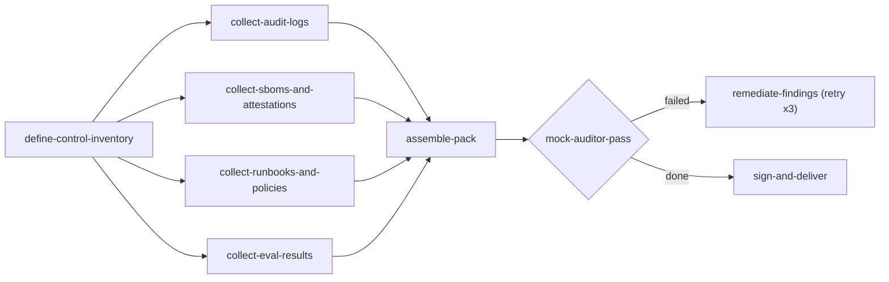

<div align="center">

<picture>
  <source media="(prefers-color-scheme: dark)" srcset="https://raw.githubusercontent.com/sipyourdrink-ltd/bernstein/main/docs/assets/logo-dark.svg">
  <source media="(prefers-color-scheme: light)" srcset="https://raw.githubusercontent.com/sipyourdrink-ltd/bernstein/main/docs/assets/logo-light.svg">
  
</picture>

<br>


<br>

> *"To achieve great things, two things are needed: a plan and not quite enough time."* - [attributed to](https://quoteinvestigator.com/2020/08/19/plan-time/) Leonard Bernstein

### the open-source governance layer for AI agents

[](https://github.com/sipyourdrink-ltd/bernstein/actions/workflows/ci.yml)
[](https://pypi.org/project/bernstein/)
[](https://ghcr.io/sipyourdrink-ltd/bernstein)
[](https://python.org)
[](https://github.com/sipyourdrink-ltd/bernstein/blob/main/LICENSE)
[](https://scorecard.dev/viewer/?uri=github.com/sipyourdrink-ltd/bernstein)
[](https://github.com/sipyourdrink-ltd/bernstein/actions/workflows/codeql.yml)
[](https://codespaces.new/sipyourdrink-ltd/bernstein?quickstart=1)
[](https://mcptoplist.com/server/io.github.sipyourdrink-ltd%2Fbernstein)
<a href="https://deepwiki.com/sipyourdrink-ltd/bernstein"></a>

[website](https://bernstein.run) &middot; [docs](https://bernstein.readthedocs.io/) &middot; [install](https://bernstein.readthedocs.io/en/latest/getting-started/install/) &middot; [first run](https://github.com/sipyourdrink-ltd/bernstein/blob/main/docs/getting-started/first-run.md) &middot; [glossary](https://github.com/sipyourdrink-ltd/bernstein/blob/main/docs/reference/GLOSSARY.md) &middot; [limitations](https://github.com/sipyourdrink-ltd/bernstein/blob/main/docs/reference/KNOWN_LIMITATIONS.md) &middot; [name policy](https://github.com/sipyourdrink-ltd/bernstein/blob/main/TRADEMARKS.md) &middot; [sponsor](https://github.com/sponsors/chernistry)

[简体中文](https://github.com/sipyourdrink-ltd/bernstein/blob/main/docs/i18n/README.zh-Hans.md) &middot; [繁體中文](https://github.com/sipyourdrink-ltd/bernstein/blob/main/docs/i18n/README.zh-TW.md) &middot; [日本語](https://github.com/sipyourdrink-ltd/bernstein/blob/main/docs/i18n/README.ja.md) &middot; [한국어](https://github.com/sipyourdrink-ltd/bernstein/blob/main/docs/i18n/README.ko.md) &middot; [हिन्दी](https://github.com/sipyourdrink-ltd/bernstein/blob/main/docs/i18n/README.hi.md) &middot; [বাংলা](https://github.com/sipyourdrink-ltd/bernstein/blob/main/docs/i18n/README.bn.md) &middot; [Русский](https://github.com/sipyourdrink-ltd/bernstein/blob/main/docs/i18n/README.ru.md) &middot; [Español](https://github.com/sipyourdrink-ltd/bernstein/blob/main/docs/i18n/README.es.md) &middot; [Português](https://github.com/sipyourdrink-ltd/bernstein/blob/main/docs/i18n/README.pt.md) &middot; [Deutsch](https://github.com/sipyourdrink-ltd/bernstein/blob/main/docs/i18n/README.de.md) &middot; [Français](https://github.com/sipyourdrink-ltd/bernstein/blob/main/docs/i18n/README.fr.md) &middot; [Italiano](https://github.com/sipyourdrink-ltd/bernstein/blob/main/docs/i18n/README.it.md) &middot; [Nederlands](https://github.com/sipyourdrink-ltd/bernstein/blob/main/docs/i18n/README.nl.md) &middot; [Polski](https://github.com/sipyourdrink-ltd/bernstein/blob/main/docs/i18n/README.pl.md) &middot; [Svenska](https://github.com/sipyourdrink-ltd/bernstein/blob/main/docs/i18n/README.sv.md) &middot; [Suomi](https://github.com/sipyourdrink-ltd/bernstein/blob/main/docs/i18n/README.fi.md) &middot; [Українська](https://github.com/sipyourdrink-ltd/bernstein/blob/main/docs/i18n/README.uk.md) &middot; [Türkçe](https://github.com/sipyourdrink-ltd/bernstein/blob/main/docs/i18n/README.tr.md) &middot; [العربية](https://github.com/sipyourdrink-ltd/bernstein/blob/main/docs/i18n/README.ar.md) &middot; [עברית](https://github.com/sipyourdrink-ltd/bernstein/blob/main/docs/i18n/README.he.md) &middot; [Bahasa Indonesia](https://github.com/sipyourdrink-ltd/bernstein/blob/main/docs/i18n/README.id.md) &middot; [Tiếng Việt](https://github.com/sipyourdrink-ltd/bernstein/blob/main/docs/i18n/README.vi.md) &middot; [ไทย](https://github.com/sipyourdrink-ltd/bernstein/blob/main/docs/i18n/README.th.md)

</div>

---

> **Status: beta.** Solo-maintained, under active development. The version number counts releases, not maturity - minor versions may change interfaces. Pin the version for anything you depend on; regressions get fixed fast, [file them](https://github.com/sipyourdrink-ltd/bernstein/issues).

Bernstein is the open-source governance layer for AI agents. It runs on policy as code: you write the policy - who may do what, what needs approval, what must be recorded - and Bernstein enforces it and produces the verifiable record. A deterministic scheduler - no model in the coordination loop - runs agents in parallel, gates what they produce, and records every step, so a run can be verified after the fact, offline, from the artifacts alone. CLI coding agents work out of the box (Claude Code, Codex, Gemini CLI, and 40+ more), and the same layer governs any agent workload: the deliverable can be a diff, a research report, a dataset, or an audit evidence pack. Air-gap install profile included. Apache-2.0.

### at a glance

Four things set it apart; everything after is detail.

- **No LLM in the coordination loop.** Scheduling is plain Python, so a run is reproducible end to end. Replay yesterday's plan and get yesterday's task graph.
- **Checkable after the fact.** The replay journal records every run, and the always-on lineage spine records every lineage-bearing step; the opt-in HMAC-chained audit log (`BERNSTEIN_AUDIT=1`) adds receipts you verify offline. Non-determinism surfaces as a hash mismatch at the exact step, not a flaky re-run. Non-code deliverables get the same treatment: a task can declare an artifact contract (report, dataset, action log, ops result) and completes on a signed lineage receipt rather than a git commit.
- **Isolated by construction.** Each coding task gets its own git worktree behind merge gates; artifact-mode tasks get a working directory under `.sdd/workspaces/`. Agents share no mutable workspace by default; the only shared state is the task backlog, which is claimed atomically. Stricter filesystem enforcement is opt-in, from the [sandbox backends](https://github.com/sipyourdrink-ltd/bernstein/blob/main/docs/architecture/sandbox.md). Disable worktrees and every task runs in the shared checkout.
- **Broad and local.** 40+ CLI agent adapters plus a generic `--prompt` wrapper, file-based state, no SaaS hop, no third-party data plane.

The full list is on the [capabilities page](https://github.com/sipyourdrink-ltd/bernstein/blob/main/docs/reference/capabilities.md); the [feature matrix](https://github.com/sipyourdrink-ltd/bernstein/blob/main/docs/reference/FEATURE_MATRIX.md) is the exhaustive index.

### what a run looks like

One YAML file declares the run: phases, roles, dependencies, and the conditions under which a node runs at all. The scheduler executes it as plain Python - nothing in the file is a prompt, and no model decides what happens next. This graph produces an audit evidence pack; the full file ships at [`.bernstein/workflows/audit-evidence-pack.yaml`](https://github.com/sipyourdrink-ltd/bernstein/blob/main/.bernstein/workflows/audit-evidence-pack.yaml).

```yaml
name: audit-evidence-pack
version: "1.0.0"

phases:
  - name: scope
    allowed_roles: [manager, architect]
  - name: collect
  - name: validate
    allowed_roles: [qa, security]
  - name: deliver
    allowed_roles: [security, manager]

nodes:
  define-control-inventory:
    phase: scope
    role: architect

  collect-audit-logs:
    phase: collect
    role: security
    depends_on: [define-control-inventory]

  # three more evidence streams collect in parallel:
  # collect-sboms-and-attestations, collect-runbooks-and-policies,
  # collect-eval-results

  assemble-pack:
    phase: validate
    role: docs
    depends_on:
      - collect-audit-logs
      - collect-sboms-and-attestations
      - collect-runbooks-and-policies
      - collect-eval-results

  mock-auditor-pass:
    phase: validate
    role: qa
    depends_on: [assemble-pack]

  remediate-findings:
    phase: collect
    role: docs
    depends_on:
      - source: mock-auditor-pass
        condition: "status == 'failed'"
    retry:
      max_attempts: 3
      until: "status == 'done'"

  sign-and-deliver:
    phase: deliver
    role: security
    depends_on:
      - source: mock-auditor-pass
        condition: "status == 'done'"
```



Each node is claimed by an agent whose role the phase allows; role fences and approval gates hold no matter what the agent does inside the task. A coding node completes behind merge gates in its own git worktree. The nodes above complete differently: an [artifact contract](https://github.com/sipyourdrink-ltd/bernstein/blob/main/docs/operations/artifacts.md) names the deliverable (report, dataset, scan, action log), and the node finishes on a signed lineage receipt instead of a commit. Same scheduler, same journal, same offline verification - whether the graph ships code, research, an ops change, or a mix of all three. Ready-made graphs for software, research, docs, enterprise, and contributor workflows live in [`.bernstein/scenarios/`](https://github.com/sipyourdrink-ltd/bernstein/tree/main/.bernstein/scenarios).

### install in 30 seconds

```bash
uv tool install bernstein    # or: pipx install bernstein
bernstein init
bernstein doctor             # checks a CLI agent is installed and authenticated
bernstein -g "fix the failing test in tests/test_foo.py"
```

pipx, pip, brew, dnf, npm, and Docker are covered in the [install guide](https://bernstein.readthedocs.io/en/latest/getting-started/install/); the air-gapped wheelhouse has its own [air-gap guide](https://bernstein.readthedocs.io/en/latest/installation/air-gap/).


The recording above is a real run, and it ships with its own proof. The cast, the signed run receipt derived from that run's journal, and the public key that pins it all live in [`docs/assets/demo-run/`](https://github.com/sipyourdrink-ltd/bernstein/tree/main/docs/assets/demo-run). Verify the run you just watched, offline:

```bash
bernstein verify receipt docs/assets/demo-run/run-receipt.json \
    --public-key docs/assets/demo-run/run-receipt.pub.pem
```

CI re-verifies the committed receipt on every push to main — and proves a tampered copy fails — so the published evidence cannot rot into a decorative file. `scripts/record_demo.sh` regenerates the recording, receipt, and key from a fresh real run; nothing inside the terminal is synthesised.

A run in flight is watchable from either operator surface. Both read the same task API, so neither is a lagging mirror of the other. In `bernstein live`, the left and right columns scroll independently as whole panes, so widgets below the fold remain reachable in shorter terminals.

|  |  |
|:---:|:---:|
| `bernstein live` — the terminal dashboard | `bernstein gui serve` — the browser dashboard |

### prove a run

Determinism here is something you check, not something you take on faith. Run once with audit enabled, then verify what was recorded:

```bash
BERNSTEIN_AUDIT=1 bernstein -g "fix the failing test in tests/test_foo.py"
bernstein replay list                 # run ids recorded on disk
bernstein replay latest --verify      # recompute the journal head, name the first divergent step
bernstein lineage verify <run_id>     # recompute the always-on lineage spine
bernstein audit verify                # HMAC chain + Merkle seal (written because audit was enabled)
bernstein audit diagnose <run_id> --signal gate --sign-key KEY
                                      # name the exact step a failure entered the run, as a signed receipt
bernstein verify run <run_id> --signing-key-path key.pem   # sign one portable run receipt
bernstein verify receipt .sdd/runs/<run_id>/run-receipt.json  # verify it offline: file only
```

The journal is written on every run; the lineage spine is always on and gains an entry for each lineage-bearing step, so a short run can finish with a valid, empty spine. `bernstein audit verify` only has a chain to check when the run was started with `BERNSTEIN_AUDIT=1`, a compliance preset, or `bernstein run --audit`. The `--audit` flag belongs to `bernstein run`; on the `bernstein -g` form above, set the environment variable.

One run receipt binds the journal head, the lineage-spine head when the run wrote spine entries, and, opt-in, an audit-chain range, under a single Ed25519-signed subject with the public key embedded. A reviewer holding that file and the operator's public key can confirm the embedded actions and chains were not changed: no HMAC key, no live `.sdd/`, and exit `2` naming the first divergent step on tamper. That receipt identifies the journal state it embeds; proving that state is the complete finished journal additionally requires an independent head/count seal. With the file alone and no `--public-key` pin, the check is integrity-only — it proves the receipt is internally consistent, not who signed it, and the verdict says so. Details in [deterministic replay](https://github.com/sipyourdrink-ltd/bernstein/blob/main/docs/operations/deterministic-replay.md#signed-run-receipt-one-file-offline-verification).

The same checkability applies to evaluation numbers. `bernstein bench run <suite> --reliability k` (also spelled `bernstein eval --reliability k`) runs every task `k` times under fixed coordination, then reports a `pass^k` floor (all `k` attempts must pass) alongside the `pass@1` ceiling. That result is sealed in a signed receipt which `bernstein bench reliability-verify` recomputes offline, so a fabricated floor fails verification. Details: [pass^k reliability floor](https://github.com/sipyourdrink-ltd/bernstein/blob/main/docs/eval/reliability.md).

### how it works

Each goal moves through four stages:

1. **Decompose**. The manager breaks your goal into tasks with roles, owned files, and completion signals. One LLM call, then plain Python from there.
2. **Spawn**. Agents start in isolated [git worktrees](https://git-scm.com/docs/git-worktree), one per coding task; an artifact-mode task gets a plain working directory instead. Main branch stays clean.
3. **Verify**. The janitor checks concrete signals: tests pass, files exist, lint clean, types correct.
4. **Merge**. Verified work lands in main. Failed tasks get retried or routed to a different model.

Why the scheduler is plain Python, and what that trades away: [why deterministic](https://github.com/sipyourdrink-ltd/bernstein/blob/main/docs/architecture/WHY_DETERMINISTIC.md).

### everyday commands

```bash
cd your-project
bernstein init                    # creates .sdd/ workspace, bernstein.yaml + templates/
bernstein -g "Add rate limiting"  # agents spawn, work in parallel, verify, exit
bernstein live                    # watch progress in the TUI dashboard
bernstein run plan.yaml           # multi-stage plan: skip LLM planning, execute directly
bernstein stop                    # graceful shutdown with drain
```

The full operator surface (PR automation, schedules, chat bridges, the autofix daemon) is in [operator commands](https://github.com/sipyourdrink-ltd/bernstein/blob/main/docs/operations/commands.md).

`bernstein workflow` runs declarative YAML DAGs of agent, command, and loop nodes - with resume support for interrupted runs:

```bash
bernstein workflow run idea-to-pr -g "Add JWT auth"   # prints run_id
bernstein workflow resume <run_id>                    # picks up at the first non-completed node
```

Run state checkpoints to `.sdd/runs/<run_id>/` on every node. Resume validates the manifest digest at run start, so a spec change is refused rather than silently executing a different manifest. See [workflow manifests](https://github.com/sipyourdrink-ltd/bernstein/blob/main/docs/operations/workflows.md).

Repository hygiene gates: `bernstein readme-l10n verify` fails a PR whose translated READMEs drifted from the English source (naming the stale section), `bernstein readme-l10n sync` rebinds them after an English edit. See [readme-l10n](https://github.com/sipyourdrink-ltd/bernstein/blob/main/docs/playbooks/readme-l10n.md).

### supported agents

Claude Code, Codex CLI, Gemini CLI, GitHub Copilot CLI, Cursor, Aider, Goose, Muse Code, OpenAI Agents SDK, Amp, Cody, Continue, Devin Terminal, Junie, Kilo, Kiro, AWS Q Developer, Ollama, OpenCode, OpenHands, Open Interpreter, gptme, Plandex, AIChat, Letta Code, Qwen, and more. The [adapter index](https://github.com/sipyourdrink-ltd/bernstein/blob/main/docs/adapters/index.md) carries install commands for 30 of them. `bernstein integrations list` enumerates all 54 wired-in integrations from `src/bernstein/adapters/registry.py`, the single source of truth for what resolves. 52 of them are selectable agent adapters; the other two rows are the `mock` test stub and the `self-hosted-endpoints` endpoint profile. Anything else with a `--prompt` flag works through the generic wrapper.

Mix agents in the same run: cheap local models for boilerplate, heavier cloud models for architecture. `bernstein integrations list --installed` shows what is available on your machine.

### volunteer compute

A project can mark issues as open to volunteers, and anyone can run one on their own machine without an account or a coordinator. The project declares what a task is allowed to do in a `volunteer.json` manifest - sandbox backend, network allowlist, wall-clock and memory ceilings - and a donor's own limits can only narrow that, never widen it. The receipt a finished task produces binds the result to the containment decision it ran under, so a maintainer can check months later what the work was actually permitted to touch.

```bash
bernstein volunteer verify .
bernstein volunteer browse --budget 60
```

The [donor guide](https://github.com/sipyourdrink-ltd/bernstein/blob/main/docs/volunteer/donor-guide.md) covers running a worker and the budget you set, the [project guide](https://github.com/sipyourdrink-ltd/bernstein/blob/main/docs/volunteer/project-guide.md) covers declaring a manifest, and the [threat model](https://github.com/sipyourdrink-ltd/bernstein/blob/main/docs/volunteer/threat-model.md) states what each boundary does and does not protect. The one-command runner is not shipped yet: `verify`, `browse` and `hub` are the working subcommands today.

### beyond the front page

Everything deep lives on the [docs site](https://bernstein.readthedocs.io/):

| page | what it covers |
|---|---|
| [capabilities](https://github.com/sipyourdrink-ltd/bernstein/blob/main/docs/reference/capabilities.md) | the full capability list: MCP server mode, signed agent cards, sandbox backends, artifact sinks, regulatory mappings |
| [who this is for](https://github.com/sipyourdrink-ltd/bernstein/blob/main/docs/use-cases.md) | where the value lands, and where Bernstein is the wrong tool |
| [workflows](https://github.com/sipyourdrink-ltd/bernstein/blob/main/docs/operations/workflow-manifests.md) | declarative YAML DAGs of agent / command / loop nodes |
| [web UI](https://github.com/sipyourdrink-ltd/bernstein/blob/main/docs/gui/index.md) | browser dashboard on the same API the TUI uses |
| [cloud execution](https://github.com/sipyourdrink-ltd/bernstein/blob/main/docs/cloudflare/cloudflare-overview.md) | experimental: run agents on Cloudflare Workers with R2 workspace sync against your own account. The hosted `api.bernstein.run` service is not yet available |
| [datasources](https://github.com/sipyourdrink-ltd/bernstein/blob/main/docs/operations/datasources.md) | read-only query receipts, plus a query driver that binds each result to the schema snapshot it was derived against |
| [agent catalogs](https://github.com/sipyourdrink-ltd/bernstein/blob/main/docs/operations/agent-catalogs.md) | point roles at agent definitions outside the built-in templates - a generic YAML/SKILL.md directory, or a Claude Code plugin-layout tree |
| [security](https://github.com/sipyourdrink-ltd/bernstein/blob/main/docs/operations/security.md) | scorecard, fuzzing, hardening |
| [architecture](https://github.com/sipyourdrink-ltd/bernstein/blob/main/docs/architecture/ARCHITECTURE.md) | how it works under the hood |

### why the name?

Bernstein is named after Leonard Bernstein, the American conductor and composer. The project orchestrates a crew of CLI coding agents the way Bernstein conducted the New York Philharmonic: every player on cue, the score deterministic, the conductor accountable for the result.

i wrote bernstein because i was paying $400/month in claude bills running three coding agents in parallel and getting nondeterministic merges. Apache 2.0, solo maintained. Live stats: [bernstein.run](https://bernstein.run).

### mentioned in

Listed in [vinta/awesome-python](https://github.com/vinta/awesome-python), covered in Augment Code's [open-source agent orchestrators](https://www.augmentcode.com/tools/open-source-agent-orchestrators) roundup, and listed in [Python Weekly #742](https://www.pythonweekly.com/p/python-weekly-issue-742-april-23-2026). We also wrote up the approach as the [deterministic zero-LLM orchestration](https://github.com/nibzard/awesome-agentic-patterns/blob/main/patterns/deterministic-zero-llm-orchestration.md) pattern in awesome-agentic-patterns.

<details>
<summary>All coverage: 20+ awesome lists, directories, newsletters, and peer citations</summary>
<br>

The full tracked list, including every awesome-list entry, catalog listing, prior-art citation, and newsletter mention, lives in [docs/mentions.md](https://github.com/sipyourdrink-ltd/bernstein/blob/main/docs/mentions.md). Entries are added as they appear; corrections welcome by issue or PR.

</details>

### contributing, support, license

PRs welcome; [CONTRIBUTING.md](https://github.com/sipyourdrink-ltd/bernstein/blob/main/CONTRIBUTING.md) has setup and code style. Security reports go through [SECURITY.md](https://github.com/sipyourdrink-ltd/bernstein/blob/main/SECURITY.md). If Bernstein saves you time: [GitHub Sponsors](https://github.com/sponsors/chernistry). Contact: [forte@bernstein.run](mailto:forte@bernstein.run).

Citation metadata lives in [CITATION.cff](https://github.com/sipyourdrink-ltd/bernstein/blob/main/CITATION.cff). License: [Apache-2.0](https://github.com/sipyourdrink-ltd/bernstein/blob/main/LICENSE); the project name is covered separately in [TRADEMARKS.md](https://github.com/sipyourdrink-ltd/bernstein/blob/main/TRADEMARKS.md).

---

[Alex Chernysh](https://alexchernysh.com) &middot; [GitHub](https://github.com/chernistry) &middot; [X](https://x.com/alex_chernysh) &middot; [bernstein.run](https://bernstein.run)

<!-- mcp-name: io.github.sipyourdrink-ltd/bernstein -->
