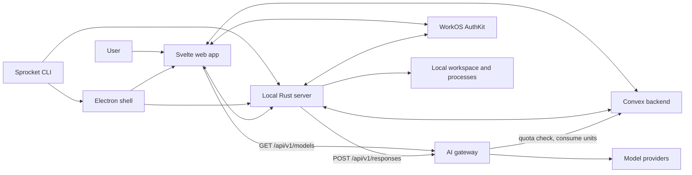
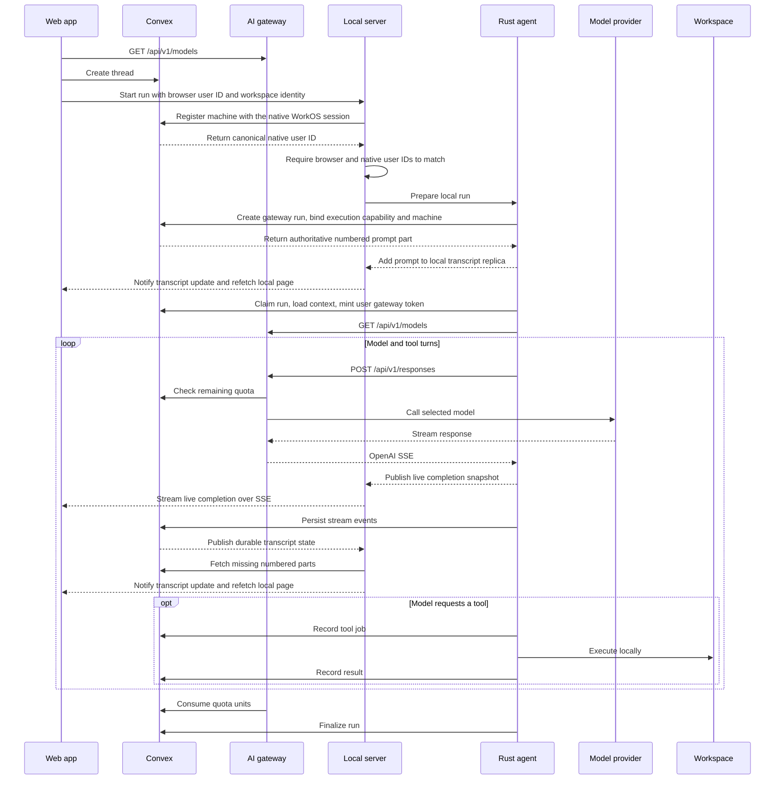

# Sprocket architecture

Sprocket is an agentic platform for streamlining hardware and software
development. Its web interface and durable conversation state are
cloud-connected, while filesystem access and command execution stay on the
user's machine.

This document describes the stable system boundaries and data flows. User setup
belongs in [README.md](README.md); crate-specific implementation notes live in
the READMEs under [`crates/`](crates/).

## Design principles

- **Local execution:** a local Rust process handles source files, patches, and
  shell processes, not the cloud backend.
- **Durable coordination:** conversations and agent-run state survive browser,
  process, and network interruptions.
- **Explicit ownership:** authenticated cloud records belong to a user, and
  active agent work belongs to a renewable run claim.
- **Portable clients:** the same web application runs in a browser, during Vite
  development, and inside Electron.
- **Layered implementation:** workspace primitives do not depend on HTTP,
  Convex, or model providers.

## System overview



The system has three main planes:

1. **Client plane:** Svelte provides the UI; Electron supplies a desktop shell;
   the CLI launches clients and the local server.
2. **Local execution plane:** the Rust server authenticates local requests,
   resolves workspace attachments, starts agent runs, and executes tools.
3. **Cloud coordination plane:** Convex stores durable application state and
   coordinates run ownership. Completions go through the AI gateway.

WorkOS establishes cloud user identity. Installed clients share one Rust-owned
WorkOS session across the renderer, agent runs, and machine registration.
Hosted web clients use AuthKit JS. A separate local
pairing mechanism authorizes the browser or Electron renderer to access the
machine-facing API.

## Component boundaries

| Component         | Owns                                                                                                                 | Does not own                                                                          |
| ----------------- | -------------------------------------------------------------------------------------------------------------------- | ------------------------------------------------------------------------------------- |
| Svelte app        | User interaction, reactive views, submission recovery                                                                | Thread-list cache, transcript synchronization, filesystem access, or provider secrets |
| Electron shell    | Desktop lifecycle, trusted renderer bridge, local server process                                                     | Conversation or agent state                                                           |
| CLI               | Process launch and server-mode selection                                                                             | Agent implementation                                                                  |
| Local server      | Local authorization, thread summary cache, transcript replica and live stream, machine presence, agent task lifetime | Durable conversation source of truth                                                  |
| Agent runtime     | Run claim, model/tool loop, cancellation, finalization                                                               | HTTP presentation or cloud schema                                                     |
| Workspace crate   | Paths, commands, patches, workspace instructions                                                                     | Authentication or networking                                                          |
| Convex RPC client | Generic Convex query/mutation/action/subscribe                                                                       | Completion translation                                                                |
| AI gateway        | Provider routing, OpenAI API, catalog, usage rates                                                                   | Subscription limits or remaining quota                                                |
| Convex backend    | User data, run coordination, transcript, artifact registry, remaining quota                                          | Local filesystem access, process execution, rates                                     |

The Rust dependency direction follows these boundaries:

```text
sprocket-cli -> sprocket-server -> sprocket-agent -> sprocket-convex
       |              |                |
       +--------------+----------------+-> sprocket-workspace
```

Lower layers remain usable without importing higher-level concerns.

## Runtime modes

### Desktop

The CLI launches Electron. Electron attaches to a compatible local server or
starts the packaged Rust executable, then loads the same web build used by the
browser mode. A narrow preload bridge exposes desktop-only actions to the
renderer.

### Browser

The CLI starts or reuses a local server and opens the locally served web app.
The server hosts both the static application and its machine-facing API.

### Development

Vite serves the web app while the Rust process serves only the local API.
Vite proxies API requests during development so the application code uses the
same paths in every runtime mode.

## State ownership

Sprocket deliberately separates cloud and machine-local state.

| State                                                                        | Owner                |
| ---------------------------------------------------------------------------- | -------------------- |
| Users, threads, durable transcript parts, runs, and tool-job records         | Convex               |
| Thread snapshot revisions and paged project-thread listings                  | Convex               |
| Local thread summary cache (active per attached project, archived on demand) | Local server         |
| Local transcript replica                                                     | Local server         |
| Current assistant stream                                                     | Local process memory |
| Local folder list (`workspacePath` + `repositoryKey`)                        | Local server         |
| Installation identity and this process’s machine credential                  | Local server         |
| Machine presence                                                             | Convex               |
| Pairing credential and local browser sessions                                | Local server         |
| Native WorkOS access token and user                                          | Local process memory |
| Native WorkOS refresh token                                                  | OS credential store  |
| Active commands, cancellation tokens, and run execution capabilities         | Local process memory |
| Source files and build artifacts                                             | User workspace       |
| Artifact identity, scope, and synced content                                 | Convex               |
| Artifact/file bindings and synchronization baselines                         | Sprocket data dir    |
| Artifact file reads, change detection, and preview feed                      | Local server         |
| Model and authentication provider secrets                                    | Cloud deployment     |

The local server owns this machine’s folder list and the account-isolated
thread summary cache. Convex threads store a `repositoryKey`. When a folder is
attached here, Rust watches that key’s active snapshot and writes it locally;
archived threads download when the UI asks. The web app reads the cache, not
`threads.listMine`. Folders that are not attached here stay hidden until they
are added.

Rename, archive, restore, rekey, and cancellation go through the local server
so it can refresh the affected cache files before the UI reads them again.
Thread creation and selected-thread lifecycle still talk to Convex directly.

### Artifacts and local bindings

The agent writes a file with its normal tools, then publishes it through
`add_artifact`. `edit_artifact` binds another existing file and explicitly replaces
the artifact's content. `list_artifacts` returns metadata for the current thread
and project. `save_artifact({artifactId, path})` saves cloud content and binds the
destination for future edits. It accepts an existing file only when its content
is identical; differing content is never overwritten.

The `artifacts` table stores content, scope, and an opaque registration ID, not local paths.
Project identity is the same `repositoryKey` used by threads, not an ID from the
retired cloud project catalog. Thread artifacts also store `threadId`.

Bindings live under `artifact-bindings` in Sprocket's data directory, isolated by
deployment, account, and workspace. Each binding records the artifact ID, path,
and last synchronized content hash. File locking serializes saves, retargets,
and sync acknowledgements; atomic replacement persists binding changes. A
registration ID is reserved locally before publication so a lost response can
be retried without creating duplicate artifacts.

Rust polls a lightweight repository revision and loads artifacts in byte-bounded
pages. The browser subscribes to that revision directly and can load cloud
artifacts without a local server or workspace. Readers retry if the revision changes between pages; tool
list results contain metadata only. Repository renames move registrations in
bounded batches and follow subsequent renames while those batches drain.

Rust reads only bound files in the selected scope. A watch lives while a UI connection
or active agent run needs it. A headless run makes a final, bounded sync attempt
before releasing its watch. Local previews arrive over `/api/artifacts/watch`
before cloud synchronization finishes; unbound artifacts render from Convex.
An unchanged local copy never overwrites newer cloud content. If both sides
changed from the persisted baseline, the preview reports a conflict and pauses
sync. Revision CAS and a locked binding check protect in-flight writes from
concurrent cloud edits and local retargets.

Relative paths resolve against the attached workspace. Absolute paths remain
absolute. Files must contain UTF-8 text and fit within 500,000 bytes. Missing or
unreadable files report an error while retaining their last readable content.
The server does not recreate missing files from the cloud copy.

The artifact cutover discards the previous versioned data. The operator clears
`artifacts` and `artifactVersions` before deploying the new schema with the normal
Convex deployment workflow. There is no archive or automated data migration.

## Agent run flow



The submission identifier makes thread and run creation safe to retry after an
ambiguous network failure. Continue-working always inserts a linked new run.
Once started, a worker must hold a renewable claim; stale workers cannot
continue tool execution or overwrite a newer result.

Tool operations are recorded before and after local execution. This gives the
UI a durable audit trail and lets terminal run state cancel work still running
on the machine.

The agent persists model output incrementally to Convex. Stream attempt and
ordering metadata prevent a delayed completion attempt from replacing a newer
one.

The transcript renderer never reads transcript content from Convex. It pages
durable parts from the Rust replica and overlays the current Rust
live-completion stream. Convex assigns durable part numbers; Svelte renders
that order and keeps no cross-thread transcript cache.

## Authentication and trust boundaries

Cloud and local authorization solve different problems:

- **Browser cloud identity:** AuthKit JS owns the hosted web session. Installed
  renderers obtain short-lived access tokens from the Rust-owned session through
  the paired, same-origin, loopback-only native token endpoint. Convex validates them
  as JWTs (`apps/web/src/convex/auth.config.ts`) and checks ownership before
  reading or changing user records.
- **Native cloud identity:** Rust owns the installed client's WorkOS authorization-code
  session. It generates PKCE and state, exchanges the
  code on the loopback callback, keeps the access token in memory, and stores
  the refresh token in the operating system credential store. Rust fetches the
  public WorkOS client ID from the unauthenticated Convex query
  `authBootstrap:getClientConfig` when it first needs WorkOS. Convex being
  unavailable therefore does not prevent the local server from starting.
- **Local authorization:** a machine-local pairing credential bootstraps a
  local session used for filesystem, cache, and agent endpoints.
- **Agent delegation:** the local server mints a random run-scoped execution
  secret when it starts a run. Convex stores only the hash. Executor
  queries and mutations authorize with that secret (`getExecutionRun`), not
  `getUserId`. Creating the run still requires the user JWT, and the Rust
  Convex client still attaches that JWT on the connection.
- **Machine presence:** each local process holds a per-launch credential.
  Registration uses the native WorkOS session and returns the canonical user
  ID. Agent launch compares that ID with the renderer's browser user ID and
  rejects mismatched accounts. Heartbeat and end are unauthenticated: they take
  the owner `userId` plus the machine credential, and require current
  `lastSeenAt` presence. A live machine rejects a different process until it
  goes stale.
- **Desktop trust:** Electron isolates the renderer, validates its origin, and
  exposes only a small set of IPC calls to the renderer.

The local server binds to loopback by default. Exposing it on another interface
changes the trust model and should be treated as a security-sensitive
deployment choice.

The native authorization callback accepts only a loopback socket peer. Its
pending state and PKCE verifier never enter the renderer, and the callback does
not return the authorization code to JavaScript. The installed renderer resumes
that same session without another AuthKit browser login. Access-token responses
are never cached, and refresh tokens never enter JavaScript. Installed sign-out
clears the native credential. A missing or temporarily unavailable browser session
does not sign out native work.

Desktop releases package the renderer build and Rust server in the same
installer, and Electron always launches the bundled server binary. These two
parts therefore update atomically. Development builds likewise build both from
one checkout. The local API does not support mixing renderer and server
versions from different releases.

The native migration is not complete. Thread-cache registration, thread
commands, cancellation, lifecycle, transcript synchronization, and attachments
still pass browser access tokens or browser user IDs to Rust. These paths must
continue to validate Convex ownership until they move to the native token
fetcher. The `/agent/run` request no longer contains a WorkOS token.

Workspace patches and shell commands are not sandboxed: both run with the
permissions of the local Sprocket process, confined only by the OS user.

## Reliability model

The distributed run protocol assumes that requests can time out after either
succeeding or failing. Its main safeguards are:

- idempotent creation keyed by a client submission identifier;
- request-independent local launch and run-scoped executor capabilities;
- renewable claims that reject stale workers;
- durable transcript and tool-job updates;
- explicit terminal states and failure reconciliation;
- cancellation propagated from durable state to local operations;
- bounded command output and process-tree termination; and
- transactional workspace patches with rollback.

These behaviors are cross-layer contracts. Changes to run ownership,
cancellation, tool payloads, history representation, or streaming must be made
in the Rust agent and Convex backend together.

## Repository layout

| Path                         | Responsibility                        |
| ---------------------------- | ------------------------------------- |
| `apps/web/`                  | Svelte application and Convex backend |
| `apps/desktop/`              | Electron shell and packaging          |
| `crates/sprocket-cli/`       | User-facing launcher                  |
| `crates/sprocket-server/`    | Local HTTP and process boundary       |
| `crates/sprocket-agent/`     | Agent run lifecycle and tools         |
| `crates/sprocket-convex/`    | Neutral Convex RPC/auth client        |
| `crates/sprocket-workspace/` | Local workspace primitives            |
| `packages/`                  | Shared JavaScript configuration       |

The AI gateway (`spikonado/ai-gateway`) is a separate private repository. Its
public origin is `https://ai-gateway.spikonado.com`, with Responses API and catalog
routes under `/api/`.

## Build and deployment

`apps/web` builds to static assets. Those assets are packaged in two separate products:

- **`sprocket-desktop`** (GitHub Releases): Electron app that embeds the static web UI and a native `sprocket` server binary. Users get `.AppImage`/`.dmg`/`.exe` installers.
- **`sprocket` CLI** (npm `@spikonado/sprocket`): the same native binary plus the static web UI for `sprocket --web`. No Electron.

The local executable receives only public runtime configuration. It obtains the
public WorkOS client ID from Convex and never receives a WorkOS client secret.
Model-provider secrets live in the gateway deployment; Convex still keeps
`OPENAI_API_KEY` for browser automation.
