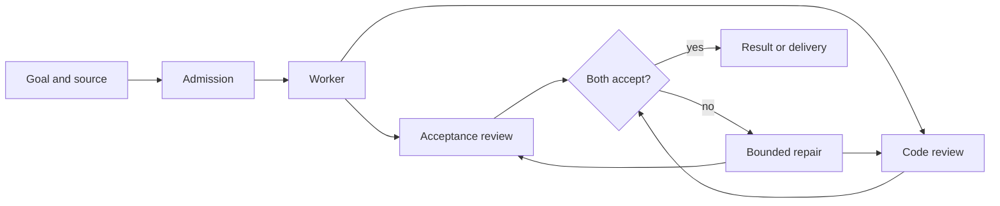

Core documentation

# Build and review software through a graph

A Zeroshot graph records implementation, review, repair, and delivery as bounded execution steps.
Its authored transitions determine which node runs next.

[Run a first task](getting-started/first-run.md){ .md-button .md-button--primary }
[Read the CLI reference](zeroshot-cli.md){ .md-button }

## What a run contains

Three authored values determine execution:

- a **graph** that defines control flow and typed state;
- a **runtime plan** that binds each executable node to a harness, provider, model, and named
  connections;
- an **initial input** that belongs to the caller and that Zeroshot checks against the graph before
  execution.

After validating those values, Zeroshot opens a durable ledger where it records each node result.
Authored edges then route review, retries, and the final result.

The built-in `software-change` template uses the route shown above. For work that does not need its
review loop, use `single-worker`; custom graphs follow the same protocol contracts.

## Choose where it runs

- **Local**

  Local mode works in the current Git worktree, keeps state on the same machine, and calls your
  installed Codex or Claude harness.

  [Install Zeroshot](getting-started/install.md)

- **Self-hosted target**

  The target image checks out source on infrastructure you control. Agent processes and the run
  ledger stay there as well.

  [Understand targets](concepts/targets.md)

- **Zeroshot Cloud**

  Cloud accepts the same graph and runtime plan through a managed target. Its documentation covers
  accounts, organization policy, and queue behavior.

  [Open the Cloud docs](https://dev.theopenengine.com/docs)

## Read more

[How execution works](concepts/execution.md) describes the graph and reduction model. Read
[Runtimes and connections](concepts/runtimes-and-connections.md) before choosing models or supplying
credentials; [Observe and control runs](guides/observe-and-control.md) covers durable status and log
streams.

The reference section is built from product-owned definitions:

- [CLI reference](zeroshot-cli.md), generated from the Clap command tree;
- [Python API](reference/python.md), generated from the SDK's public objects and docstrings;
- [Cluster API](reference/cluster/api.md), generated from the checked-in
  OpenRPC contract and protocol schemas.

When reading about an installed release, choose its version from the header. Exact release paths do
not change, while `stable` and `dev` move; [Documentation versions](project/versioning.md) defines
the URL and manifest contract.
