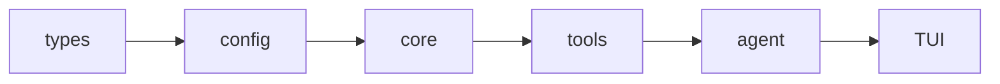

<div align="center">

<picture>
  
</picture>

**Secure, open, universal terminal coding agent in Rust.**

[](#license)
[](./docs/development/DEVELOPMENT_SETUP.md)
[](https://agentskills.io/)
[](./docs/guides/zed-acp.md)
[](./docs/guides/mcp-integration.md)
[](./docs/guides/agent-plugins.md)
[](https://deepwiki.com/vinhnx/VTCode)

</div>

> [!TIP]
> New here? Start with [Installation](./docs/installation/README.md), then
> [Getting Started](./docs/user-guide/getting-started.md).

<details>
<summary><strong>Contents</strong></summary>

- [Overview](#overview)
- [Why VT Code](#why-vt-code)
- [Quick start](#quick-start)
  - [1. Install](#1-install)
  - [2. Configure](#2-configure)
  - [3. Run](#3-run)
  - [WebMCP browser bridge (opt-in)](#webmcp-browser-bridge-opt-in)
- [What's inside](#whats-inside)
  - [Commands](#commands)
  - [Four pillars](#four-pillars)
    - [Agent core](#agent-core)
    - [Safety](#safety)
    - [Extensibility](#extensibility)
    - [Interface \& quality](#interface--quality)
- [Documentation](#documentation)
- [Development](#development)
- [Contributing](#contributing)
  - [Ways to contribute](#ways-to-contribute)
  - [Getting started](#getting-started)
  - [Contributors](#contributors)
- [Support](#support)
  - [Sponsorship](#sponsorship)
- [License](#license)

</details>

## Overview

<div align="center">


<br />
<em>Secure, open, universal.</em>

</div>

VT Code is an open-source terminal coding agent written in Rust: one static binary for quick interactive sessions and long-running autonomous work alike. No IDE required, no context left behind.

It is a **harness, not just an LLM wrapper**. The model reasons; the runtime supplies everything else — tools, context, sandboxing, state, and **verification**. That separation is what turns raw model output into safe, reviewable progress, entirely in your terminal.

> [!NOTE]
> **Status:** Active development. Local inference and some automation flows
> are experimental and may change between releases.

> [!TIP]
> **Behind the build:** [Building VT Code, a year in](https://huggingface.co/blog/vinhnx90/building-vtcode-a-year-in)
> covers harness design, evals, security, and lessons from a year of
> building.
>
> **Video companions:** [Podcast](https://www.youtube.com/watch?v=XLoswcd5rH0) ·
> [Video](https://www.youtube.com/watch?v=PvL_kPjgU6o).

## Why VT Code

Most agents are a model plus a tool call. That gets you a demo, not a
teammate. Real work breaks them in predictable ways, and VT Code answers
each one with a structural default, not a prompt tweak:

| When agents fail at…              | VT Code's structural answer                                                                                                                                                                                                                           |
| --------------------------------- | ----------------------------------------------------------------------------------------------------------------------------------------------------------------------------------------------------------------------------------------------------- |
| **Sessions drift**                | Dynamic context assembly and auto-compaction keep long sessions grounded: the model reasons over current state, not a stale transcript. [Runtime guidance](./docs/development/runtime-guidance.md)                                                    |
| **Tool output floods the window** | Results are spooled to disk and summarized into the model's view on demand: signal stays in context, noise stays out. [Runtime guidance](./docs/development/runtime-guidance.md)                                                                      |
| **One unreviewed command**        | Sandboxed execution and approvals fail closed, with adversarial regression coverage for the attacks that actually happen: command injection, path/symlink escape, environment leakage. [Security model](./docs/development/COMMAND_SECURITY_MODEL.md) |
| **"Done" is a claim**             | Built-in evals with pass@k / pass^k metrics and environment-based verification: the agent's own report never counts as success. [Eval guide](./docs/guides/eval.md)                                                                                   |

None of this is emergent.
[`ThreadEvent`](./crates/common/vtcode-exec-events) is the single source of
truth for what happened during a run: one event stream feeds replay,
checkpoints, memory, and trajectory export. The
[agent loop contract](./docs/guides/agent-loop-contract.md) specifies how
turns, tool results, and recovery behave. The behavior you rely on is
written down, not accidental.

If you have been burned by agents that look impressive until something goes wrong, these are the defaults you were missing — built in, not bolted on. The [four pillars](#four-pillars) below cover the full surface, or skip to [Quick start](#quick-start) and see it work.

## Quick start

### 1. Install

```bash
curl -fsSL https://raw.githubusercontent.com/vinhnx/vtcode/main/scripts/install.sh | bash
# or: brew install vinhnx/tap/vtcode
# or: cargo install vtcode
```

### 2. Configure

```bash
cd path/to/your/project
vtcode init         # scaffolds config + AGENTS.md; review before committing
```

Set your API key: the TUI's `/secret` command stores it in your OS keyring
(never in a workspace `.env` or shell history), which is the most secure
option:

```bash
vtcode secret add openai   # headless; or run /secret add openai inside the TUI
```

`vtcode login` covers OAuth providers (ChatGPT, GitHub Copilot). Plain env vars and workspace `.env` still work, useful for CI. See [Getting started](./docs/user-guide/getting-started.md) for the credential resolution order.

> [!CAUTION]
> Never commit API keys or put them in `vtcode.toml`.

### 3. Run

```bash
vtcode                  # interactive TUI
vtcode ask "…"          # one-shot question, no session, no tools
vtcode exec "…"         # headless task with the full tool loop
vtcode continue         # resume the last session
```

That is the whole loop: install, init, run. See [Commands](#commands) for the complete CLI surface, and [Getting Started](./docs/user-guide/getting-started.md) for the full tour.

### WebMCP browser bridge (opt-in)

```bash
# Inside the TUI:
/webmcp pair <origin>

# Or serve a bounded workspace:
vtcode webmcp serve --origin <origin> --allowed-root <dir>
```

| Host       | Link                                                      |
| ---------- | --------------------------------------------------------- |
| Hosted app | <https://vtcode.vinhnx.chatgpt.site/>                     |
| Fallback   | <https://vinhnx.github.io/VTCode/>                        |
| User guide | [WebMCP user guide](./docs/user-guide/webmcp.md)          |
| Deployment | [WebMCP deployment reference](./docs/reference/webmcp.md) |

## What's inside

One static Rust binary: no runtime dependencies, no plugins to install,
nothing to wire up. Everything below ships in the default build.

**At a glance:** durable sessions · sandboxed execution · every major model ·
MCP, Skills & plugins · terminal-native TUI · built-in evals

### Commands

Bare `vtcode` opens the interactive TUI. Four subcommands cover most of the
work:

```bash
vtcode ask "explain Rc vs Arc"    # one-shot answer, no session, no tools
vtcode exec "refactor main.rs"    # headless task with the full tool loop
vtcode review                     # agent review of uncommitted changes
vtcode eval --suite suite.json    # verify behavior with pass@k metrics
```

A second tier handles session lifecycle and day-to-day operations:

| Command                              | Purpose                                                                               |
| ------------------------------------ | ------------------------------------------------------------------------------------- |
| `vtcode continue`                    | Resume the last session, or fork it into a new one with `--session-id`                |
| `vtcode schedule`                    | Durable recurring prompts, by cron or one-shot; `install-service` survives restarts   |
| `vtcode secret`                      | Store provider API keys in your OS keyring, never in shell history or workspace files |
| `vtcode models`                      | Inspect, test, and compare providers and models                                       |
| `vtcode snapshots` / `vtcode revert` | List and roll back to workspace snapshots                                             |
| `vtcode tool-policy`                 | Allow or deny specific tools per workspace                                            |
| `vtcode trajectory`                  | Pretty-print run logs for debugging and audits                                        |

`vtcode analyze`, `vtcode check`, `vtcode schema tools`, `vtcode man`, and
`vtcode update` round out the operator surface. See `vtcode --help` for the
full list.

### Four pillars

| Pillar                                         | In one line                                               |
| ---------------------------------------------- | --------------------------------------------------------- |
| **[Agent core](#agent-core)**                  | The loop that turns model output into reviewable progress |
| **[Safety](#safety)**                          | Fail-closed execution, from sandbox to policy             |
| **[Extensibility](#extensibility)**            | Every model and protocol, no fork                         |
| **[Interface & quality](#interface--quality)** | Terminal-native UX, verified by default                   |

#### Agent core

_The loop that turns model output into reviewable progress._

- **Durable sessions:** checkpoints, auto-compaction, and spooled tool
  output keep hour-long runs grounded. `continue` resumes; `revert` rolls
  back to a snapshot. ([Runtime
  guidance](./docs/development/runtime-guidance.md) · [Session
  persistence](./docs/development/session-persistence.md))
- **One event contract:** a single `ThreadEvent` stream drives replay, the
  session store, memory, and trajectory export. One history, never divergent
  copies. ([Agent loop contract](./docs/guides/agent-loop-contract.md))
- **Planning & autonomy:** planning gates, propose/verify sub-agents,
  isolated worktrees, and cost guardrails. Autonomy is earned with evidence,
  not granted up front.
  ([Planning workflow](./docs/guides/planning-workflow.md) ·
  [Full automation](./docs/guides/full-automation.md))
- **Persistent memory:** gotchas, decisions, and library notes survive across
  runs, so the agent stops re-learning your project every session.
  ([Memory management](./docs/guides/memory-management.md))

#### Safety

_Fail closed by default, with coverage for the attacks that actually happen._

- **Sandboxed execution:** command policies and workspace approvals fail
  closed: injection, path/symlink escape, and environment leakage are blocked
  before anything runs. ([Security
  model](./docs/development/COMMAND_SECURITY_MODEL.md) ·
  [Permissions](./docs/guides/permissions.md))
- **Syntax-aware command parsing:** tree-sitter decomposes shell pipelines
  into sub-commands, so every piece is validated against policy, not just
  the first word. ([Tree-sitter
  integration](./docs/user-guide/tree-sitter-integration.md))
- **Hooks & tool policies:** lifecycle hooks gate tool calls before they
  run; per-tool allow/deny rules run common dev tools automatically and
  require confirmation for dangerous operations. ([Hooks
  guide](./docs/guides/hooks-guide.md) · [Execution
  policy](./docs/development/EXECUTION_POLICY.md))

#### Extensibility

_Plug in without forking; your setup survives upgrades._

- **Every model, one abstraction:** first-party APIs (OpenAI, Anthropic,
  Gemini, DeepSeek, Qwen, Mistral, xAI, …), gateways (OpenRouter, Vercel AI
  Gateway), OpenAI-compatible endpoints, and local inference (Ollama, LM
  Studio, llama.cpp) behind one streaming interface. Switching models never
  changes your workflow. ([Provider
  guides](./docs/providers/PROVIDER_GUIDES.md) · [Local
  models](./docs/guides/local-models.md))
- **Integrations:** MCP servers, Agent Skills, Agent Plugins, ACP (Zed),
  A2A, and the WebMCP browser bridge all attach to the core without patching
  it. ([MCP](./docs/guides/mcp-integration.md) ·
  [Skills](./docs/skills/SKILLS_GUIDE.md) ·
  [Plugins](./docs/guides/agent-plugins.md) ·
  [ACP](./docs/guides/zed-acp.md) · [A2A](./docs/a2a/a2a-protocol.md) ·
  [WebMCP](./docs/user-guide/webmcp.md))
- **Embed VT Code:** serve the agent over ACP for editors, expose an
  Anthropic-compatible API with `vtcode anthropic-api`, or proxy to the Codex
  app-server. VT Code works as a backend, not just a CLI.
  ([ACP](./docs/guides/zed-acp.md) ·
  [Protocols](./docs/protocols/OPEN_RESPONSES.md))

> [!TIP]
> Manage models with `vtcode models list|config|test|compare|info`, restrict
> providers per workspace via `providers_whitelist` in `vtcode.toml`, and
> control local inference with `/local` in the TUI.
> [Provider guides](./docs/providers/PROVIDER_GUIDES.md) are the source of
> truth for credentials and model defaults.

#### Interface & quality

_Native to the terminal, verified by default._

- **Terminal-native TUI:** WCAG AA-validated themes, markdown rendering,
  diff previews, and customizable output styles and status line. Built for
  the terminal, not ported to it. ([Interactive
  mode](./docs/user-guide/interactive-mode.md) · [Output
  styles](./docs/guides/output_styles.md))
- **Headless & automation:** `exec` mode, scheduled tasks, and sub-agents
  cover scripted, parallel, and unattended work.
  ([Exec mode](./docs/user-guide/exec-mode.md) ·
  [Scheduled tasks](./docs/user-guide/scheduled-tasks.md) ·
  [Sub-agents](./docs/user-guide/subagents.md))
- **Evals:** pass@k / pass^k metrics with environment-based verification.
  The agent's own report never counts as success.
  ([Eval guide](./docs/guides/eval.md))

> [!TIP]
> Optional search accelerators (ripgrep, ast-grep) install with
> `vtcode dependencies install search-tools`.

## Documentation

| Area    | Guides                                                                                                                                                                                                                                                                                   |
| ------- | ---------------------------------------------------------------------------------------------------------------------------------------------------------------------------------------------------------------------------------------------------------------------------------------- |
| Start   | [Installation](./docs/installation/README.md) · [Getting started](./docs/user-guide/getting-started.md) · [Wiki](https://github.com/vinhnx/VTCode/wiki)                                                                                                                                  |
| Use     | [TUI](./docs/user-guide/interactive-mode.md) · [CLI](./docs/user-guide/commands.md) · [WebMCP](./docs/user-guide/webmcp.md) · [Automation](./docs/guides/full-automation.md) · [Planning](./docs/guides/planning-workflow.md) · [Configuration](./docs/config/CONFIG_FIELD_REFERENCE.md) |
| Extend  | [Skills](./docs/skills/SKILLS_GUIDE.md) · [Plugins](./docs/guides/agent-plugins.md) · [MCP](./docs/guides/mcp-integration.md) · [Editors (ACP)](./docs/guides/zed-acp.md)                                                                                                                |
| Operate | [Safety](./docs/security/SECURITY_MODEL.md) · [Protocols](./docs/protocols/OPEN_RESPONSES.md) · [Loop engineering](./docs/project/PLAN-loop-engineering.md) · [Architecture](./docs/ARCHITECTURE.md)                                                                                     |

The full catalog lives in the [Documentation Index](./docs/INDEX.md).

## Development



Clone and run the fast gate:

```bash
git clone https://github.com/vinhnx/vtcode.git
cd vtcode
./scripts/run-debug.sh
./scripts/check-dev.sh   # fast gate: clippy, fmt, check
cargo nextest run        # tests (never `cargo test`)
```

Rust stable, edition 2024, MSRV 1.93. ~30 crates layered as
`types → config → core → tools → agent → TUI`, with `ThreadEvent` as the
authoritative runtime contract.

See [Development setup](./docs/development/DEVELOPMENT_SETUP.md) and
[Testing](./docs/development/testing.md).

## Contributing

### Ways to contribute

- **Security**: Found a vulnerability? Follow the [Security
  Policy](https://github.com/vinhnx/VTCode/security/policy).
- **Bug fixes and patches**: Small or large, every fix counts.
- **Documentation**: Guides, examples, and corrections help everyone.
- **Features and ideas**: Open an issue or start a discussion.
- **Code reviews and testing**: Trying things out and reporting breakage keeps the project healthy.

### Getting started

- Browse [good first issues](https://github.com/vinhnx/vtcode/issues?q=is%3Aopen+is%3Aissue+label%3A%22good+first+issue%22)
- Read [CONTRIBUTING.md](./docs/CONTRIBUTING.md) for humans
- Check [AGENTS.md](./AGENTS.md) for AI agents

> [!NOTE]
> Small, focused PRs merge fastest. If you get stuck, open an issue for help.

### Contributors

Thank you to everyone who shaped VT Code.

<details>
<summary><strong>Show all contributors</strong></summary>

<div align="center">
  <a href="https://github.com/kernitus"></a>&nbsp;
  <a href="https://github.com/7jrxt42BxFZo4iAnN4CX"></a>&nbsp;
  <a href="https://github.com/oiwn"></a>&nbsp;
  <a href="https://github.com/Sachin-Bhat"></a>&nbsp;
  <a href="https://github.com/chenrui333"></a>&nbsp;
  <a href="https://github.com/gzsombor"></a>&nbsp;
  <a href="https://github.com/leonj1"></a>&nbsp;
  <a href="https://github.com/netbrah"></a>&nbsp;
  <a href="https://github.com/xcrong"></a>&nbsp;
  <a href="https://github.com/mouse-value-add"></a>&nbsp;
  <a href="https://github.com/raphamorim"></a>&nbsp;
  <a href="https://github.com/nnfrog"></a>&nbsp;
  <a href="https://github.com/glmgbj233"></a>&nbsp;
  <a href="https://github.com/EvoLinkAI"></a>&nbsp;
  <a href="https://github.com/diegosouzapw"></a>&nbsp;
  <a href="https://github.com/ericcurtin"></a>&nbsp;
  <a href="https://github.com/ForrestThump"></a>&nbsp;
  <a href="https://github.com/morler"></a>&nbsp;
  <a href="https://github.com/poelzi"></a>&nbsp;
  <a href="https://github.com/RobertBorg"></a>&nbsp;
  <a href="https://github.com/Sanjays2402"></a>&nbsp;
  <a href="https://github.com/TuanLe-bk18"></a>&nbsp;
  <a href="https://github.com/uiYzzi"></a>
</div>

</details>

## Support

### Sponsorship

VT Code is built and maintained in spare time. If it helped you ship or learn something, a [sponsorship](https://github.com/sponsors/vinhnx) keeps the project independent.

<div align="center">
  <a href="https://github.com/dnhn"></a>
  <a href="https://github.com/codemod"></a>
  <a href="https://github.com/coderabbitai"></a>
  <a href="https://github.com/KhaiRyth"></a>
</div>

<div align="center">

[](https://github.com/sponsors/vinhnx)
<a href="https://buymeacoffee.com/vinhnx"></a>

</div>

## License

First-party code is **MIT OR Apache-2.0**. See [LICENSE](LICENSE).
Third-party code keeps its original licenses: see[THIRD-PARTY-NOTICES](THIRD-PARTY-NOTICES).

<div align="right">

[Back to top](#readme)

</div>
